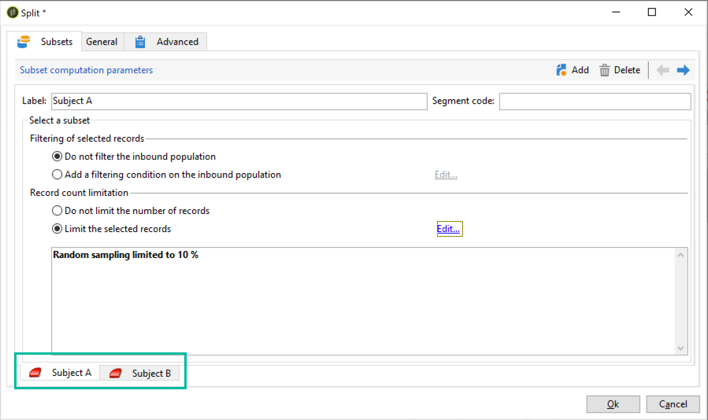

# Configuración de las pruebas A/B {#configuring-a-b-testing}

En esta sección, se explica cómo crear un flujo de trabajo para realizar pruebas A/B.

1. Cree un nuevo flujo de trabajo y, luego, configure una actividad de consulta para dirigirse a la población destinataria. Consulte la [documentación de Campaign v8](https://experienceleague.adobe.com/docs/campaign/automation/workflows/wf-activities/targeting-activities/query.html?lang=es){target="_blank"}.

1. Añada una actividad de división para dividir la población de destino en varios subconjuntos. Consulte la [documentación de Campaign v8](https://experienceleague.adobe.com/docs/campaign/automation/workflows/wf-activities/targeting-activities/split.html?lang=es){target="_blank"}.

1. Abra la actividad y configure cada subconjunto según sus necesidades. Para obtener más información sobre cómo configurar una actividad **[!UICONTROL Split]**, consulte [esta sección](../../workflow/using/split.md).

   En este ejemplo, queremos probar dos temas nuevos para una newsletter presentando cada uno de ellos al 10 % de la población objetivo.

   

1. Añada una transición para enviar a la población restante la newsletter con el asunto actual. Para ello, active la opción **[!UICONTROL Generate complement]** en la pestaña **[!UICONTROL General]**.

   

1. Para cada subconjunto, añada la versión del envío que se va a probar.

   

Ahora puede iniciar el flujo de trabajo. Una vez enviadas las entregas, podrá rastrear el comportamiento de los tres subconjuntos en los registros de envío, para ver qué asunto ha tenido más éxito.

Los flujos de trabajo también le permiten automatizar los procesos al identificar automáticamente la variante de envío que tuvo un mejor rendimiento y, a continuación, enviarla a la población restante. Para obtener más información al respecto, consulte este [caso de uso paso a paso](a-b-testing-use-case.md).
