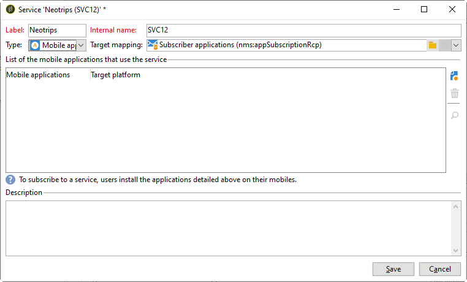

# Pasos de configuración para Android

Una vez que el paquete esté instalado, puede definir la configuración de la aplicación de Android en Adobe Campaign Classic.

>[!NOTE]
>
>Para obtener información sobre cómo configurar la aplicación para iOS y cómo crear un envío para iOS, consulte esta [sección](../../delivery/using/configuring-the-mobile-application.md).

Los pasos clave son:

1. [Configuración de la cuenta externa de Android](#configuring-external-account-android)
1. [Configuración del servicio de Android](#configuring-android-service)
1. [Creación de la aplicación móvil en Campaign](#creating-android-app)
1. [Ampliación del esquema de la aplicación con datos adicionales](#extend-subscription-schema)

Podrá [crear una notificación enriquecida de Android](#creating-android-delivery).

## Configuración de la cuenta externa de Android {#configuring-external-account-android}

Para Android, hay dos conectores disponibles:

* Conector V1, que permite una conexión por elemento secundario de MTA.
* Conector V2, que permite conexiones simultáneas con el servidor FCM para mejorar el rendimiento.

Para elegir el conector que desea utilizar, siga estos pasos:

1. Vaya a **[!UICONTROL Administration > Platform > External accounts]**.
1. Seleccione la cuenta externa **[!UICONTROL Android routing]**.
1. En la pestaña **[!UICONTROL Connector]**, rellene el campo **[!UICONTROL JavaScript used in the connector]**:

   Para Android V2: https://localhost:8080/nms/jsp/androidPushConnectorV2.js

   >[!NOTE]
   >
   > También puede configurarlo de la siguiente manera: https://localhost:8080/nms/jsp/androidPushConnector.js, pero se recomienda utilizar la versión 2 del conector.

   

1. Para Android V2, hay un parámetro adicional disponible en el archivo de configuración de Adobe Server (serverConf.xml):

   * **maxGCMConnectPerChild**: Límite máximo de solicitudes HTTP paralelas al FCM iniciado por cada servidor secundario (8 por defecto).

## Configuración del servicio Android {#configuring-android-service}

 [Obtenga información sobre cómo configurar un servicio de Android en vídeo](https://experienceleague.adobe.com/docs/campaign-classic-learn/getting-started-with-push-notifications-for-android/configuring-an-android-service-in-campaign.html?lang=es#configuring-an-android-service-and-creating-an-android-mobile-application-in-campaign)

1. Vaya al nodo **[!UICONTROL Profiles and Targets > Services and subscriptions]** y seleccione **[!UICONTROL New]**.

   

1. Defina un **[!UICONTROL Label]** y un **[!UICONTROL Internal name]**.
1. Vaya al campo **[!UICONTROL Type]** y seleccione **[!UICONTROL Mobile application]**.

   >[!NOTE]
   >
   >La asignación de destino predeterminada **[!UICONTROL Subscriber applications (nms:appSubscriptionRcp)]** está relacionada con la tabla de destinatarios. Si desea utilizar una asignación de destino diferente, debe crear una nueva asignación de destino e introducirla en el campo **[!UICONTROL Target mapping]** del servicio. Para obtener más información sobre la creación de asignación de destino, consulte la [guía de configuración](../../configuration/using/about-custom-recipient-table.md).

   

1. A continuación, haga clic en el botón **[!UICONTROL Add]** para seleccionar el tipo de aplicación.

   

1. Cree la aplicación de Android. Para obtener más información, consulte [esta sección](../../delivery/using/configuring-the-mobile-application-android.md#creating-android-app).

## Creación de una aplicación móvil de Android {#creating-android-app}

Después de crear el servicio, debe crear la aplicación de Android:

1. En el servicio recién creado, haga clic en el botón **[!UICONTROL Add]** para seleccionar el tipo de aplicación.

   

1. Seleccione **[!UICONTROL Create an Android application]** y escriba un **[!UICONTROL Label]**.

   

1. Asegúrese de que se ha definido la misma **[!UICONTROL Integration key]** en Adobe Campaign y en el código de la aplicación a través del SDK. Para obtener más información, consulte: [Integración del SDK de Campaign en la aplicación móvil](../../delivery/using/integrating-campaign-sdk-into-the-mobile-application.md).

   >[!NOTE]
   >
   > **[!UICONTROL Integration key]** es totalmente personalizable con un valor de cadena, pero debe ser exactamente igual al especificado en el SDK.

1. Seleccione la **[!UICONTROL API version]**: HTTP v1 o HTTP (heredada). Estas configuraciones se detallan en [esta sección](#select-api-version)

1. Rellene los campos **[!UICONTROL Firebase Cloud Messaging the Android connection settings]**.

1. Haga clic en **[!UICONTROL Finish]**, luego en **[!UICONTROL Save]**. La aplicación de Android ya está lista para su uso en Campaign Classic.

De forma predeterminada, Adobe Campaign guarda una clave en el campo **[!UICONTROL User identifier]** (@userKey) de la tabla **[!UICONTROL Subscriber applications (nms:appSubscriptionRcp)]**. Esta clave permite vincular una suscripción a un destinatario. Para recopilar datos adicionales (como una clave de acceso compleja), es necesario aplicar la siguiente configuración:

### Seleccione la versión de la API{#select-api-version}

Después de crear el servicio y una nueva aplicación móvil, debe configurar la aplicación móvil según la versión de API elegida.

* **La configuración de HTTP v1** se detalla en esta [sección](../../delivery/using/configuring-the-mobile-application-android.md#android-service-httpv1).
* **La configuración de HTTP (heredada)** se detalla en esta [sección](../../delivery/using/configuring-the-mobile-application-android.md#android-service-http).

#### Configuración de la API HTTP v1{#android-service-httpv1}

Para configurar la versión de la API HTTP v1, siga los pasos a continuación:

1. En la ventana **[!UICONTROL Mobile application creation wizard]**, seleccione **[!UICONTROL HTTPV1]** en la lista desplegable **[!UICONTROL API version]**.

1. Haga clic en **[!UICONTROL Load project json file to extract projet details...]** para cargar directamente el archivo con clave JSON. Para obtener más información sobre cómo extraer el archivo JSON, consulte esta [página](https://firebase.google.com/docs/admin/setup#initialize-sdk).

   También puede introducir manualmente los siguientes detalles:
   * **[!UICONTROL Project Id]**
   * **[!UICONTROL Private Key]**
   * **[!UICONTROL Client Email]**

   

1. Haga clic en **[!UICONTROL Test the connection]** para comprobar que la configuración es correcta y que el servidor de marketing tiene acceso a FCM.

   >[!CAUTION]
   >
   >Para la implementación intermediaria, el botón **[!UICONTROL Test connection]** no comprueba si el servidor MID tiene acceso al servidor FCM.

   

1. Como opción, puede enriquecer el contenido de un mensaje push con algunos **[!UICONTROL Application variables]** si es necesario. Son totalmente personalizables y una parte de la carga útil de mensajes se envía al dispositivo móvil.

1. Haga clic en **[!UICONTROL Finish]**, luego en **[!UICONTROL Save]**. La aplicación de Android ya está lista para su uso en Campaign Classic.

A continuación se muestran los nombres de carga útil de FCM para personalizar aún más la notificación push:

| Tipo de mensaje | Elemento de mensaje configurable (nombre de carga útil de FCM) | Opciones configurables (nombre de carga útil de FCM) |
|:-:|:-:|:-:|
| mensaje de datos | N/A | validate_only |
| mensaje de notificación | title, body, android_channel_id, icon, sound, tag, color, click_action, image, ticker, sticky, visibility, notification_priority, notification_count   | validate_only |

 
 

#### Configuración de la API HTTP (heredada){#android-service-http}

Para configurar la versión de la API HTTP (heredada), siga los pasos a continuación:

1. En la ventana **[!UICONTROL Mobile application creation wizard]**, seleccione **[!UICONTROL HTTP (legacy)]** en la lista desplegable **[!UICONTROL API version]**.

1. Introduzca el **[!UICONTROL Project key]** que proporcionó el desarrollador de la aplicación móvil.

1. Como opción, puede enriquecer el contenido de un mensaje push con algunos **[!UICONTROL Application variables]** si es necesario. Son totalmente personalizables y una parte de la carga útil de mensajes se envía al dispositivo móvil.

   En el ejemplo siguiente, se añade **title**, **imageURL** e **iconURL** para crear notificaciones push enriquecidas y, a continuación, se proporciona a la aplicación la imagen, el título y el icono que se muestran en la notificación.

   

1. Haga clic en **[!UICONTROL Finish]**, luego en **[!UICONTROL Save]**. La aplicación de Android ya está lista para su uso en Campaign Classic.

A continuación se muestran los nombres de carga útil de FCM para personalizar aún más la notificación push:

| Tipo de mensaje | Elemento de mensaje configurable (nombre de carga útil de FCM) | Opciones configurables (nombre de carga útil de FCM) |
|:-:|:-:|:-:|
| mensaje de datos | N/D | dryRun |
| mensaje de notificación | title, body, android_channel_id, icon, sound, tag, color, click_action   | dryRun |

 

## Ampliación del esquema appsubscriptionRcp {#extend-subscription-schema}

 [Obtenga información sobre cómo ampliar el esquema appsubscriptionRcp con este vídeo](https://experienceleague.adobe.com/docs/campaign-classic-learn/getting-started-with-push-notifications-for-android/extending-the-app-subscription-schema.html?lang=es#extending-the-app-subscription-schema-to-personalize-push-notifications)

Debe ampliar **appsubscriptionRcp** para definir nuevos campos que almacenen parámetros de la aplicación en la base de datos de Campaign. Estos campos se utilizarán, por ejemplo, para la personalización. Para ello:

1. Cree una extensión del esquema **[!UICONTROL Subscriber applications (nms:appsubscriptionRcp)]** y defina los campos nuevos. Obtenga más información sobre la extensión de esquema en [esta página](../../configuration/using/about-schema-edition.md).

1. Defina la asignación en la pestaña **[!UICONTROL Subscription parameters]**.

   >[!CAUTION]
   >
   >Asegúrese de que los nombres de configuración en la pestaña **[!UICONTROL Subscription parameters]** sean los mismos que los del código de la aplicación móvil. Consulte la sección [Integración del SDK de campaña en la aplicación móvil](../../delivery/using/integrating-campaign-sdk-into-the-mobile-application.md).

## Creación de una notificación enriquecida de Android {#creating-android-delivery}

Con Firebase Cloud Messaging, puede elegir entre dos tipos de mensajes:

* **[!UICONTROL Data message]**, gestionado por la aplicación del cliente.
    Los mensajes se envían directamente a la aplicación móvil, que generará y mostrará la notificación de Android al dispositivo. Los mensajes de datos solo contienen las variables de aplicación personalizadas.

* **[!UICONTROL Notification message]**, gestionado automáticamente por el SDK de FCM.
     FCM muestra automáticamente el mensaje en los dispositivos de los usuarios en nombre de la aplicación del cliente. Los mensajes de notificación contienen un conjunto predefinido de parámetros y opciones, pero pueden personalizarse aún más con las variables de aplicación personalizadas.

Para obtener más información sobre los tipos de mensajes de Firebase Cloud Messaging, consulte la documentación [de FCM](https://firebase.google.com/docs/cloud-messaging/concept-options#notifications_and_data_messages).

### Creación de un mensaje de datos {#creating-data-message}

1. Vaya a **[!UICONTROL Campaign management]** > **[!UICONTROL Deliveries]**.

1. Haga clic **[!UICONTROL New]**.

   

1. Seleccione **[!UICONTROL Deliver on Android (android)]** en la lista desplegable **[!UICONTROL Delivery template]**. Añada un **[!UICONTROL Label]** al envío.

1. Haga clic en **[!UICONTROL To]** para definir la población en destinatario. De forma predeterminada, se aplica la asignación de destino **[!UICONTROL Subscriber application]**. Haga clic en **[!UICONTROL Add]** para seleccionar el servicio.

   

1. En la ventana **[!UICONTROL Target type]**, seleccione **[!UICONTROL Subscribers of an Android mobile application]** y haga clic en **[!UICONTROL Next]**.

1. En la lista desplegable **[!UICONTROL Service]**, seleccione el servicio creado anteriormente y, a continuación, la aplicación, y haga clic en **[!UICONTROL Finish]**.
Las **[!UICONTROL Application variables]** se añaden automáticamente en función de lo que se añadió durante los pasos de configuración.

   

1. Seleccione **[!UICONTROL data message]** como **[!UICONTROL Message Type]**.

1. Edite la notificación enriquecida.

   

1. Puede agregar información en la configuración **[!UICONTROL Application variables]** si es necesario. **[!UICONTROL Application variables]** debe configurarse en el servicio Android y formar parte de la carga de mensajes que se envía al dispositivo móvil.

1. Haga clic en **[!UICONTROL Save]** y realice la entrega.

La imagen y la página web deberían aparecer en la notificación push cuando se reciban en los dispositivos móviles Android de los suscriptores.

### Creación de mensajes de notificación {#creating-notification-message}

>[!NOTE]
>
>Las opciones adicionales para los mensajes de notificación solo están disponibles con la configuración de la API HTTP v1. Para obtener más información, consulte [esta sección](../../delivery/using/configuring-the-mobile-application-android.md#android-service-httpv1).

 [Obtenga información sobre cómo crear una notificación push de Android con este vídeo](https://experienceleague.adobe.com/docs/campaign-classic-learn/getting-started-with-push-notifications-for-android/configuring-and-sending-push-notifications.html?lang=es#additional-resources)

1. Vaya a **[!UICONTROL Campaign management]** > **[!UICONTROL Deliveries]**.

1. Haga clic **[!UICONTROL New]**.

   

1. Seleccione **[!UICONTROL Deliver on Android (android)]** en la lista desplegable **[!UICONTROL Delivery template]**. Añada un **[!UICONTROL Label]** al envío.

1. Haga clic en **[!UICONTROL To]** para definir la población en destinatario. De forma predeterminada, se aplica la asignación de destino **[!UICONTROL Subscriber application]**. Haga clic en **[!UICONTROL Add]** para seleccionar el servicio.

   

1. En la ventana **[!UICONTROL Target type]**, seleccione **[!UICONTROL Subscribers of an Android mobile application]** y haga clic en **[!UICONTROL Next]**.

1. En la lista desplegable **[!UICONTROL Service]**, seleccione el servicio creado anteriormente y, a continuación, la aplicación, y haga clic en **[!UICONTROL Finish]**.

   

1. Seleccione **[!UICONTROL notification message]** como **[!UICONTROL Message Type]**.

1. Añada un título y edite el mensaje. Personalice la notificación push con **[!UICONTROL Notification options]**:

   * **[!UICONTROL Channel ID]**: configure el ID de canal de la notificación. La aplicación debe crear un canal con este ID de canal antes de recibir cualquier notificación.
   * **[!UICONTROL Sound]**: configure el sonido para que se reproduzca cuando el dispositivo reciba la notificación.
   * **[!UICONTROL Color]**: configure el color del icono de la notificación.
   * **[!UICONTROL Icon]**: configure el icono de la notificación para que se muestre en los dispositivos de sus perfiles.
   * **[!UICONTROL Tag]**: establezca el identificador utilizado para reemplazar las notificaciones existentes en el cajón de notificaciones.
   * **[!UICONTROL Click action]**: configure en la notificación la acción asociada con el clic del usuario.

   Para obtener más información sobre **[!UICONTROL Notification options]** y cómo rellenar estos campos, consulte la [documentación de FCM](https://firebase.google.com/docs/reference/fcm/rest/v1/projects.messages#androidnotification).

   

1. Si la aplicación está configurada con el protocolo de API HTTP v1, puede personalizar aún más la notificación push con el siguiente **[!UICONTROL HTTPV1 additional options]**:

   * **[!UICONTROL Ticker]**: configure el texto del valor de la notificación. Solo está disponible para dispositivos configurados con Android 5.0 Lollipop.
   * **[!UICONTROL Image]**: configure la dirección URL de la imagen para que se muestre en la notificación.
   * **[!UICONTROL Notification Count]**: configure el número de información nueva sin leer para que se muestre directamente en el icono de la aplicación.
   * **[!UICONTROL Sticky]**: establezca en true o false. Si se establece en false, la notificación se descarta automáticamente cuando el usuario hace clic en ella. Si se establece en true, la notificación se seguirá mostrando incluso cuando el usuario haga clic en ella.
   * **[!UICONTROL Notification Priority]**: establezca los niveles de prioridad de la notificación en predeterminados, mínimos, bajos o altos. Para más información, consulte la [documentación de FCM](https://firebase.google.com/docs/reference/fcm/rest/v1/projects.messages#NotificationPriority).
   * **[!UICONTROL Visibility]**: establezca los niveles de visibilidad de la notificación en pública, privada o secreta. Para más información, consulte la [documentación de FCM](https://firebase.google.com/docs/reference/fcm/rest/v1/projects.messages#visibility).

   Para obtener más información sobre **[!UICONTROL HTTP v1 additional options]** y cómo rellenar estos campos, consulte la [documentación de FCM](https://firebase.google.com/docs/reference/fcm/rest/v1/projects.messages#androidnotification).

   

1. Puede agregar información en la configuración **[!UICONTROL Application variables]** si es necesario. **[!UICONTROL Application variables]** debe configurarse en el servicio Android y formar parte de la carga de mensajes que se envía al dispositivo móvil.

1. Haga clic en **[!UICONTROL Save]** y realice la entrega.

La imagen y la página web deberían aparecer en la notificación push cuando se reciban en los dispositivos móviles Android de los suscriptores.
