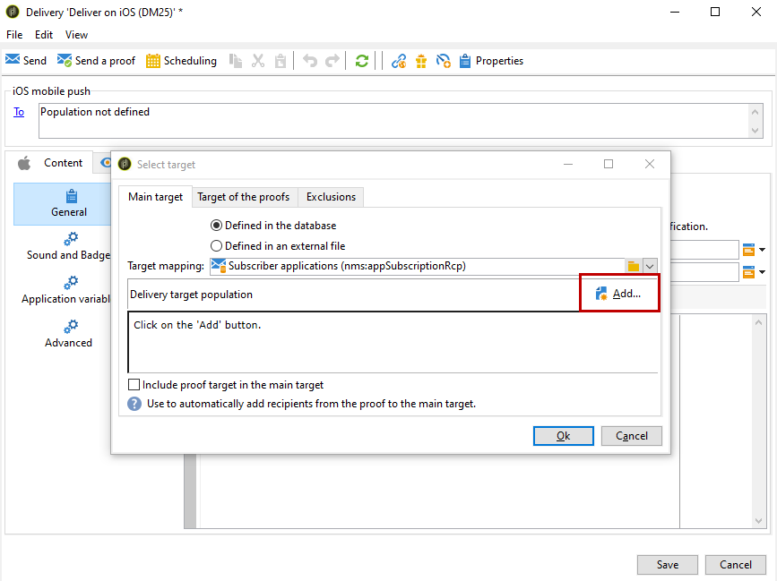

# Pasos de configuración para iOS {#configuring-the-mobile-application-in-adobe-campaign-ios}

Una vez que el paquete esté instalado, puede definir la configuración de la aplicación de iOS en Adobe Campaign Classic.

>[!NOTE]
>
>Para obtener información sobre cómo configurar la aplicación para Android y cómo crear un envío para Android, consulte esta [sección](../../delivery/using/configuring-the-mobile-application-android.md).

## Configuración de la cuenta externa de iOS {#configuring-external-account-ios}

Para iOS, el conector HTTP/2 de iOS envía notificaciones a la APNS HTTP/2.

Para configurar este conector, siga estos pasos:

1. Vaya a **[!UICONTROL Administration > Platform > External accounts]**.
1. Seleccione la cuenta externa **[!UICONTROL iOS routing]**.
1. En la pestaña **[!UICONTROL Connector]**, rellene el campo **[!UICONTROL Access URL of the connector]** con la siguiente dirección URL: ```http://localhost:8080/nms/jsp/iosHTTP2.jsp```

   >[!NOTE]
   >
   > A partir de la versión 20.3 de Campaign, el conector binario heredado de iOS está en desuso. Si utiliza este conector, debe adaptar la implementación en consecuencia. [Más información](https://helpx.adobe.com/es/campaign/kb/migrate-to-apns-http2.html)

   

1. Haga clic **[!UICONTROL Save]**.

Ya está configurado el conector de iOS. Puede crear su servicio.

## Configuración del servicio iOS {#configuring-ios-service}

>[!CAUTION]
>
>La aplicación debe estar configurada para acciones push ANTES de cualquier integración con el SDK de Adobe Campaign.
>
>Si no es así, consulte [esta página](https://developer.apple.com/documentation/usernotifications).

1. Vaya al nodo **[!UICONTROL Profiles and Targets > Services and subscriptions]** y seleccione **[!UICONTROL New]**.

   

1. Defina un **[!UICONTROL Label]** y un **[!UICONTROL Internal name]**.
1. Vaya al campo **[!UICONTROL Type]** y seleccione **[!UICONTROL Mobile application]**.

   >[!NOTE]
   >
   >La asignación de destino predeterminada **[!UICONTROL Subscriber applications (nms:appSubscriptionRcp)]** está relacionada con la tabla de destinatarios. Si desea utilizar una asignación de destino diferente, debe crear una nueva asignación de destino e introducirla en el campo **[!UICONTROL Target mapping]** del servicio. Para obtener más información sobre la creación de asignación de destino, consulte la [guía de configuración](../../configuration/using/about-custom-recipient-table.md).

   

1. A continuación, haga clic en el botón **[!UICONTROL Add]** para seleccionar el tipo de aplicación.

   

1. Cree sus aplicaciones de desarrollo y producción de iOS. Para obtener más información, consulte [esta sección](../../delivery/using/configuring-the-mobile-application.md#creating-ios-app).

## Creación de una aplicación móvil de iOS {#creating-ios-app}

Después de crear el servicio, debe crear la aplicación de iOS:

1. En el servicio recién creado, haga clic en el botón **[!UICONTROL Add]** para seleccionar el tipo de aplicación.

   

1. Aparece la siguiente ventana. Seleccione **[!UICONTROL Create an iOS application]** y comience introduciendo el **[!UICONTROL Label]**.

   

1. Como opción, puede enriquecer el contenido de un mensaje push con algunos **[!UICONTROL Application variables]** si es necesario. Son totalmente personalizables y una parte de la carga útil de mensajes se envía al dispositivo móvil.
En el siguiente ejemplo, se añaden **mediaURl** y **mediaExt** para crear notificaciones push enriquecidas y, a continuación, se proporciona a la aplicación la imagen que se muestra en la notificación.

   

1. La pestaña **[!UICONTROL Subscription parameters]** permite definir la asignación con una extensión del esquema **[!UICONTROL Subscriber applications (nms:appsubscriptionRcp)]**.

   >[!NOTE]
   >
   >Asegúrese de no utilizar el mismo certificado para la versión de desarrollo (entorno limitado) y la versión de producción de la aplicación.

1. La pestaña **[!UICONTROL Sounds]** permite especificar un sonido para reproducir. Haga clic en **[!UICONTROL Add]** y rellene el campo **[!UICONTROL Internal name]** que debe contener el nombre del archivo incrustado en la aplicación o el nombre del sonido del sistema.

1. Haga clic en **[!UICONTROL Next]** para comenzar a configurar la aplicación de desarrollo.

1. Asegúrese de que se ha definido la misma **[!UICONTROL Integration key]** en Adobe Campaign y en el código de la aplicación a través del SDK. Para obtener más información, consulte: [Integración del SDK de Campaign en la aplicación móvil](../../delivery/using/integrating-campaign-sdk-into-the-mobile-application.md). Esta clave de integración, específica de cada aplicación, permite vincular la aplicación móvil con la plataforma de Adobe Campaign.

   >[!NOTE]
   >
   > **[!UICONTROL Integration key]** es totalmente personalizable con un valor de cadena, pero debe ser exactamente igual al especificado en el SDK.

1. Seleccione uno de los iconos predeterminados en el campo **[!UICONTROL Application icon]** para personalizar la aplicación móvil en el servicio.

1. Seleccione el **[!UICONTROL Authentication mode]**. Tenga en cuenta que siempre puede cambiar el modo de autenticación más adelante en la pestaña **[!UICONTROL Certificate]** de la aplicación móvil.
   * **[!UICONTROL Certificate-based authentication]**: haga clic en **[!UICONTROL Enter the certificate...]**, seleccione la clave p12 e introduzca la contraseña proporcionada por el desarrollador de aplicaciones móviles.
   * **[!UICONTROL Token-based authentication]**: complete la configuración de conexión de **[!UICONTROL Key ID]**, **[!UICONTROL Team ID]** y **[!UICONTROL Bundle ID]** y luego seleccione el certificado p8 haciendo clic en **[!UICONTROL Enter the private key]**. Para más información sobre **[!UICONTROL Token-based authentication]**, consulte la [documentación de Apple](https://developer.apple.com/documentation/usernotifications/setting_up_a_remote_notification_server/establishing_a_token-based_connection_to_apns).

   >[!NOTE]
   >
   > Adobe recomienda usar la **[!UICONTROL Token-based authentication]** para la configuración de iOS, ya que este modo de autenticación es más seguro y no está enlazado al vencimiento del certificado.

   

1. Puede hacer clic en **[!UICONTROL Test the connection]** para asegurarse de que se ha realizado correctamente.

1. Haga clic en **[!UICONTROL Next]** para configurar la aplicación de producción y siga los mismos pasos detallados anteriormente.

   

1. Haga clic en **[!UICONTROL Finish]**.

La aplicación de iOS ya está lista para su uso en Campaign Classic.

## Creación de una notificación enriquecida de iOS {#creating-ios-delivery}

Con iOS 10 o posterior, es posible generar notificaciones rich. Adobe Campaign puede enviar notificaciones mediante variables que permiten al dispositivo mostrar una notificación rich.

Debe crear un nuevo envío y vincularlo a la aplicación móvil creada.

1. Vaya a **[!UICONTROL Campaign management]** > **[!UICONTROL Deliveries]**.

1. Haga clic **[!UICONTROL New]**.

   

1. Seleccione **[!UICONTROL Deliver on iOS (ios)]** en la lista desplegable **[!UICONTROL Delivery template]**. Añada un **[!UICONTROL Label]** al envío.

1. Haga clic en **[!UICONTROL To]** para definir la población en destinatario. De forma predeterminada, se aplica la asignación de destino **[!UICONTROL Subscriber application]**. Haga clic en **[!UICONTROL Add]** para seleccionar el servicio creado anteriormente.

   

1. En la ventana **[!UICONTROL Target type]**, seleccione **[!UICONTROL Subscribers of an iOS mobile application (iPhone, iPad)]** y haga clic en **[!UICONTROL Next]**.

1. En la lista desplegable **[!UICONTROL Service]**, seleccione el servicio creado anteriormente, luego la aplicación a la que desee dirigirse y haga clic en **[!UICONTROL Finish]**.
Las **[!UICONTROL Application variables]** se añaden automáticamente en función de lo que se añadió durante los pasos de configuración.

   

1. Edite la notificación enriquecida.

   

1. Marque la casilla **[!UICONTROL Mutable content]** en la ventana de notificación de edición para permitir que la aplicación móvil descargue contenido de medios.

1. Haga clic en **[!UICONTROL Save]** y realice la entrega.

La imagen y la página web deben aparecer en la notificación push cuando se reciban en los dispositivos móviles iOS de los suscriptores.


