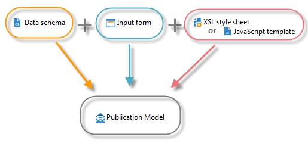

# Recursos y principios del gestor de contenido{#content-manager-resources-and-principles}

Se debe definir una plantilla de publicación que contenga plantillas de transformación para cada contenido.

Un bloque de contenido se estructura en un documento XML para el almacenamiento de datos. Se utiliza una interfaz de edición para introducir el contenido de la consola del cliente de Adobe Campaign o mediante un explorador Web. El contenido también se puede introducir automáticamente mediante la captura de flujo XML o datos recopilados en una base de datos.

Al combinar el documento XML y las hojas de estilo de plantilla XSL o JavaScript, se genera automáticamente la proyección de la plantilla de publicación en los distintos formatos (HTML, texto).

Se requieren los siguientes recursos para la configuración del contenido:

* Esquemas de datos: descripción de la estructura de contenido XML. Para obtener más información, consulte [Esquemas de datos](../../delivery/using/data-schemas.md).
* Formularios de entrada de datos: construcción de pantallas de entrada de datos. Para obtener más información, consulte [Formularios de entrada](../../delivery/using/input-forms.md).
* Imágenes: imágenes utilizadas en los formularios de entrada de datos. Para obtener más información, consulte [Administración de imágenes](../../delivery/using/formatting.md#image-management).
* Hojas de estilo: formato de documentos de salida con lenguaje XSLT. Para obtener más información, consulte [Formato](../../delivery/using/formatting.md).
* Plantillas JavaScript: formato de documentos de salida con lenguaje JavaScript. Para obtener más información, consulte [Plantillas de publicación](../../delivery/using/publication-templates.md).
* Códigos JavaScript: Códigos JavaScript para la adición de datos. Para obtener más información, consulte [Acumulador](../../delivery/using/publication-templates.md#aggregator).
* Plantillas de publicación: definición de plantillas de publicación. Para obtener más información, consulte [Plantillas de publicación](../../delivery/using/publication-templates.md).
* Contenido: ejemplos de contenido para crear y publicar. Para más información, consulte [Uso de una plantilla de contenido](../../delivery/using/using-a-content-template.md).
