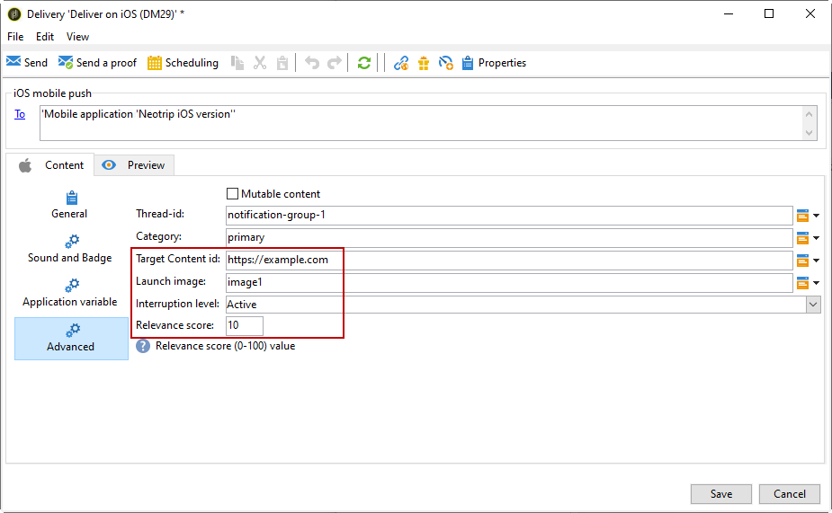

# Creación de notificaciones para iOS{#create-notifications-ios}

En esta sección se detallan los elementos específicos para la entrega de notificaciones en iOS. En [esta sección](steps-about-delivery-creation-steps.md) se exponen conceptos globales sobre la creación de envíos.

Comience creando una nueva entrega.

Para crear una notificación push para dispositivos iOS, siga los pasos a continuación:

1. Seleccione la plantilla de envíos **[!UICONTROL Deliver on iOS]**.

   

1. Para definir el objetivo de la notificación, haga clic en el enlace **[!UICONTROL To]** y, luego, en **[!UICONTROL Add]**.

   

   >[!NOTE]
   >
   >En [esta sección](steps-defining-the-target-population.md) se describe el proceso detallado al seleccionar la población objetivo de una entrega.
   >
   >Para obtener más información sobre el uso de los campos de personalización, consulte [esta sección](about-personalization.md).
   >
   >Para obtener más información sobre la integración de una lista de reasignación, consulte [Acerca de las direcciones semilla](about-seed-addresses.md)

1. Seleccione **[!UICONTROL Subscribers of an iOS mobile application (iPhone, iPad)]**, seleccione el servicio correspondiente a su aplicación móvil (Neotrips, en este caso) y luego seleccione la versión de iOS de la aplicación.

   

1. Elija su **[!UICONTROL Notification type]** entre **[!UICONTROL General notification (Alert, Sound, Badge)]** o **[!UICONTROL Silent notification]**.

   

   >[!NOTE]
   >
   >El modo **Push silenciosa** permite enviar una notificación “silenciosa” a una aplicación móvil. No se avisa al usuario de la llegada de la notificación. Esta se transfiere directamente a la aplicación.

1. En el **[!UICONTROL Title]** , introduzca la etiqueta del título que desea que aparezca en la lista de notificaciones disponibles en el centro de notificaciones.

   Este campo permite definir el valor del parámetro **title** de la carga útil de notificación de iOS.

1. Puede añadir un **[!UICONTROL Subtitle]**, valor del parámetro subtitle de la carga útil de notificación de iOS. Consulte [esta sección](configuring-the-mobile-application.md).

1. Introduzca el contenido del mensaje en la sección **[!UICONTROL Message content]** del asistente. El uso de los campos de personalización se presenta en la sección [Acerca de la personalización](about-personalization.md).

   

1. Haga clic en el icono **[!UICONTROL Insert emoticon]** para insertar emoticonos en la notificación push. Para personalizar la lista de emoticonos, consulte [esta sección](customizing-emoticon-list.md)

1. En el **[!UICONTROL Sound and Badge]** , puede editar las siguientes opciones:

   * **[!UICONTROL Clean Badge]**: active estas opciones para actualizar el valor del distintivo.

   * **[!UICONTROL Value]**: configure un número que se utilizará para mostrar directamente en el icono de la aplicación la cantidad de información nueva no leída.

   * **[!UICONTROL Critical alert mode]**: habilite esta opción para añadir sonido a la notificación, incluso si el teléfono del usuario está activado o si el iPhone está silenciado.

   * **[!UICONTROL Name]**: seleccione el sonido que el terminal móvil debe reproducir cuando reciba la notificación.

   * **[!UICONTROL Volume]**: volumen de su sonido de 0 a 100.
   >[!NOTE]
   >
   >Los sonidos deben incluirse en la aplicación y definirse cuando se cree el servicio. Consulte [esta sección](configuring-the-mobile-application.md#configuring-external-account-ios).

   

1. En el **[!UICONTROL Application variables]** , la pestaña **[!UICONTROL Application variables]** se añaden automáticamente. Permiten definir el comportamiento de las notificaciones, por ejemplo, puede configurar una pantalla específica de la aplicación para que se muestre cuando el usuario active la notificación.

   Para obtener más información, consulte [esta sección](configuring-the-mobile-application.md).

1. En el **[!UICONTROL Advanced]** , puede editar las siguientes opciones generales:

   * **[!UICONTROL Mutable content]**: active esta opción para permitir que la aplicación móvil descargue contenido multimedia.

   * **[!UICONTROL Thread-id]**: identificador utilizado para agrupar las notificaciones relacionadas.

   * **[!UICONTROL Category]**: nombre de su ID de categoría que mostrará botones de acción. Estas notificaciones proporcionan al usuario una forma más rápida de realizar distintas tareas en respuesta a una notificación sin necesidad de abrir ni navegar por la aplicación.

   

1. Para las notificaciones con distinción de tiempo, puede especificar las siguientes opciones:

   * **[!UICONTROL Target content ID]**: identificador utilizado para identificar la ventana de aplicación que se reenvía cuando se abre la notificación.

   * **[!UICONTROL Launch image]**: nombre del archivo de imagen de lanzamiento que se va a mostrar. Si el usuario decide iniciar la aplicación, se mostrará la imagen seleccionada en lugar de la pantalla de inicio de la aplicación.

   * **[!UICONTROL Interruption level]**:

      * **[!UICONTROL Active]**: De forma predeterminada, el sistema presenta la notificación inmediatamente, ilumina la pantalla y puede reproducir un sonido. Las notificaciones no rompen los modos de Enfoque.

      * **[!UICONTROL Passive]**: El sistema agrega la notificación a la lista de notificaciones sin iluminar la pantalla ni reproducir un sonido. Las notificaciones no rompen los modos de Enfoque.

      * **[!UICONTROL Time sensitive]**: El sistema presenta la notificación inmediatamente, enciende la pantalla, puede reproducir un sonido y atravesar los modos de Enfoque. Este nivel no requiere un permiso especial de Apple.

      * **[!UICONTROL Critical]**: El sistema presenta la notificación inmediatamente, enciende la pantalla y evita el interruptor silencioso o los modos de enfoque. Tenga en cuenta que este nivel requiere un permiso especial de Apple.
   * **[!UICONTROL Relevance score]**: establezca una puntuación de relevancia de 0 a 100. El sistema utiliza esto para ordenar las notificaciones en el resumen de notificaciones.

   

1. Una vez configurada la notificación, haga clic en la pestaña **[!UICONTROL Preview]** para previsualizar la notificación.

   

   >[!NOTE]
   >
   >El estilo de la notificación (banner o alerta) no se define en Adobe Campaign. Depende de la configuración seleccionada por el usuario en los ajustes de iOS. Sin embargo, Adobe Campaign permite previsualizar cada tipo de estilo de notificación. Haga clic en la flecha situada en la parte inferior derecha para cambiar de un estilo a otro.
   >
   >La previsualización utiliza el aspecto y la presentación de iOS 10.

Para enviar una prueba y realizar la entrega final, utilice el mismo proceso que en las entregas por correo electrónico. [Más información](steps-validating-the-delivery.md)

Después de enviar mensajes, puede monitorizar y realizar un seguimiento de las entregas. Para obtener más información, consulte estas secciones:

* [Cuarentenas de notificaciones push](understanding-quarantine-management.md#push-notification-quarantines)
* [Seguimiento de una entrega](about-delivery-monitoring.md)
* [Comprensión de los errores de entrega](understanding-delivery-failures.md)

## Creación de una notificación enriquecida de iOS {#creating-ios-delivery}

Con iOS 10 o posterior, es posible generar notificaciones rich. Adobe Campaign puede enviar notificaciones mediante variables que permiten al dispositivo mostrar una notificación rich.

Debe crear un nuevo envío y vincularlo a la aplicación móvil creada.

1. Vaya a **[!UICONTROL Campaign management]** > **[!UICONTROL Deliveries]**.

1. Haga clic **[!UICONTROL New]**.

   

1. Seleccione **[!UICONTROL Deliver on iOS (ios)]** en la lista desplegable **[!UICONTROL Delivery template]**. Añada un **[!UICONTROL Label]** al envío.

1. Haga clic en **[!UICONTROL To]** para definir la población en destinatario. De forma predeterminada, se aplica la asignación de destino **[!UICONTROL Subscriber application]**. Haga clic en **[!UICONTROL Add]** para seleccionar el servicio creado anteriormente.

   

1. En la ventana **[!UICONTROL Target type]**, seleccione **[!UICONTROL Subscribers of an iOS mobile application (iPhone, iPad)]** y haga clic en **[!UICONTROL Next]**.

1. En la lista desplegable **[!UICONTROL Service]**, seleccione el servicio creado anteriormente, luego la aplicación a la que desee dirigirse y haga clic en **[!UICONTROL Finish]**.

   

1. Edite la notificación enriquecida.

   

1. En el **[!UICONTROL Application variables]** , la pestaña **[!UICONTROL Application variables]** se añaden automáticamente en función de lo que se añadió durante los pasos de configuración.

   >[!NOTE]
   >
   >Las variables de aplicación se deben definir en el código de la aplicación móvil e introducirse durante la creación del servicio. Para obtener más información, consulte [esta sección](configuring-the-mobile-application.md).

   

1. En el **[!UICONTROL Advanced]** , marque **[!UICONTROL Mutable content]** para permitir que la aplicación móvil descargue contenido multimedia.

1. Haga clic en **[!UICONTROL Save]** y realice la entrega.

La imagen y la página web deben aparecer en la notificación push cuando se reciban en los dispositivos móviles iOS de los suscriptores.

