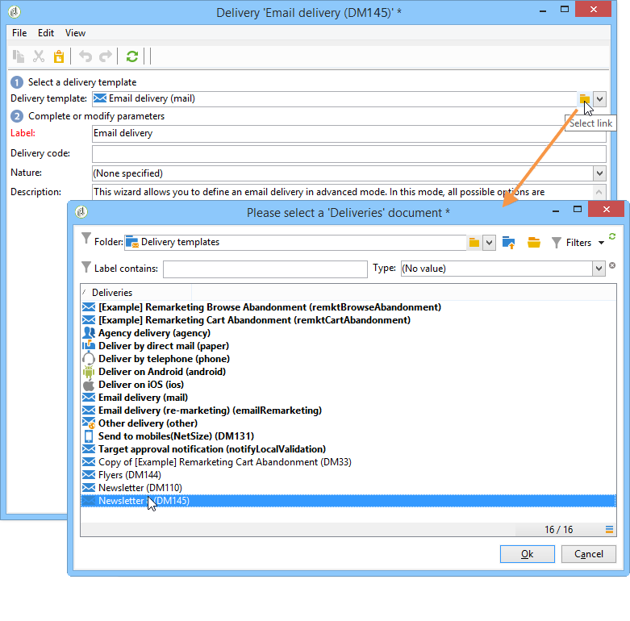

# Creación de un envío a partir de una plantilla{#creating-a-delivery-from-a-template}

## Vinculación de una plantilla a un envío {#linking-the-template-to-a-delivery}

Para crear un envío basado en una plantilla existente, seleccione la plantilla de la lista de plantillas de envío disponibles.

Otherwise, click the **[!UICONTROL Select link]** folder to the right of the field to browse the tree.

Select the desired directory from the **[!UICONTROL Folder]** field, or click the **[!UICONTROL Display sub-levels]** icon to display the contents of the directories in the sub-trees of the current directory.

Select the delivery template to be used, and click **[!UICONTROL Ok]**.

## Ejecución de la plantilla {#executing-the-template}

Puede iniciar la ejecución de una plantilla directamente desde la lista de plantillas sin tener que crear primero un envío. Para ello, seleccione la plantilla que desea ejecutar y haga clic con el botón derecho del ratón. Select **[!UICONTROL Actions>Execute the delivery template...]**.

También puede usar **[!UICONTROL File>Actions>Execute the delivery template...]**.

Enter the delivery parameters and click **[!UICONTROL Send]**.

Esta acción genera un envío en la carpeta adjunta a la plantilla. El nombre de este envío es el nombre de la plantilla de envío desde la que se creó.

>[!NOTE]
>
>Para obtener más información sobre la configuración de una entrega, consulte [Definición del contenido](../../delivery/using/defining-the-email-content.md)del correo electrónico.
