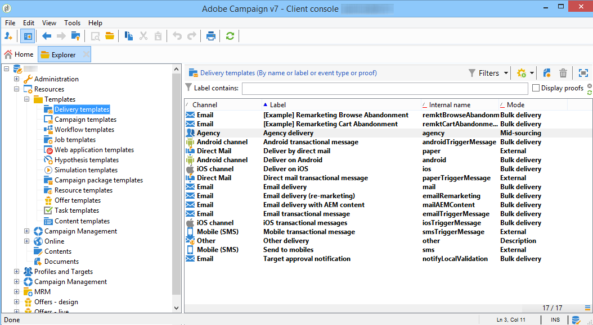

# Creación de una plantilla de envío{#creating-a-delivery-template}

## Conversión de un envío existente en una plantilla {#converting-an-existing-delivery-to-a-template}

Puede convertir un envío en una plantilla y usarla con las nuevas acciones de envío repetidas. To convert a delivery to a template, select it from the delivery list, accessible via the **[!UICONTROL Campaign management]** node of the tree.

Right-click and select **[!UICONTROL Actions > Save as template...]**.

Esta acción crea una plantilla de envío a partir del envío seleccionado. You must enter the folder where it is saved (in the **[!UICONTROL Folder]** field) as well as the folder where the deliveries created based on this template are created (in the **[!UICONTROL Execution folder]** field).

Para obtener más información sobre el modo de configuración, consulte [Vinculación de la plantilla a una entrega](../../delivery/using/creating-a-delivery-from-a-template.md#linking-the-template-to-a-delivery).

## Creación de una nueva plantilla {#creating-a-new-template}

Para configurar una plantilla de envío, siga los siguientes pasos:

1. Abra el explorador de Campaign.
1. En la carpeta **Recursos**, seleccione **Plantilla** y luego **Plantillas de envío**.

   

1. Haga clic en **Nueva** en la barra de herramientas para crear una nueva plantilla de envío.

   

1. Modifique la **Etiqueta** y el **Nombre interno** de la carpeta.
1. Guarde la plantilla y vuelva a abrirla.
1. Haga clic en el botón **Propiedades** y, a continuación, modifique los valores según sus necesidades.

   

1. En la pestaña **General**, confirme o cambie las ubicaciones seleccionadas en los menús desplegables **Carpeta de ejecución**, **Carpeta** y **Enrutamiento**.

   

1. Rellene la categoría **parámetros de correo electrónico** con el asunto del correo electrónico y la población objetivo.
1. Añada el **contenido HTML** para personalizar la plantilla. Puede mostrar un enlace a una página espejo y un enlace para darse de baja.
1. Seleccione la pestaña **Preview.** En el menú desplegable **Personalización de prueba**, seleccione **Destinatario** para previsualizar la plantilla como el perfil elegido.

   

1. Haga clic en **Save**. La plantilla ya está lista para utilizarse en un envío.

>[!NOTE]
>
>Para evitar errores de configuración, se recomienda duplicar una plantilla nativa y modificar sus propiedades en lugar de crear una nueva plantilla.
