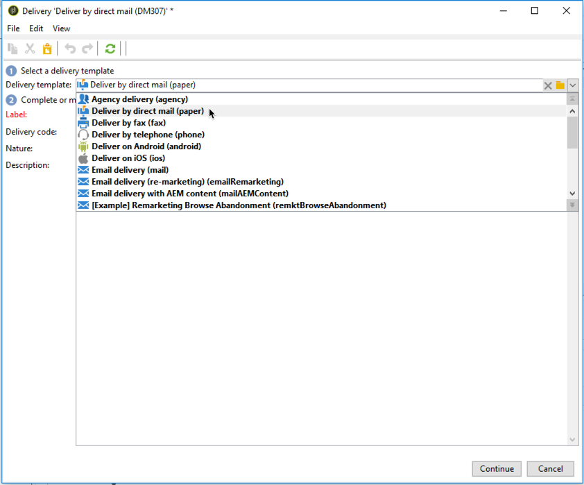

# Creación de una entrega de correo directo{#creating-a-direct-mail-delivery}

Para crear una nueva envío de correo directo, siga los pasos a continuación:

>[!NOTE]
>
>En la [documentación de Campaign v8](https://experienceleague.adobe.com/docs/campaign/campaign-v8/send/create-message.html?lang=es){target="_blank"} se exponen conceptos globales sobre la creación de envíos.

1. Cree un nuevo envío, por ejemplo, en el panel de control de envíos.
1. Seleccione la plantilla de envío **Enviar por correo directo (papel)**.

   

1. Identifique su envío con una etiqueta, un código y una descripción. Para obtener más información, consulte esta sección en la [documentación de Campaign v8](https://experienceleague.adobe.com/docs/campaign/campaign-v8/send/create-message.html?lang=es#create-the-delivery){target="_blank"}.
1. Haga clic en **Continuar** para confirmar esta información y mostrar la ventana de configuración de mensajes.
