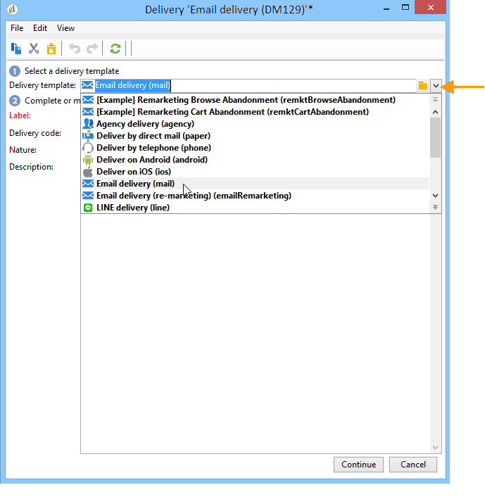

# Creación de una entrega de correo electrónico{#creating-an-email-delivery}

Para crear un nuevo envío de correo electrónico, siga los pasos siguientes:

>[!NOTE]
>
>En [esta sección](../../delivery/using/steps-about-delivery-creation-steps.md) se exponen conceptos globales sobre la creación de envíos.

1. Cree un nuevo envío, por ejemplo, desde el panel Envío.
1. Seleccione la plantilla de envío **Envío de correo electrónico (correo)** o cualquier plantilla de envío de correo electrónico que haya creado. Para obtener más información sobre plantillas de envío, consulte [esta sección](../../delivery/using/about-templates.md).

   

1. Identifique su entrega con una etiqueta, un código y una descripción. Para obtener más información, consulte [esta sección](../../delivery/using/steps-create-and-identify-the-delivery.md#identifying-the-delivery).
1. Haga clic en **Continuar** para confirmar esta información y mostrar la ventana de configuración de mensajes.
