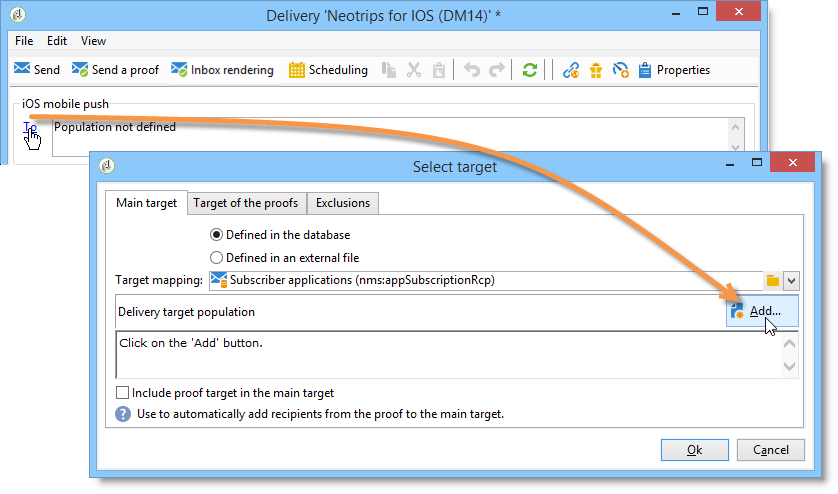
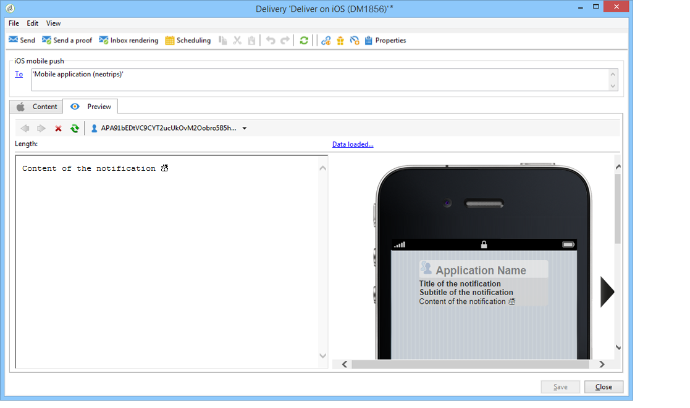

# Creación de notificaciones{#creating-notifications}

En esta sección se detallan los elementos específicos para la entrega de notificaciones en iOS y Android. En [esta sección](../../delivery/using/steps-about-delivery-creation-steps.md) se exponen conceptos globales sobre la creación de envíos.

Comience creando una nueva entrega.

## Envío de notificaciones en iOS {#sending-notifications-on-ios}

1. Seleccione la plantilla de envíos **[!UICONTROL Deliver on iOS]**.

   

1. Para definir el objetivo de la notificación, haga clic en el enlace **[!UICONTROL To]** y, luego, en **[!UICONTROL Add]**.

   

   >[!NOTE]
   >
   >En [esta sección](../../delivery/using/steps-defining-the-target-population.md) se describe el proceso detallado al seleccionar la población objetivo de una entrega.
   >
   >Para obtener más información sobre el uso de los campos de personalización, consulte [Acerca de la personalización](../../delivery/using/about-personalization.md)
   >
   >Para obtener más información sobre la integración de una lista de reasignación, consulte [Acerca de las direcciones semilla](../../delivery/using/about-seed-addresses.md)

1. Seleccione **[!UICONTROL Subscribers of an iOS mobile application (iPhone, iPad)]**, seleccione el servicio correspondiente a su aplicación móvil (Neotrips, en este caso) y luego seleccione la versión de iOS de la aplicación.

   

1. Seleccione el tipo de notificación: **[!UICONTROL Alert]**, **[!UICONTROL Badge]**, **[!UICONTROL Alert and badge]** o **[!UICONTROL Silent Push]**.

   

   >[!NOTE]
   >
   >El modo **Silent Push** está disponible en iOS 7. Esto permite enviar una notificación “silenciosa” a una aplicación móvil. No se avisa al usuario de la llegada de la notificación. Esta se transfiere directamente a la aplicación.

1. En el campo **[!UICONTROL Title]**, introduzca la etiqueta del título que desea que aparezca en la notificación. Solo aparece en la lista de notificaciones disponibles en el centro de notificaciones. Este campo permite definir el valor del parámetro **title** de la carga útil de notificación de iOS.

1. Si utiliza el conector HTTP/2, puede añadir un subtítulo (valor del parámetro **subtitle** de la carga útil de notificación de iOS). Consulte la sección [Configuración de la aplicación móvil en Adobe Campaign](../../delivery/using/configuring-the-mobile-application.md).

1. A continuación, introduzca el **[!UICONTROL Message]** y el **[!UICONTROL Value of the badge]** en función del tipo de notificación elegido.

   

   >[!NOTE]
   >
   >Las notificaciones de tipo **[!UICONTROL Badge]** y **[!UICONTROL Alert and badge]** permiten modificar el valor del distintivo (el número situado encima del logotipo de la aplicación móvil). Para actualizar el distintivo, sencillamente debe introducir 0 como valor. Si el campo está vacío, el valor de la insignia no cambia.

1. Haga clic en el icono **[!UICONTROL Insert emoticon]** para insertar emoticonos en la notificación push. Para personalizar la lista de emoticonos, consulte [Personalización de la lista de emoticonos](../../delivery/using/customizing-emoticon-list.md).

1. **[!UICONTROL Action button]** le permite definir una etiqueta para el botón de acción que aparece en las notificaciones de alerta (campo **action_loc_key** de la carga útil). Si la aplicación de iOS administra cadenas localizables (**Localizable.strings**), introduzca la clave correspondiente en este campo. Si la aplicación no administra texto localizable, introduzca la etiqueta que desea ver en el botón de acción. Para obtener más información sobre cadenas localizables, consulte la [documentación de Apple](https://developer.apple.com/library/archive/documentation/NetworkingInternet/Conceptual/RemoteNotificationsPG/CreatingtheNotificationPayload.html#//apple_ref/doc/uid/TP40008194-CH10-SW1).
1. En el campo **[!UICONTROL Play a sound]**, seleccione el sonido que el terminal móvil debe reproducir cuando reciba la notificación.

   >[!NOTE]
   >
   >Los sonidos deben incluirse en la aplicación y definirse cuando se cree el servicio. Consulte [Configuración de la cuenta externa de iOS](../../delivery/using/configuring-the-mobile-application.md#configuring-external-account-ios).

1. En el campo **[!UICONTROL Application variables]**, introduzca el valor de cada variable. Las variables de aplicación permiten definir el comportamiento de las notificaciones: por ejemplo, se puede configurar una pantalla específica de la aplicación que aparece cuando el usuario activa la notificación.

   >[!NOTE]
   >
   >Las variables de aplicación se deben definir en el código de la aplicación móvil e introducirse durante la creación del servicio. Para obtener más información, consulte [Configuración de la aplicación móvil en Adobe Campaign](../../delivery/using/configuring-the-mobile-application.md).

1. Una vez configurada la notificación, haga clic en la pestaña **[!UICONTROL Preview]** para previsualizar la notificación.

   

   >[!NOTE]
   >
   >El estilo de la notificación (banner o alerta) no se define en Adobe Campaign. Depende de la configuración seleccionada por el usuario en los ajustes de iOS. Sin embargo, Adobe Campaign permite previsualizar cada tipo de estilo de notificación. Haga clic en la flecha situada en la parte inferior derecha para cambiar de un estilo a otro.
   >
   >La previsualización utiliza el aspecto y la presentación de iOS 10.

Para enviar una prueba y realizar la entrega final, utilice el mismo proceso que en las entregas por correo electrónico.

Después de enviar mensajes, puede monitorizar y realizar un seguimiento de las entregas. Para obtener más información, consulte estas secciones:

* [Cuarentena de notificaciones push](../../delivery/using/understanding-quarantine-management.md#push-notification-quarantines)
* [Seguimiento de una entrega](../../delivery/using/monitoring-a-delivery.md)
* [Comprensión de los errores de entrega](../../delivery/using/understanding-delivery-failures.md)

## Envío de notificaciones en Android {#sending-notifications-on-android}

1. Comience por seleccionar la plantilla de envíos **[!UICONTROL Deliver on Android (android)]**.

   

1. Para definir el objetivo de la notificación, haga clic en el enlace **[!UICONTROL To]** y, luego, en **[!UICONTROL Add]**.

   

1. Seleccione **[!UICONTROL Subscribers of an Android mobile application]**, elija el servicio correspondiente a su aplicación móvil (Neotrips, en este caso), y luego seleccione la versión de Android de la aplicación.

   

1. A continuación, introduzca el contenido de la notificación.

   

1. Haga clic en el icono **[!UICONTROL Insert emoticon]** para insertar emoticonos en la notificación push. Para personalizar la lista de emoticonos, consulte [Personalización de la lista de emoticonos](../../delivery/using/defining-interactive-content.md).

1. En el campo **[!UICONTROL Application variables]**, introduzca el valor de cada variable. Las variables de aplicación permiten definir el comportamiento de las notificaciones: por ejemplo, se puede configurar una pantalla específica de la aplicación que aparece cuando el usuario activa la notificación.

   >[!NOTE]
   >
   >Las variables de aplicación se deben definir en el código de la aplicación móvil e introducirse durante la creación del servicio. Para obtener más información, consulte [Configuración de la aplicación móvil en Adobe Campaign](../../delivery/using/configuring-the-mobile-application.md).

1. Una vez configurada la notificación, haga clic en la pestaña **[!UICONTROL Preview]** para previsualizar la notificación.

   

Para enviar una prueba y realizar la entrega final, utilice el mismo proceso que en las entregas por correo electrónico.

El proceso detallado para validar y realizar una entrega se presenta en las siguientes secciones:

* [Validación de la entrega](../../delivery/using/steps-validating-the-delivery.md)
* [Realización de la entrega](../../delivery/using/steps-sending-the-delivery.md)

Después de enviar mensajes, puede monitorizar y realizar un seguimiento de las entregas. Para obtener más información, consulte estas secciones:

* [Cuarentena de notificaciones push](../../delivery/using/understanding-quarantine-management.md#push-notification-quarantines)
* [Seguimiento de una entrega](../../delivery/using/monitoring-a-delivery.md)
* [Comprensión de los errores de entrega](../../delivery/using/understanding-delivery-failures.md)
