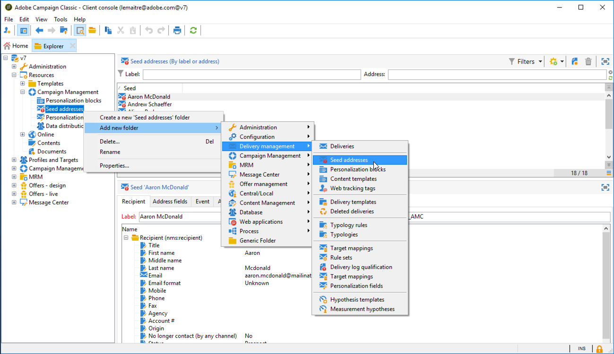

# Creación de direcciones sembradas{#creating-seed-addresses}

Seed addresses are not managed via standard profiles and targets, but in a dedicated node of the Adobe Campaign hierarchy **[!UICONTROL Resources > Campaign management > Seed addresses]**.

Se pueden crear subcarpetas para organizar las direcciones sembradas. Para ello, haga clic con el botón derecho en el **[!UICONTROL Seed addresses]** nodo y seleccione **[!UICONTROL Create a new 'Seed addresses' folder]**. Name the sub-folder and then press **[!UICONTROL Enter]** to validate. Ahora puede crear o copiar las direcciones sembradas en esta subcarpeta. For more on this, refer to [Defining addresses](#defining-addresses).

Adobe Campaign también permite crear plantillas de las direcciones sembradas que se importan a los envíos o campañas, adaptándolas a las necesidades específicas de los envíos o campañas correspondientes. Consulte [Creación de plantillas](#creating-seed-address-templates)de dirección de inicio.

## Definición de las direcciones {#defining-addresses}

Para crear direcciones sembradas, siga los siguientes pasos:

1. Click the **[!UICONTROL New]** button above the list of seed addresses.
1. Enter the data linked to the address in the matching fields from the **[!UICONTROL Recipient]** tab. Los campos disponibles corresponden a los datos fundamentales del perfil de los destinatarios del envío (nms:recipientTable): nombre, apellido, correo electrónico, etc.

   >[!NOTE]
   >
   >La etiqueta de la dirección se rellena automáticamente con el apellido y el nombre definidos.
   >
   >Al crear direcciones sembradas, no es necesario introducir todos los campos de cada pestaña. Los elementos de personalización que faltan se introducen de forma aleatoria durante el envío.

   

1. In the **[!UICONTROL Seed fields]** tab, enter the values that will be inserted in the delivery logs during the analysis phase (in the **[!UICONTROL nms:broadLog]** table).
1. In the **[!UICONTROL Additional data]** tab, enter the personalization data used for the deliveries created in the Datamanagement workflows and which you want to assign a specific value to.

## Creación de plantillas de la dirección sembrada {#creating-seed-address-templates}

Para crear plantillas de las direcciones que más tarde pueda importar y modificar para cada envío, el proceso es el mismo que al definir una nueva dirección sembrada. La única diferencia es que las direcciones sembradas deben almacenarse en una carpeta de tipo “plantilla”.

Para definir una carpeta de tipo “plantilla”, siga el siguiente proceso:

1. Create a new **[!UICONTROL Seed addresses]** type folder, right-click the folder then select **[!UICONTROL Properties...]**.

   

1. Haga clic en la **[!UICONTROL Restriction]** ficha y agregue la siguiente condición de filtrado: **@isModel = true**.

   

   Ahora, las direcciones almacenadas en esta carpeta pueden utilizarse como plantillas de direcciones. You can import them into deliveries or campaigns and adapt them based on the specific needs of the concerned deliveries and campaigns (see [Adding seed addresses](../../delivery/using/adding-seed-addresses.md)).
