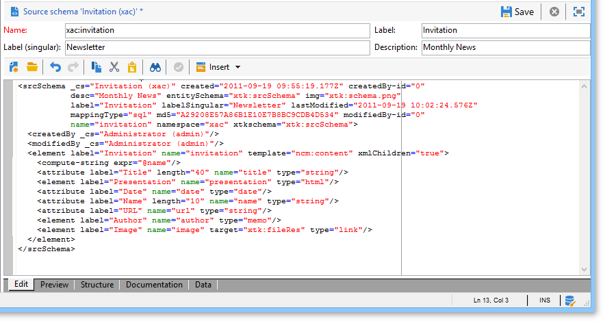

# Uso de esquemas de datos en Campaign{#data-schemas}

A continuación se muestran algunos principios generales sobre el uso de esquemas de datos en Adobe Campaign.

Para obtener más información sobre la creación y la configuración de esquemas de datos en Adobe Campaign, consulte [esta sección](../../configuration/using/about-schema-edition.md).

## Estructura del esquema {#schema-structure}

El documento XML de un esquema de datos debe contener **`<srcschema>`** el elemento raíz con los atributos **name** y **namespace** para rellenar el nombre del esquema y su espacio de nombres.

```
<srcSchema name="schema_name" namespace="namespace">
...
</srcSchema>
```

El punto de entrada del esquema es el elemento principal. Es fácil de identificar porque tiene el mismo nombre que el esquema y debe ser el elemento secundario del elemento raíz. La descripción del contenido comienza con este elemento.

En un esquema de administración de contenido, el elemento principal se representa mediante la siguiente línea:

```
<element name="book" template="ncm:content" xmlChildren="true">
```

El atributo **template** introducido en el elemento principal permite ampliar el esquema con propiedades genéricas a todas las definiciones de contenido, como nombre, fecha de creación, autor, cadena asociada, etc.

Estas propiedades se describen en el esquema **ncm:content**.

>[!NOTE]
>
>La presencia del atributo **xmlChildren** indica que la estructura de datos introducida mediante el elemento principal se almacena en un documento XML de la instancia de contenido.

>[!CAUTION]
>
>Al crear un nuevo esquema o durante una extensión de esquema, se debe mantener el mismo valor de secuencia de clave principal (@pkSequence) para todo el conjunto.

## Tipos de datos {#data-types}

A continuación, se muestra un ejemplo de esquema de administración de contenido con los tipos rellenados:

```
<srcSchema name="book" namespace="cus">
  <element name="book" template="ncm:content" xmlChildren="true">
    <attribute name="title" type="string"/>
    <attribute name="date" type="date"/>
    <attribute name="language" type="string"/>
    <element name="chapter">
      <attribute name="name" type="string"/>
      <element name="page" type="string>
        <attribute name="number" type="short"/>
      </element>
    </element>
  </element>
</element>
```

## Propiedades {#properties}

Se pueden utilizar varias propiedades para enriquecer los elementos **`<element>`** y **`<attribute>`** del esquema de datos.

Las propiedades principales utilizadas en la administración de contenido son las siguientes:

* **label**: descripción breve.
* **desc**: descripción larga.
* **default**: devuelve un valor predeterminado en la creación de contenido.
* **userEnum**: enumeración gratuita para almacenar y visualizar los valores introducidos mediante este campo.
* **enum**: enumeración fija utilizada cuando se conoce de antemano la lista de valores posibles.

A continuación, se muestra un ejemplo de esquema con las propiedades rellenadas:

```
<srcSchema name="book" namespace="cus">
  <enumeration name="language" basetype="string" default="eng">    
    <value name="fra" label="French"/>    
    <value name="eng" label="English"/>   
  </enumeration>

  <element name="book" label="Book" desc="Example book" template="ncm:content" xmlChildren="true">
    <attribute name="title" type="string" label="Title" default="'New book'"/>
    <attribute name="date" type="date" default="GetDate()"/>
    <attribute name="language" type="string" label="Language" enum="language"/>
    <element name="chapter" label="Chapter">
      <attribute name="name" type="string" label="Name" desc="Name of chapter"/>
      <element name="page" type="string" label="Page" desc="Page content">
        <attribute name="number" type="short" label="Number" default="CounterValue('numPage')"/>
      </element>
    </element>
  </element>
</srcSchema>
```

## Elementos de colección {#collection-elements}

Una colección es una lista de elementos con el mismo nombre y el mismo nivel jerárquico.

En este ejemplo, los elementos **`<chapter>`** y **`<page>`** son elementos de colección. Por lo tanto, el atributo **unbound** debe añadirse a la definición de estos elementos.

```
<element name="chapter" label="Chapter" unbound="true" ordered="true">
```

```
<element name="page" type="string" label="Page" desc="Content of page" unbound="true">
```

>[!NOTE]
>
>La presencia del atributo **ordered=&quot;true&quot;** permite ordenar los elementos insertados en la colección.

## Referencias a elementos {#element-referencing}

Las referencias a elementos se utilizan en los esquemas de contenido. Permiten factorizar la definición de un elemento **`<element>`** para que otros elementos con la misma estructura puedan referirse a él.

El atributo **ref** del elemento al que se hace referencia debe completarse con la ruta del elemento de referencia (XPath).

**Ejemplo**: añadir una sección **Appendix** con la misma estructura que el elemento **`<chapter>`** del esquema ejemplo.

```
<srcSchema name="book" namespace="cus">
  <element name="section">
    <attribute name="name" type="string" label="Name" desc="Name"/>
    <element name="page" type="string" label="Page" desc="Content of page">
      <attribute name="number" type="short" label="Number" default="CounterValue('numPage')"/>
    </element>

  <element name="book" label="Book" desc="Example book" template="ncm:content" xmlChildren="true">
    <attribute name="title" type="string" label="Title" default="'New book'"/>
    <attribute name="date" type="date" default="GetDate()"/>
    <attribute name="language" type="string" label="Language" enum="language"/>
    <element name="chapter" label="Chapter" ref="section"/>
    <element name="appendix" label="Appendix" ref="section"/>
  </element>
</srcSchema>
```

La estructura del capítulo se mueve al elemento con el nombre “sección” fuera del elemento principal. El capítulo y la sección hacen referencia al elemento “sección”.

## Cadena Compute {#compute-string}

Una **Compute string** (cadena de caracteres) es una expresión XPath que se utiliza para construir una cadena que representa una instancia de contenido.

A continuación, se muestra un ejemplo de esquema con su **Compute string**:

```
<srcSchema name="book" namespace="cus">
  <element name="book" label="Book" desc="Example book" template="ncm:content" xmlChildren="true">
    <compute-string expr="@name"/>
    ...
  </element>
</srcSchema>
```

## Edición de esquemas {#editing-schemas}

El campo de edición permite introducir el contenido XML del esquema de origen.



Cuando se guarda el esquema de origen, la generación del esquema ampliado se inicia automáticamente.

>[!NOTE]
>
>El control de edición **Name** permite introducir la clave del esquema, formado por el nombre y el espacio de nombres. Los atributos **name** y **namespace** del elemento raíz del esquema se actualizan automáticamente en el campo de edición XML del esquema.
