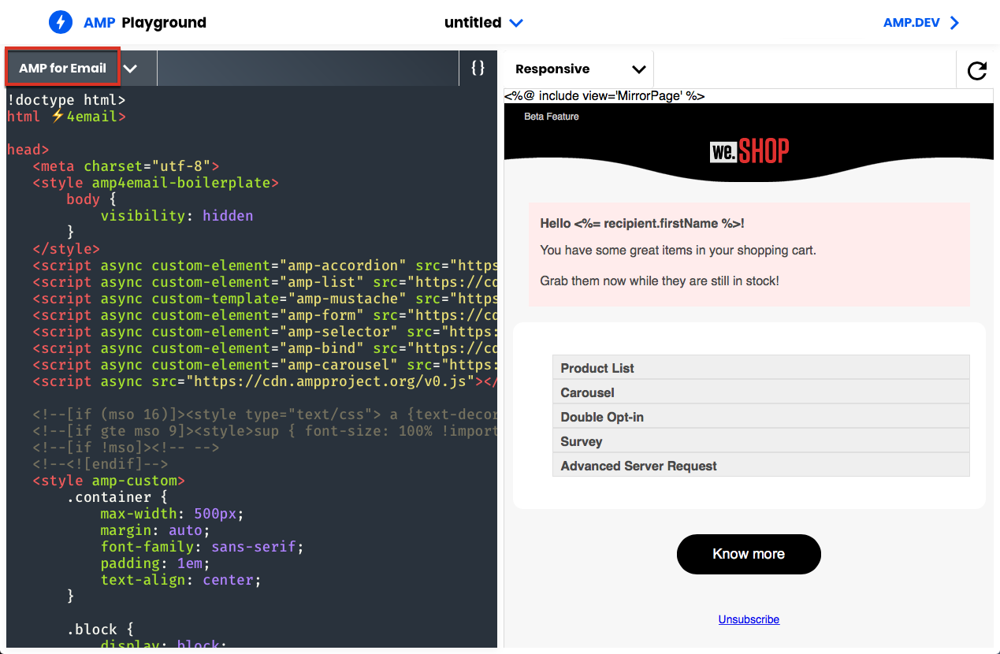

# Definición del contenido interactivo {#defining-interactive-content}

Adobe Campaign le permite usar el nuevo formato [AMP interactivo del correo electrónico](https://amp.dev/about/email/), que permite enviar correos electrónicos dinámicos en ciertas condiciones.

Con AMP para correo electrónico, puede:
* Probar el envío de correos electrónicos AMP a direcciones específicas correctamente configuradas.
* Enviar correos electrónicos AMP a las direcciones de Gmail, Outlook o Mail.ru después de registrarse con los proveedores correspondientes.

Para obtener más información sobre la prueba y el envío de correos electrónicos AMP, consulte [Direccionamiento de un correo electrónico AMP](#targeting-amp-email).

Esta función está disponible a través de un paquete dedicado en Adobe Campaign. Para utilizarlo, este paquete debe estar instalado. Una vez finalizado, reinicie el servidor para que el paquete se tenga en cuenta.

>[!NOTE]
>
> Para las arquitecturas híbridas y alojadas, el paquete debe instalarse en todos los servidores, incluidos el [servidor intermediario](../../installation/using/mid-sourcing-server.md) y la [instancia de ejecución](../../message-center/using/configuring-instances.md#execution-instance). Póngase en contacto con el ejecutivo de cuentas.

## Acerca de AMP para correo electrónico {#about-amp-for-email}

El nuevo formato de **AMP para correo electrónico** permite incluir componentes de AMP dentro de los mensajes para mejorar la experiencia de correo electrónico con contenido enriquecido y procesable. Con la funcionalidad moderna de la aplicación disponible directamente en los correos electrónicos, los destinatarios pueden interactuar dinámicamente con el contenido del mensaje.

Por ejemplo:
* Los correos electrónicos escritos con AMP pueden contener elementos interactivos como carruseles de imágenes.
* El contenido permanece actualizado en el mensaje.
* Los destinatarios pueden realizar acciones como responder a un formulario sin salir de su bandeja de entrada.

AMP para correo electrónico es compatible con los correos electrónicos existentes. La versión AMP del mensaje está incrustada en el correo electrónico como una nueva parte MIME, además del HTML y/o el texto sin formato, lo que garantiza la compatibilidad entre todos los clientes de correo electrónico.

Para obtener más información sobre la AMP para los requisitos y especificaciones de formato de correo electrónico, consulte la [documentación para desarrolladores de AMP](https://amp.dev/documentation/guides-and-tutorials/learn/email-spec/amp-email-format/?format=email).

 [Descubra esta función en vídeo](#amp-email-video)

## Pasos clave para utilizar AMP para correo electrónico con Adobe Campaign {#key-steps-to-use-amp}

Para probar y enviar correctamente un correo electrónico de AMP con Adobe Campaign, siga los pasos a continuación:
1. Instale el paquete **[!UICONTROL AMP support]**. Consulte [Instalación de paquetes integrados de Campaign](../../installation/using/installing-campaign-standard-packages.md).
1. Cree un correo electrónico y su contenido de AMP en Adobe Campaign. Consulte [Creación de contenido de correo electrónico de AMP con Adobe Campaign](#build-amp-email-content).
1. Asegúrese de seguir todos los requisitos de entrega de los proveedores de correo electrónico que admiten el formato AMP. Consulte [requisitos de AMP para entrega por correo electrónico](#amp-for-email-delivery-requirements).
1. Al definir el objetivo, asegúrese de seleccionar los destinatarios que podrán visualizar el formato AMP. Consulte [Objetivización de un correo electrónico AMP](#targeting-amp-email).

   >[!NOTE]
   >
   >Actualmente solo puede enviar correos electrónicos AMP a [direcciones de correo electrónico específicas](#testing-amp-delivery-for-selected-addresses) (para fines de prueba) o después de [registrarse](#delivering-amp-emails-by-registering) con los clientes de correo electrónico admitidos.

1. Envíe el correo electrónico como lo haría normalmente. Consulte [Envío de un correo electrónico de AMP](#sending-amp-email).

## Creación de contenido de correo electrónico AMP en Adobe Campaign {#build-amp-email-content}

Para generar un correo electrónico con el formato AMP, siga los pasos a continuación.

>[!IMPORTANT]
>
>Asegúrese de seguir las especificaciones y los requisitos de AMP para correo electrónico detallados en la [documentación para desarrolladores de AMP](https://amp.dev/documentation/guides-and-tutorials/learn/email_fundamentals/?format=email). También puede consultar las [prácticas recomendadas de AMP para correo electrónico](https://amp.dev/documentation/guides-and-tutorials/develop/amp_email_best_practices/?format=email).

1. Al crear la entrega por correo electrónico, seleccione cualquier plantilla.

   >[!NOTE]
   >
   >Una plantilla de AMP específica contiene un ejemplo de las capacidades principales que puede utilizar: lista de productos, carrusel, doble inclusión, encuesta y solicitud de servidor avanzada.

1. Seleccione la pestaña **[!UICONTROL AMP content]**.

   

1. Edite el contenido de AMP para adaptarlo a sus necesidades.

   >[!NOTE]
   >
   >Para obtener más información sobre la creación del primer correo electrónico de AMP, consulte la [documentación para desarrolladores de AMP](https://amp.dev/documentation/guides-and-tutorials/start/create_email/?format=email).

   Por ejemplo, puede utilizar el componente de lista de productos de la plantilla de AMP y mantener una lista de productos de un sistema de terceros, o incluso dentro de Adobe Campaign. Siempre que se ajuste un precio u otro elemento, se va a reflejar automáticamente cuando el destinatario vuelva a abrir el correo electrónico desde su buzón.

1. Personalice el contenido de AMP según sea necesario, como lo haría normalmente con el formato HTML en Adobe Campaign, con campos y bloques de personalización.

   

1. Una vez finalizado el proceso de edición, seleccione todo el contenido de AMP, cópielo y péguelo en el [validador basado en web de AMP](https://validator.ampproject.org) o en un sitio web similar.

   >[!NOTE]
   >
   >Asegúrese de seleccionar **AMP4 EMAIL** en la lista desplegable de la parte superior de la pantalla.

   

   Los errores se marcan en línea.

   >[!NOTE]
   >
   >El editor AMP de Adobe Campaign no está diseñado para validar contenidos. Utilice un sitio web externo como el [validador basado en web de AMP](https://validator.ampproject.org) para comprobar si el contenido es correcto.

1. Realice las modificaciones necesarias hasta que el contenido de la AMP pase la validación.

   

1. Copie y pegue el contenido validado en [AMP Playground](https://playground.amp.dev) o un sitio web similar para previsualizar el contenido.

   >[!NOTE]
   >
   >Asegúrese de seleccionar **AMP for Email** en la lista desplegable de la parte superior de la pantalla.

   

   >[!NOTE]
   >
   >No puede previsualizar el contenido de AMP directamente en Adobe Campaign. Utilice un sitio web externo como, por ejemplo, [AMP Playground](https://playground.amp.dev).

1. Vuelva a Adobe Campaign y copie y pegue el contenido validado en la pestaña **[!UICONTROL AMP content]**.

1. Cambie a la pestaña **[!UICONTROL HTML content]** o **[!UICONTROL Text content]** y defina el contenido para al menos uno de estos dos formatos.

   >[!IMPORTANT]
   >
   >Si el correo electrónico no contiene una versión HTML o de texto sin formato además del contenido de AMP, no se puede enviar.

## Requisitos de AMP para entrega por correo electrónico {#amp-for-email-delivery-requirements}

Al crear el contenido de AMP en Adobe Campaign, debe cumplir las condiciones para enviar un correo electrónico dinámico, que son específicas de los proveedores de correo electrónico de los destinatarios.

Actualmente, tres proveedores de correo electrónico admiten la prueba de este formato: Gmail, Outlook y Mail.ru.

Todos los pasos y especificaciones requeridos para probar el envío con formato AMP en cuentas de Gmail se detallan en la [documentación para desarrolladores de Gmail](https://developers.google.com/gmail/ampemail?) y en la [documentación para desarrolladores de Outlook](https://docs.microsoft.com/en-gb/outlook/amphtml/) y [Mail.ru](https://postmaster.mail.ru/amp) correspondiente.

En particular, deben cumplirse los siguientes requisitos:
* Siga los requisitos de seguridad de AMP específicos de [Gmail](https://developers.google.com/gmail/ampemail/security-requirements), [Outlook](https://docs.microsoft.com/en-gb/outlook/amphtml/security-requirements) y [Mail.ru](https://postmaster.mail.ru/amp/?lang=en#howto).
* La parte MIME de AMP debe contener un [documento AMP válido](https://amp.dev/documentation/guides-and-tutorials/learn/validation-workflow/validate_emails/?format=email).
* La parte MIME de AMP debe ser inferior a 100 KB.

También puede consultar las [Sugerencias y las limitaciones conocidas de Gmail](https://developers.google.com/gmail/ampemail/tips) y las [prácticas recomendadas de AMP para Outlook](https://docs.microsoft.com/en-gb/outlook/amphtml/best-practices).

## Objetivización de correo electrónico de AMP {#targeting-amp-email}

Actualmente puede experimentar enviando un correo electrónico de AMP en dos pasos:

1. Adobe Campaign permite probar la entrega de un correo electrónico dinámico con tecnología AMP a las direcciones de correo electrónico seleccionadas correctamente configuradas, a fin de verificar su contenido y comportamiento. Consulte [Prueba de entrega de correo electrónico AMP para direcciones seleccionadas](#testing-amp-delivery-for-selected-addresses).

1. Una vez probada, puede realizar una entrega o una campaña como parte del programa de AMP para correo electrónico registrándose con los proveedores de correo electrónico correspondientes para que se incluya en la lista de dominios de remitente añadida a la lista de permitidos. Consulte [Envío de correos electrónicos AMP mediante registro en un proveedor de correo electrónico](#delivering-amp-emails-by-registering).

### Prueba de la entrega de correo electrónico AMP para direcciones seleccionadas {#testing-amp-delivery-for-selected-addresses}

Puede probar la entrega de mensajes dinámicos desde Adobe Campaign a las direcciones de correo electrónico seleccionadas.

>[!NOTE]
>
>Actualmente, solo Gmail, Outlook y Mail.ru admiten la prueba del formato AMP.

Para Gmail y Outlook, primero debe añadir las direcciones de los remitentes que está utilizando a la lista de permitidos para enviar desde Adobe Campaign las cuentas de direccionamiento de Gmail y Outlook.

Para ello:
1. Asegúrese de que la opción que habilita el correo electrónico dinámico esté marcada para los proveedores de correo electrónico correspondientes.
1. Copie la dirección del remitente que se muestra en el campo **[!UICONTROL From]** de la entrega y péguela en la sección correspondiente de la configuración de la cuenta del proveedor de correo electrónico.

Para obtener más información, consulte la documentación para desarrolladores de [Gmail](https://developers.google.com/gmail/ampemail/testing-dynamic-email) y de [Outlook](https://docs.microsoft.com/en-gb/outlook/amphtml/register-outlook#individual-mailbox-registration).

Para probar el envío de un correo electrónico AMP a una dirección Mail.ru, siga los pasos de la [documentación del desarrollador de Mail.ru](https://postmaster.mail.ru/amp/?lang=en#howto) (sección **Si es un usuario**).

### Envío de correos electrónicos AMP mediante registro con un proveedor de correo electrónico {#delivering-amp-emails-by-registering}

Puede experimentar enviar correos electrónicos dinámicos registrándose con los proveedores de correo electrónico admitidos para que su dominio de remitente se añada a la lista de permitidos.

>[!NOTE]
>
>Actualmente, solo Gmail, Outlook Mail.ru admiten el formato AMP.

Una vez probadas con algunas direcciones, puede enviar correos electrónicos AMP a cualquier dirección de Gmail o Outlook. Para hacerlo, debe registrarse correctamente con Google o Microsoft y esperar su respuesta. Siga los pasos presentados en la documentación para desarrolladores de [Gmail](https://developers.google.com/gmail/ampemail/register) y de [Outlook](https://docs.microsoft.com/en-gb/outlook/amphtml/register-outlook#global-registration). Después de registrarse correctamente, se convierte en un remitente autorizado.

Para enviar correos electrónicos AMP a direcciones de Mail.ru, siga los requisitos y pasos que se enumeran en la [documentación de desarrolladores de Mail.ru](https://postmaster.mail.ru/amp/?lang=en#howto) (sección **Si es un remitente de correo electrónico**).

## Envío de un correo electrónico de AMP {#sending-amp-email}

Una vez que el contenido de AMP y la reserva están listos, y una vez definido un objetivo compatible, puede enviar el correo electrónico como lo haría normalmente.

Actualmente solo Gmail, Outlook y Mail.ru admiten el formato AMP en ciertas condiciones. Puede dirigirse a direcciones de otros proveedores de correo electrónico, pero recibirán la versión HTML o de texto sin formato de su correo electrónico.

>[!IMPORTANT]
>
>Si el correo electrónico no contiene una versión HTML o de texto sin formato además del contenido de AMP, no se puede enviar.

Los destinatarios coincidentes obtienen la versión AMP del correo electrónico en su buzón.

Por ejemplo, si ha incluido una lista de productos en el correo electrónico, al editar los precios en un sistema de terceros, los precios se ajustan automáticamente cada vez que los destinatarios vuelvan a abrir el correo electrónico en su buzón.

>[!NOTE]
>
>Puede crear una regla de procesamiento de correo para evitar que dominios específicos reciban correos electrónicos AMP. Consulte [Administración de formatos de correo electrónico](../../installation/using/email-deliverability.md#managing-email-formats).
>
>De forma predeterminada, la opción **[!UICONTROL AMP inclusion]** está configurada en **[!UICONTROL No]**.

## Videotutorial {#amp-email-video}

El siguiente vídeo explica cómo activar AMP en Adobe Campaign y cómo usarlo.

>[!VIDEO](https://video.tv.adobe.com/v/29940?quality=12&learn=on)

Puede encontrar disponibles más vídeos de procedimientos para Campaign [aquí](https://experienceleague.adobe.com/docs/campaign-classic-learn/tutorials/overview.html?lang=es).
