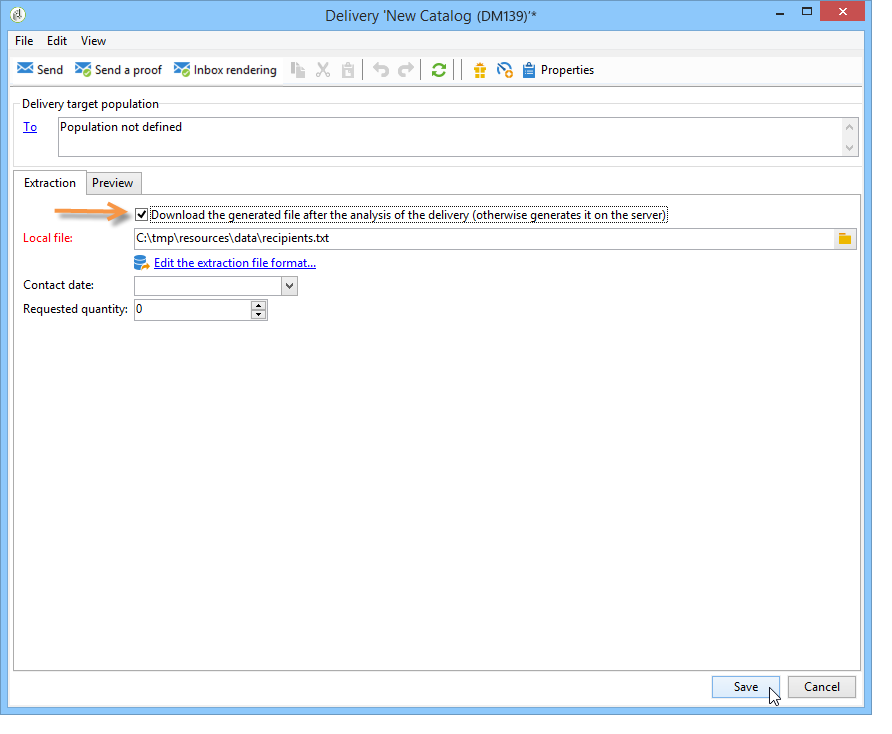
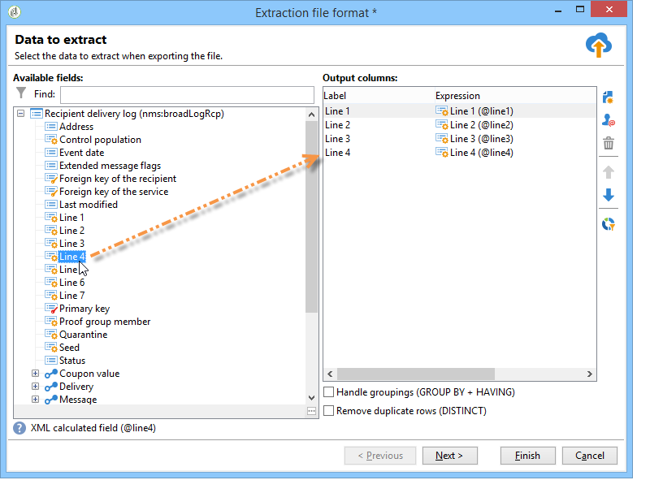

# Definición del contenido de correo postal{#defining-the-direct-mail-content}

## Extracción de archivos {#extraction-file}

El nombre del archivo que contiene los datos extraídos se define en el campo **[!UICONTROL File]**. El botón situado a la derecha del campo permite utilizar campos personalizados para crear el nombre del archivo.

De forma predeterminada, el archivo de extracción se crea y se almacena en el servidor. Puede guardarlo en el equipo. Para ello, marque la **[!UICONTROL Download the generated file after the analysis of the delivery]**. En este caso, es necesario indicar la ruta de acceso al directorio de almacenamiento local así como al nombre de archivo.

Para una entrega de correo postal, el contenido de la extracción se define en el vínculo **[!UICONTROL Edit the extraction file format...]**.

Este vínculo le permite acceder al Asistente de extracción y definir la información (columnas) que se van a exportar en el archivo de salida.

Es posible insertar una URL personalizada en el archivo de extracción. Para obtener más información, consulte [esta sección](../../web/using/publishing-a-web-form.md).

>[!NOTE]
>
>Este asistente incluye los pasos del asistente de exportación detallados en la sección [Introducción](../../platform/using/executing-export-jobs.md).
