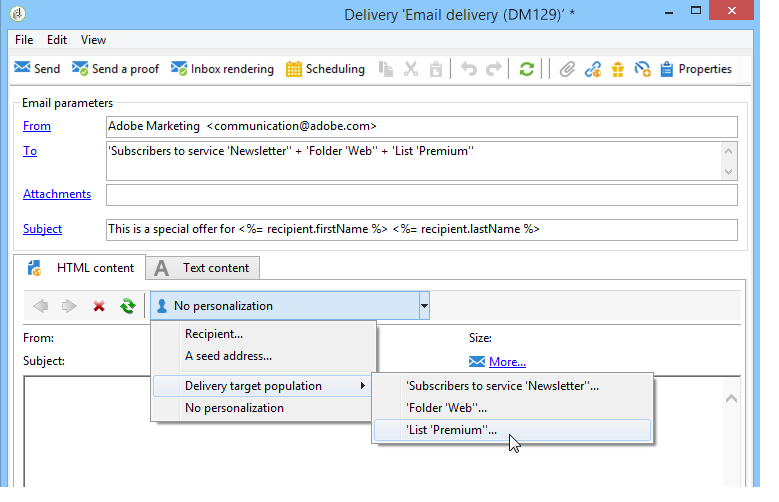
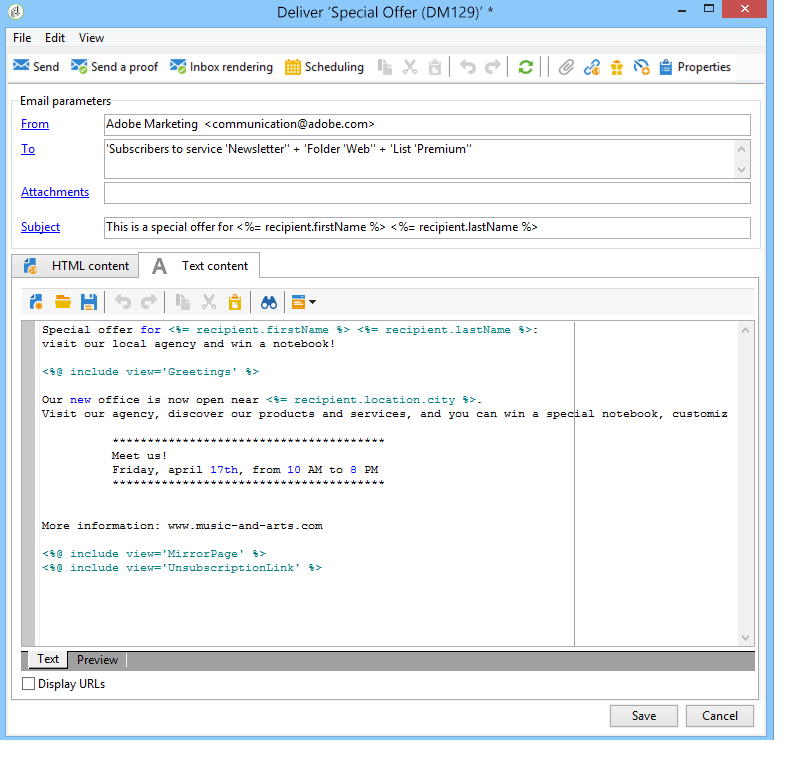
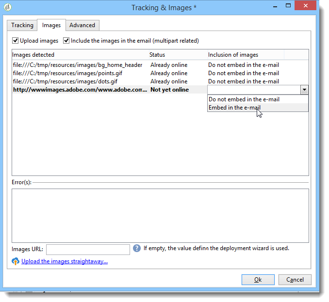
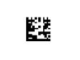

# Definición del contenido del correo electrónico {#defining-the-email-content}

## Remitente {#sender}

Para definir el nombre y la dirección del remitente que aparece en el encabezado de los mensajes enviados, haga clic en el vínculo **[!UICONTROL From]**.

Esta ventana permite introducir toda la información necesaria para crear los encabezados de los mensajes de correo electrónico. Dicha información puede personalizarse. Para ello, utilice los botones a la derecha de los campos de entrada para insertar campos personalizados.

Para saber cómo insertar y utilizar campos personalizados, consulte la sección [Acerca de la personalización](../../delivery/using/about-personalization.md).

>[!NOTE]
>
>* La dirección del remitente se utiliza en las respuestas de forma predeterminada.
>* Los parámetros de encabezado no deben estar vacíos. De forma predeterminada, contienen los valores introducidos al configurar el asistente de implementación. Para obtener más información, consulte la [Guía de instalación](../../installation/using/deploying-an-instance.md).
>* La dirección del remitente es obligatoria para permitir que se envíe un mensaje de correo electrónico (estándar RFC).
>* Adobe Campaign comprueba la sintaxis de las direcciones de correo electrónico introducidas.

>[!IMPORTANT]
>
>En el contexto de las comprobaciones implementadas por los proveedores de acceso a Internet (ISP) para luchar contra los mensajes de correo electrónico no deseados (spam), Adobe recomienda crear cuentas de correo electrónico que correspondan a las direcciones especificadas para las entregas y las respuestas. Consulte con el administrador del sistema de mensajería.

## Asunto del mensaje {#message-subject}

El asunto del mensaje se configura en el campo correspondiente. Puede introducirlo directamente en el campo o hacer clic en el vínculo **[!UICONTROL Subject]** para introducir una secuencia de comandos. El vínculo personalizado permite insertar campos de base de datos en el asunto.

>[!IMPORTANT]
>
>El asunto del mensaje es obligatorio.

El contenido del campo se sustituye por el valor del perfil de destinatario cuando se envía el mensaje.

Por ejemplo, en el mensaje anterior, el asunto del mensaje está personalizado para cada destinatario con datos de su perfil.

>[!NOTE]
>
>El uso de plantillas personalizadas se presenta en [Acerca de la personalización](../../delivery/using/about-personalization.md).

También puede insertar iconos gestuales en la línea de asunto con la ventana emergente **[!UICONTROL Insert emoticon]**.

## Contenido del mensaje {#message-content}

>[!IMPORTANT]
>
>Por razones de privacidad, recomendamos utilizar HTTPS para todos los recursos externos.

El contenido del mensaje se define en la sección inferior de la ventana de configuración de entrega.

Los mensajes se envían en formato HTML o texto de forma predeterminada, según las preferencias del destinatario. Se recomienda crear contenido en ambos formatos para garantizar que los mensajes se puedan visualizar correctamente en cualquier sistema de correo. Para obtener más información, consulte [Seleccionar formatos de mensajes](#selecting-message-formats).

* Para importar un contenido HTML, usar el botón **[!UICONTROL Open]**. También puede pegar el código de fuente directamente en la subpestaña **[!UICONTROL Source]**.

   Si está utilizando el [Editor de contenido digital](../../web/using/about-campaign-html-editor.md) (DCE), consulte [Selección de una plantilla de contenido](../../web/using/use-case--creating-an-email-delivery.md#step-3---selecting-a-content).

   >[!IMPORTANT]
   >
   >El contenido HTML debe crearse de antemano y luego importarse en Adobe Campaign. El editor HTML no está diseñado para creación de contenido.

   La subpestaña **[!UICONTROL Preview]** permite ver la renderización de cada contenido para un destinatario. Los campos personalizados y los elementos condicionales del contenido se sustituyen por la información correspondiente del perfil seleccionado.

   Los botones de la barra de herramientas proporcionan acceso a las acciones estándar y a los parámetros de formato de la página HTML.

   

   Puede insertar imágenes en mensajes desde un archivo local o desde una biblioteca de imágenes en Adobe Campaign. Para ello, haga clic en el icono **[!UICONTROL Image]** y seleccione las opciones deseadas.

   

   Se puede acceder a las imágenes de biblioteca a través de la carpeta **[!UICONTROL Resources>Online>Public resources]** en el árbol de carpetas. Consulte también [Añadir imágenes](#adding-images).

   El último botón de la barra de herramientas permite insertar campos personalizados.

   >[!NOTE]
   >
   >El uso de plantillas personalizadas se presenta en [Acerca de la personalización](../../delivery/using/about-personalization.md).

   Las pestañas situadas en la parte inferior de la página permiten mostrar el código HTML de la página que se está creando y ver la renderización del mensaje con su personalización. Para iniciar esta pantalla, haga clic en **[!UICONTROL Preview]** y seleccione un destinatario con el botón **[!UICONTROL Test personalization]** de la barra de herramientas. Puede seleccionar un destinatario de los objetivos definidos o elegir otro destinatario.

   

   Puede validar el mensaje HTML. También puede ver el contenido del encabezado del correo electrónico.

   

* Para importar un contenido de texto, utilice el botón **[!UICONTROL Open]** o la pestaña **[!UICONTROL Text Content]** para introducir el contenido del mensaje cuando se muestre en formato de texto. Utilice los botones de la barra de herramientas para acceder a las acciones de los contenidos. El último botón permite insertar los campos personalizados.

   

   En cuanto al formato HTML, haga clic en la pestaña **[!UICONTROL Preview]** situada en la parte inferior de la página para ver la renderización del mensaje con su personalización.

   

<!--## Selecting message formats {#selecting-message-formats}

You can change the format of email messages sent. To do this, edit the delivery properties and click the **[!UICONTROL Delivery]** tab.

Select the format of the email in the lower section of the window:

* **[!UICONTROL Use recipient preferences]** (default mode)

  The message format is defined according to the data stored in the recipient profile and stored by default in the **[!UICONTROL email format]** field (@emailFormat). If a recipient wishes to receive messages in a certain format, this is the format sent. If the field is not filled in, a multipart-alternative message is sent (see below).

* **[!UICONTROL Let recipient mail client choose the most appropriate format]**

  The message contains both formats: text and HTML. The format displayed on reception depends on the configuration of the recipient's mail software (multipart-alternative).

  >[!IMPORTANT]
  >
  >This option includes both versions of the document. It therefore impacts the delivery rate, because the message size is greater.

* **[!UICONTROL Send all messages in text format]**

  The message is sent in text format. HTML format will not be sent, but used for the mirror page only when the recipient clicks on the message.-->

## Definición del contenido interactivo {#amp-for-email-format}

Adobe Campaign le permite probar el nuevo formato [AMP interactivo para correo electrónico](https://amp.dev/es/about/email/), que permite enviar correos electrónicos dinámicos en ciertas condiciones.

Para obtener más información, consulte [esta sección](../../delivery/using/defining-interactive-content.md).

## Uso de la gestión de contenido {#using-content-management}

Puede definir el contenido de la entrega mediante los formularios de gestión de contenido directamente en el asistente de envíos. Para ello, debe hacer referencia a la plantilla de publicación de la gestión de contenido que se va a utilizar, en la pestaña **[!UICONTROL Advanced]** de las propiedades de entrega.

Una pestaña adicional permite introducir contenido que se integra y formatea automáticamente según las reglas de gestión de contenido.

>[!NOTE]
>
>Para obtener más información sobre la administración de contenido en Adobe Campaign, consulte [esta sección](../../delivery/using/about-content-management.md).

## Inserción de emoticonos {#inserting-emoticons}

Puede insertar emoticonos en el contenido del correo electrónico.

1. Haga clic en el icono **[!UICONTROL Insert emoticon]**.
1. En la ventana emergente, seleccione un emoticono.

   

1. Haga clic en el botón **[!UICONTROL Close]** cuando termine.

Para personalizar la lista de emoticonos, consulte esta [página](../../delivery/using/customizing-emoticon-list.md).

## Adición de imágenes {#adding-images}

Las entregas de correo electrónico de formato HTML pueden contener imágenes. Desde el asistente de entregas, puede importar una página HTML que contenga imágenes o insertar imágenes directamente utilizando el editor HTML mediante el icono **[!UICONTROL Image]**.

Las imágenes pueden ser:

* Una imagen local o una imagen obtenida desde un servidor
* Una imagen almacenada en la biblioteca de recursos públicos de Adobe Campaign

   Los recursos públicos son accesibles a través del nodo **[!UICONTROL Resources > Online]** de la jerarquía de Adobe Campaign. Se agrupan en una biblioteca y se pueden incluir en mensajes de correo electrónico, pero también se pueden utilizar para campañas o tareas, o para la gestión de contenido.

* Un recurso compartido con Adobe Experience Cloud. Consulte [esta sección](../../integrations/using/sharing-assets-with-adobe-experience-cloud.md).

>[!IMPORTANT]
>
>Para incluir imágenes en los mensajes de correo electrónico con el asistente de entregas, la instancia de Adobe Campaign debe configurarse para habilitar la gestión de recursos públicos. Este procedimiento se puede realizar desde el asistente de implementación. Consulte [esta sección](../../installation/using/deploying-an-instance.md) para obtener más información sobre la configuración.

El asistente de entrega permite añadir imágenes locales o imágenes almacenadas en la biblioteca al contenido de los mensajes. Para ello, haga clic en el botón **[!UICONTROL Image]** en la barra de herramientas HTML.

>[!IMPORTANT]
>
>Para que los destinatarios puedan ver las imágenes incluidas en los mensajes que reciben, estos mensajes deben estar disponibles en un servidor accesible desde el exterior.

Para administrar imágenes mediante el asistente de envíos:

1. En la barra de herramientas, haga clic en el icono **[!UICONTROL Tracking & Images]**.
   

1. Seleccione **[!UICONTROL Upload images]** en la **[!UICONTROL Images]** pestaña.
1. Puede elegir si desea incluir las imágenes en el mensaje de correo electrónico.
   

* Puede cargar imágenes manualmente sin esperar a la fase de análisis de entregas. Para ello, haga clic en el vínculo **[!UICONTROL Upload the images straightaway...]**.
* Puede especificar otra ruta para acceder a las imágenes en el servidor de seguimiento. Para ello, indíquela en el campo **[!UICONTROL Images URL]**. Este valor anula el valor definido en los parámetros del asistente de instalación.

Cuando se abre contenido HTML con imágenes incluidas en el asistente de entregas, un mensaje le da la opción de cargar las imágenes inmediatamente en función de los parámetros de entrega.

>[!IMPORTANT]
>
>Las rutas de acceso a la imagen se modifican durante la carga manual o al enviar mensajes.

### Envío de un mensaje con imágenes {#sending-a-message-with-images}

>[!NOTE]
>
>Para evitar problemas de rendimiento, si incluye imágenes descargadas sobre la marcha desde una URL personalizada como [datos adjuntos](../../delivery/using/attaching-files.md), cada tamaño de imagen no debe superar los 100.000 bytes de forma predeterminada. Este umbral recomendado se puede configurar desde [la lista de opciones de Campaign Classic](../../installation/using/configuring-campaign-options.md#delivery).

A continuación se muestra un ejemplo de entrega con cuatro imágenes:

Estas imágenes provienen de un directorio local o sitio web que puede verificar desde la pestaña **[!UICONTROL Source]**.

Haga clic en el icono **[!UICONTROL Tracking & Images]** y, a continuación, en la pestaña **[!UICONTROL Images]** para comenzar a detectar imágenes en el mensaje.

Puede ver el estado de cada imagen detectada:

* Si una imagen se almacena localmente o se ubica en otro servidor, aunque este servidor sea visible desde el exterior (en un sitio de Internet, por ejemplo), se detecta como **[!UICONTROL Not yet online]**.
* Las imágenes se detectan como **[!UICONTROL Already online]** si se cargaron anteriormente antes de crear otro envío.
* En el asistente de implementación puede definir las direcciones URL para las que no se ha habilitado la detección de imágenes: la carga de estas imágenes pasa a estar **[!UICONTROL Skipped]**.

>[!NOTE]
>
>Las imágenes se identifican por su contenido y no por sus rutas de acceso. Esto significa que la imagen cargada previamente con un nombre diferente o en un directorio diferente se detecta como **[!UICONTROL Already online]**.

Durante la fase de análisis, las imágenes se cargan automáticamente en el servidor para poder acceder a ellas desde el exterior, excepto en las imágenes locales que deben cargarse de antemano.

Puede trabajar con previsión y cargar las imágenes para que puedan verlas otros operadores de Adobe Campaign. Esto resulta útil si trabaja de forma colaborativa. Para ello, haga clic en **[!UICONTROL Upload the images straightaway...]** para cargar las imágenes en el servidor.

>[!NOTE]
>
>A continuación, se modifican las URL de las imágenes del mensaje de correo electrónico, además de sus nombres, concretamente.

Una vez que las imágenes están en línea, puede ver los cambios en los nombres y en las rutas a través de la pestaña **[!UICONTROL Source]** del mensaje.

Si selecciona **[!UICONTROL Include the images in the email]** puede elegir las imágenes que desea incluir en la columna correspondiente.

>[!NOTE]
>
>Si las imágenes locales se incluyen en el mensaje, debe confirmar los cambios en el código de fuente del mensaje.

## Inserción de un código de barras en un correo electrónico{#inserting-a-barcode-in-an-email}

El módulo de generación de códigos de barras permite crear varios tipos de códigos de barras que cumplan con muchos estándares habituales, incluidos códigos de barras 2D.

Es posible generar dinámicamente un código de barras como mapa de bits que utilice un valor definido con criterios de cliente. Se pueden incluir códigos de barras personalizados en las campañas de correo electrónico. El destinatario puede imprimir el mensaje y mostrarlo a la empresa emisora para escanearlo (por ejemplo, durante la comprobación).

Para insertar un código de barras en un correo electrónico, coloque el cursor en el contenido en el que desea mostrarlo y, a continuación, haga clic en el botón de personalización. Seleccione **[!UICONTROL Include > Barcode...]**.

A continuación, configure los siguientes elementos para adaptarlos a sus necesidades:

1. Seleccione el tipo de código de barras.

   * Para el formato 1D, los siguientes tipos están disponibles en Adobe Campaign: Codabar, Code 128, GS1-128 (anteriormente EAN-128), UPC-A, UPC-E, ISBN, EAN-8, Code39, Interleaved 2 de 5, POSTNET y Royal Mail (RM4SCC).

      Ejemplo de código de barras 1D:

      

   * Los tipos DataMatrix y PDF417 están relacionados con el formato 2D.

      Ejemplo de código de barras 2D:

      

   * Para insertar un código QR, seleccione este tipo e introduzca la tasa de corrección de errores que desee aplicar. Esta velocidad define la cantidad de información repetida y la tolerancia ante el deterioro.

      

      Ejemplo de código QR:

      

1. Introduzca el tamaño del código de barras que desea insertar en el correo electrónico: la configuración de la escala permite aumentar o reducir el tamaño del código de barras, de x1 a x10.
1. El campo **[!UICONTROL Value]** permite definir el valor del código de barras. Un valor puede coincidir con una oferta especial y puede ser la función de un criterio, puede ser el valor de un campo de base de datos vinculado a los clientes.

   Este ejemplo muestra un código de barras de tipo EAN-8 al que se ha añadido el número de cuenta de un destinatario. Para ello, haga clic en el botón de personalización a la derecha del campo **[!UICONTROL Value]** y seleccione **[!UICONTROL Recipient > Account number]**:

   

1. El campo **[!UICONTROL Height]** permite configurar la altura del código de barras sin cambiar su anchura, modificando la cantidad de espacio entre cada barra.

   No hay ningún control de entrada restrictivo en función del tipo de código de barras. Si un valor de código de barras es incorrecto, solo se puede ver en el modo de **Preview** donde el código de barras aparece tachado en rojo.

   >[!NOTE]
   >
   >El valor asignado a un código de barras depende de su tipo. Por ejemplo, un tipo EAN-8 debe tener exactamente 8 números.
   >
   >El botón de personalización situado a la derecha del campo **[!UICONTROL Value]** permite añadir datos además del propio valor. Esto enriquece el código de barras, siempre que el estándar de código de barras lo acepte.
   >
   >Por ejemplo, si está utilizando un código de barras de tipo GS1-128 y desea introducir el número de cuenta de un destinatario además del valor, haga clic en el botón de personalización y seleccione **[!UICONTROL Recipient > Account number]**. Si el número de cuenta del destinatario seleccionado se introduce correctamente, el código de barras lo tiene en cuenta.

Una vez configurados estos elementos, puede finalizar su el correo electrónico y enviarlo. Para evitar errores, asegúrese siempre de que el contenido se muestra correctamente antes de realizar una entrega haciendo clic en la pestaña **[!UICONTROL Preview]**.

>[!NOTE]
>
>Si el valor de un código de barras es incorrecto, su mapa de bits se muestra tachado en rojo.

<!--## Sending emails on Japanese mobiles {#sending-emails-on-japanese-mobiles}

### Email formats for Japanese mobiles {#email-formats-for-japanese-mobiles}

Adobe Campaign manages three specific Japanese formats for email on mobiles: **Deco-mail** (DoCoMo mobiles), **Decore Mail** (Softbank mobiles) and **Decoration Mail** (KDDI AU mobiles). These formats impose particular coding, structure, and size constraints. Learn more about limitations and recommendations in [this section](#limitations-and-recommendations).

In order for the recipient to correctly receive messages in one of these formats, we recommend selecting **[!UICONTROL Deco-mail (DoCoMo)]**, **[!UICONTROL Decore Mail (Softbank)]** or **[!UICONTROL Decoration Mail (KDDI AU)]** in the corresponding profile:

However, if you leave the **[!UICONTROL Email format]** option as **[!UICONTROL Unknown]**, **[!UICONTROL HTML]** or **[!UICONTROL Text]**, Adobe Campaign will automatically detect (when sending the email) the Japanese format to use so that the message is correctly displayed.

This automatic detection system is based on the list of predefined domains defined in the **[!UICONTROL Management of Email Formats]** mail rule set. For more on managing email formats, refer to [this page](../../installation/using/email-deliverability.md#managing-email-formats).

### Limitations and recommendations {#limitations-and-recommendations}

A certain number of constraints apply for sending emails that will be read on a mobile operated by a Japanese provider (Softbank, DoCoMo, KDDI AU).

Therefore, you must:

* Only use images in JPEG or GIF format
* Create a delivery with text and HTML sections that are strictly lower than 10 000 bytes (for KDDI AU and DoCoMo)
* Use images with a total size (before encoding) that is lower than 100 KB
* Do not use more than 20 images per message
* Use a reduced size HTML format (a limited number of tags are available for each operator)

>[!NOTE]
>
>Limitations specific to each operator are to be taken into account when creating your message. Refer to:  
>
>* For DoCoMo, refer to [this page](https://www.nttdocomo.co.jp/service/developer/make/content/deco_mail/index.html)
>* For KDDI AU, refer to [this page](https://www.au.com/ezfactory/tec/spec/decorations/template.html)
>* For Softbank, refer to [this page](https://www.support.softbankmobile.co.jp/partner/home_tech3/index.cfm)

### Testing the email content {#testing-the-email-content}

#### Previewing the message {#previewing-the-message}

Adobe Campaign allows you to check that your message format is adapted to be sent to a Japanese mobile.

Once you have defined your content and entered the email subject, you can check the display and formatting when the message is created.

In the **[!UICONTROL Preview]** tab of the content editing window, clicking **[!UICONTROL More... > Deco-mail diagnostic]** allows you to:

* Check that the HTML content tags conform to the Japanese format restrictions
* Check that the number of images in the message does not exceed the limit imposed by the format (20 images)
* Check the total message size (less than 100kB)

  

#### Running typology rule {#running-typology-rule}

In addition to the previewing diagnosis, a second check is carried out when sending a proof or a delivery: a specific typology rule, **[!UICONTROL Deco-mail check]**, is started during the analysis.

>[!IMPORTANT]
>
>This typology rule is only executed if at least one of the recipients is configured to receive emails in **[!UICONTROL Deco-mail (DoCoMo)]**, **[!UICONTROL Decore Mail (Softbank)]** or **[!UICONTROL Decoration Mail (KDDI AU)]** format.

This typology rule allows you to make sure that the delivery respects the [format constraints](#limitations-and-recommendations) defined by the Japanese operators, particularly in relation to the total size of the email, the size of the HTML and text sections, the number of images in the messages, and the tags in the HTML content.

#### Sending proofs {#sending-proofs}

You can send proofs to test your delivery. When you send the proof, if you are using substitution addresses, please enter addresses that correspond to the email format of the profile used.

For example, you can replace a profile's address by test@softbank.ne.jp if the email format for this profile was defined beforehand on **[!UICONTROL Decore Mail (Softbank)]**.

### Sending messages {#sending-messages}

To send an email to recipients with Japanese email formats with Campaign, two options are possible:

* Create two deliveries: one only for Japanese recipients and another for other recipients - refer to [this section](#designing-a-specific-delivery-for-japanese-formats).
* Create a single delivery and Adobe Campaign will automatically detect the format to use - refer to [this section](#designing-a-delivery-for-all-formats).

#### Designing a specific delivery for Japanese formats {#designing-a-specific-delivery-for-japanese-formats}

You can create a workflow that contains two deliveries: one to be read on a Japanese mobile and another for recipients with a standard email format.

To do this, use the **[!UICONTROL Split]** activity in your workflow and define the Japanese email formats (Deco-mail, Decoration Mail and Decore Mail) as filtering conditions.

#### Designing a delivery for all formats {#designing-a-delivery-for-all-formats}

When Adobe Campaign dynamically manages the formats according to the domain (profiles with email formats defined as **[!UICONTROL Unknown]**, **[!UICONTROL HTML]** or **[!UICONTROL Text]** ), you can send the same delivery to all of your recipients.

The message contact will display correctly for the users on Japanese mobiles, just as for the standard recipients.

>[!IMPORTANT]
>
>Make sure to respect the special features associated with each Japanese email format (Deco-mail, Decoration Mail, and Decore Mail). For more information on limitations, refer to [this section](#limitations-and-recommendations).-->
