<?xml version="1.0" encoding="UTF-8"?>
<xliff xmlns="urn:oasis:names:tc:xliff:document:1.2" xmlns:okp="okapi-framework:xliff-extensions" xmlns:its="http://www.w3.org/2005/11/its" xmlns:itsxlf="http://www.w3.org/ns/its-xliff/" version="1.2" its:version="2.0">
<file original="help/delivery/using/defining-the-email-content.md.mdnouisc" source-language="en-US" target-language="en-XX" datatype="x-text/markdown">
<body>
<trans-unit id="tu33" xml:space="preserve">
<source xml:lang="en-US">https://experienceleague.adobe.com/en/docs/control-panel/using/instances-settings/url-permissions</source>
<target xml:lang="en-XX">https://experienceleague.adobe.com/es/docs/control-panel/using/instances-settings/url-permissions</target>
</trans-unit>
<trans-unit id="tu59" xml:space="preserve">
<source xml:lang="en-US">https://amp.dev/about/email/</source>
<target xml:lang="en-XX">https://amp.dev/es/about/email/</target>
</trans-unit>
<trans-unit id="tu61" xml:space="preserve">
<source xml:lang="en-US">https://experienceleague.adobe.com/docs/campaign/campaign-v8/send/emails/defining-interactive-content.html</source>
<target xml:lang="en-XX">https://experienceleague.adobe.com/docs/campaign/campaign-v8/send/emails/defining-interactive-content.html?lang=es</target>
</trans-unit>
<trans-unit id="tu1" restype="x-YAML_METADATA_HEADER_VALUE" xml:space="preserve">
<source xml:lang="en-US">Define the email content in Adobe Campaign Classic</source>
<target xml:lang="en-XX">Definición del contenido del correo electrónico en Adobe Campaign Classic</target>
</trans-unit>
<trans-unit id="tu2" restype="x-YAML_METADATA_HEADER_VALUE" xml:space="preserve">
<source xml:lang="en-US">Learn how to define the email content when using Adobe Campaign</source>
<target xml:lang="en-XX">Obtenga información acerca de cómo definir el contenido del correo electrónico al utilizar Adobe Campaign</target>
</trans-unit>
<trans-unit id="tu3" xml:space="preserve">
<source xml:lang="en-US">Also applies to v8</source>
<target xml:lang="en-XX">También se aplica a v8</target>
</trans-unit>
<trans-unit id="tu4" xml:space="preserve">
<source xml:lang="en-US">Also applies to Campaign v8</source>
<target xml:lang="en-XX">También se aplica a Campaign v8</target>
</trans-unit>
<trans-unit id="tu5" xml:space="preserve">
<source xml:lang="en-US">Define the email content</source>
<target xml:lang="en-XX">Definición del contenido del correo electrónico</target>
</trans-unit>
<trans-unit id="tu6" xml:space="preserve">
<source xml:lang="en-US">Sender</source>
<target xml:lang="en-XX">Remitente</target>
</trans-unit>
<trans-unit id="tu7" xml:space="preserve">
<source xml:lang="en-US">To define the name and address of the sender which will appear in the header of messages sent, click the <ph id="1" ctype="x-STRONG_EMPHASIS">**[!UICONTROL From]**</ph> link.</source>
<target xml:lang="en-XX">Para definir el nombre y la dirección del remitente que aparece en el encabezado de los mensajes enviados, haga clic en el vínculo <ph id="1" ctype="x-STRONG_EMPHASIS">**[!UICONTROL From]**</ph>.</target>
</trans-unit>
<trans-unit id="tu8" xml:space="preserve">
<source xml:lang="en-US"><ph id="1" ctype="x-IMAGE">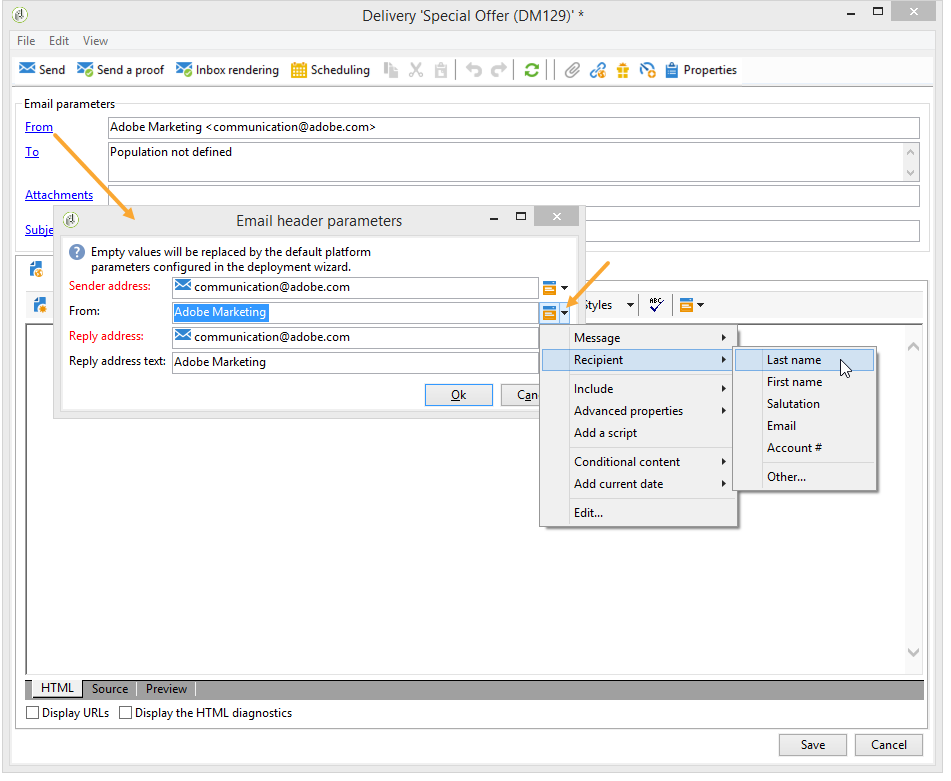</ph></source>
<target xml:lang="en-XX"><ph id="1" ctype="x-IMAGE"></ph></target>
</trans-unit>
<trans-unit id="tu9" xml:space="preserve">
<source xml:lang="en-US">This window lets you enter all the information required to create the email message headers. This information can be personalized. To do this, use the buttons to the right of the input fields to insert personalization fields.</source>
<target xml:lang="en-XX">Esta ventana permite introducir toda la información necesaria para crear los encabezados de los mensajes de correo electrónico. Dicha información puede personalizarse. Para ello, utilice los botones a la derecha de los campos de entrada para insertar campos personalizados.</target>
</trans-unit>
<trans-unit id="tu10" xml:space="preserve">
<source xml:lang="en-US">To find out how to insert and use personalization fields, refer to <ph id="1" ctype="x-LINK">[</ph>About personalization<ph id="2" ctype="x-LINK">](about-personalization.md)</ph> section.</source>
<target xml:lang="en-XX">Para saber cómo insertar y utilizar campos personalizados, consulte la sección <ph id="1" ctype="x-LINK">[</ph>Acerca de la personalización<ph id="2" ctype="x-LINK">](about-personalization.md)</ph>.</target>
</trans-unit>
<trans-unit id="tu11" xml:space="preserve">
<source xml:lang="en-US"><ph id="1" ctype="x-regxph" equiv-text="[!NOTE">[!NOTE]</ph></source>
<target xml:lang="en-XX"><ph id="1" ctype="x-regxph" equiv-text="[!NOTE">[!NOTE]</ph></target>
</trans-unit>
<trans-unit id="tu12" xml:space="preserve">
<source xml:lang="en-US">The sender's address is used for replies by default.</source>
<target xml:lang="en-XX">La dirección del remitente se utiliza en las respuestas de forma predeterminada.</target>
</trans-unit>
<trans-unit id="tu13" xml:space="preserve">
<source xml:lang="en-US">The header parameters must not be empty. By default, they contain the values input when configuring the deployment wizard. Learn more in <ph id="1" ctype="x-LINK">[</ph>this section<ph id="2" ctype="x-LINK">](../../installation/using/deploying-an-instance.md)</ph>.</source>
<target xml:lang="en-XX">Los parámetros de encabezado no deben estar vacíos. De forma predeterminada, contienen los valores introducidos al configurar el asistente de implementación. Obtenga más información en <ph id="1" ctype="x-LINK">[</ph>esta sección<ph id="2" ctype="x-LINK">](../../installation/using/deploying-an-instance.md)</ph>.</target>
</trans-unit>
<trans-unit id="tu14" xml:space="preserve">
<source xml:lang="en-US">The sender's address is mandatory to allow an email to be sent (RFC standard).</source>
<target xml:lang="en-XX">La dirección del remitente es obligatoria para permitir que se envíe un mensaje de correo electrónico (estándar RFC).</target>
</trans-unit>
<trans-unit id="tu15" xml:space="preserve">
<source xml:lang="en-US">Adobe Campaign checks the syntax of email addresses entered.</source>
<target xml:lang="en-XX">Adobe Campaign comprueba la sintaxis de las direcciones de correo electrónico introducidas.</target>
</trans-unit>
<trans-unit id="tu16" xml:space="preserve">
<source xml:lang="en-US"><ph id="1" ctype="x-regxph" equiv-text="[!CAUTION">[!CAUTION]</ph></source>
<target xml:lang="en-XX"><ph id="1" ctype="x-regxph" equiv-text="[!CAUTION">[!CAUTION]</ph></target>
</trans-unit>
<trans-unit id="tu17" xml:space="preserve">
<source xml:lang="en-US">To avoid deliverability issues, the email accounts that correspond to the addresses specified for deliveries and replies must exist and must be monitored. Check with your system administrator.</source>
<target xml:lang="en-XX">Para evitar problemas de entregabilidad, las cuentas de correo electrónico que corresponden con las direcciones especificadas para envíos y respuestas deben existir y monitorizarse. Consulte con el administrador del sistema de mensajería.</target>
</trans-unit>
<trans-unit id="tu18" xml:space="preserve">
<source xml:lang="en-US">Message subject</source>
<target xml:lang="en-XX">Asunto del mensaje</target>
</trans-unit>
<trans-unit id="tu19" xml:space="preserve">
<source xml:lang="en-US">The subject of the message is configured in the corresponding field. You can enter it directly in the field or click the <ph id="1" ctype="x-STRONG_EMPHASIS">**[!UICONTROL Subject]**</ph> link to enter a script. The personalization link lets you insert database fields in the subject.</source>
<target xml:lang="en-XX">El asunto del mensaje se configura en el campo correspondiente. Puede introducirlo directamente en el campo o hacer clic en el vínculo <ph id="1" ctype="x-STRONG_EMPHASIS">**[!UICONTROL Subject]**</ph> para introducir una secuencia de comandos. El vínculo personalizado permite insertar campos de base de datos en el asunto.</target>
</trans-unit>
<trans-unit id="tu20" xml:space="preserve">
<source xml:lang="en-US"><ph id="1" ctype="x-regxph" equiv-text="[!IMPORTANT">[!IMPORTANT]</ph></source>
<target xml:lang="en-XX"><ph id="1" ctype="x-regxph" equiv-text="[!IMPORTANT">[!IMPORTANT]</ph></target>
</trans-unit>
<trans-unit id="tu21" xml:space="preserve">
<source xml:lang="en-US">The message subject is mandatory.</source>
<target xml:lang="en-XX">El asunto del mensaje es obligatorio.</target>
</trans-unit>
<trans-unit id="tu22" xml:space="preserve">
<source xml:lang="en-US"><ph id="1" ctype="x-IMAGE"></ph></source>
<target xml:lang="en-XX"><ph id="1" ctype="x-IMAGE"></ph></target>
</trans-unit>
<trans-unit id="tu23" xml:space="preserve">
<source xml:lang="en-US">The field content will be replaced by the value in the recipient profile when the message is sent.</source>
<target xml:lang="en-XX">El contenido del campo se sustituye por el valor del perfil de destinatario cuando se envía el mensaje.</target>
</trans-unit>
<trans-unit id="tu24" xml:space="preserve">
<source xml:lang="en-US">For example, in the message above, the subject of the message is personalized for each recipient with data from their profile.</source>
<target xml:lang="en-XX">Por ejemplo, en el mensaje anterior, el asunto del mensaje está personalizado para cada destinatario con datos de su perfil.</target>
</trans-unit>
<trans-unit id="tu25" xml:space="preserve">
<source xml:lang="en-US"><ph id="1" ctype="x-regxph" equiv-text="[!NOTE">[!NOTE]</ph></source>
<target xml:lang="en-XX"><ph id="1" ctype="x-regxph" equiv-text="[!NOTE">[!NOTE]</ph></target>
</trans-unit>
<trans-unit id="tu26" xml:space="preserve">
<source xml:lang="en-US">The use of personalization fields is presented in <ph id="1" ctype="x-LINK">[</ph>About personalization<ph id="2" ctype="x-LINK">](about-personalization.md)</ph>.</source>
<target xml:lang="en-XX">El uso de plantillas personalizadas se presenta en <ph id="1" ctype="x-LINK">[</ph>Acerca de la personalización<ph id="2" ctype="x-LINK">](about-personalization.md)</ph>.</target>
</trans-unit>
<trans-unit id="tu27" xml:space="preserve">
<source xml:lang="en-US">You can also insert emoticons to your subject line with the <ph id="1" ctype="x-STRONG_EMPHASIS">**[!UICONTROL Insert emoticon]**</ph> pop-up window.</source>
<target xml:lang="en-XX">También puede insertar iconos gestuales en la línea de asunto con la ventana emergente <ph id="1" ctype="x-STRONG_EMPHASIS">**[!UICONTROL Insert emoticon]**</ph>.</target>
</trans-unit>
<trans-unit id="tu28" xml:space="preserve">
<source xml:lang="en-US">Message content</source>
<target xml:lang="en-XX">Contenido del mensaje</target>
</trans-unit>
<trans-unit id="tu29" xml:space="preserve">
<source xml:lang="en-US"><ph id="1" ctype="x-regxph" equiv-text="[!IMPORTANT">[!IMPORTANT]</ph></source>
<target xml:lang="en-XX"><ph id="1" ctype="x-regxph" equiv-text="[!IMPORTANT">[!IMPORTANT]</ph></target>
</trans-unit>
<trans-unit id="tu30" xml:space="preserve">
<source xml:lang="en-US">For privacy reasons, we recommend using HTTPS for all external resources.</source>
<target xml:lang="en-XX">Por razones de privacidad, recomendamos utilizar HTTPS para todos los recursos externos.</target>
</trans-unit>
<trans-unit id="tu31" xml:space="preserve">
<source xml:lang="en-US"><ph id="1" ctype="x-regxph" equiv-text="[!IMPORTANT">[!IMPORTANT]</ph></source>
<target xml:lang="en-XX"><ph id="1" ctype="x-regxph" equiv-text="[!IMPORTANT">[!IMPORTANT]</ph></target>
</trans-unit>
<trans-unit id="tu32" xml:space="preserve">
<source xml:lang="en-US">Release 7.4.4 (build 9401) includes an update to the external URL allow list. Make sure the domains used in your message content are added to your instance's approved allow list so that resources continue to load without interruption. As a Campaign Administrator, use the Control Panel to add and manage allow-listed URLs. See <ph id="1" ctype="x-LINK">[</ph>Add URL permissions<ph id="2" ctype="x-LINK">[#$tu33]{target="_blank"}</ph> for steps.</source>
<target xml:lang="en-XX">La versión 7.4.4 (versión 9401) incluye una actualización de la lista de permitidos de URL externas. Asegúrese de que los dominios utilizados en el contenido del mensaje se añadan a la lista de permitidos aprobada de la instancia para que los recursos se sigan cargando sin interrupción. Como administrador de Campaign, utilice el Panel de control para añadir y administrar las URL incluidas en la lista de permitidos. Consulte <ph id="1" ctype="x-LINK">[</ph>Adición de permisos de URL<ph id="2" ctype="x-LINK">[#$tu33]{target="_blank"}</ph> para conocer los pasos.</target>
</trans-unit>
<trans-unit id="tu34" xml:space="preserve">
<source xml:lang="en-US">The content of the message is defined in the lower section of the delivery configuration window.</source>
<target xml:lang="en-XX">El contenido del mensaje se define en la sección inferior de la ventana de configuración de entrega.</target>
</trans-unit>
<trans-unit id="tu35" xml:space="preserve">
<source xml:lang="en-US">Messages are sent in HTML or text format by default, according to recipient preference. We recommend creating content in both formats to ensure that messages can be correctly displayed in any mail system. For more on this, refer to <ph id="1" ctype="x-LINK">[</ph>Selecting message formats<ph id="2" ctype="x-LINK">](email-parameters.md#selecting-message-formats)</ph>.</source>
<target xml:lang="en-XX">Los mensajes se envían en formato HTML o texto de forma predeterminada, según las preferencias del destinatario. Se recomienda crear contenido en ambos formatos para garantizar que los mensajes se puedan visualizar correctamente en cualquier sistema de correo. Para obtener más información, consulte <ph id="1" ctype="x-LINK">[</ph>Seleccionar formatos de mensajes<ph id="2" ctype="x-LINK">](email-parameters.md#selecting-message-formats)</ph>.</target>
</trans-unit>
<trans-unit id="tu36" xml:space="preserve">
<source xml:lang="en-US">To import an HTML content, use the <ph id="1" ctype="x-STRONG_EMPHASIS">**[!UICONTROL Open]**</ph> button. You can also paste the source code directly into the <ph id="4" ctype="x-STRONG_EMPHASIS">**[!UICONTROL Source]**</ph> sub-tab.</source>
<target xml:lang="en-XX">Para importar un contenido HTML, usar el botón <ph id="1" ctype="x-STRONG_EMPHASIS">**[!UICONTROL Open]**</ph>. También puede pegar el código de fuente directamente en la subpestaña <ph id="4" ctype="x-STRONG_EMPHASIS">**[!UICONTROL Source]**</ph>.</target>
</trans-unit>
<trans-unit id="tu37" xml:space="preserve">
<source xml:lang="en-US">If you are using the <ph id="1" ctype="x-LINK">[</ph>Digital Content Editor<ph id="2" ctype="x-LINK">](../../web/using/about-campaign-html-editor.md)</ph> (DCE), refer to <ph id="3" ctype="x-LINK">[</ph>Selecting a content template<ph id="4" ctype="x-LINK">](../../web/using/use-case-creating-an-email-delivery.md#step-3---selecting-a-content)</ph>.</source>
<target xml:lang="en-XX">Si está utilizando el <ph id="1" ctype="x-LINK">[</ph>Editor de contenido digital<ph id="2" ctype="x-LINK">](../../web/using/about-campaign-html-editor.md)</ph> (DCE), consulte <ph id="3" ctype="x-LINK">[</ph>Selección de una plantilla de contenido<ph id="4" ctype="x-LINK">](../../web/using/use-case-creating-an-email-delivery.md#step-3---selecting-a-content)</ph>.</target>
</trans-unit>
<trans-unit id="tu38" xml:space="preserve">
<source xml:lang="en-US"><ph id="1" ctype="x-regxph" equiv-text="[!IMPORTANT">[!IMPORTANT]</ph></source>
<target xml:lang="en-XX"><ph id="1" ctype="x-regxph" equiv-text="[!IMPORTANT">[!IMPORTANT]</ph></target>
</trans-unit>
<trans-unit id="tu39" xml:space="preserve">
<source xml:lang="en-US">The HTML content must be created beforehand, then imported into Adobe Campaign. The HTML editor is not designed for content creation.</source>
<target xml:lang="en-XX">El contenido HTML debe crearse de antemano y luego importarse en Adobe Campaign. El editor HTML no está diseñado para creación de contenido.</target>
</trans-unit>
<trans-unit id="tu40" xml:space="preserve">
<source xml:lang="en-US">The <ph id="1" ctype="x-STRONG_EMPHASIS">**[!UICONTROL Preview]**</ph> sub-tab lets you view the rendering of each content for a recipient. The personalization fields and the conditional elements of content are replaced with the corresponding information for the selected profile.</source>
<target xml:lang="en-XX">La subpestaña <ph id="1" ctype="x-STRONG_EMPHASIS">**[!UICONTROL Preview]**</ph> permite ver la renderización de cada contenido para un destinatario. Los campos personalizados y los elementos condicionales del contenido se sustituyen por la información correspondiente del perfil seleccionado.</target>
</trans-unit>
<trans-unit id="tu41" xml:space="preserve">
<source xml:lang="en-US">The toolbar buttons provide access to the standard actions and formatting parameters for the HTML page.</source>
<target xml:lang="en-XX">Los botones de la barra de herramientas proporcionan acceso a las acciones estándar y a los parámetros de formato de la página HTML.</target>
</trans-unit>
<trans-unit id="tu42" xml:space="preserve">
<source xml:lang="en-US"><ph id="1" ctype="x-IMAGE">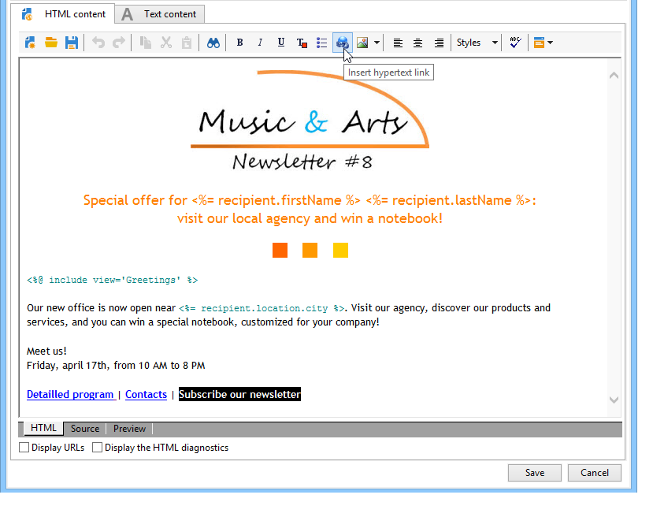</ph></source>
<target xml:lang="en-XX"><ph id="1" ctype="x-IMAGE"></ph></target>
</trans-unit>
<trans-unit id="tu43" xml:space="preserve">
<source xml:lang="en-US">You can insert images in messages from a local file or from an image library in Adobe Campaign. To do this, click the <ph id="1" ctype="x-STRONG_EMPHASIS">**[!UICONTROL Image]**</ph> icon and select the appropriate option.</source>
<target xml:lang="en-XX">Puede insertar imágenes en mensajes desde un archivo local o desde una biblioteca de imágenes en Adobe Campaign. Para ello, haga clic en el icono <ph id="1" ctype="x-STRONG_EMPHASIS">**[!UICONTROL Image]**</ph> y seleccione las opciones deseadas.</target>
</trans-unit>
<trans-unit id="tu44" xml:space="preserve">
<source xml:lang="en-US"><ph id="1" ctype="x-IMAGE"></ph></source>
<target xml:lang="en-XX"><ph id="1" ctype="x-IMAGE"></ph></target>
</trans-unit>
<trans-unit id="tu45" xml:space="preserve">
<source xml:lang="en-US">Library images can be accessed via the <ph id="1" ctype="x-STRONG_EMPHASIS">**[!UICONTROL Resources>Online>Public resources]**</ph> folder in the folder tree. Also refer to <ph id="4" ctype="x-LINK">[</ph>Adding images<ph id="5" ctype="x-LINK">](#adding-images)</ph>.</source>
<target xml:lang="en-XX">Se puede acceder a las imágenes de biblioteca a través de la carpeta <ph id="1" ctype="x-STRONG_EMPHASIS">**[!UICONTROL Resources>Online>Public resources]**</ph> en el árbol de carpetas. Consulte también <ph id="4" ctype="x-LINK">[</ph>Añadir imágenes<ph id="5" ctype="x-LINK">](#adding-images)</ph>.</target>
</trans-unit>
<trans-unit id="tu46" xml:space="preserve">
<source xml:lang="en-US">The last button in the toolbar lets you insert personalization fields.</source>
<target xml:lang="en-XX">El último botón de la barra de herramientas permite insertar campos personalizados.</target>
</trans-unit>
<trans-unit id="tu47" xml:space="preserve">
<source xml:lang="en-US"><ph id="1" ctype="x-regxph" equiv-text="[!NOTE">[!NOTE]</ph></source>
<target xml:lang="en-XX"><ph id="1" ctype="x-regxph" equiv-text="[!NOTE">[!NOTE]</ph></target>
</trans-unit>
<trans-unit id="tu48" xml:space="preserve">
<source xml:lang="en-US">The use of personalization fields is presented in <ph id="1" ctype="x-LINK">[</ph>About personalization<ph id="2" ctype="x-LINK">](about-personalization.md)</ph>.</source>
<target xml:lang="en-XX">El uso de plantillas personalizadas se presenta en <ph id="1" ctype="x-LINK">[</ph>Acerca de la personalización<ph id="2" ctype="x-LINK">](about-personalization.md)</ph>.</target>
</trans-unit>
<trans-unit id="tu49" xml:space="preserve">
<source xml:lang="en-US">The tabs at the bottom of the page let you display the HTML code of the page being created and view the rendering of the message with its personalization. To launch this display, click <ph id="1" ctype="x-STRONG_EMPHASIS">**[!UICONTROL Preview]**</ph> and select a recipient using the <ph id="4" ctype="x-STRONG_EMPHASIS">**[!UICONTROL Test personalization]**</ph> button in the toolbar. You can select a recipient from the defined target(s) or choose another recipient.</source>
<target xml:lang="en-XX">Las pestañas situadas en la parte inferior de la página permiten mostrar el código HTML de la página que se está creando y ver la renderización del mensaje con su personalización. Para iniciar esta pantalla, haga clic en <ph id="1" ctype="x-STRONG_EMPHASIS">**[!UICONTROL Preview]**</ph> y seleccione un destinatario con el botón <ph id="4" ctype="x-STRONG_EMPHASIS">**[!UICONTROL Test personalization]**</ph> de la barra de herramientas. Puede seleccionar un destinatario de los objetivos definidos o elegir otro destinatario.</target>
</trans-unit>
<trans-unit id="tu50" xml:space="preserve">
<source xml:lang="en-US"><ph id="1" ctype="x-IMAGE"></ph></source>
<target xml:lang="en-XX"><ph id="1" ctype="x-IMAGE"></ph></target>
</trans-unit>
<trans-unit id="tu51" xml:space="preserve">
<source xml:lang="en-US">You can validate the HTML message. You can also view the content of the email header.</source>
<target xml:lang="en-XX">Puede validar el mensaje HTML. También puede ver el contenido del encabezado del correo electrónico.</target>
</trans-unit>
<trans-unit id="tu52" xml:space="preserve">
<source xml:lang="en-US"><ph id="1" ctype="x-IMAGE"></ph></source>
<target xml:lang="en-XX"><ph id="1" ctype="x-IMAGE"></ph></target>
</trans-unit>
<trans-unit id="tu53" xml:space="preserve">
<source xml:lang="en-US">To import a text content, use the <ph id="1" ctype="x-STRONG_EMPHASIS">**[!UICONTROL Open]**</ph> button, or the <ph id="4" ctype="x-STRONG_EMPHASIS">**[!UICONTROL Text Content]**</ph> tab to enter the content of the message when displayed in text format. Use the toolbar buttons to access actions on the contents. The last button lets you insert personalization fields.</source>
<target xml:lang="en-XX">Para importar un contenido de texto, utilice el botón <ph id="1" ctype="x-STRONG_EMPHASIS">**[!UICONTROL Open]**</ph> o la pestaña <ph id="4" ctype="x-STRONG_EMPHASIS">**[!UICONTROL Text Content]**</ph> para introducir el contenido del mensaje cuando se muestre en formato de texto. Utilice los botones de la barra de herramientas para acceder a las acciones de los contenidos. El último botón permite insertar los campos personalizados.</target>
</trans-unit>
<trans-unit id="tu54" xml:space="preserve">
<source xml:lang="en-US"><ph id="1" ctype="x-IMAGE"></ph></source>
<target xml:lang="en-XX"><ph id="1" ctype="x-IMAGE"></ph></target>
</trans-unit>
<trans-unit id="tu55" xml:space="preserve">
<source xml:lang="en-US">As for the HTML format click the <ph id="1" ctype="x-STRONG_EMPHASIS">**[!UICONTROL Preview]**</ph> tab at the bottom of the page to view the rendering of the message with its personalization.</source>
<target xml:lang="en-XX">En cuanto al formato HTML, haga clic en la pestaña <ph id="1" ctype="x-STRONG_EMPHASIS">**[!UICONTROL Preview]**</ph> situada en la parte inferior de la página para ver la renderización del mensaje con su personalización.</target>
</trans-unit>
<trans-unit id="tu56" xml:space="preserve">
<source xml:lang="en-US"><ph id="1" ctype="x-IMAGE">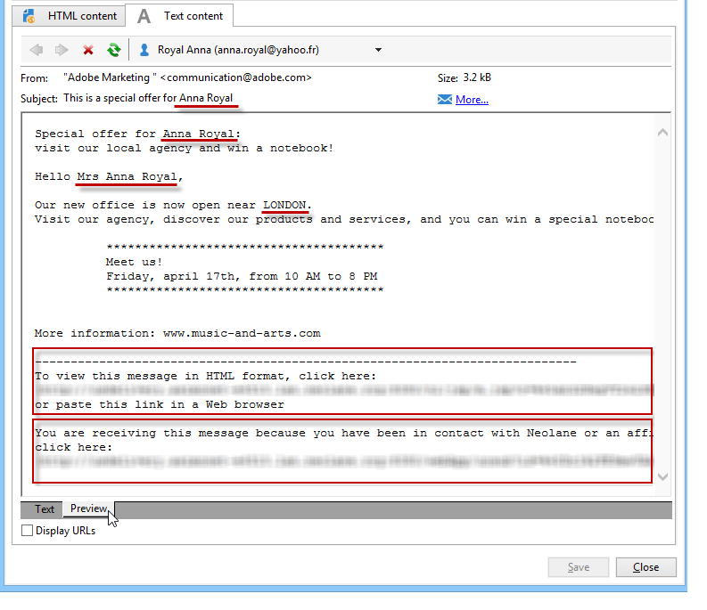</ph></source>
<target xml:lang="en-XX"><ph id="1" ctype="x-IMAGE"></ph></target>
</trans-unit>
<trans-unit id="tu57" xml:space="preserve">
<source xml:lang="en-US">Define interactive content</source>
<target xml:lang="en-XX">Definición del contenido interactivo</target>
</trans-unit>
<trans-unit id="tu58" xml:space="preserve">
<source xml:lang="en-US">Adobe Campaign enables you to try the new interactive <ph id="1" ctype="x-LINK">[</ph>AMP for Email<ph id="2" ctype="x-LINK">[#$tu59]</ph> format, which enables to send dynamic emails, under certain conditions.</source>
<target xml:lang="en-XX">Adobe Campaign le permite probar el nuevo formato <ph id="1" ctype="x-LINK">[</ph>AMP interactivo para correo electrónico<ph id="2" ctype="x-LINK">[#$tu59]</ph>, que permite enviar correos electrónicos dinámicos en ciertas condiciones.</target>
</trans-unit>
<trans-unit id="tu60" xml:space="preserve">
<source xml:lang="en-US">For more on this, see the <ph id="1" ctype="x-LINK">[</ph>Campaign v8 documentation<ph id="2" ctype="x-LINK">[#$tu61]{target="_blank"}</ph>.</source>
<target xml:lang="en-XX">Para obtener más información al respecto, consulte la <ph id="1" ctype="x-LINK">[</ph>documentación de la versión 8 de Campaign<ph id="2" ctype="x-LINK">[#$tu61]{target="_blank"}</ph>.</target>
</trans-unit>
<trans-unit id="tu62" xml:space="preserve">
<source xml:lang="en-US">Use content management</source>
<target xml:lang="en-XX">Uso de la administración de contenido</target>
</trans-unit>
<trans-unit id="tu63" xml:space="preserve">
<source xml:lang="en-US">You can define the content of the delivery using the content management forms, directly in the delivery assistant. To do this, you must reference the publication template of the content management to be used, in the <ph id="1" ctype="x-STRONG_EMPHASIS">**[!UICONTROL Advanced]**</ph> tab of the delivery properties.</source>
<target xml:lang="en-XX">Puede definir el contenido del envío mediante los formularios de administración de contenido directamente en el asistente de envíos. Para ello, debe hacer referencia a la plantilla de publicación de la administración de contenido que se va a utilizar, en la pestaña <ph id="1" ctype="x-STRONG_EMPHASIS">**[!UICONTROL Advanced]**</ph> de las propiedades de entrega.</target>
</trans-unit>
<trans-unit id="tu64" xml:space="preserve">
<source xml:lang="en-US"><ph id="1" ctype="x-IMAGE"></ph></source>
<target xml:lang="en-XX"><ph id="1" ctype="x-IMAGE"></ph></target>
</trans-unit>
<trans-unit id="tu65" xml:space="preserve">
<source xml:lang="en-US">An additional tab lets you enter content that will automatically be integrated and formatted according to the content management rules.</source>
<target xml:lang="en-XX">Una pestaña adicional permite introducir contenido que se integra y formatea automáticamente según las reglas de administración de contenido.</target>
</trans-unit>
<trans-unit id="tu66" xml:space="preserve">
<source xml:lang="en-US"><ph id="1" ctype="x-IMAGE">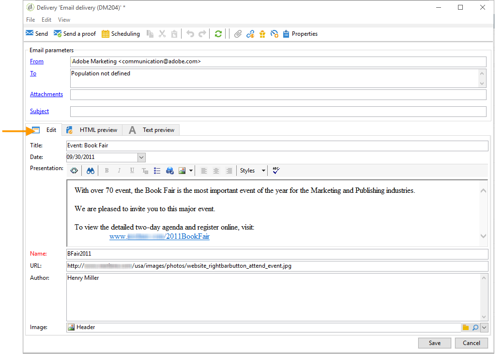</ph></source>
<target xml:lang="en-XX"><ph id="1" ctype="x-IMAGE"></ph></target>
</trans-unit>
<trans-unit id="tu67" xml:space="preserve">
<source xml:lang="en-US"><ph id="1" ctype="x-regxph" equiv-text="[!NOTE">[!NOTE]</ph></source>
<target xml:lang="en-XX"><ph id="1" ctype="x-regxph" equiv-text="[!NOTE">[!NOTE]</ph></target>
</trans-unit>
<trans-unit id="tu68" xml:space="preserve">
<source xml:lang="en-US">For further information about content management in Adobe Campaign, refer to <ph id="1" ctype="x-LINK">[</ph>this section<ph id="2" ctype="x-LINK">](about-content-management.md)</ph>.</source>
<target xml:lang="en-XX">Para obtener más información sobre la administración de contenido en Adobe Campaign, consulte <ph id="1" ctype="x-LINK">[</ph>esta sección<ph id="2" ctype="x-LINK">](about-content-management.md)</ph>.</target>
</trans-unit>
<trans-unit id="tu69" xml:space="preserve">
<source xml:lang="en-US">Insert emoticons</source>
<target xml:lang="en-XX">Inserción de emoticonos</target>
</trans-unit>
<trans-unit id="tu70" xml:space="preserve">
<source xml:lang="en-US">You can insert emoticons to your email content.</source>
<target xml:lang="en-XX">Puede insertar emoticonos en el contenido del correo electrónico.</target>
</trans-unit>
<trans-unit id="tu71" xml:space="preserve">
<source xml:lang="en-US">Click the <ph id="1" ctype="x-STRONG_EMPHASIS">**[!UICONTROL Insert emoticon]**</ph> icon.</source>
<target xml:lang="en-XX">Haga clic en el icono <ph id="1" ctype="x-STRONG_EMPHASIS">**[!UICONTROL Insert emoticon]**</ph>.</target>
</trans-unit>
<trans-unit id="tu72" xml:space="preserve">
<source xml:lang="en-US">Select an emoticon from the pop-up window.</source>
<target xml:lang="en-XX">En la ventana emergente, seleccione un emoticono.</target>
</trans-unit>
<trans-unit id="tu73" xml:space="preserve">
<source xml:lang="en-US"><ph id="1" ctype="x-IMAGE"></ph></source>
<target xml:lang="en-XX"><ph id="1" ctype="x-IMAGE"></ph></target>
</trans-unit>
<trans-unit id="tu74" xml:space="preserve">
<source xml:lang="en-US">Click the <ph id="1" ctype="x-STRONG_EMPHASIS">**[!UICONTROL Close]**</ph> button when done.</source>
<target xml:lang="en-XX">Haga clic en el botón <ph id="1" ctype="x-STRONG_EMPHASIS">**[!UICONTROL Close]**</ph> cuando termine.</target>
</trans-unit>
<trans-unit id="tu75" xml:space="preserve">
<source xml:lang="en-US">To customize the emoticon list, refer to this <ph id="1" ctype="x-LINK">[</ph>page<ph id="2" ctype="x-LINK">](customizing-emoticon-list.md)</ph>.</source>
<target xml:lang="en-XX">Para personalizar la lista de emoticonos, consulte esta <ph id="1" ctype="x-LINK">[</ph>página<ph id="2" ctype="x-LINK">](customizing-emoticon-list.md)</ph>.</target>
</trans-unit>
<trans-unit id="tu76" xml:space="preserve">
<source xml:lang="en-US">Add images</source>
<target xml:lang="en-XX">Adición de imágenes</target>
</trans-unit>
<trans-unit id="tu77" xml:space="preserve">
<source xml:lang="en-US">HTML format email deliveries can contain images. From the delivery assistant, you can import an HTML page containing images or insert images directly using the HTML editor via the <ph id="1" ctype="x-STRONG_EMPHASIS">**[!UICONTROL Image]**</ph> icon.</source>
<target xml:lang="en-XX">Los envíos de correo electrónico de formato HTML pueden contener imágenes. Desde el asistente de envíos, puede importar una página HTML que contenga imágenes o insertar imágenes directamente utilizando el editor HTML mediante el icono <ph id="1" ctype="x-STRONG_EMPHASIS">**[!UICONTROL Image]**</ph>.</target>
</trans-unit>
<trans-unit id="tu78" xml:space="preserve">
<source xml:lang="en-US">Guardrails</source>
<target xml:lang="en-XX">Mecanismos de protección</target>
</trans-unit>
<trans-unit id="tu79" xml:space="preserve">
<source xml:lang="en-US">To avoid performance issues, images included in emails cannot exceed 100 KB. This limit, set by default, can be changed from the <ph id="1" ctype="x-CODE">`NmsDelivery_MaxDownloadedImageSize`</ph> option. However, Adobe strongly recommends to avoid large images in your email deliveries.</source>
<target xml:lang="en-XX">Para evitar problemas de rendimiento, las imágenes incluidas en los correos electrónicos no pueden superar los 100 KB. Este límite, establecido de forma predeterminada, se puede cambiar desde la opción <ph id="1" ctype="x-CODE">`NmsDelivery_MaxDownloadedImageSize`</ph>. Sin embargo, Adobe recomienda encarecidamente evitar imágenes grandes en los envíos de correo electrónico.</target>
</trans-unit>
<trans-unit id="tu80" xml:space="preserve">
<source xml:lang="en-US">Learn more in <ph id="1" ctype="x-LINK">[</ph>the list of Campaign Classic options<ph id="2" ctype="x-LINK">](../../installation/using/configuring-campaign-options.md#delivery)</ph>.</source>
<target xml:lang="en-XX">Obtenga más información en <ph id="1" ctype="x-LINK">[</ph>la lista de opciones de Campaign Classic<ph id="2" ctype="x-LINK">](../../installation/using/configuring-campaign-options.md#delivery)</ph>.</target>
</trans-unit>
<trans-unit id="tu81" xml:space="preserve">
<source xml:lang="en-US">Types of images</source>
<target xml:lang="en-XX">Tipos de imágenes</target>
</trans-unit>
<trans-unit id="tu82" xml:space="preserve">
<source xml:lang="en-US">Images can be:</source>
<target xml:lang="en-XX">Las imágenes pueden ser:</target>
</trans-unit>
<trans-unit id="tu83" xml:space="preserve">
<source xml:lang="en-US">A local image, or an image called from a server</source>
<target xml:lang="en-XX">Una imagen local o una imagen obtenida desde un servidor</target>
</trans-unit>
<trans-unit id="tu84" xml:space="preserve">
<source xml:lang="en-US">An image stored in the Adobe Campaign public resources library</source>
<target xml:lang="en-XX">Una imagen almacenada en la biblioteca de recursos públicos de Adobe Campaign</target>
</trans-unit>
<trans-unit id="tu85" xml:space="preserve">
<source xml:lang="en-US">Public resources are accessible via the <ph id="1" ctype="x-STRONG_EMPHASIS">**[!UICONTROL Resources > Online]**</ph> node of the Adobe Campaign hierarchy. They are grouped in a library and can be included in email messages, but can also be used for campaigns or tasks, or for content management.</source>
<target xml:lang="en-XX">Los recursos públicos son accesibles a través del nodo <ph id="1" ctype="x-STRONG_EMPHASIS">**[!UICONTROL Resources > Online]**</ph> de la jerarquía de Adobe Campaign. Se agrupan en una biblioteca y se pueden incluir en mensajes de correo electrónico, pero también se pueden utilizar para campañas o tareas, o para la administración de contenido.</target>
</trans-unit>
<trans-unit id="tu86" xml:space="preserve">
<source xml:lang="en-US">An asset shared with Adobe Experience Cloud. Refer to <ph id="1" ctype="x-LINK">[</ph>this section<ph id="2" ctype="x-LINK">](../../integrations/using/sharing-assets-with-adobe-experience-cloud.md)</ph>.</source>
<target xml:lang="en-XX">Un recurso compartido con Adobe Experience Cloud. Consulte <ph id="1" ctype="x-LINK">[</ph>esta sección<ph id="2" ctype="x-LINK">](../../integrations/using/sharing-assets-with-adobe-experience-cloud.md)</ph>.</target>
</trans-unit>
<trans-unit id="tu87" xml:space="preserve">
<source xml:lang="en-US">Insert and manage images</source>
<target xml:lang="en-XX">Inserción y administración de imágenes</target>
</trans-unit>
<trans-unit id="tu88" xml:space="preserve">
<source xml:lang="en-US">The delivery assistant lets you add local images, or images stored in the library, to the content of messages. To do this, click the <ph id="1" ctype="x-STRONG_EMPHASIS">**[!UICONTROL Image]**</ph> button in the HTML content toolbar.</source>
<target xml:lang="en-XX">El asistente de envíos permite añadir imágenes locales o imágenes almacenadas en la biblioteca al contenido de los mensajes. Para ello, haga clic en el botón <ph id="1" ctype="x-STRONG_EMPHASIS">**[!UICONTROL Image]**</ph> en la barra de herramientas HTML.</target>
</trans-unit>
<trans-unit id="tu89" xml:space="preserve">
<source xml:lang="en-US"><ph id="1" ctype="x-IMAGE"></ph></source>
<target xml:lang="en-XX"><ph id="1" ctype="x-IMAGE"></ph></target>
</trans-unit>
<trans-unit id="tu90" xml:space="preserve">
<source xml:lang="en-US"><ph id="1" ctype="x-regxph" equiv-text="[!IMPORTANT">[!IMPORTANT]</ph></source>
<target xml:lang="en-XX"><ph id="1" ctype="x-regxph" equiv-text="[!IMPORTANT">[!IMPORTANT]</ph></target>
</trans-unit>
<trans-unit id="tu91" xml:space="preserve">
<source xml:lang="en-US">In order for the recipients to be able to view the images included in the messages that they receive, these messages must be available on a server accessible from the outside.</source>
<target xml:lang="en-XX">Para que los destinatarios puedan ver las imágenes incluidas en los mensajes que reciben, estos mensajes deben estar disponibles en un servidor accesible desde el exterior.</target>
</trans-unit>
<trans-unit id="tu92" xml:space="preserve">
<source xml:lang="en-US">To manage images via the delivery assistant:</source>
<target xml:lang="en-XX">Para administrar las imágenes mediante el asistente de envíos:</target>
</trans-unit>
<trans-unit id="tu93" xml:space="preserve">
<source xml:lang="en-US">Click the <ph id="1" ctype="x-STRONG_EMPHASIS">**[!UICONTROL Tracking &amp; Images]**</ph> icon in the toolbar.
</source>
<target xml:lang="en-XX">En la barra de herramientas, haga clic en el icono <ph id="1" ctype="x-STRONG_EMPHASIS">**[!UICONTROL Tracking &amp; Images]**</ph>.
</target>
</trans-unit>
<trans-unit id="tu94" xml:space="preserve">
<source xml:lang="en-US"><ph id="1" ctype="x-IMAGE"></ph></source>
<target xml:lang="en-XX"><ph id="1" ctype="x-IMAGE"></ph></target>
</trans-unit>
<trans-unit id="tu95" xml:space="preserve">
<source xml:lang="en-US">Select <ph id="1" ctype="x-STRONG_EMPHASIS">**[!UICONTROL Upload images]**</ph> in the <ph id="4" ctype="x-STRONG_EMPHASIS">**[!UICONTROL Images]**</ph> tab.</source>
<target xml:lang="en-XX">Seleccione <ph id="1" ctype="x-STRONG_EMPHASIS">**[!UICONTROL Upload images]**</ph> en la <ph id="4" ctype="x-STRONG_EMPHASIS">**[!UICONTROL Images]**</ph> pestaña.</target>
</trans-unit>
<trans-unit id="tu96" xml:space="preserve">
<source xml:lang="en-US">You can then choose whether you wish to include the images in the email message.
</source>
<target xml:lang="en-XX">Puede elegir si desea incluir las imágenes en el mensaje de correo electrónico.
</target>
</trans-unit>
<trans-unit id="tu97" xml:space="preserve">
<source xml:lang="en-US"><ph id="1" ctype="x-IMAGE"></ph></source>
<target xml:lang="en-XX"><ph id="1" ctype="x-IMAGE"></ph></target>
</trans-unit>
<trans-unit id="tu98" xml:space="preserve">
<source xml:lang="en-US">You can upload images manually without waiting for the delivery analysis phase. To do this, click the <ph id="1" ctype="x-STRONG_EMPHASIS">**[!UICONTROL Upload the images straightaway...]**</ph> link.</source>
<target xml:lang="en-XX">Puede cargar imágenes manualmente sin esperar a la fase de análisis de entregas. Para ello, haga clic en el vínculo <ph id="1" ctype="x-STRONG_EMPHASIS">**[!UICONTROL Upload the images straightaway...]**</ph>.</target>
</trans-unit>
<trans-unit id="tu99" xml:space="preserve">
<source xml:lang="en-US">You can specify another path for access to the images on the tracking server. To do this, enter it in the <ph id="1" ctype="x-STRONG_EMPHASIS">**[!UICONTROL Images URL]**</ph> field. This value overrides the value defined in the parameters of the installation assistant.</source>
<target xml:lang="en-XX">Puede especificar otra ruta para acceder a las imágenes en el servidor de seguimiento. Para ello, indíquela en el campo <ph id="1" ctype="x-STRONG_EMPHASIS">**[!UICONTROL Images URL]**</ph>. Este valor anula el valor definido en los parámetros del asistente de instalación.</target>
</trans-unit>
<trans-unit id="tu100" xml:space="preserve">
<source xml:lang="en-US">When you open HTML content with included images in the delivery assistant, a message gives you the option of uploading the images immediately, according to the delivery parameters.</source>
<target xml:lang="en-XX">Cuando se abre contenido HTML con imágenes incluidas en el asistente de envíos, un mensaje le da la opción de cargar las imágenes inmediatamente en función de los parámetros de envío.</target>
</trans-unit>
<trans-unit id="tu101" xml:space="preserve">
<source xml:lang="en-US"><ph id="1" ctype="x-IMAGE">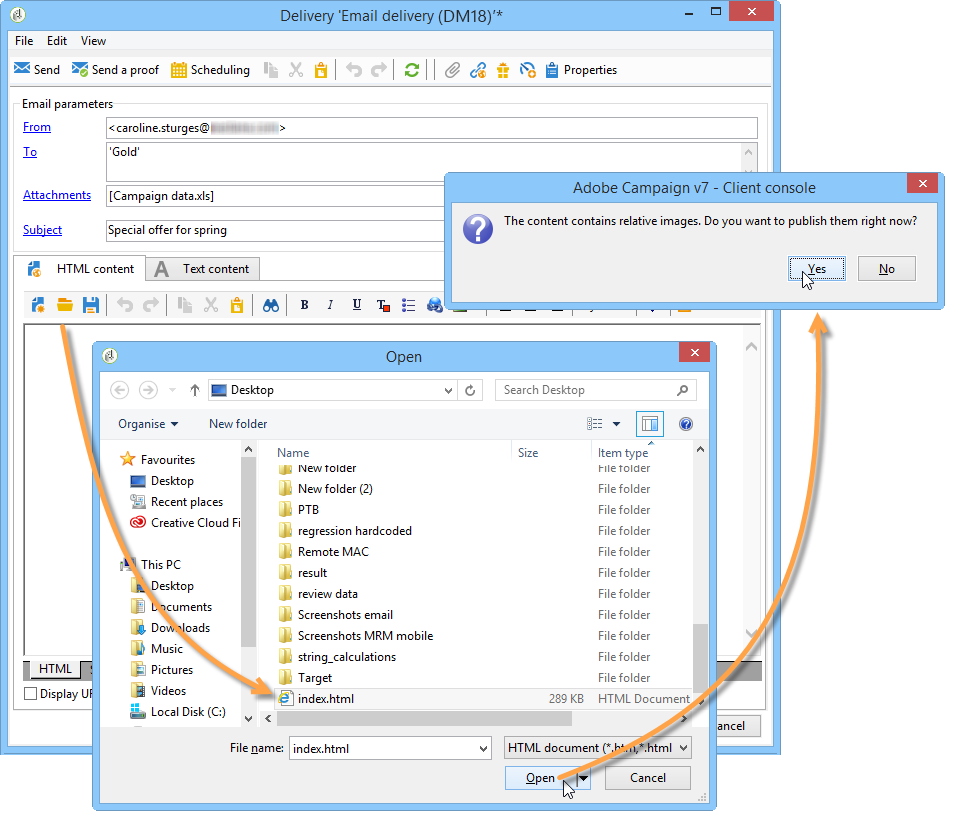</ph></source>
<target xml:lang="en-XX"><ph id="1" ctype="x-IMAGE"></ph></target>
</trans-unit>
<trans-unit id="tu102" xml:space="preserve">
<source xml:lang="en-US"><ph id="1" ctype="x-regxph" equiv-text="[!IMPORTANT">[!IMPORTANT]</ph></source>
<target xml:lang="en-XX"><ph id="1" ctype="x-regxph" equiv-text="[!IMPORTANT">[!IMPORTANT]</ph></target>
</trans-unit>
<trans-unit id="tu103" xml:space="preserve">
<source xml:lang="en-US">The image URLs are modified during manual uploading or when sending messages.</source>
<target xml:lang="en-XX">Las URL de imagen se modifican durante la carga manual o al enviar mensajes.</target>
</trans-unit>
<trans-unit id="tu104" xml:space="preserve">
<source xml:lang="en-US">Use case: send a message with images</source>
<target xml:lang="en-XX">Caso de uso: envío de un mensaje con imágenes</target>
</trans-unit>
<trans-unit id="tu105" xml:space="preserve">
<source xml:lang="en-US">Below is a sample of a delivery with four images:</source>
<target xml:lang="en-XX">A continuación se muestra un ejemplo de envío con cuatro imágenes:</target>
</trans-unit>
<trans-unit id="tu106" xml:space="preserve">
<source xml:lang="en-US"><ph id="1" ctype="x-IMAGE"></ph></source>
<target xml:lang="en-XX"><ph id="1" ctype="x-IMAGE"></ph></target>
</trans-unit>
<trans-unit id="tu107" xml:space="preserve">
<source xml:lang="en-US">These images come from a local directory or Web site as you can verify from the <ph id="1" ctype="x-STRONG_EMPHASIS">**[!UICONTROL Source]**</ph> tab.</source>
<target xml:lang="en-XX">Estas imágenes provienen de un directorio local o sitio web que puede verificar desde la pestaña <ph id="1" ctype="x-STRONG_EMPHASIS">**[!UICONTROL Source]**</ph>.</target>
</trans-unit>
<trans-unit id="tu108" xml:space="preserve">
<source xml:lang="en-US"><ph id="1" ctype="x-IMAGE">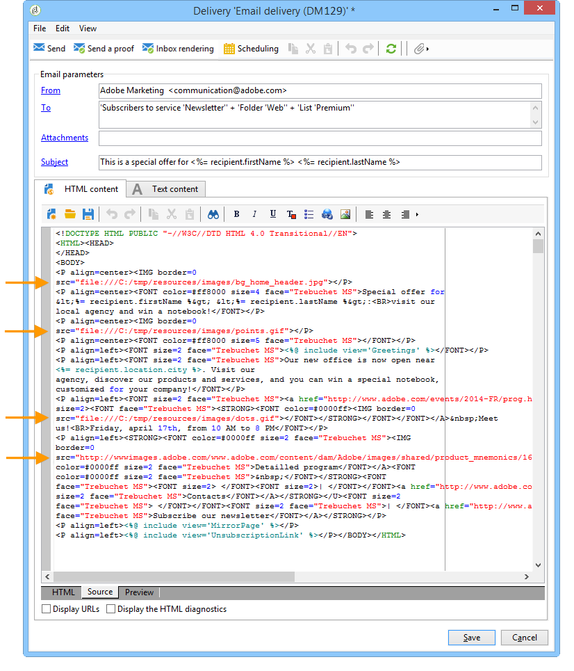</ph></source>
<target xml:lang="en-XX"><ph id="1" ctype="x-IMAGE"></ph></target>
</trans-unit>
<trans-unit id="tu109" xml:space="preserve">
<source xml:lang="en-US">Click the <ph id="1" ctype="x-STRONG_EMPHASIS">**[!UICONTROL Tracking &amp; Images]**</ph> icon and then the <ph id="4" ctype="x-STRONG_EMPHASIS">**[!UICONTROL Images]**</ph> tab to start detecting images in the message.</source>
<target xml:lang="en-XX">Haga clic en el icono <ph id="1" ctype="x-STRONG_EMPHASIS">**[!UICONTROL Tracking &amp; Images]**</ph> y, a continuación, en la pestaña <ph id="4" ctype="x-STRONG_EMPHASIS">**[!UICONTROL Images]**</ph> para comenzar a detectar imágenes en el mensaje.</target>
</trans-unit>
<trans-unit id="tu110" xml:space="preserve">
<source xml:lang="en-US">For each image detected, you can view its status:</source>
<target xml:lang="en-XX">Puede ver el estado de cada imagen detectada:</target>
</trans-unit>
<trans-unit id="tu111" xml:space="preserve">
<source xml:lang="en-US">If an image is stored locally or located on another server, even if this server is visible from the outside (on an internet site, for example), it will be detected as <ph id="1" ctype="x-STRONG_EMPHASIS">**[!UICONTROL Not yet online]**</ph>.</source>
<target xml:lang="en-XX">Si una imagen se almacena localmente o se ubica en otro servidor, aunque este servidor sea visible desde el exterior (en un sitio de Internet, por ejemplo), se detecta como <ph id="1" ctype="x-STRONG_EMPHASIS">**[!UICONTROL Not yet online]**</ph>.</target>
</trans-unit>
<trans-unit id="tu112" xml:space="preserve">
<source xml:lang="en-US">The images are detected as <ph id="1" ctype="x-STRONG_EMPHASIS">**[!UICONTROL Already online]**</ph> if they were uploaded earlier while creating another delivery.</source>
<target xml:lang="en-XX">Las imágenes se detectan como <ph id="1" ctype="x-STRONG_EMPHASIS">**[!UICONTROL Already online]**</ph> si se cargaron anteriormente antes de crear otro envío.</target>
</trans-unit>
<trans-unit id="tu113" xml:space="preserve">
<source xml:lang="en-US">In the deployment wizard, you can define URLs for which image detection is not enabled: uploading these images will be <ph id="1" ctype="x-STRONG_EMPHASIS">**[!UICONTROL Skipped]**</ph>.</source>
<target xml:lang="en-XX">En el asistente de implementación puede definir las direcciones URL para las que no se ha habilitado la detección de imágenes: la carga de estas imágenes pasa a estar <ph id="1" ctype="x-STRONG_EMPHASIS">**[!UICONTROL Skipped]**</ph>.</target>
</trans-unit>
<trans-unit id="tu114" xml:space="preserve">
<source xml:lang="en-US"><ph id="1" ctype="x-regxph" equiv-text="[!NOTE">[!NOTE]</ph></source>
<target xml:lang="en-XX"><ph id="1" ctype="x-regxph" equiv-text="[!NOTE">[!NOTE]</ph></target>
</trans-unit>
<trans-unit id="tu115" xml:space="preserve">
<source xml:lang="en-US">Images are identified by their content and not by their access paths. This means that an image uploaded previously under a different name or in a different directory will be detected as <ph id="1" ctype="x-STRONG_EMPHASIS">**[!UICONTROL Already online]**</ph>.</source>
<target xml:lang="en-XX">Las imágenes se identifican por su contenido y no por sus rutas de acceso. Esto significa que la imagen cargada previamente con un nombre diferente o en un directorio diferente se detecta como <ph id="1" ctype="x-STRONG_EMPHASIS">**[!UICONTROL Already online]**</ph>.</target>
</trans-unit>
<trans-unit id="tu116" xml:space="preserve">
<source xml:lang="en-US">During the analysis phase, the images are automatically uploaded to the server so that they are accessible from the exterior, except for the local images which must be uploaded beforehand.</source>
<target xml:lang="en-XX">Durante la fase de análisis, las imágenes se cargan automáticamente en el servidor para poder acceder a ellas desde el exterior, excepto en las imágenes locales que deben cargarse de antemano.</target>
</trans-unit>
<trans-unit id="tu117" xml:space="preserve">
<source xml:lang="en-US">You can work ahead and upload images so that they can be viewed by other Adobe Campaign operators. You may find this useful if working collaboratively. To do this, click <ph id="1" ctype="x-STRONG_EMPHASIS">**[!UICONTROL Upload the images straightaway...]**</ph> to upload the images onto the server.</source>
<target xml:lang="en-XX">Puede trabajar con previsión y cargar las imágenes para que puedan verlas otros operadores de Adobe Campaign. Esto resulta útil si trabaja de forma colaborativa. Para ello, haga clic en <ph id="1" ctype="x-STRONG_EMPHASIS">**[!UICONTROL Upload the images straightaway...]**</ph> para cargar las imágenes en el servidor.</target>
</trans-unit>
<trans-unit id="tu118" xml:space="preserve">
<source xml:lang="en-US"><ph id="1" ctype="x-IMAGE"></ph></source>
<target xml:lang="en-XX"><ph id="1" ctype="x-IMAGE"></ph></target>
</trans-unit>
<trans-unit id="tu119" xml:space="preserve">
<source xml:lang="en-US"><ph id="1" ctype="x-regxph" equiv-text="[!NOTE">[!NOTE]</ph></source>
<target xml:lang="en-XX"><ph id="1" ctype="x-regxph" equiv-text="[!NOTE">[!NOTE]</ph></target>
</trans-unit>
<trans-unit id="tu120" xml:space="preserve">
<source xml:lang="en-US">The URLs of the images in the email, and their names in particular, are then modified.</source>
<target xml:lang="en-XX">A continuación, se modifican las URL de las imágenes del mensaje de correo electrónico, además de sus nombres, concretamente.</target>
</trans-unit>
<trans-unit id="tu121" xml:space="preserve">
<source xml:lang="en-US">Once the images are online, you can view changes to their names and paths from the <ph id="1" ctype="x-STRONG_EMPHASIS">**[!UICONTROL Source]**</ph> tab of the message.</source>
<target xml:lang="en-XX">Una vez que las imágenes están en línea, puede ver los cambios en los nombres y en las rutas a través de la pestaña <ph id="1" ctype="x-STRONG_EMPHASIS">**[!UICONTROL Source]**</ph> del mensaje.</target>
</trans-unit>
<trans-unit id="tu122" xml:space="preserve">
<source xml:lang="en-US"><ph id="1" ctype="x-IMAGE">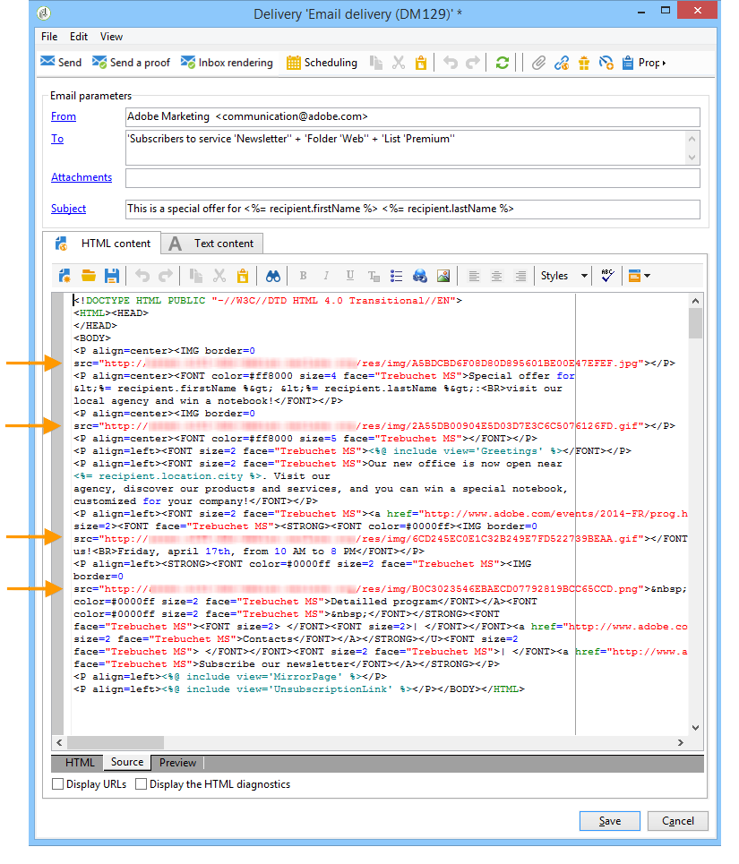</ph></source>
<target xml:lang="en-XX"><ph id="1" ctype="x-IMAGE"></ph></target>
</trans-unit>
<trans-unit id="tu123" xml:space="preserve">
<source xml:lang="en-US">If you select <ph id="1" ctype="x-STRONG_EMPHASIS">**[!UICONTROL Include the images in the email]**</ph>, you can choose which images to include in the corresponding column.</source>
<target xml:lang="en-XX">Si selecciona <ph id="1" ctype="x-STRONG_EMPHASIS">**[!UICONTROL Include the images in the email]**</ph> puede elegir las imágenes que desea incluir en la columna correspondiente.</target>
</trans-unit>
<trans-unit id="tu124" xml:space="preserve">
<source xml:lang="en-US"><ph id="1" ctype="x-IMAGE">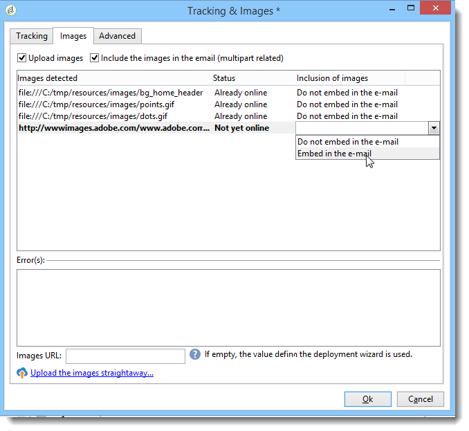</ph></source>
<target xml:lang="en-XX"><ph id="1" ctype="x-IMAGE"></ph></target>
</trans-unit>
<trans-unit id="tu125" xml:space="preserve">
<source xml:lang="en-US"><ph id="1" ctype="x-regxph" equiv-text="[!NOTE">[!NOTE]</ph></source>
<target xml:lang="en-XX"><ph id="1" ctype="x-regxph" equiv-text="[!NOTE">[!NOTE]</ph></target>
</trans-unit>
<trans-unit id="tu126" xml:space="preserve">
<source xml:lang="en-US">If local images are included in the message, you must confirm changes to the message source code.</source>
<target xml:lang="en-XX">Si las imágenes locales se incluyen en el mensaje, debe confirmar los cambios en el código de fuente del mensaje.</target>
</trans-unit>
<trans-unit id="tu127" xml:space="preserve">
<source xml:lang="en-US">Insert a personalized barcode</source>
<target xml:lang="en-XX">Inserción de un código de barras personalizado</target>
</trans-unit>
<trans-unit id="tu128" xml:space="preserve">
<source xml:lang="en-US">The barcode generation module lets you create several types of barcodes that comply with many common standards, including 2D barcodes.</source>
<target xml:lang="en-XX">El módulo de generación de códigos de barras permite crear varios tipos de códigos de barras que cumplan con muchos estándares habituales, incluidos códigos de barras 2D.</target>
</trans-unit>
<trans-unit id="tu129" xml:space="preserve">
<source xml:lang="en-US">It is possible to dynamically generate a barcode as a bitmap using a value defined using customer criteria. Personalized barcodes can be included in email campaigns. The recipient can print the message and show it to the issuing company for scanning (when checking out for example).</source>
<target xml:lang="en-XX">Es posible generar dinámicamente un código de barras como mapa de bits que utilice un valor definido con criterios de cliente. Se pueden incluir códigos de barras personalizados en las campañas de correo electrónico. El destinatario puede imprimir el mensaje y mostrarlo a la empresa emisora para escanearlo (por ejemplo, durante la comprobación).</target>
</trans-unit>
<trans-unit id="tu130" xml:space="preserve">
<source xml:lang="en-US">To insert a barcode into an email, place the cursor in the content where you want to display it, then click the personalization button. Select <ph id="1" ctype="x-STRONG_EMPHASIS">**[!UICONTROL Include > Barcode...]**</ph>.</source>
<target xml:lang="en-XX">Para insertar un código de barras en un correo electrónico, coloque el cursor en el contenido en el que desea mostrarlo y, a continuación, haga clic en el botón de personalización. Seleccione <ph id="1" ctype="x-STRONG_EMPHASIS">**[!UICONTROL Include > Barcode...]**</ph>.</target>
</trans-unit>
<trans-unit id="tu131" xml:space="preserve">
<source xml:lang="en-US"><ph id="1" ctype="x-IMAGE"></ph></source>
<target xml:lang="en-XX"><ph id="1" ctype="x-IMAGE"></ph></target>
</trans-unit>
<trans-unit id="tu132" xml:space="preserve">
<source xml:lang="en-US">Then configure the following elements to suit your needs:</source>
<target xml:lang="en-XX">A continuación, configure los siguientes elementos para adaptarlos a sus necesidades:</target>
</trans-unit>
<trans-unit id="tu133" xml:space="preserve">
<source xml:lang="en-US">Select the type of barcode.</source>
<target xml:lang="en-XX">Seleccione el tipo de código de barras.</target>
</trans-unit>
<trans-unit id="tu134" xml:space="preserve">
<source xml:lang="en-US">For 1D format, the following types are available in Adobe Campaign: Codabar, Code 128, GS1-128 (formerly EAN-128), UPC-A, UPC-E, ISBN, EAN-8, Code39, Interleaved 2 of 5, POSTNET and Royal Mail (RM4SCC).</source>
<target xml:lang="en-XX">Para el formato 1D, los siguientes tipos están disponibles en Adobe Campaign: Codabar, Code 128, GS1-128 (anteriormente EAN-128), UPC-A, UPC-E, ISBN, EAN-8, Code39, Interleaved 2 de 5, POSTNET y Royal Mail (RM4SCC).</target>
</trans-unit>
<trans-unit id="tu135" xml:space="preserve">
<source xml:lang="en-US">Example of a 1D barcode:</source>
<target xml:lang="en-XX">Ejemplo de código de barras 1D:</target>
</trans-unit>
<trans-unit id="tu136" xml:space="preserve">
<source xml:lang="en-US"><ph id="1" ctype="x-IMAGE">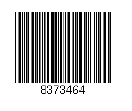</ph></source>
<target xml:lang="en-XX"><ph id="1" ctype="x-IMAGE"></ph></target>
</trans-unit>
<trans-unit id="tu137" xml:space="preserve">
<source xml:lang="en-US">The DataMatrix and PDF417 types concern the 2D format.</source>
<target xml:lang="en-XX">Los tipos DataMatrix y PDF417 están relacionados con el formato 2D.</target>
</trans-unit>
<trans-unit id="tu138" xml:space="preserve">
<source xml:lang="en-US">Example of a 2D barcode:</source>
<target xml:lang="en-XX">Ejemplo de código de barras 2D:</target>
</trans-unit>
<trans-unit id="tu139" xml:space="preserve">
<source xml:lang="en-US"><ph id="1" ctype="x-IMAGE"></ph></source>
<target xml:lang="en-XX"><ph id="1" ctype="x-IMAGE"></ph></target>
</trans-unit>
<trans-unit id="tu140" xml:space="preserve">
<source xml:lang="en-US">To insert a QR code, select this type and enter the error correction rate to apply. This rate defines the quantity of information repeated and the tolerance to deterioration.</source>
<target xml:lang="en-XX">Para insertar un código QR, seleccione este tipo e introduzca la tasa de corrección de errores que desee aplicar. Esta velocidad define la cantidad de información repetida y la tolerancia ante el deterioro.</target>
</trans-unit>
<trans-unit id="tu141" xml:space="preserve">
<source xml:lang="en-US"><ph id="1" ctype="x-IMAGE">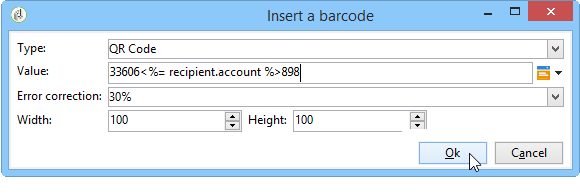</ph></source>
<target xml:lang="en-XX"><ph id="1" ctype="x-IMAGE"></ph></target>
</trans-unit>
<trans-unit id="tu142" xml:space="preserve">
<source xml:lang="en-US">Example of a QR code:</source>
<target xml:lang="en-XX">Ejemplo de código QR:</target>
</trans-unit>
<trans-unit id="tu143" xml:space="preserve">
<source xml:lang="en-US"><ph id="1" ctype="x-IMAGE"></ph></source>
<target xml:lang="en-XX"><ph id="1" ctype="x-IMAGE"></ph></target>
</trans-unit>
<trans-unit id="tu144" xml:space="preserve">
<source xml:lang="en-US">Enter the size of the barcode that you want to insert into the email: configuring the scale lets you increase or reduce the size of the barcode, from x1 to x10.</source>
<target xml:lang="en-XX">Introduzca el tamaño del código de barras que desea insertar en el correo electrónico: la configuración de la escala permite aumentar o reducir el tamaño del código de barras, de x1 a x10.</target>
</trans-unit>
<trans-unit id="tu145" xml:space="preserve">
<source xml:lang="en-US">The <ph id="1" ctype="x-STRONG_EMPHASIS">**[!UICONTROL Value]**</ph> field enables you to define the value of the barcode. A value can match a special offer and can be the function of a criteria, it can be the value of a database field linked to the customers.</source>
<target xml:lang="en-XX">El campo <ph id="1" ctype="x-STRONG_EMPHASIS">**[!UICONTROL Value]**</ph> permite definir el valor del código de barras. Un valor puede coincidir con una oferta especial y puede ser la función de un criterio, puede ser el valor de un campo de base de datos vinculado a los clientes.</target>
</trans-unit>
<trans-unit id="tu146" xml:space="preserve">
<source xml:lang="en-US">This example shows an EAN-8 type barcode, to which was added the account number of a recipient. To add this account number, click the personalization button to the right of the <ph id="1" ctype="x-STRONG_EMPHASIS">**[!UICONTROL Value]**</ph> field and select <ph id="4" ctype="x-STRONG_EMPHASIS">**[!UICONTROL Recipient > Account number]**</ph>.</source>
<target xml:lang="en-XX">Este ejemplo muestra un código de barras de tipo EAN-8 al que se ha añadido el número de cuenta de un destinatario. Para ello, haga clic en el botón de personalización a la derecha del campo <ph id="1" ctype="x-STRONG_EMPHASIS">**[!UICONTROL Value]**</ph> y seleccione <ph id="4" ctype="x-STRONG_EMPHASIS">**[!UICONTROL Recipient > Account number]**</ph>:</target>
</trans-unit>
<trans-unit id="tu147" xml:space="preserve">
<source xml:lang="en-US"><ph id="1" ctype="x-IMAGE">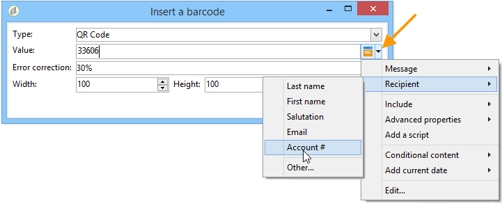</ph></source>
<target xml:lang="en-XX"><ph id="1" ctype="x-IMAGE"></ph></target>
</trans-unit>
<trans-unit id="tu148" xml:space="preserve">
<source xml:lang="en-US">The <ph id="1" ctype="x-STRONG_EMPHASIS">**[!UICONTROL Height]**</ph> field lets you configure the height of the barcode without changing its width, by altering the amount of space between each bar.</source>
<target xml:lang="en-XX">El campo <ph id="1" ctype="x-STRONG_EMPHASIS">**[!UICONTROL Height]**</ph> permite configurar la altura del código de barras sin cambiar su anchura, modificando la cantidad de espacio entre cada barra.</target>
</trans-unit>
<trans-unit id="tu149" xml:space="preserve">
<source xml:lang="en-US">There is no restrictive entry control depending on the type of barcode. If a barcode value is incorrect, it will only be visible in <ph id="1" ctype="x-STRONG_EMPHASIS">**</ph>Preview<ph id="2" ctype="x-STRONG_EMPHASIS">**</ph> mode where the barcode will be crossed out in red.</source>
<target xml:lang="en-XX">No hay ningún control de entrada restrictivo en función del tipo de código de barras. Si un valor de código de barras es incorrecto, solo se puede ver en el modo de <ph id="1" ctype="x-STRONG_EMPHASIS">**</ph>Preview<ph id="2" ctype="x-STRONG_EMPHASIS">**</ph> donde el código de barras aparece tachado en rojo.</target>
</trans-unit>
<trans-unit id="tu150" xml:space="preserve">
<source xml:lang="en-US"><ph id="1" ctype="x-regxph" equiv-text="[!NOTE">[!NOTE]</ph></source>
<target xml:lang="en-XX"><ph id="1" ctype="x-regxph" equiv-text="[!NOTE">[!NOTE]</ph></target>
</trans-unit>
<trans-unit id="tu151" xml:space="preserve">
<source xml:lang="en-US">The value assigned to a barcode depends on its type. For example, an EAN-8 type shall have exactly 8 numbers.</source>
<target xml:lang="en-XX">El valor asignado a un código de barras depende de su tipo. Por ejemplo, un tipo EAN-8 debe tener exactamente 8 números.</target>
</trans-unit>
<trans-unit id="tu152" xml:space="preserve">
<source xml:lang="en-US">The personalization button to the right of the <ph id="1" ctype="x-STRONG_EMPHASIS">**[!UICONTROL Value]**</ph> field lets you add data in addition to the value itself. This enriches the barcode, provided that the barcode standard accepts it.</source>
<target xml:lang="en-XX">El botón de personalización situado a la derecha del campo <ph id="1" ctype="x-STRONG_EMPHASIS">**[!UICONTROL Value]**</ph> permite añadir datos además del propio valor. Esto enriquece el código de barras, siempre que el estándar de código de barras lo acepte.</target>
</trans-unit>
<trans-unit id="tu153" xml:space="preserve">
<source xml:lang="en-US">For example, if you are using a GS1-128 type barcode and want to enter the account number of a recipient in addition to the value, click the personalization button and select <ph id="1" ctype="x-STRONG_EMPHASIS">**[!UICONTROL Recipient > Account number]**</ph>. If the account number of the selected recipient is entered correctly, the barcode takes it into account.</source>
<target xml:lang="en-XX">Por ejemplo, si está utilizando un código de barras de tipo GS1-128 y desea introducir el número de cuenta de un destinatario además del valor, haga clic en el botón de personalización y seleccione <ph id="1" ctype="x-STRONG_EMPHASIS">**[!UICONTROL Recipient > Account number]**</ph>. Si el número de cuenta del destinatario seleccionado se introduce correctamente, el código de barras lo tiene en cuenta.</target>
</trans-unit>
<trans-unit id="tu154" xml:space="preserve">
<source xml:lang="en-US">Once these elements have been configured, you can finalize your email and send it. To avoid errors, always make sure your content is displayed correctly before performing a delivery by clicking the <ph id="1" ctype="x-STRONG_EMPHASIS">**[!UICONTROL Preview]**</ph> tab.</source>
<target xml:lang="en-XX">Una vez configurados estos elementos, puede finalizar su el correo electrónico y enviarlo. Para evitar errores, asegúrese siempre de que el contenido se muestra correctamente antes de realizar una entrega haciendo clic en la pestaña <ph id="1" ctype="x-STRONG_EMPHASIS">**[!UICONTROL Preview]**</ph>.</target>
</trans-unit>
<trans-unit id="tu155" xml:space="preserve">
<source xml:lang="en-US"><ph id="1" ctype="x-IMAGE"></ph></source>
<target xml:lang="en-XX"><ph id="1" ctype="x-IMAGE"></ph></target>
</trans-unit>
<trans-unit id="tu156" xml:space="preserve">
<source xml:lang="en-US"><ph id="1" ctype="x-regxph" equiv-text="[!NOTE">[!NOTE]</ph></source>
<target xml:lang="en-XX"><ph id="1" ctype="x-regxph" equiv-text="[!NOTE">[!NOTE]</ph></target>
</trans-unit>
<trans-unit id="tu157" xml:space="preserve">
<source xml:lang="en-US">If the value of a barcode is incorrect, its bitmap is shown crossed out in red.</source>
<target xml:lang="en-XX">Si el valor de un código de barras es incorrecto, su mapa de bits se muestra tachado en rojo.</target>
</trans-unit>
<trans-unit id="tu158" xml:space="preserve">
<source xml:lang="en-US"><ph id="1" ctype="x-IMAGE"></ph></source>
<target xml:lang="en-XX"><ph id="1" ctype="x-IMAGE"></ph></target>
</trans-unit>
</body>
</file>
</xliff>