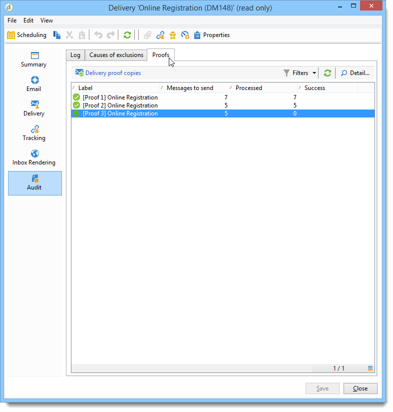
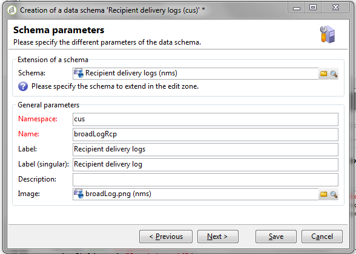
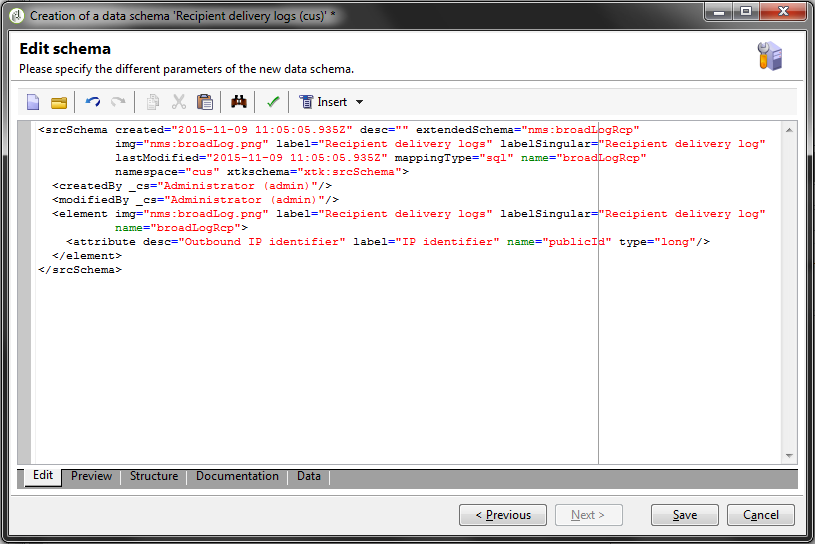

# Panel de entregas {#delivery-dashboard}

El **panel de entregas** es fundamental para controlar las entregas y los problemas que puedan ser detectados durante la entrega de mensajes.

Permite recuperar información de una entrega y editarla si es necesario. Tenga en cuenta que el contenido de las pestañas no se puede cambiar una vez realizada la entrega.

A continuación, se muestra la información que puede monitorizar en las distintas pestañas disponibles en el panel:

* [Resumen de entregas](#delivery-summary)
* [Informes de envío](#delivery-reports)
* [Registros de entregas, páginas espejo y exclusiones](#delivery-logs-and-history)
* [Registros de entregas e historial](#tracking-logs)
* [Representación de entregas](#delivery-rendering)
* [Auditoría de entrega](#delivery-audit-)


**Temas relacionados:**

* [Comprensión de los errores de entrega](../../delivery/using/understanding-delivery-failures.md)
* [Comprensión de la gestión de la cuarentena](../../delivery/using/understanding-quarantine-management.md)
* [Prácticas recomendadas de entregas](../../delivery/using/delivery-best-practices.md)
* [Administración de entregas](../../delivery/using/about-deliverability.md)

## Resumen de entregas {#delivery-summary}

La pestaña **[!UICONTROL Summary]** contiene las características de la entrega: estado de entrega, canal utilizado, información sobre el remitente, asunto, información sobre la ejecución.

## Informes de entrega {#delivery-reports}

El vínculo **[!UICONTROL Reports]** le permite ver un conjunto de informes relativos a la acción de entrega: informes de entregas generales, informes detallados, informes de entregas, distribución de mensajes fallidos, tasa de apertura, clics y transacciones, etc.**[!UICONTROL Summary]**

El contenido de esta pestaña se puede configurar según sus necesidades. Para obtener más información sobre los informes de entregas, consulte [esta sección](../../reporting/using/delivery-reports.md).


## Registros de entregas, historial y exclusiones {#delivery-logs-and-history}

La pestaña **[!UICONTROL Delivery]** ofrece un historial de los sucesos en esta entrega. Contiene los registros de entregas, es decir, la lista de mensajes enviados y su estado y los mensajes asociados.

Para una entrega, puede mostrar, por ejemplo, solo los destinatarios con una entrega fallido o una dirección en cuarentena. Para ello, haga clic en el botón **[!UICONTROL Filters]** y seleccione **[!UICONTROL By state]**. Seleccione el estado en la lista desplegable. En [esta página](../../delivery/using/delivery-statuses.md) se enumeran varios estados.

>[!NOTE]
>
>La lista que muestra los registros de entregas se puede personalizar, como cualquier lista de Campaign Classic. Por ejemplo, puede agregar una columna para saber qué dirección IP envió cada correo electrónico en una entrega. Para obtener más información sobre esto, consulte el caso de uso detallado en [esta sección](#use-case).


El enlace **[!UICONTROL Display the mirror page for this message...]** permite ver la página espejo del contenido de la entrega seleccionado en la lista en una nueva ventana.

La página espejo solo está disponible para las entregas para los que se ha definido contenido HTML. Para obtener más información, consulte [Generación de la página espejo](../../delivery/using/sending-messages.md#generating-the-mirror-page).


## Registros de entregas e historial{#tracking-logs}

La pestaña **[!UICONTROL Tracking]** enumera el historial de seguimiento de esta entrega. Esta pestaña muestra los datos de seguimiento de los mensajes enviados, es decir, todas las direcciones URL sobre las que Adobe Campaign realiza un seguimiento. Los datos de seguimiento se actualizan cada hora.

>[!NOTE]
>
>Si el seguimiento no está habilitado para una entrega, esta pestaña no se muestra.

La configuración de seguimiento se realiza en el escenario adecuado del asistente de entregas. Consulte [Configuración de los vínculos rastreados](../../delivery/using/how-to-configure-tracked-links.md).

Los datos de **[!UICONTROL Tracking]** se interpretan en los informes de entrega. Consulte [esta sección](../../reporting/using/delivery-reports.md).


## Renderización de la bandeja de entrada {#delivery-rendering}

La pestaña **[!UICONTROL Inbox rendering]** le permite obtener una previsualización del mensaje en los diferentes contextos en los que se puede recibir y comprobar la compatibilidad en las aplicaciones y los escritorios principales.

Así, puede asegurarse de que su mensaje se mostrará a los destinatarios de una forma óptima en una gran variedad de clientes, correos web y dispositivos.

Para obtener más información sobre la renderización de la bandeja de entrada, consulte [esta página](../../delivery/using/inbox-rendering.md).


## Auditoría de entrega {#delivery-audit-}

La pestaña **[!UICONTROL Audit]** contiene el registro de entregas y todos los mensajes correspondientes a las pruebas.

El botón **[!UICONTROL Refresh]** permite actualizar los datos. Utilice el botón **[!UICONTROL Filters]** para definir un filtro en los datos.

Los iconos especiales permiten identificar errores o advertencias. Consulte [Análisis de la entrega](../../delivery/using/steps-validating-the-delivery.md#analyzing-the-delivery).

La subpestaña **[!UICONTROL Proofs]** permite ver la lista de pruebas que se han enviado.



Puede modificar la información mostrada en esta ventana (y la de las pestañas **[!UICONTROL Delivery]** y **[!UICONTROL Tracking]**) seleccionando las columnas que desea mostrar. Para ello, haga clic en el icono **[!UICONTROL Configure list]** situado en la esquina inferior derecha. Para obtener más información sobre la configuración de listas, consulte [esta sección](../../platform/using/adobe-campaign-workspace.md#configuring-lists).

## Sincronización del panel de entregas {#delivery-dashboard-synchronization}

En el panel de entregas, se recomienda comprobar los mensajes procesados y los registros de entregas para asegurarse de que su entrega se haya realizado correctamente.

Algunos indicadores o estados pueden ser incorrectos o no estar actualizados; esto puede resolverse con las soluciones siguientes:

* Si su estado de entrega es incorrecto, compruebe que se hayan realizado todas las aprobaciones necesarias para esta entrega o que los flujos de trabajo de **[!UICONTROL operationMgt]** y **[!UICONTROL deliveryMgt]** se estén ejecutando sin errores. Esto también se puede deber a que la entrega mediante una afinidad no está configurado en la instancia del emisor.

* Si los indicadores de entregas aún se encuentran en 0 y si se encuentra en una configuración intermediaria, consulte el flujo de trabajo técnico **[!UICONTROL Mid-sourcing (delivery counters)]**. Inícielo si su estado no es **[!UICONTROL Started]**. A continuación, puede intentar volver a calcular los indicadores haciendo clic con el botón derecho en la entrega correspondiente en el explorador de Adobe Campaign y seleccionando **[!UICONTROL Actions]** > **[!UICONTROL Recompute delivery and tracking indicators]**. Para obtener más información sobre los indicadores de seguimiento, consulte [esta sección](../../reporting/using/delivery-reports.md#tracking-indicators).

* Si el contador de entregas no coincide con su entrega, intente volver a calcular los indicadores haciendo clic con el botón derecho en la entrega correspondiente del explorador de Adobe Campaign y seleccionando **[!UICONTROL Actions]** > **[!UICONTROL Recompute delivery and tracking indicators]** para volver a sincronizar. Para obtener más información sobre los indicadores de seguimiento, consulte [esta sección](../../reporting/using/delivery-reports.md#tracking-indicators).

* Si el contador de entregas no está actualizado para las implementaciones intermediarias, compruebe que se esté ejecutando el flujo de trabajo técnico **[!UICONTROL Mid-Sourcing (Delivery counters)]**. Para obtener más información, consulte [esta página](../../installation/using/mid-sourcing-deployment.md).

También puede rastrear las entregas con diferentes informes a través del panel de entrega. Para obtener más información, consulte [esta sección](../../reporting/using/delivery-reports.md).

## Ejemplo de uso: Añadir direcciones IP de los remitentes a los registros {#use-case}

En esta sección, aprenderá a agregar a los registros de entregas información sobre la dirección IP que envió cada correo electrónico en una entrega.

>[!NOTE]
>
>Esta modificación es diferente si utiliza una instancia única o una instancia de intermediario. Antes de realizar la modificación, asegúrese de que está conectado a la instancia de entregas de correo electrónico.

### Paso 1: Ampliación del esquema

Para agregar **publicID** a sus registros de entregas, primero debe extender el esquema. Puede continuar como se indica a continuación.

1. Cree una extensión de esquema en **[!UICONTROL Administration]** > **[!UICONTROL Configuration]** > **[!UICONTROL Data Schemas]** > **[!UICONTROL New]**.

   Para obtener más información sobre las extensiones de esquema, consulte [esta página](../../configuration/using/extending-a-schema.md).

1. Seleccione **[!UICONTROL broadLogRcp]** para ampliar los registros de entregas de destinatario (nms) y definir un área de nombres personalizada. En este caso será &quot;cus&quot;:

   

   >[!NOTE]
   >
   >Si la instancia está en Intermediario, debe usar el esquema broadLogMid.

1. Añada el nuevo campo en la extensión. En este ejemplo, debe reemplazar:

   ```
   <element img="nms:broadLog.png" label="Recipient delivery logs" labelSingular="Recipient delivery log" name="broadLogRcp"/>
   ```

   por:

   ```
   <element img="nms:broadLog.png" label="Recipient delivery logs" labelSingular="Recipient delivery log" name="broadLogRcp">
   <attribute desc="Outbound IP identifier" label="IP identifier"
   name="publicId" type="long"/>
   </element>
   ```

   

### Paso 2: Actualización de la estructura de la base de datos

Una vez realizadas las modificaciones, debe actualizar la estructura de la base de datos para que esté alineada con su descripción lógica.

Para realizar esto, siga los pasos a continuación:

1. Haga clic en el menú **[!UICONTROL Tools]** > **[!UICONTROL Advanced]** > **[!UICONTROL Update database structure...]**.

   

1. En la ventana **[!UICONTROL Edit tables]**, se comprueba la tabla **[!UICONTROL NmsBroadLogRcp]** (o la tabla **[!UICONTROL broadLogMid]** si está en un entorno de intermediario), como se muestra a continuación:

   

   >[!IMPORTANT]
   >
   >Asegúrese siempre de que no haya ninguna otra modificación, excepto la tabla **[!UICONTROL NmsBroadLoGRcp]** (o la tabla **[!UICONTROL broadLogMid]** si está en un entorno de intermediario). Si es así, desmarque otras tablas.

1. Haga clic en **[!UICONTROL Next]** para validar. Se muestra la siguiente pantalla:

   

1. Haga clic en **[!UICONTROL Next]**, luego **[!UICONTROL Start]**, para actualizar la estructura de la base de datos de inicio. Se inicia la creación de índices. Este paso puede ser largo, dependiendo del número de filas de la tabla **[!UICONTROL NmsBroadLogRcp]**.

   

>[!NOTE]
>
>Una vez que la actualización de la estructura física de la base de datos se haya completado correctamente, debe desconectarse y volver a conectarse para que se tengan en cuenta las modificaciones.

### Paso 3: Validación de la modificación

Para confirmar que todo funcionó correctamente, debe actualizar la pantalla de registros de entregas.

Para ello, acceda a los registros de entregas y agregue la columna Identificador de IP.


>[!NOTE]
>
>Para obtener información sobre cómo configurar listas en la interfaz de Campaign Classic, consulte [esta página](../../platform/using/adobe-campaign-workspace.md).

A continuación, se muestra lo que debería ver en la pestaña **[!UICONTROL Delivery]** después de realizar las modificaciones:


