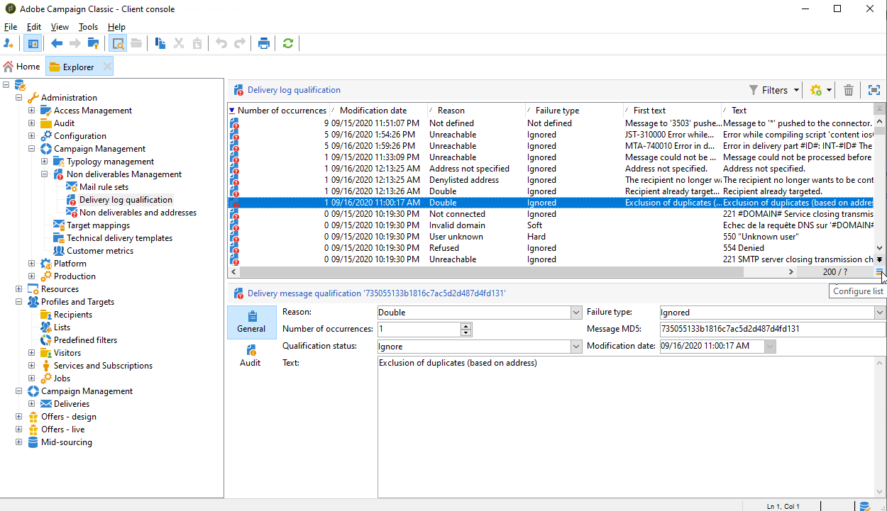

# Errores de envío y administración de cuarentena {#delivery-failures-quarantine}

>[!NOTE]
>
>En la documentación de Campaign v8 se documenta una guía completa sobre los errores de entrega y la administración de cuarentena. Este contenido se aplica tanto a los usuarios de Campaign Classic v7 como de Campaign v8:
>
>* [Comprender los errores de entrega](https://experienceleague.adobe.com/en/docs/campaign/campaign-v8/send/monitor/delivery-failures){target="_blank"}: abarca tipos de errores, motivos de error, errores sincrónicos/asincrónicos, administración de reintentos y solución de problemas
>* [Administración de cuarentena](https://experienceleague.adobe.com/en/docs/campaign/campaign-v8/send/monitor/quarantines){target="_blank"}: cubre la cuarentena frente a la lista de bloqueados, los umbrales de error leves, los informes de cuarentena y la eliminación de direcciones
>
>Esta página documenta la **configuración específica de Campaign Classic v7** para la administración de correo de rebote y cuarentena en implementaciones híbridas y locales.

## Comprensión de los errores de envío

Para obtener conceptos comunes sobre errores de entrega, tipos de error e instrucciones para la solución de problemas, consulte la [documentación de Campaign v8 Understanding delivery failures](https://experienceleague.adobe.com/en/docs/campaign/campaign-v8/send/monitor/delivery-failures){target="_blank"}.

## Configuración de correo rechazado {#bounce-mail-config}

Las siguientes opciones de configuración están disponibles para **implementaciones híbridas/on-premise de Campaign Classic v7** para administrar el procesamiento de correos rechazados.

### Configuración del buzón de rechazos {#bounce-mailbox-configuration}

Para instalaciones on-premise, la configuración del buzón de rechazos se detalla en [esta sección](../../installation/using/deploying-an-instance.md#managing-bounced-emails).

La plataforma Adobe Campaign recopila los mensajes de error asíncronos a través del buzón de rechazos y los califica el proceso inMail para enriquecer la lista de reglas de gestión de correo electrónico.

>[!NOTE]
>
>Para los usuarios de Cloud Services administrados de Campaign v8, la configuración del buzón de rechazos la realiza y administra Adobe. No se requiere ninguna configuración.

### Administración de cualificación de correo rechazado {#bounce-mail-qualification-management}

En el caso de instalaciones on-premise e instalaciones alojadas/híbridas que utilizan el servidor de correo de Campaign heredado, cuando se produce un error en el envío de un correo electrónico, el servidor de envío de Adobe Campaign recibe un mensaje de error del servidor de mensajería o del servidor DNS remoto. La lista de errores se compone de cadenas de caracteres incluidas en el mensaje rechazado por el servidor remoto. Los tipos y los motivos del error se asignan a cada mensaje.

Esta lista está disponible a través del nodo **[!UICONTROL Administration > Campaign Management > Non deliverables Management > Delivery log qualification]**. Contiene todas las reglas utilizadas por Adobe Campaign para clasificar los errores de entrega. No es exhaustiva, Adobe Campaign la actualiza regularmente y también la puede administrar el usuario.

El mensaje rechazado por el servidor remoto en la primera vez que se produjo este tipo de error se muestra en la columna **[!UICONTROL First text]** de la tabla **[!UICONTROL Delivery log qualification]**. Si no se muestra esta columna, haga clic en el botón **[!UICONTROL Configure list]** situado en la parte inferior derecha de la lista para seleccionarla.

Adobe Campaign filtra este mensaje para eliminar el contenido de la variable (como ID, fechas, direcciones de correo electrónico, números de teléfono, etc.) y muestra el resultado filtrado en la columna **[!UICONTROL Text]**. Las variables se reemplazan por **`#xxx#`**, excepto las direcciones que se sustituyen por **`*`**.

Este proceso permite reunir todos los errores del mismo tipo y evitar entradas múltiples para errores similares en la tabla Calificación del registro de envío.

>[!NOTE]
>
>El campo **[!UICONTROL Number of occurrences]** muestra el número de veces que se ha producido el mensaje en la lista. Está limitado a 100 000 incidencias. Si lo desea, puede editar el campo, por ejemplo, para reiniciarlo.

Los correos electrónicos rechazados pueden tener el siguiente estado de calificación:

* **[!UICONTROL To qualify]**: no se pudo calificar el correo rechazado. Se debe asignar la calificación al equipo de entregas para garantizar una capacidad de entrega eficiente de la plataforma. Siempre que no esté clasificado, no se usa el correo rechazado para enriquecer la lista de reglas de gestión de correo electrónico.
* **[!UICONTROL Keep]**: el correo rechazado se ha clasificado y el flujo de trabajo **Actualizar la entrega** lo usará para compararlo con las reglas de gestión de correo electrónico existentes y enriquecer la lista.
* **[!UICONTROL Ignore]**: el MTA de Campaign ignora el correo rechazado, lo que significa que esta devolución nunca hará que la dirección del destinatario se ponga en cuarentena. El flujo de trabajo de **actualización para la entrega** no lo usará y no se enviará a las instancias de cliente.

>[!NOTE]
>
>En caso de una interrupción de un ISP, los correos electrónicos enviados a través de Campaign se marcan erróneamente como rechazos. Para corregir esto, debe actualizar la calificación de devoluciones. Para obtener más información, consulte [esta página](update-bounce-qualification.md).

### Configuración de reglas de gestión de correo electrónico {#email-management-rules}

Se accede a las reglas de correo a través del nodo **[!UICONTROL Administration > Campaign Management > Non deliverables Management > Mail rule sets]**. Las reglas de administración de correo electrónico se muestran en la parte inferior de la ventana.

>[!NOTE]
>
>Los parámetros predeterminados de la plataforma se configuran en el asistente de implementación. Para obtener más información, consulte [esta sección](../../installation/using/deploying-an-instance.md).

Las reglas predeterminadas son las siguientes:

>[!IMPORTANT]
>
>* El servidor de entrega (MTA) debe reiniciarse si se han cambiado los parámetros.
>* La modificación o creación de reglas de administración solo es para usuarios expertos.

#### Correo electrónico entrante {#inbound-email}

Estas reglas contienen las cadenas que pueden devolver los servidores remotos y que permiten calificar el error (**Grave**, **leve** o **ignorado**).

Cuando un mensaje de correo electrónico falla, el servidor remoto devuelve un mensaje de rechazo a la dirección especificada en los parámetros de la plataforma. Adobe Campaign compara el contenido de cada mensaje de rechazo con las cadenas de la lista de reglas y, a continuación, lo asigna a uno de los tres tipos de error.

>[!NOTE]
>
>El usuario puede crear sus propias reglas. Al importar un paquete y al actualizar datos mediante el flujo de trabajo **Refresh for deliverability**, se sobrescriben las reglas creadas por el usuario.

Para obtener más información sobre la calificación de correo rechazado, consulte [esta sección](#bounce-mail-qualification-management).

#### Administración de dominios {#domain-management}

Para instalaciones on-premise, el MTA aplica una sola regla de **Administración de dominios** a todos los dominios.

<!---->

* Se puede elegir si activar o no determinadas normas de identificación y claves de cifrado para comprobar el nombre del dominio como, por ejemplo, **ID de remitente**, **DomainKeys**, **DKIM** y **S/MIME**.
* Los parámetros **SMTP relay** permiten configurar la dirección IP y el puerto de un servidor de transmisión para un dominio determinado. Para obtener más información, consulte [esta sección](../../installation/using/configuring-campaign-server.md#smtp-relay).

Si sus mensajes muestran **[!UICONTROL on behalf of]** en la dirección del remitente, asegúrese de no firmar correos electrónicos con **ID de remitente**, que es el estándar de autenticación de correo electrónico propietario obsoleto de Microsoft. Si la opción **[!UICONTROL Sender ID]** está habilitada, desmarque la casilla correspondiente y póngase en contacto con el [Servicio de atención al cliente de Adobe](https://helpx.adobe.com/es/enterprise/admin-guide.html/enterprise/using/support-for-experience-cloud.ug.html). La capacidad de envío no se ve afectada.

#### Administración de MX {#mx-management}

Para las instalaciones on-premise, se utilizan reglas de administración MX para regular el flujo de correos electrónicos salientes para un dominio específico.

<!---->

Estas reglas están disponibles en el asistente de implementación y se pueden personalizar:

* **[!UICONTROL MX Management]**: esta regla se usa para controlar el flujo de correos electrónicos salientes para un dominio. Realiza muestras de los mensajes rechazados y bloquea la entrega a donde corresponda.

* **[!UICONTROL Period]**: lapso de tiempo durante el cual se limitan o bloquean los mensajes.

* **[!UICONTROL Limit]**: el número máximo de mensajes permitidos por período de tiempo.

* **[!UICONTROL Type]**: tipo de error (grave, leve o omitido) utilizado para determinar el comportamiento de envío. Consulte la [documentación de Campaign v8](https://experienceleague.adobe.com/en/docs/campaign/campaign-v8/send/monitor/delivery-failures){target="_blank"} para ver las definiciones de tipo de error.

Para obtener más información sobre gestión MX, consulte [esta sección](../../installation/using/email-deliverability.md#about-mx-rules).

>[!NOTE]
>
>Para los usuarios de Cloud Services administrados de Campaign v8, las reglas MX y la administración de flujo de correo electrónico son administradas por Adobe como parte de la infraestructura administrada. Póngase en contacto con el Servicio de atención al cliente de Adobe si necesita ajustar la configuración MX para casos de uso específicos.

## Administración de cuarentena {#quarantine-management}

Para obtener instrucciones detalladas sobre la administración de cuarentena, consulte la [Documentación de administración de cuarentena de Campaign v8](https://experienceleague.adobe.com/en/docs/campaign/campaign-v8/send/monitor/quarantines){target="_blank"}.

## Configuración de cuarentena {#quarantine-config}

Las siguientes opciones de configuración están disponibles para **implementaciones híbridas/locales de Campaign Classic v7** con el fin de personalizar el comportamiento de la cuarentena.

### Configuración del umbral de error leve {#soft-error-threshold}

Para las instalaciones on-premise que utilizan el servidor de correo de Campaign heredado, puede modificar el número de errores y el periodo entre dos errores antes de que una dirección se ponga en cuarentena.

Para establecer esta configuración:

1. Acceda al asistente de implementación desde **[!UICONTROL Tools]** > **[!UICONTROL Advanced]** > **[!UICONTROL Deployment wizard]**
2. Vaya a **[!UICONTROL Email channel]** > **[!UICONTROL Advanced parameters]**
3. Configurar:
   * **Número de errores**: El número máximo de errores leves antes de poner una dirección en cuarentena (predeterminado: 5)
   * **Período entre dos errores significativos**: Período de tiempo (en segundos) para el recuento de errores (predeterminado: 86 400 segundos = 1 día)

Cuando el contador de errores alcanza el umbral, la dirección se pone en cuarentena. Si el último error significativo se produjo hace más de 10 días, el contador de errores se reinicia.

Para obtener más información, consulte [esta página](communication-channels.md) en **Envío de entregas** > **Configurar reintentos**.

>[!NOTE]
>
>Para los usuarios de Cloud Services administrados de Campaign v8, la configuración de reintentos y los umbrales de error los administra Adobe en función del rendimiento de la IP y la reputación del dominio. No se requiere ninguna configuración.

### Flujo de trabajo para limpieza de bases de datos {#database-cleanup-workflow}

Para instalaciones on-premise, el flujo de trabajo técnico **[!UICONTROL Database cleanup]** elimina automáticamente las direcciones en cuarentena que coinciden con condiciones específicas.

Acceda a este flujo de trabajo desde **[!UICONTROL Administration]** > **[!UICONTROL Production]** > **[!UICONTROL Technical workflows]** > **[!UICONTROL Database cleanup]**.

El flujo de trabajo elimina las direcciones de la cuarentena en los siguientes casos:

* Direcciones en estado **[!UICONTROL With errors]** después de un envío correcto
* Direcciones con estado **[!UICONTROL With errors]** si el último rebote suave se produjo hace más de 10 días
* Direcciones en estado **[!UICONTROL With errors]** con error **[!UICONTROL Mailbox full]** después de 30 días

Asegúrese de que este flujo de trabajo se ejecute regularmente (recomendado: diariamente) para mantener la higiene de la lista de cuarentena.

Para obtener más información sobre limpieza de bases de datos, consulte [esta sección](../../production/using/database-cleanup-workflow.md).

>[!NOTE]
>
>Para los usuarios de Cloud Services administrados de Campaign v8, Adobe supervisa y administra el flujo de trabajo de limpieza de la base de datos.

### Detalles específicos de cuarentena de notificaciones push {#push-quarantine-specifics}

Para Campaign Classic v7, las cuarentenas de notificaciones push siguen el mecanismo de cuarentena general con algunos comportamientos específicos del canal.

Para las notificaciones push de **iOS** y **Android**, el mecanismo de cuarentena utiliza tokens de dispositivo en lugar de direcciones de correo electrónico. Cuando se desinstala o se vuelve a instalar una aplicación móvil, el token asociado se pone en cuarentena.

Para obtener información detallada sobre los escenarios de cuarentena de notificaciones push (tipos de error de iOS y Android, comportamiento de reintentos, etc.), consulte la documentación de [Explicación de los errores de entrega](https://experienceleague.adobe.com/en/docs/campaign/campaign-v8/send/monitor/delivery-failures){target="_blank"}, que incluye tablas completas de tipos de errores de notificaciones push.

### Detalles específicos de cuarentena de SMS {#sms-quarantine-specifics}

Para Campaign Classic v7, las cuarentenas de SMS siguen el mecanismo de cuarentena general con algunos comportamientos específicos del canal relacionados con los números de teléfono en lugar de las direcciones de correo electrónico.

El mecanismo de cuarentena del SMS varía según el conector utilizado:

* **Conectores SMPP estándar**: Las reglas de calificación de errores definidas en **[!UICONTROL Administration > Campaign Management > Non deliverables Management > Delivery log qualification]** se aplican a los envíos SMS.

* **Conector SMPP genérico extendido**: la administración de errores se administra de forma diferente mediante expresiones regulares (regex) para analizar los mensajes de informe de estado (SR) devueltos por el proveedor SMSC.

Para obtener información detallada sobre los escenarios de cuarentena de SMS y los tipos de error, consulte la documentación de [Explicación de los errores de entrega](https://experienceleague.adobe.com/en/docs/campaign/campaign-v8/send/monitor/delivery-failures){target="_blank"}, que incluye tablas completas de tipos de errores de SMS.

## Temas relacionados

* [Comprender los errores de entrega](https://experienceleague.adobe.com/en/docs/campaign/campaign-v8/send/monitor/delivery-failures){target="_blank"} (Documentación de Campaign v8)
* [Administración de cuarentena](https://experienceleague.adobe.com/en/docs/campaign/campaign-v8/send/monitor/quarantines){target="_blank"} (documentación de Campaign v8)
* [Prácticas recomendadas de envío](https://experienceleague.adobe.com/en/docs/campaign/campaign-v8/start/delivery-best-practices){target="_blank"} (documentación de Campaign v8)
* [Estados de entrega](https://experienceleague.adobe.com/en/docs/campaign/campaign-v8/send/monitor/delivery-statuses){target="_blank"} (documentación de Campaign v8)
* [Flujo de trabajo de limpieza de la base de datos](../../production/using/database-cleanup-workflow.md) (v7 híbrido/local)
* [Configurar reintentos de entrega](communication-channels.md) (v7 híbrido/local)
* [Actualizar calificación de devoluciones](update-bounce-qualification.md) (v7 híbrido/local)
* [Configuración de envío de correo electrónico](../../installation/using/email-deliverability.md) (v7 híbrido/local)
* [Implementación de una instancia](../../installation/using/deploying-an-instance.md#managing-bounced-emails) (v7 híbrida/local)

