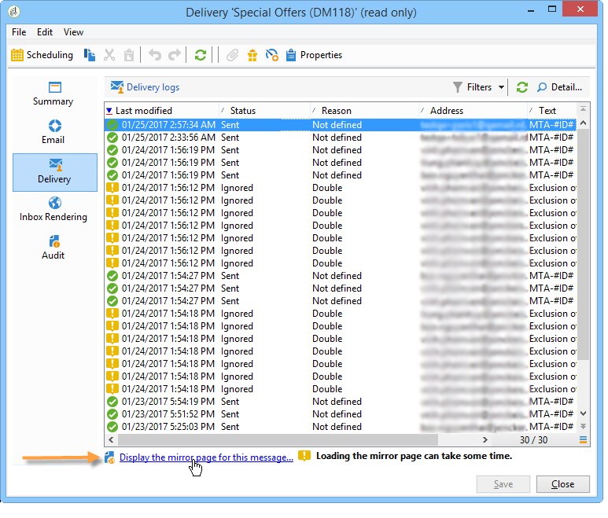
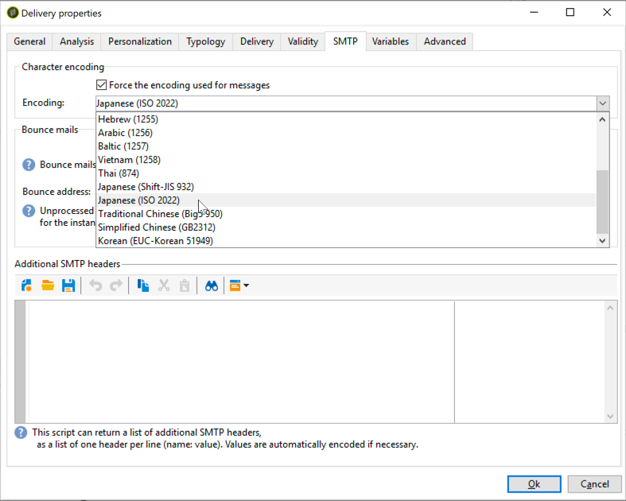

# Parámetros de correo electrónico {#email-parameters}

Esta sección presenta las opciones y los parámetros específicos del envío de correo electrónico.

## Correo electrónico CCO {#email-bcc}

Adobe Campaign permite almacenar correos electrónicos en un sistema externo a través de CCO añadiendo simplemente una dirección de correo electrónico CCO al destino del mensaje.

Una vez activada la opción, se conserva una copia exacta de todos los mensajes enviados en este envío.

Para obtener más información sobre la configuración y las prácticas recomendadas para las direcciones de correo electrónico CCO, consulte [esta sección](../../installation/using/email-archiving.md).

>[!NOTE]
>
>El correo electrónico CCO es una capacidad opcional. Compruebe el acuerdo de licencia y póngase en contacto con el administrador de cuentas para activarlo.

Al crear un nuevo envío o una plantilla de envíos, el correo electrónico CCO no está habilitado de forma predeterminada. Debe habilitarlo manualmente en el nivel de envío o de plantilla de envíos de correo electrónico.

Para habilitar el correo electrónico CCO para una plantilla de envíos de correo electrónico, siga los pasos a continuación:

1. Vaya a **[!UICONTROL Campaign Management]** > **[!UICONTROL Deliveries]** o **[!UICONTROL Resources]** > **[!UICONTROL Templates]** > **[!UICONTROL Delivery templates]**.
1. Seleccione la entrega que desee o duplique la plantilla de **envío de correo electrónico** preestablecida y, a continuación, seleccione la plantilla duplicada.
1. Haga clic en el botón **Propiedades**.
1. Seleccione la pestaña **[!UICONTROL Delivery]** .
1. Marque la opción **correo electrónico CCO**. Se enviará una copia de todos los mensajes entregados para cada envío en función de esta plantilla a la dirección de CCO de correo electrónico que se haya configurado.

   

>[!NOTE]
>
>Si se abren y se hace clic en los correos electrónicos enviados a la dirección de CCO, esto se tiene en cuenta en el cálculo de **[!UICONTROL Total opens]** y **[!UICONTROL Clicks]** en el análisis de envío, lo cual podría provocar algunos cálculos erróneos.

## Selección de los formatos de mensaje {#selecting-message-formats}

Puede cambiar el formato de los mensajes de correo electrónico enviados. Para ello, edite las propiedades de la entrega y haga clic en la pestaña **[!UICONTROL Delivery]**.

Seleccione el formato del correo electrónico en la sección inferior de la ventana:

* **[!UICONTROL Use recipient preferences]** (modo predeterminado)

   El formato de mensaje se define según los datos almacenados en el perfil de destinatario y se almacena de forma predeterminada en el campo **[!UICONTROL email format]** (@emailFormat). Si un destinatario desea recibir mensajes en un formato determinado, este es el formato enviado. Si el campo no está rellenado, se envía un mensaje multipart-alternative (consulte a continuación).

* **[!UICONTROL Let recipient mail client choose the most appropriate format]**

   El mensaje contiene ambos formatos: texto y HTML. El formato que se muestra al recibirlo depende de la configuración del software de correo del destinatario (multipart-alternative).

   >[!IMPORTANT]
   >
   >Esta opción incluye ambas versiones del documento. Por lo tanto, esto afecta a la tasa de entrega ya que el tamaño del mensaje es mayor.

* **[!UICONTROL Send all messages in text format]**

   El mensaje se envía en formato de texto. El formato HTML no se envía, pero se utiliza solo para la página espejo cuando el destinatario hace clic en el mensaje.

>[!NOTE]
>
>Para obtener más información sobre la definición del contenido del correo electrónico, consulte [esta sección](../../delivery/using/defining-the-email-content.md).

## Generación de la página espejo {#generating-mirror-page}

La página espejo es una página HTML accesible en línea mediante un navegador web. Su contenido es idéntico al del correo electrónico.

De forma predeterminada, la página espejo se genera si el vínculo se inserta en el contenido del correo. Para obtener más información sobre cómo personalizar la inserción de bloques, consulte [Bloques de personalización](../../delivery/using/personalization-blocks.md).

En las propiedades de la entrega, el campo **[!UICONTROL Mode]** de la pestaña **[!UICONTROL Validity]** permite modificar el modo de generación de esta página.

>[!IMPORTANT]
>
>Se debe definir un contenido HTML para la entrega de la página espejo que se va a crear.

Además del modo predeterminado, también están disponibles las siguientes opciones:

* **[!UICONTROL Force the generation of the mirror page]**: Incluso si no se inserta ningún vínculo a la página espejo en el envío, esta se creará.
* **[!UICONTROL Do not generate the mirror page]**: No se genera ninguna página espejo, aunque el vínculo esté presente en el envío.
* **[!UICONTROL Generates a mirror page accessible using only the message identifier]**: Esta opción permite acceder al contenido de la página espejo, con información de personalización, en la ventana de registro de envío. Para ello, tras finalizar la entrega, haga clic en la pestaña **[!UICONTROL Delivery]** y seleccione la línea del destinatario cuya página duplicada desee ver. Haga clic en el vínculo **[!UICONTROL Display the mirror page for this message...]**.

   

## Codificación de caracteres {#character-encoding}

En la pestaña **[!UICONTROL SMTP]** de los parámetros de entrega, la sección **[!UICONTROL Character encoding]** le permite establecer una codificación específica.

La codificación predeterminada es UTF-8. Si algunos de los proveedores de correo electrónico de los destinatarios no admiten la codificación estándar UTF-8, es posible que desee configurar una codificación específica para que muestre correctamente los caracteres especiales a los destinatarios de los mensajes de correo electrónico.

Por ejemplo, desea enviar un correo electrónico que contenga caracteres japoneses. Para asegurarse de que todos los caracteres se mostrarán correctamente a los destinatarios en Japón, es posible que desee utilizar una codificación que admita los caracteres japoneses en lugar de la codificación UTF-8 estándar.

Para ello, seleccione la opción **[!UICONTROL Force the encoding used for messages]** en la sección **[!UICONTROL Character encoding]** y elija una codificación en la lista desplegable que se muestra.

## Gestión de correos electrónicos rechazados {#managing-bounce-emails}

La pestaña **[!UICONTROL SMTP]** de los parámetros de envío permite configurar la gestión de los correos electrónicos rechazados.

De forma predeterminada, los correos electrónicos rechazados se reciben en el cuadro de error predeterminado de la plataforma, pero se puede definir una dirección de error específica para una entrega.

Desde esta pantalla, también puede definir una dirección específica para investigar los motivos de rechazo de los correos electrónicos cuando la aplicación no pueda calificarlos automáticamente. Para cada uno de estos campos, el icono **Añadir campos personalizados** le permite añadir parámetros de personalización.

Para obtener más información sobre la gestión de correo rechazado, consulte [esta sección](../../delivery/using/understanding-delivery-failures.md#bounce-mail-management).

## Añadir encabezados SMTP {#adding-smtp-headers}

Es posible añadir encabezados SMTP a las entregas. Para ello, utilice la sección correspondiente en la pestaña **[!UICONTROL SMTP]** de la entrega.

La secuencia de comandos introducida en esta ventana debe hacer referencia a un encabezado por línea en el siguiente formulario **name:value**.

Los valores se codifican automáticamente si es necesario.

>[!IMPORTANT]
>
>La adición de secuencias de comandos para insertar encabezados SMTP se reserva para usuarios avanzados.
>
>La sintaxis de esta secuencia de comandos debe cumplir con los requisitos de este tipo de contenido: no dejar espacios sin utilizar, ninguna línea vacía, etc.
