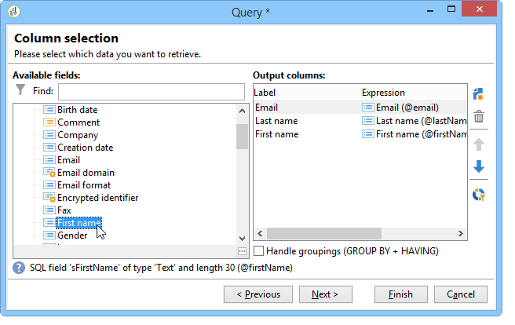

# Enriquecimiento de contenido{#enriching-content}

Los acumuladores le permiten enriquecer el contenido con datos externos. Estos datos proceden de consultas genéricas o tablas vinculadas.

## Consultas genéricas {#generic-queries}

Las consultas se configuran mediante la plantilla de publicación de la pestaña **[!UICONTROL Aggregator]**.

Los datos recuperados enriquecen el documento de salida XML a través de su elemento principal.

Ejemplo de devolución desde una consulta en el esquema del destinatario (**nms:recipient**):

```
<book name="Content Management">
  ...
  <collection-recipient>
    <recipient lastName="Doe" firstName="John" email="john.doe@aolf.com">
    ...
  </collection-recipient>
</book>
```

El elemento **`<collection-recipient>`** representa el elemento de entrada del documento resultante de una consulta. Los datos recuperados se devuelven en este elemento; en nuestro ejemplo, una lista de destinatarios.

### Adición de una consulta {#adding-a-query}

Los parámetros de la consulta se editan mediante un asistente.

1. En la primera página, especifique la etiqueta y el esquema que contiene los datos que se van a recuperar.

   

   >[!NOTE]
   >
   >El campo de edición **Path** se utiliza para cambiar el nombre del elemento de salida de la consulta.

1. La siguiente página permite seleccionar los datos que se van a recuperar.

   

1. La siguiente página define la condición de filtro.

   

1. La última página inicia una previsualización de los datos devueltos por la consulta.

   

## Tablas vinculadas {#linked-tables}

Los vínculos permiten recuperar datos externos vinculados al contenido.

Hay dos tipos de datos vinculados:

* Vínculos de contenido: modo nativo de gestión del contenido. El contenido del vínculo se integra automáticamente en el documento de salida XML.
* Los vínculos a listas externas proporcionan acceso a las demás listas de la base de datos con la limitación de recuperar los datos del vínculo seleccionado mediante un acumulador.

### Vinculación a un esquema de contenido {#link-to-a-content-schema}

En el esquema de datos, se define un vínculo de contenido de la siguiente manera:

```
<element expandSchemaTarget="cus:chapter" label="Main chapter" name="mainChapter" type="string"/>
```

La definición del vínculo se rellena en un **tipo** string **`<element>`**, y el atributo **expandSchemaTarget** hace referencia al esquema de destino (“cus:chapter” en el ejemplo). El esquema de referencia debe ser de contenido.

El contenido del elemento de destino enriquece el elemento de vínculo, es decir, el elemento **`<chapter>`** en el esquema de ejemplo:

```
<mainChapter computeString="Introduction" id="7011" title="Introduction" xtkschema="cus:chapter">    
  <page>Introduction to input <STRONG>forms</STRONG>.</page>
</mainChapter>
```

>[!NOTE]
>
>La **Compute string** del vínculo se presenta desde el atributo **computeString**.

En el formulario de entrada, el control de edición del vínculo se declara de la siguiente manera:

```
<input type="articleEdit" xpath="mainChapter"/>
```


El icono **[!UICONTROL Magnifier]** permite abrir el formulario de edición del elemento relacionado.

#### Colección de vínculos {#link-collection}

Para rellenar una colección de vínculos, añada el atributo **unbound=&quot;true&quot;** a la definición del elemento de vínculo en el esquema de datos:

```
<element expandSchemaTarget="cus:chapter" label="List of chapters" name="chapter"  ordered="true" unbound="true"/>
```

El contenido del elemento de destino enriquece cada elemento de colección:

```
<chapter computeString="Introduction" id="7011" title="Introduction" xtkschema="cus:chapter">    
  <page>Introduction to input <STRONG>forms</STRONG>.</page>
</chapter>
```

En el formulario de entrada, el control de lista se declara de la siguiente manera:

```
<input editable="false" nolabel="true" toolbarCaption="List of chapters" type="articleList" xpath="chapter" zoom="true"/>
```


Se muestra una columna predeterminada para ver la **Compute string** de los elementos de destino.

### Vínculos a tablas externas {#links-to-external-tables}

Se declara un vínculo a una tabla externa en el esquema de datos de la siguiente manera:

```
<element label="Main contact" name="mainContact" target="nms:recipient" type="link"/>
```

La definición del vínculo se rellena en un **tipo** vínculo **`<element>`** y el atributo **target** hace referencia al esquema de destino (“nms:destinatario” en el ejemplo).

Por norma, los vínculos deben declararse del elemento principal del esquema de datos.

**Compute string** y la clave del elemento de destino enriquecen los atributos **`<name>-id`** y **`<name>-cs`** en el elemento principal.

En nuestro ejemplo, el vínculo se rellena en el esquema “cus:book”, el contenido de los datos del vínculo se incluye en los atributos “mainContact-id” y “mainContact-cs”:

```
<book computeString="Content management" date="2006/06/08" id="6106" language="en" mainContact-cs="John Doe (john.doe@adobe.com)" mainContact-id="3012" name="Content management" xtkschema="cus:book">
```

El control de edición de vínculos se declara de la siguiente manera:

```
<input xpath="mainContact"/>
```


Puede restringir la selección de elementos de destino añadiendo el elemento **`<sysfilter>`** a través de la definición del vínculo en el formulario de entrada:

```
<input xpath="mainContact">
  <!-- Filter the selection of the link on the Adobe domain -->
  <sysFilter>
    <condition expr="@domain =  'adobe.com '"/>
  </sysFilter>
</input>
```

>[!NOTE]
>
>Esta restricción también se aplica a los vínculos de contenido.

#### Colección de vínculos {#link-collection-1}

La definición de la colección es idéntica a la definición de una lista en los elementos de colección:

```
<element label="List of contacts" name="contact" unbound="true">
  <element label="Recipient" name="recipient" target="nms:recipient" type="link"/>
</element>
```

En el formulario de entrada, el control de lista se declara de la siguiente manera:

```
<input nolabel="true" toolbarCaption="List of contacts" type="list" xpath="contact">
  <input xpath="recipient"/>
</input>
```


>[!NOTE]
>
>La lista es editable y permite seleccionar el vínculo de un control de tipo “vínculo” presentado más atrás.

El contenido del elemento de destino enriquece cada elemento de colección en el documento de salida:

```
<contact id="11504978621" recipient-cs="Doe John (john.doe@adobe.com)" recipient-id="3012"/>
<contact id="11504982510" recipient-cs="Martinez Peter (peter.martinez@adobe.com)" recipient-id="3013"/>
```

#### Acumulación de vínculos {#link-aggregation}

El contenido de cada vínculo al que se hace referencia se limita a la clave interna y a la **Compute string** del elemento de destino.

Se utiliza un script de JavaScript para enriquecer el contenido de los vínculos mediante consultas SOAP.

**Ejemplo**: añadir el nombre del destinatario al vínculo “mainContact” y a los vínculos de la colección “contact”:

```
// Update <mainContact> link
var mainContactId = content.@['mainContact-id']
var query = xtk.queryDef.create(
    <queryDef schema="nms:recipient" operation="get">
      <select>
        <node expr="@lastName"/>
      </select>
      <where>
        <condition expr={"@id="+mainContactId}/>
      </where>
    </queryDef>)

var recipient = query.ExecuteQuery()
content.mainContact.@lastName = recipient.@lastName

// Update <contact> link collection
for each(var contact in content.contact)
{
  var contactId = contact.@['recipient-id']
  var query = xtk.queryDef.create(
    <queryDef schema="nms:recipient" operation="get">
      <select>
        <node expr="@lastName"/>
      </select>
      <where>
        <condition expr={"@id="+contactId}/>
      </where>
    </queryDef>
  )
  
  var recipient = query.ExecuteQuery()
  contact.@lastName = recipient.@lastName
}
```

El resultado obtenido después de la ejecución del script:

```
<mainContact lastName="Doe"/>

<contact id="11504978621" lastName="Doe" recipient-cs="Doe John (john.doe@adobe.com)" recipient-id="3012"/>  
<contact id="11504982510" lastName="Martinez" recipient-cs="Martinez Peter (peter.martinez@adobe.com)" recipient-id="3013"/> 
```

El contenido del código JavaScript se añade mediante la carpeta **[!UICONTROL Administration > Configuration > Content management > JavaScript Codes]** y debe rellenarse en la plantilla de publicación para cada transformación.


