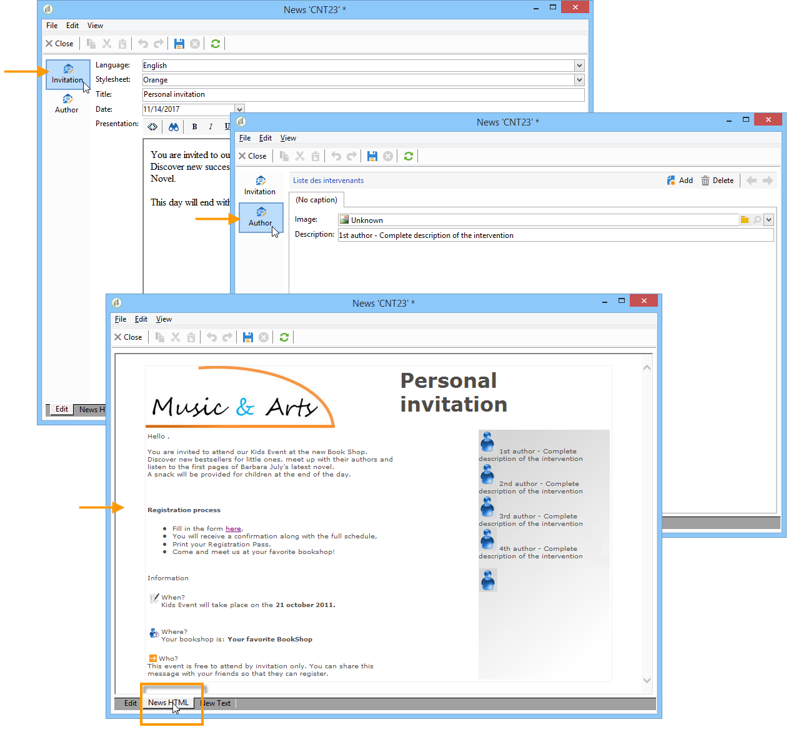
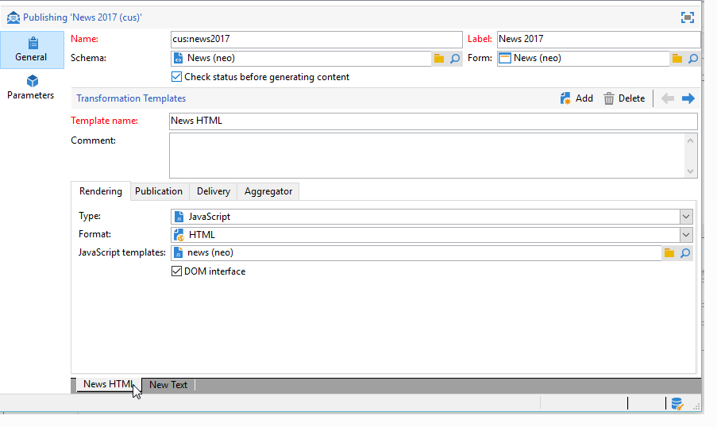
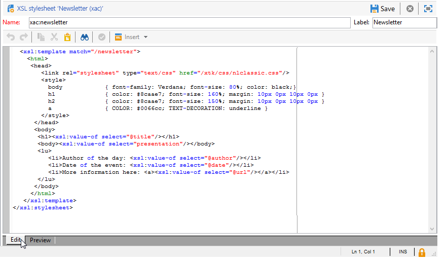
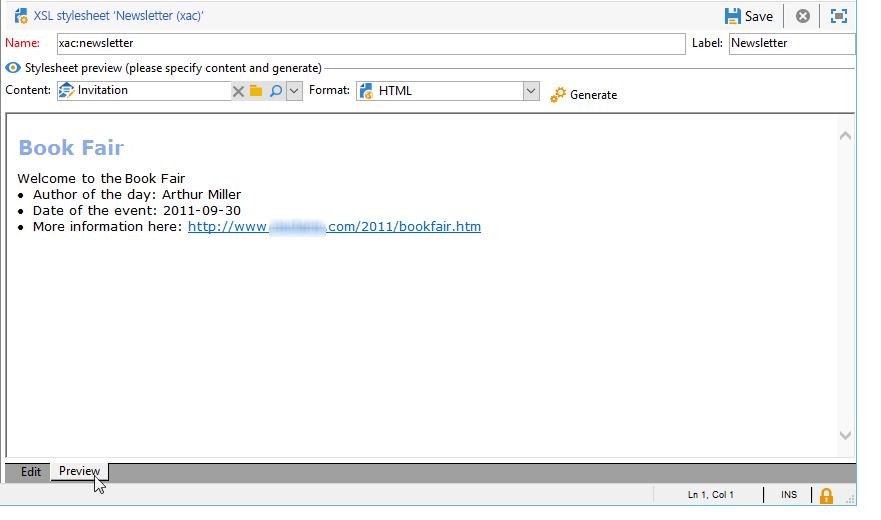

# Formato{#formatting}

## Plantillas JavaScript {#javascript-templates}

Una plantilla JavaScript es un documento HTML o de texto que incluye un código JavaScript. Se construye del mismo modo que el contenido de un correo electrónico en una acción de entrega.

### Identificación de una plantilla JavaScript {#identification-of-a-javascript-template}

Una plantilla JavaScript se identifica con su nombre y área de nombres igual que los esquemas y formularios. No obstante, se recomienda añadir la opción **.js** al nombre de la plantilla.

### Estructura de una plantilla JavaScript {#structure-of-a-javascript-template}

Ejemplo de una plantilla de formato HTML de JavaScript basada en el esquema “cus:book”:

```
<html>
  <body>
    <!-- Title of book -->
    <h1><%= content.@name %></h1>
    <ul>
      <% for each(var chapter in content.chapter) { %>
        <li><%= chapter.@name %></li>
      <% }%>
    </ul>
  </body>
</html>
```

Las distintas directivas de JavaScript aparecen en el siguiente formulario:

* Campos combinados: muestra el contenido de los datos con la sintaxis **`<%= <source> %>`**, donde `<source>` es el campo de origen de los datos que desea mostrar.
* Bloques de instrucciones: ejecuta una serie de instrucciones de JavaScript incluidas entre las etiquetas &lt;% y %>.

El objeto **content** representa el elemento principal del documento XML de entrada.

En nuestro ejemplo, la línea siguiente muestra el contenido del nombre del libro:

```
<h1><%= content.@name %></h1>
```

El código siguiente se repite en el elemento de colección `<chapter>`:

```
<% for each(var chapter in content.chapter) { %>
  <li><%= chapter.@name %></li>
<% }%>
```

Los atributos y elementos del contenido se representan como objetos JavaScript y respetan la estructura del documento de origen.

**Ejemplo**:

* **content.@name**: recupera el valor del atributo “name” del elemento principal.
* **content.@`['name']`**: idéntico al **content.@name** sintaxis
* **content.chapter.length**: devuelve el número de elementos en el elemento de colección `<chapter`.
* **content.chapter`[0]`.@name**: recupera el nombre del primer elemento `<chapter>`.
* **chapter.name()**: devuelve el nombre del elemento `<chapter>`.
* **chapter.parent().name()**: devuelve el nombre del elemento principal de `<chapter>`

>[!CAUTION]
>
>Dado que el carácter “-” está reservado en el lenguaje JavaScript, la recuperación del valor de cualquier atributo o elemento que contenga este carácter se debe llevar a cabo mediante la sintaxis `['<field>']`.
>
>Por ejemplo: `content.@['offer-id']`.

Todo el poder de un lenguaje de programación (variables, bucles, pruebas condicionales, funciones, etc.) está disponible para construir el documento de salida. Las API SOAP están accesibles para enriquecer el documento de salida.

Ejemplos:

* Prueba condicional:

   ```
   <% if (content.@number == 1 || content.@language == 'en') { %>
   <!-- Content to be displayed if test is true--> 
   <% } %>
   ```

* Llamada de función:

   ```
   <!-- Displays a horizontal bar -->
   ;<% function DisplayHorizontalBar() { %>
     <hr/>
   <% } %> 
   
   <!-- The same function in a block  -->
   <% 
   function DisplayHorizontalBar2()
   {
     document.write('<hr/>');
   }
   %> 
   
   <!-- Returns the value in uppercase -->
   <% 
   function formatName(value)
   { 
     return value.toUpperCase(); 
   }
   %>
   
   <!-- Call functions -->
   <%= DisplayHorizontalBar1() %>
   <%= DisplayHorizontalBar2() %>
   <%= formatName(content.@name) %>
   ```

* Declaraciones y llamada variable:

   ```
   <%  var counter = 0; %>
   
   <%= counter += 10 %>
   ```

* Recuperación y visualización de un nombre de destinatario con métodos estáticos:

   ```
   <% var recipient = nms.recipient.get(1246); %>
   <%= recipient.lastName %>
   ```

* Recuperación y visualización de un nombre de destinatario con métodos no estáticos:

   ```
   <% var query = xtk.queryDef.create(
     <queryDef schema="nms:recipient" operation="get">
       <select>
         <node expr="@lastName"/>
       </select>
       <where>
         <condition expr="@id=1246"/>
       </where>
     </queryDef>);
   
     var recipient = query.ExecuteQuery();
   %>
   
   <%= recipient.@lastName %>
   ```

### Inclusión de una plantilla JavaScript {#including-a-javascript-template}

Puede crear una biblioteca de funciones o variables para su uso posterior. Para hacer esto, importe la plantilla JavaScript con la función **eval.** Esto permite enriquecer los contextos con funciones adicionales declaradas en otras plantillas de JavaScript.

**Ejemplo**: importe la plantilla **common.jsp**.

```
<% eval(xtk.javascript.get("cus:common.js").data);  %>
```

### Edición de una plantilla JavaScript {#editing-a-javascript-template}

La zona de edición permite rellenar el contenido de la plantilla JavaScript:


>[!NOTE]
>
>El esquema de modelo de datos asociado debe rellenarse para la inicialización de objetos JavaScript.

Para generar la vista previa del documento de salida en cualquier momento, seleccione un contenido y un formato de salida (HTML, texto, XML) y haga clic en **[!UICONTROL Generate]**:


>[!NOTE]
>
>No es necesario guardar los cambios para obtener una vista previa del documento de salida.

### Ejemplo de cómo crear y utilizar una plantilla JavaScript {#example-of-how-to-create-and-use-a-javascript-template}

A continuación puede consultar la configuración necesaria para implementar la siguiente gestión de contenido mediante una plantilla JavaScript:



Este ejemplo comprende los siguientes pasos:

1. Cree el esquema siguiente (en este caso: **neo:news**):

   ```
   <srcSchema _cs="Invitation (neo)"   entitySchema="xtk:srcSchema" img="xtk:schema.png" label="Invitation" mappingType="sql" name="news" namespace="neo" xtkschema="xtk:srcSchema">
   
     <enumeration basetype="string" default="en" name="language">
       <value label="Français" name="fr" value="fr"/>
       <value label="English" name="gb" value="gb"/>
     </enumeration>
   
     <enumeration basetype="string" name="css">
       <value label="Blue" name="bl" value="blue"/>
       <value label="Orange" name="or" value="orange"/>
     </enumeration>
   
     <element label="Intervenants" name="attendee">
       <key internal="true" name="id">
         <keyfield xpath="@id"/>
       </key>
       <attribute label="Name" name="name" type="string"/>
       <element label="Image" name="image" target="xtk:fileRes" type="link"/>
       <attribute label="Description" name="description" type="string"/>
       <attribute default="Gid()" label="Id" name="id" type="long"/>
     </element>
   
     <element label="Invitation" name="news" template="ncm:content" xmlChildren="true">
   
       <compute-string expr="@name"/>
       <attribute enum="language" label="Language" name="language" type="string"/>
       <attribute enum="css" label="Stylesheet" name="css" type="string"/>
       <attribute label="Title" name="title" type="string"/>
       <element label="Presentation" name="presentation" type="html"/>
       <attribute label="Date" name="date" type="date"/>
       <element label="Attendees list" name="attendeesList" ordered="true" ref="attendee" unbound="true"/>
   
     </element>
   </srcSchema>
   ```

1. Cree el formulario relacionado de tipo **[!UICONTROL Content management]** (**neo:news**).

   ```
   <form _cs="News (neo)" entitySchema="xtk:form"  img="xtk:form.png" label="News"  name="news" namespace="neo" type="contentForm" xtkschema="xtk:form">
   
     <container type="iconbox">
       <container label="Invitation">
         <input xpath="@langue"/>
         <input xpath="@css"/>
         <input xpath="@title"/>
         <input xpath="@date"/>
         <input xpath="presentation"/>
       </container>
   
       <container label="Intervenants">
         <container toolbarCaption="Liste des intervenants" type="notebooklist" xpath="attendeesList" xpath-label="@nom">
           <container>
             <input xpath="@nom"/>
             <input img="nl:sryimage.png" newEntityFormChoice="true" xpath="image">
               <sysFilter>
                 <condition expr="@isImage = true"/>
               </sysFilter>
             </input>
             <input xpath="@description"/>
           </container>
         </container>
       </container>
     </container>
   
   </form>
   ```

1. Cree las plantillas JavaScript con contenido de mensaje para los formatos HTML y texto.

   * En nuestro ejemplo, para HTML:

      ```
      <html>     
        <head>         
          <title>Newsletter</title>
           <style type="text/css">
            .body {font-family:Verdana, Arial, Helvetica, sans-serif; font-size:10px; color:#514c48; margin-left: auto; margin-right: auto;}
            .body table {width:748; border: solid 1px; cellpadding:0; cellspacing:0"}
           </style>
        </head>     
        <body>
          <p><center><%= mirrorPage %></center></p>
          <center>
            <table>      
             <tr>
              <td>                                                         
                                                   
              </td>
              <td>
                <h1><%= content.@title %></h1>
              </td>
             </tr>
             <tr>
      
             <td>
              <div >                                    
                <h0><%= hello,</h0>                              
                <p><%= content.presentation %></p>                                          
      
                <h0>Useful information</h0>                              
                <p>                                  
                  When? <br/><%= formatDate(content.@date, "%2D %Bl %4Y") %> From 10 AM in your bookshop.</p><br/>                                       
                <p>                                  
                  Who? <br>Meet our favorite authors and illustrators and get a signed copy of their book.</p><br/>                                                         
                <p>                                  
                  Attendance is free but there is a limited number of seats: sign up now!</p>
            </div>
            </td>
      
              <td>                                                    
               <div style="text-align:left; width:210; height:400px; background:url([IMAGE DE FOND])">
      
                  <h0><%= participant %></h0>
                  <%
                  var i
                  var iLength = content.attendeesList.length()
                  for (i=0; i<iLength; i++)
                  { %>
                  <p>
                    <%= generateImgTag(content.attendeesList[i].@["image-id"]) %>  <%= content.attendeesList[i].@description %>
                  </p>  
                  <% }  
                  %>                              
               </div2>
              </td>
          </tr>
        </table>
      </center>
      </body>    
      </html>
      ```

   * Para texto:

      ```
      <%= content.@title %>
      <%= content.presentation %>
      
      *** When? On <%= formatDate(content.@date, "%2D %Bl %4Y") %> From 10 AM in your bookshop.
      
      *** Who? Come and meet our favorite authors and illustrators and get a signed copy of their books. 
      
      *** Attendance is free but there is a limited number of seats: sign up now!
      
      Guests:
      ******************
      <%
      var i
      var iLength = content.attendeesList.length()
      //for (i=(iLength-1); i>-1; i--)
      for( i=0 ; i<iLength ; i++ )
        { %>
        Description <%= i %> : <%= content.attendeesList[i].@description %>
        <% }  
      %>
      ```

1. Ahora cree la plantilla de publicación utilizada para ambos formatos:

   * Para HTML:

      

   * Para texto:

      

1. Puede utilizar esta plantilla de contenido en los envíos.

   Para más información, consulte [Uso de una plantilla de contenido](../../delivery/using/using-a-content-template.md).

## Hojas de estilo XSL {#xsl-stylesheets}

El lenguaje XSLT permite cambiar un documento XML en un documento de salida. Según el método de salida de la hoja de estilo, el documento resultante se puede generar en HTML, texto sin formato u otro árbol XML.

Esta transformación está a su vez en XML en un documento conocido como hoja de estilo.

### Identificación de una hoja de estilo {#identifying-a-stylesheet}

Una hoja de estilo se identifica por su nombre y área de nombres, al igual que los esquemas y formularios. No obstante, se recomienda añadir la extensión **.xsl** al nombre de la hoja de estilo.

La clave de identificación de una hoja de estilo es una cadena formada por el área de nombres y el nombre separados por dos puntos; por ejemplo:**cus:book.xsl**.

### Estructura de una hoja de estilo {#structure-of-a-stylesheet}

Ejemplo de una hoja de estilo de formato HTML basada en el esquema de ejemplo “cus:book”:

```
<?xml version="1.0" encoding="ISO-8859-1" ?>
<xsl:stylesheet xmlns:xsl="http://www.w3.org/1999/XSL/Transform" version="1.0">
  <xsl:output encoding="ISO-8859-1" method="html"/>
  <!-- Point of entry of the stylesheet -->
  <xsl:template match="/book">
    <html>
      <body>
        <!-- Book title -->
        <h1><xsl:value-of select="@name"/></h1>
        <lu>
          <!-- List of chapters -->
          <xsl:for-each select="child::chapter">
            <li><xsl:value-of select="@name"/></li>
          </xsl:for-each>
       </lu>
      </body>
    </html>
   </xsl:template>
</xsl:stylesheet>
```

Una hoja de estilo es un documento XML que sigue las siguientes reglas:

* los valores de los atributos están entre comillas,
* un elemento debe tener un marcador de apertura y uno de cierre,
* reemplace los caracteres “&lt;” o “&amp;” por las entidades **&#39;&lt;&#39;** o **&#39;&amp;&#39;**,
* cada elemento XSL debe utilizar el área de nombres **xsl**.

Una hoja de estilo debe comenzar con el marcador del elemento raíz XSL **`<xsl:stylesheet>`** y terminar con el marcador **`</xsl:stylesheet>`**. El área de nombres XSL debe definirse en el marcador de apertura de la siguiente manera:

```
<xsl:stylesheet xmlns:xsl="http://www.w3.org/1999/XSL/Transform" version="1.0">
```

El elemento **`<xsl:output>`** especifica el formato del documento generado. Especifique el conjunto de caracteres y el formato de salida deseados.

```
<xsl:output encoding="ISO-8859-1" method="html"/>
```

Las siguientes instrucciones describen la configuración de la hoja de estilo para el formato del documento de salida.

```
<xsl:template match="/book">
  <html>
    <body>
      <!-- Book title -->
      <h1><xsl:value-of select="@name"/></h1>
      <lu>
        <!-- List of chapters -->
        <xsl:for-each select="child::chapter">
          <li><xsl:value-of select="@name"/></li>
        </xsl:for-each>
      </lu>
    </body>
  </html>
</xsl:template>
```

De forma predeterminada, el procesador XSLT busca la **template** que se aplica al nodo raíz o principal del documento XML de entrada. La construcción del documento de salida comienza con esta **template**.

En nuestro ejemplo, se genera una página HTML a partir del esquema “cus:book” mostrando el nombre del libro y la lista de capítulos.

>[!NOTE]
>
>Para obtener más información sobre el lenguaje XSLT, consulte un documento de referencia de XSLT.

### Visualización de HTML/XML {#displaying-html-xml}

Para mostrar un campo **html**, utilice la opción **disable-output-escaping=&quot;yes&quot;** de la directiva **`<xsl:value-of>`**. Esto permite evitar sustituir caracteres por su entidad XML (por ejemplo, &lt; por &lt;).

La directiva **`<xsl:text>`** con la opción **disable-output-escaping=“yes”** permite insertar etiquetas JavaScript para los campos de personalización o las pruebas condicionales.

Ejemplos:

* Visualización del contenido de un campo de tipo “html”:

   ```
   <xsl:value-of select="summary" disable-output-escaping="yes"/>
   ```

* Inserción del campo personalizado **&lt;%= recipient.email %>**:

   ```
   <xsl:text disable-output-escaping="yes"><%= recipient.email %></xsl:text>
   ```

* Adición de la prueba condicional **&lt;% if (recipient.language == &#39;en&#39;) `{` %>**:

   ```
   <xsl:text disable-output-escaping="yes"><% if (recipient.language == 'en') { %></xsl:text>
   ```

### Inclusión de las hojas de estilo {#including-stylesheets}

Es posible crear una biblioteca de plantillas o variables para compartirlas entre varias hojas de estilo. La **template** “longMonth” expuesta más arriba es un ejemplo típico de la ventaja de colocar una plantilla de forma remota en una hoja de estilo para que se pueda reutilizar más adelante.

La directiva **`<xsl:include>`** indica el nombre de la hoja de estilo que se va a incluir en el documento.

**Ejemplo**: incluida la hoja de estilo “common.xsl”.

```
<? xml version="1.0" encoding="ISO-8859-1" ?>
<xsl:stylesheet xmlns:xsl="http://www.w3.org/1999/XSL/Transform" version="1.0">
  <xsl:include href="common.xsl"/> 
  <xsl:output encoding="ISO-8859-1" method="jsp" indent="yes"/>
  ...
</xsl:stylesheet>
```

>[!NOTE]
>
>El nombre del área de nombres no se debe introducir en la referencia de la hoja de estilo que desea incluir. Como estándar, esta hoja de estilo se crea con el área de nombres del usuario.

### Edición de una hoja de estilo {#editing-a-stylesheet}

La zona de edición permite rellenar el contenido de la hoja de estilo:



Para generar una previsualización del documento de salida en cualquier momento, seleccione una instancia de contenido y el formato (HTML, texto, XML) y, luego, haga clic en **[!UICONTROL Generate]**:



>[!NOTE]
>
>No es necesario guardar los cambios en la hoja de estilo para ver la previsualización del documento de salida.

## Gestión de imágenes {#image-management}

### Referencias de imágenes {#image-referencing}

Se puede hacer referencia a las imágenes introducidas en el documento HTML de salida mediante referencias absolutas o relativas.

Las referencias relativas permiten introducir la URL del servidor que contiene las imágenes en las opciones **NcmRessourcesDir** y **NcmRessourcesDirPreview.** Estas opciones contienen la ubicación de las imágenes para su publicación y previsualización en la consola del cliente de Adobe Campaign.

Se puede acceder a estas dos opciones a través de la pantalla de administración de opciones de la carpeta **[!UICONTROL Administration > Platform > Options]**.

**Ejemplo**:

* NcmResourcesDir = &quot;https://server/images/&quot;
* NcmResourcesDirPreview = &quot;x:/images/&quot;

Durante el procesamiento de hojas de estilo, el atributo **_resPath** del elemento principal del documento XML de entrada se rellena automáticamente con una o varias opciones en función del contexto (vista previa o publicación).

Ejemplo de cómo utilizar la opción de colocación de la imagen y su uso con una imagen:

```
/newsletter/image.png"/>
```

>[!NOTE]
>
>Se recomienda declarar una variable que contenga la referencia del servidor donde se almacenan las imágenes (“resPath” en nuestro ejemplo).

### Uso de recursos públicos {#using-public-resources}

También puede utilizar **[!UICONTROL Public resources]** para declarar imágenes y cargarlas en el servidor, según la configuración de instancia introducida en el asistente de implementación.

A continuación, puede llamar a estas imágenes en el contenido. Para ello, utilice la siguiente sintaxis en el esquema de gestión de contenido:

```
<element label="Image" name="image" target="xtk:fileRes" type="link"/>
```

En el formulario, el campo para seleccionar la imagen se añade mediante la siguiente sintaxis:

```
<input img="nl:sryimage.png" newEntityFormChoice="true" xpath="image">
    <sysFilter>
      <condition expr="@isImage = true"/>
    </sysFilter>
  </input>
```

>[!NOTE]
>
>Para obtener más información sobre **[!UICONTROL Public resources]** y cómo configurarlos y utilizarlos, consulte [esta sección](../../installation/using/deploying-an-instance.md#managing-public-resources).

## Visualización de la fecha {#date-display}

En el documento de entrada XML, las fechas se almacenan en formato XML interno: **AAAA/MM/DD HH:MM:SS** (ejemplo: 2018/10/01 12:23:30).

Adobe Campaign ofrece funciones de formato de fecha para las plantillas JavaScript y las hojas de estilo XSL detalladas más adelante.

### Formato de fecha JavaScript {#javascript-date-formatting}

Para mostrar una fecha en el formato deseado, Adobe Campaign proporciona la función **formatDate**, que toma como entrada el contenido de la fecha y una cadena que especifica el formato de salida con la siguiente sintaxis: **%4Y/%2M/%2D %2H%2N%2S**.

Ejemplos:

* Para mostrar la fecha con el formato **31/10/2018**:

   ```
    <%= formatDate(content.@date, "%2D/%2M/%4Y") %>
   ```

* Para mostrar la fecha con el formato **julio de 2018**:

   ```
   <%
    function displayDate(date)
     {
       var aMonth = 
       [ 'January', 'February', 'March', 'April', 'May', 'June', 'July', 'August', 'September', 'October', 'November', 'December' ];
   
       var month = formatDate(content.@date, "%2M")
       var year = formatDate(content.@date, "%4Y")
   
       return aMonth[month-1]+" "+year;
     }
   %>
   
   <%= displayDate(content.@date) %>
   ```

### Formato de fecha XSL {#xsl-date-formatting}

No hay ninguna función de gestión de fecha estándar en la sintaxis XSLT. Para mostrar una fecha en el formato deseado, Adobe Campaign proporciona la función externa **date-format**. Esta función toma como entrada el contenido de la fecha y una cadena que especifica el formato de salida con la siguiente sintaxis: **%4Y/%2M/%2D %2H%2N%2**.

Ejemplos:

* Para mostrar la fecha con el formato **01/10/2018**:

   ```
   <xsl:value-of select="external:date-format(@date, '%2D/%2M/%4Y')"/>
   ```

* Para mostrar la fecha con el formato de **julio de 2018**:

   ```
   <!-- Returns the month in the form of a string with the month number as input -->
   <xsl:template name="longMonth">
     <xsl:param name="monthNumber"/>
   
     <xsl:choose>
       <xsl:when test="$monthNumber = 1">January</xsl:when>
       <xsl:when test="$monthNumber = 2">February</xsl:when>
       <xsl:when test="$monthNumber = 3">March</xsl:when>
       <xsl:when test="$monthNumber = 4">April</xsl:when>
       <xsl:when test="$monthNumber = 5">May</xsl:when>
       <xsl:when test="$monthNumber = 6">June</xsl:when>
       <xsl:when test="$monthNumber = 7">July</xsl:when>
       <xsl:when test="$monthNumber = 8">August</xsl:when>
       <xsl:when test="$monthNumber = 9">September</xsl:when>
       <xsl:when test="$monthNumber = 10">October</xsl:when>
       <xsl:when test="$monthNumber = 11">November</xsl:when>
       <xsl:when test="$monthNumber = 12">December</xsl:when>
     </xsl:choose>
   </xsl:template> 
   
   <!-- Display date -->
   <xsl:call-template name="longMonth">
     <xsl:with-param name="monthNumber">
       <xsl:value-of select="external:date-format(@date, '%2M')"/>
     </xsl:with-param>
   </xsl:call-template>
    <xsl:value-of select="external:date-format(@date, '%4y')"/>
   ```
