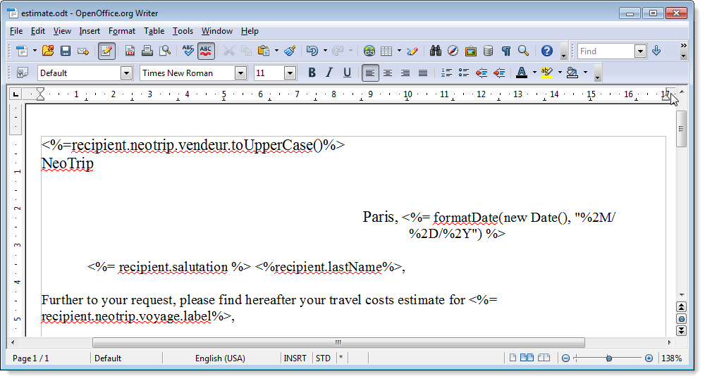
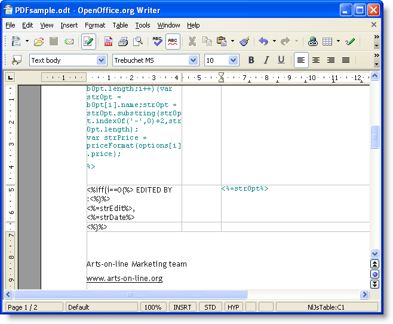
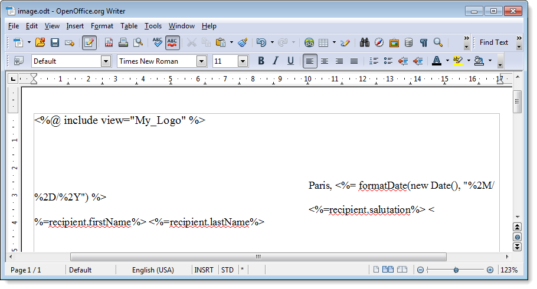

# Generación de documentos PDF personalizados{#generating-personalized-pdf-documents}

## Acerca de los documentos PDF variables {#about-variable-pdf-documents}

Adobe Campaign permite generar documentos PDF variables para archivos adjuntos de correo electrónico a partir de documentos de LibreOffice o Microsoft Word.

Se admiten las siguientes extensiones: “.docx”, “.doc” y “.odt”.

Para personalizar los documentos, se encuentran disponibles las mismas funcionalidades de JavaScript que para la personalización del correo electrónico.

Debe activar la opción **[!UICONTROL "The content of the file is personalized and converted to PDF during the delivery of each message"]**. Esta opción está accesible al adjuntar el archivo al correo electrónico de entrega. Para obtener más información sobre cómo adjuntar un archivo calculado, consulte la [Documentación de la versión 8 de Campaign](https://experienceleague.adobe.com/docs/campaign/campaign-v8/send/emails/attaching-files.html?lang=es){target="_blank"}.

Ejemplo de personalización de encabezado de factura:



Para generar tablas dinámicas o incluir imágenes a través de una URL, se debe seguir un proceso específico.

## Generación de tablas dinámicas {#generating-dynamic-tables}

El procedimiento para generar tablas dinámicas es el siguiente:

* Cree una tabla con tres líneas y tantas columnas como sea necesario y, a continuación, configure su diseño (bordes, etc.).
* Sitúe el cursor en la tabla y haga clic en el menú **[!UICONTROL Table > Table properties]**. Vaya a la pestaña **[!UICONTROL Table]** e introduzca un nombre que comience por **NlJsTable**.
* En la primera celda de la primera línea, defina un bucle (“for”, por ejemplo) que permita la iteración en los valores que desea mostrar en la tabla.
* En cada celda de la segunda línea de la tabla, inserte secuencias de comandos que devuelvan los valores que desea mostrar.
* Cierre el bucle en la tercera y en la última línea de la tabla.

  Ejemplo de definición de tabla dinámica:

  

## Inserción de imágenes externas {#inserting-external-images}

La inserción de imágenes externas resulta útil si, por ejemplo, se desea personalizar un documento con una imagen cuya URL se introduce en un campo del destinatario.

Para ello, se debe configurar un bloque personalizado y, a continuación, incluir una llamada al bloque personalizado en el archivo adjunto.

**Ejemplo: inserción de un logotipo personalizado según el país del destinatario**

**Paso 1: Creación del archivo adjunto:**

* Inserte la llamada al bloque de personalización: **&lt;%@ include view=&quot;blockname&quot; %>**.
* Inserte el contenido (personalizado o no) en el cuerpo del archivo.



**Paso 2: Creación del bloque personalizado:**

* Vaya al menú **[!UICONTROL Resources > Campaign management > Personalization blocks]** de la consola de Adobe Campaign.
* Cree un nuevo bloque personalizado llamado “My Logo” con “My_Logo” como nombre interno.
* Haga clic en el vínculo **[!UICONTROL Advanced parameters...]** y luego marque la opción **[!UICONTROL "The content of the block is included in an attachment"]**. Esto permite copiar la definición del bloque personalizado directamente en el contenido del archivo de OpenOffice.

  

  Se deben diferenciar dos tipos de declaraciones dentro del bloque personalizado:

   * El código de Adobe Campaign de los campos personalizados, en los que las comillas angulares de “apertura” y “cierre” se deben reemplazar por caracteres de escape (`&lt;` y `&gt;` respectivamente).
   * Todo el código XML de OpenOffice se copia en el documento de OpenOffice.

En el ejemplo, el bloque personalizado tiene este aspecto:

```
<% if (recipient.country.label == "Germany") { %>
<draw:frame svg:width="4cm" svg:height="3cm">
<draw:image xlink:href=https://..../logo_germany.png />
</draw:frame>
<% } else
if (recipient.country.label == "USA")
{ %>
<draw:frame svg:width="4cm" svg:height="3cm">
<draw:image xlink:href=https://..../logo_USA.png />
</draw:frame>
<% } %>
```

Según el país del destinatario, la personalización se puede ver en el documento vinculado a la entrega:


