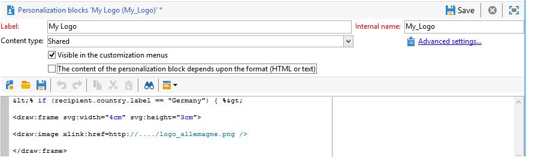

<?xml version="1.0" encoding="UTF-8"?>
<xliff xmlns="urn:oasis:names:tc:xliff:document:1.2" xmlns:okp="okapi-framework:xliff-extensions" xmlns:its="http://www.w3.org/2005/11/its" xmlns:itsxlf="http://www.w3.org/ns/its-xliff/" version="1.2" its:version="2.0">
<file original="help/delivery/using/generating-personalized-pdf-documents.md.mdnouisc" source-language="en-US" target-language="en-XX" datatype="x-text/markdown">
<body>
<trans-unit id="tu11" xml:space="preserve">
<source xml:lang="en-US">https://experienceleague.adobe.com/docs/campaign/campaign-v8/send/emails/attaching-files.html?lang=es</source>
<target xml:lang="en-XX">https://experienceleague.adobe.com/docs/campaign/campaign-v8/send/emails/attaching-files.html?lang=es</target>
</trans-unit>
<trans-unit id="tu27" xml:space="preserve">
<source xml:lang="en-US">https://experienceleague.adobe.com/es/docs/control-panel/using/instances-settings/url-permissions</source>
<target xml:lang="en-XX">https://experienceleague.adobe.com/es/docs/control-panel/using/instances-settings/url-permissions</target>
</trans-unit>
<trans-unit id="tu1" restype="x-YAML_METADATA_HEADER_VALUE" xml:space="preserve">
<source xml:lang="en-US">Generate personalized PDF documents</source>
<target xml:lang="en-XX">Generación de documentos PDF personalizados</target>
</trans-unit>
<trans-unit id="tu2" restype="x-YAML_METADATA_HEADER_VALUE" xml:space="preserve">
<source xml:lang="en-US">Learn how to generate personalized PDF documents</source>
<target xml:lang="en-XX">Obtenga información sobre cómo generar documentos PDF personalizados</target>
</trans-unit>
<trans-unit id="tu3" xml:space="preserve">
<source xml:lang="en-US">Also applies to v8</source>
<target xml:lang="en-XX">También se aplica a v8</target>
</trans-unit>
<trans-unit id="tu4" xml:space="preserve">
<source xml:lang="en-US">Also applies to Campaign v8</source>
<target xml:lang="en-XX">También se aplica a Campaign v8</target>
</trans-unit>
<trans-unit id="tu5" xml:space="preserve">
<source xml:lang="en-US">Generate personalized PDF documents</source>
<target xml:lang="en-XX">Generación de documentos PDF personalizados</target>
</trans-unit>
<trans-unit id="tu6" xml:space="preserve">
<source xml:lang="en-US">About variable PDF documents</source>
<target xml:lang="en-XX">Acerca de los documentos PDF variables</target>
</trans-unit>
<trans-unit id="tu7" xml:space="preserve">
<source xml:lang="en-US">Adobe Campaign lets you generate variable PDF documents for email attachments from LibreOffice or Microsoft Word documents.</source>
<target xml:lang="en-XX">Adobe Campaign permite generar documentos PDF variables para archivos adjuntos de correo electrónico a partir de documentos de LibreOffice o Microsoft Word.</target>
</trans-unit>
<trans-unit id="tu8" xml:space="preserve">
<source xml:lang="en-US">The following extensions are supported: ".docx", ".doc", and ".odt".</source>
<target xml:lang="en-XX">Se admiten las siguientes extensiones: “.docx”, “.doc” y “.odt”.</target>
</trans-unit>
<trans-unit id="tu9" xml:space="preserve">
<source xml:lang="en-US">To personalize your documents, the same JavaScript functionalities as for email personalization are available.</source>
<target xml:lang="en-XX">Para personalizar los documentos, se encuentran disponibles las mismas funcionalidades de JavaScript que para la personalización del correo electrónico.</target>
</trans-unit>
<trans-unit id="tu10" xml:space="preserve">
<source xml:lang="en-US">You need to activate the <ph id="1" ctype="x-STRONG_EMPHASIS">**[!UICONTROL "The content of the file is personalized and converted to PDF during the delivery of each message"]**</ph> option. This option is accessible when you attach the file to the delivery email. For more on attaching a calculated file, refer the <ph id="4" ctype="x-LINK">&lbrack;</ph>Campaign v8 documentation<ph id="5" ctype="x-LINK">[#$tu11]{target="_blank"}</ph>.</source>
<target xml:lang="en-XX">Debe activar la opción <ph id="1" ctype="x-STRONG_EMPHASIS">**[!UICONTROL "The content of the file is personalized and converted to PDF during the delivery of each message"]**</ph>. Esta opción está accesible al adjuntar el archivo al correo electrónico de entrega. Para obtener más información sobre cómo adjuntar un archivo calculado, consulte la <ph id="4" ctype="x-LINK">&lbrack;</ph>Documentación de la versión 8 de Campaign<ph id="5" ctype="x-LINK">[#$tu11]{target="_blank"}</ph>.</target>
</trans-unit>
<trans-unit id="tu12" xml:space="preserve">
<source xml:lang="en-US">Example of an invoice header personalization:</source>
<target xml:lang="en-XX">Ejemplo de personalización de encabezado de factura:</target>
</trans-unit>
<trans-unit id="tu13" xml:space="preserve">
<source xml:lang="en-US"><ph id="1" ctype="x-IMAGE"></ph></source>
<target xml:lang="en-XX"><ph id="1" ctype="x-IMAGE"></ph></target>
</trans-unit>
<trans-unit id="tu14" xml:space="preserve">
<source xml:lang="en-US">To generate dynamic tables or include images via a URL, you need to follow a specific process.</source>
<target xml:lang="en-XX">Para generar tablas dinámicas o incluir imágenes a través de una URL, se debe seguir un proceso específico.</target>
</trans-unit>
<trans-unit id="tu15" xml:space="preserve">
<source xml:lang="en-US">Generate dynamic tables</source>
<target xml:lang="en-XX">Generación de tablas dinámicas</target>
</trans-unit>
<trans-unit id="tu16" xml:space="preserve">
<source xml:lang="en-US">The procedure for generating dynamic tables is as follows:</source>
<target xml:lang="en-XX">El procedimiento para generar tablas dinámicas es el siguiente:</target>
</trans-unit>
<trans-unit id="tu17" xml:space="preserve">
<source xml:lang="en-US">Create a table with three lines and as many columns as necessary, then configure its layout (borders, etc.).</source>
<target xml:lang="en-XX">Cree una tabla con tres líneas y tantas columnas como sea necesario y, a continuación, configure su diseño (bordes, etc.).</target>
</trans-unit>
<trans-unit id="tu18" xml:space="preserve">
<source xml:lang="en-US">Place your cursor on the table and click the <ph id="1" ctype="x-STRONG_EMPHASIS">**[!UICONTROL Table > Table properties]**</ph> menu. Go to the <ph id="4" ctype="x-STRONG_EMPHASIS">**[!UICONTROL Table]**</ph> tab and enter a name beginning with <ph id="7" ctype="x-STRONG_EMPHASIS">**</ph>NlJsTable<ph id="8" ctype="x-STRONG_EMPHASIS">**</ph>.</source>
<target xml:lang="en-XX">Sitúe el cursor en la tabla y haga clic en el menú <ph id="1" ctype="x-STRONG_EMPHASIS">**[!UICONTROL Table > Table properties]**</ph>. Vaya a la pestaña <ph id="4" ctype="x-STRONG_EMPHASIS">**[!UICONTROL Table]**</ph> e introduzca un nombre que comience por <ph id="7" ctype="x-STRONG_EMPHASIS">**</ph>NlJsTable<ph id="8" ctype="x-STRONG_EMPHASIS">**</ph>.</target>
</trans-unit>
<trans-unit id="tu19" xml:space="preserve">
<source xml:lang="en-US">In the first cell of the first line, define a loop ("for", for example) that enables iteration on the values you want to display in the table.</source>
<target xml:lang="en-XX">En la primera celda de la primera línea, defina un bucle (“for”, por ejemplo) que permita la iteración en los valores que desea mostrar en la tabla.</target>
</trans-unit>
<trans-unit id="tu20" xml:space="preserve">
<source xml:lang="en-US">In each cell of the second line of the table, insert scripts that return the values to display.</source>
<target xml:lang="en-XX">En cada celda de la segunda línea de la tabla, inserte secuencias de comandos que devuelvan los valores que desea mostrar.</target>
</trans-unit>
<trans-unit id="tu21" xml:space="preserve">
<source xml:lang="en-US">Close the loop in the third and last line of the table.</source>
<target xml:lang="en-XX">Cierre el bucle en la tercera y en la última línea de la tabla.</target>
</trans-unit>
<trans-unit id="tu22" xml:space="preserve">
<source xml:lang="en-US">Example of a dynamic table definition:</source>
<target xml:lang="en-XX">Ejemplo de definición de tabla dinámica:</target>
</trans-unit>
<trans-unit id="tu23" xml:space="preserve">
<source xml:lang="en-US"><ph id="1" ctype="x-IMAGE"></ph></source>
<target xml:lang="en-XX"><ph id="1" ctype="x-IMAGE"></ph></target>
</trans-unit>
<trans-unit id="tu24" xml:space="preserve">
<source xml:lang="en-US">Insert external images</source>
<target xml:lang="en-XX">Inserción de imágenes externas</target>
</trans-unit>
<trans-unit id="tu25" xml:space="preserve">
<source xml:lang="en-US"><ph id="1" ctype="x-regxph" equiv-text="&lbrack;!IMPORTANT">[!IMPORTANT]</ph></source>
<target xml:lang="en-XX"><ph id="1" ctype="x-regxph" equiv-text="&lbrack;!IMPORTANT">[!IMPORTANT]</ph></target>
</trans-unit>
<trans-unit id="tu26" xml:space="preserve">
<source xml:lang="en-US">Release 7.4.4 (build 9401) includes an update to the external URL allow list. Make sure the domains used for external images in your attachments are added to your instance's approved allow list so that resources continue to load without interruption. As a Campaign Administrator, use the Control Panel to add and manage allow-listed URLs. See <ph id="1" ctype="x-LINK">&lbrack;</ph>Add URL permissions<ph id="2" ctype="x-LINK">[#$tu27]{target="_blank"}</ph> for steps.</source>
<target xml:lang="en-XX">La versión 7.4.4 (versión 9401) incluye una actualización de la lista de permitidos de URL externas. Asegúrese de que los dominios utilizados para las imágenes externas en los archivos adjuntos se añadan a la lista de permitidos aprobada de la instancia para que los recursos se sigan cargando sin interrupción. Como administrador de Campaign, utilice el Panel de control para añadir y administrar las URL incluidas en la lista de permitidos. Consulte <ph id="1" ctype="x-LINK">&lbrack;</ph>Adición de permisos de URL<ph id="2" ctype="x-LINK">[#$tu27]{target="_blank"}</ph> para conocer los pasos.</target>
</trans-unit>
<trans-unit id="tu28" xml:space="preserve">
<source xml:lang="en-US">The insertion of external images is useful if, for instance, you want to personalize a document with an image whose URL is entered in a field of the recipient.</source>
<target xml:lang="en-XX">La inserción de imágenes externas resulta útil si, por ejemplo, se desea personalizar un documento con una imagen cuya URL se introduce en un campo del destinatario.</target>
</trans-unit>
<trans-unit id="tu29" xml:space="preserve">
<source xml:lang="en-US">To do this, you need to configure a personalization block, then include a call to the personalization block in the attachment.</source>
<target xml:lang="en-XX">Para ello, se debe configurar un bloque personalizado y, a continuación, incluir una llamada al bloque personalizado en el archivo adjunto.</target>
</trans-unit>
<trans-unit id="tu30" xml:space="preserve">
<source xml:lang="en-US"><ph id="1" ctype="x-STRONG_EMPHASIS">**</ph>Example: insert a personalized logo depending on the recipient's country<ph id="2" ctype="x-STRONG_EMPHASIS">**</ph></source>
<target xml:lang="en-XX"><ph id="1" ctype="x-STRONG_EMPHASIS">**</ph>Ejemplo: inserción de un logotipo personalizado según el país del destinatario<ph id="2" ctype="x-STRONG_EMPHASIS">**</ph></target>
</trans-unit>
<trans-unit id="tu31" xml:space="preserve">
<source xml:lang="en-US"><ph id="1" ctype="x-STRONG_EMPHASIS">**</ph>Step 1: create the attachment:<ph id="2" ctype="x-STRONG_EMPHASIS">**</ph></source>
<target xml:lang="en-XX"><ph id="1" ctype="x-STRONG_EMPHASIS">**</ph>Paso 1: Creación del archivo adjunto:<ph id="2" ctype="x-STRONG_EMPHASIS">**</ph></target>
</trans-unit>
<trans-unit id="tu32" xml:space="preserve">
<source xml:lang="en-US">Insert the call to the personalization block: <ph id="1" ctype="x-STRONG_EMPHASIS">**</ph>&lt;%@ include view="blockname" %><ph id="2" ctype="x-STRONG_EMPHASIS">**</ph>.</source>
<target xml:lang="en-XX">Inserte la llamada al bloque de personalización: <ph id="1" ctype="x-STRONG_EMPHASIS">**</ph>&lt;%@ include view="blockname" %><ph id="2" ctype="x-STRONG_EMPHASIS">**</ph>.</target>
</trans-unit>
<trans-unit id="tu33" xml:space="preserve">
<source xml:lang="en-US">Insert your content (personalized or not) into the body of the file.</source>
<target xml:lang="en-XX">Inserte el contenido (personalizado o no) en el cuerpo del archivo.</target>
</trans-unit>
<trans-unit id="tu34" xml:space="preserve">
<source xml:lang="en-US"><ph id="1" ctype="x-IMAGE"></ph></source>
<target xml:lang="en-XX"><ph id="1" ctype="x-IMAGE"></ph></target>
</trans-unit>
<trans-unit id="tu35" xml:space="preserve">
<source xml:lang="en-US"><ph id="1" ctype="x-STRONG_EMPHASIS">**</ph>Step 2: create the personalization block:<ph id="2" ctype="x-STRONG_EMPHASIS">**</ph></source>
<target xml:lang="en-XX"><ph id="1" ctype="x-STRONG_EMPHASIS">**</ph>Paso 2: Creación del bloque personalizado:<ph id="2" ctype="x-STRONG_EMPHASIS">**</ph></target>
</trans-unit>
<trans-unit id="tu36" xml:space="preserve">
<source xml:lang="en-US">Go to the <ph id="1" ctype="x-STRONG_EMPHASIS">**[!UICONTROL Resources > Campaign management > Personalization blocks]**</ph> menu of the Adobe Campaign console.</source>
<target xml:lang="en-XX">Vaya al menú <ph id="1" ctype="x-STRONG_EMPHASIS">**[!UICONTROL Resources > Campaign management > Personalization blocks]**</ph> de la consola de Adobe Campaign.</target>
</trans-unit>
<trans-unit id="tu37" xml:space="preserve">
<source xml:lang="en-US">Create a new "My Logo" personalization block with "My_Logo" as an internal name.</source>
<target xml:lang="en-XX">Cree un nuevo bloque personalizado llamado “My Logo” con “My_Logo” como nombre interno.</target>
</trans-unit>
<trans-unit id="tu38" xml:space="preserve">
<source xml:lang="en-US">Click on the <ph id="1" ctype="x-STRONG_EMPHASIS">**[!UICONTROL Advanced parameters...]**</ph> link then check the <ph id="4" ctype="x-STRONG_EMPHASIS">**[!UICONTROL "The content of the block is included in an attachment"]**</ph> option. This lets you copy the definition of the personalization block directly into the content of the OpenOffice file.</source>
<target xml:lang="en-XX">Haga clic en el vínculo <ph id="1" ctype="x-STRONG_EMPHASIS">**[!UICONTROL Advanced parameters...]**</ph> y luego marque la opción <ph id="4" ctype="x-STRONG_EMPHASIS">**[!UICONTROL "The content of the block is included in an attachment"]**</ph>. Esto permite copiar la definición del bloque personalizado directamente en el contenido del archivo de OpenOffice.</target>
</trans-unit>
<trans-unit id="tu39" xml:space="preserve">
<source xml:lang="en-US"><ph id="1" ctype="x-IMAGE"></ph></source>
<target xml:lang="en-XX"><ph id="1" ctype="x-IMAGE"></ph></target>
</trans-unit>
<trans-unit id="tu40" xml:space="preserve">
<source xml:lang="en-US">You need to differentiate two types of declarations within the personalization block:</source>
<target xml:lang="en-XX">Se deben diferenciar dos tipos de declaraciones dentro del bloque personalizado:</target>
</trans-unit>
<trans-unit id="tu41" xml:space="preserve">
<source xml:lang="en-US">The Adobe Campaign code of the personalization fields for which the "open" and "closed" chevrons must be replaced with escape characters (respectively <ph id="1" ctype="x-CODE">`&amp;lt;`</ph> and <ph id="2" ctype="x-CODE">`&amp;gt;`</ph>).</source>
<target xml:lang="en-XX">El código de Adobe Campaign de los campos personalizados, en los que las comillas angulares de “apertura” y “cierre” se deben reemplazar por caracteres de escape (<ph id="1" ctype="x-CODE">`&amp;lt;`</ph> y <ph id="2" ctype="x-CODE">`&amp;gt;`</ph> respectivamente).</target>
</trans-unit>
<trans-unit id="tu42" xml:space="preserve">
<source xml:lang="en-US">The entire OpenOffice XML code will be copied into the OpenOffice document.</source>
<target xml:lang="en-XX">Todo el código XML de OpenOffice se copia en el documento de OpenOffice.</target>
</trans-unit>
<trans-unit id="tu43" xml:space="preserve">
<source xml:lang="en-US">In the example, the personalization block looks like this:</source>
<target xml:lang="en-XX">En el ejemplo, el bloque personalizado tiene este aspecto:</target>
</trans-unit>
<trans-unit id="tu44" xml:space="preserve">
<source xml:lang="en-US">Depending on the recipient's country, personalization is visible in the document linked to the delivery:</source>
<target xml:lang="en-XX">Según el país del destinatario, la personalización se puede ver en el documento vinculado a la entrega:</target>
</trans-unit>
<trans-unit id="tu45" xml:space="preserve">
<source xml:lang="en-US"><ph id="1" ctype="x-IMAGE"></ph></source>
<target xml:lang="en-XX"><ph id="1" ctype="x-IMAGE"></ph></target>
</trans-unit>
</body>
</file>
</xliff>