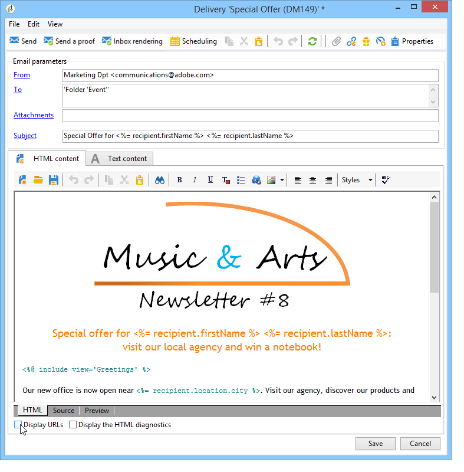

# Configuración de los vínculos rastreados{#how-to-configure-tracked-links}

Para cada entrega, puede hacer un seguimiento de la recepción de mensajes y la activación de los vínculos insertados en el contenido del mensaje. Esto permite hacer un seguimiento del comportamiento de los destinatarios haciendo un seguimiento de las acciones de entrega para las que se segmentaron.

>[!NOTE]
>
>El seguimiento se aplica a los mensajes, pero el seguimiento web permite controlar cómo los destinatarios navegan por un sitio web (páginas visitadas, compras).
>
>La configuración del seguimiento web se presenta en [esta sección](../../configuration/using/about-web-tracking.md).

El seguimiento de mensajes está activado de forma predeterminada. Para personalizar cómo se realiza el seguimiento de las direcciones URL, siga los pasos a continuación:

1. Seleccione la opción **[!UICONTROL Display URLs]** en la sección inferior del asistente de envíos, bajo el contenido del mensaje.

   

   Al seleccionar una dirección URL de la lista de direcciones URL rastreadas, se resalta en el contenido de la entrega, excepto en el vínculo en la página espejo y el vínculo de cancelación de la suscripción que se proporciona de forma predeterminada.

   

1. Seleccione si desea activar o no el seguimiento para cada URL del mensaje.

   >[!IMPORTANT]
   >
   >Cuando la dirección URL del vínculo se utiliza como etiqueta, se recomienda desactivar el seguimiento para evitar riesgos de bloqueo por suplantación de identidad.
   >
   >Por ejemplo, si la dirección URL de www.adobe.com se inserta en el mensaje y el seguimiento está activado, el contenido del vínculo de hipertexto se modifica a https://nlt.adobe.net/r/?id=xxxxxx. Esto significa que los clientes del mensaje de destinatario podrían considerarse fraudulentos.

1. Si es necesario, cambie la etiqueta del seguimiento, haga doble clic en la etiqueta e introduzca una nueva.

   >[!NOTE]
   >
   >Las etiquetas de las direcciones URL rastreadas y las etiquetas se pueden modificar para simplificar la lectura de la información al rastrear las entregas. Se añaden dos direcciones URL o dos etiquetas con el mismo nombre al calcular el recuento de clics.

1. Si es necesario, cambie el modo de seguimiento y seleccione un nuevo modo en la columna **[!UICONTROL Tracking]** que coincida con el vínculo de destino, como se muestra a continuación:

   

   Para cada URL individual, puede definir el modo de seguimiento en uno de estos valores:

   * **[!UICONTROL Enabled]**: activa el seguimiento en esta dirección URL.
   * **[!UICONTROL Not tracked]**: desactiva el seguimiento en esta dirección URL.
   * **[!UICONTROL Always enabled]**: siempre activa el seguimiento de esta dirección URL. Esta información se guarda de manera que la próxima vez, si la URL aparece de nuevo en el contenido de un mensaje futuro, el seguimiento se activa automáticamente.
   * **[!UICONTROL Never tracked]**: nunca activa el seguimiento de esta dirección URL. Esta información se guarda de manera que la próxima vez, si la URL aparece de nuevo en un mensaje futuro, su seguimiento se desactiva automáticamente.
   * **[!UICONTROL Opt-out]**: considera esta URL como una URL de exclusión o de baja.
   * **[!UICONTROL Mirror page]**: considera esta URL como una URL de página espejo.

1. Además, puede seleccionar una categoría para cada URL rastreada en la lista desplegable de la columna **[!UICONTROL Category]**. Estas categorías pueden mostrarse en los informes, como en **[!UICONTROL URLs and click streams]** (consulte [esta sección](../../reporting/using/reports-on-deliveries.md#urls-and-click-streams)). Las categorías se definen en una lista desglosada específica: **[!UICONTROL urlCategory]** (consulte [Administración de enumeraciones](../../platform/using/managing-enumerations.md)).
