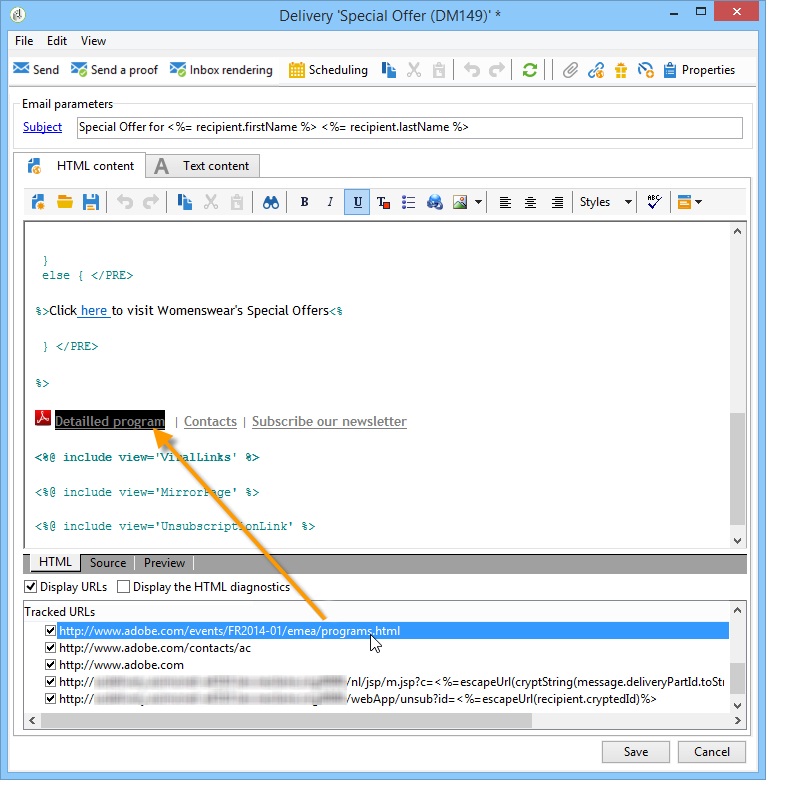

# Configuración de los enlaces rastreados{#how-to-configure-tracked-links}

Para cada entrega, puede hacer un seguimiento de la recepción de mensajes y la activación de los vínculos insertados en el contenido del mensaje. Esto permite hacer un seguimiento del comportamiento de los destinatarios haciendo un seguimiento de las acciones de entrega para las que se segmentaron.

>[!NOTE]
>
>El seguimiento se aplica a los mensajes, pero el seguimiento web permite controlar cómo los destinatarios navegan por un sitio web (páginas visitadas, compras).
>
>La configuración del seguimiento web se presenta en [esta sección](../../configuration/using/about-web-tracking.md).

El seguimiento de mensajes está activado de forma predeterminada. Para personalizar cómo se realiza el seguimiento de las direcciones URL, siga los pasos a continuación:

1. Select the **[!UICONTROL Display URLs]** option in the lower section of the delivery wizard, under the message content.

   

   Al seleccionar una dirección URL de la lista de direcciones URL rastreadas, se resalta en el contenido del envío, excepto en el enlace en la página espejo y el enlace de cancelación de la suscripción que se proporciona de forma predeterminada.

   

1. Seleccione si desea activar o no el seguimiento para cada URL del mensaje.

   >[!CAUTION]
   >
   >Cuando la dirección URL del enlace se utiliza como etiqueta, se recomienda desactivar el seguimiento para evitar riesgos de bloqueo por suplantación de identidad.
   >
   >Por ejemplo, si la dirección URL de www.adobe.com se inserta en el mensaje y el seguimiento está activado, el contenido del enlace de hipertexto se modifica a https://nlt.adobe.net/r/?id=xxxxxx. Esto significa que los clientes del mensaje de destinatario podrían considerarse fraudulentos.

1. Si es necesario, cambie la etiqueta del seguimiento, haga doble clic en la etiqueta e introduzca una nueva.

   >[!NOTE]
   >
   >Las etiquetas de las direcciones URL rastreadas y las etiquetas se pueden modificar para simplificar la lectura de la información al rastrear los envíos. Se añaden dos direcciones URL o dos etiquetas con el mismo nombre al calcular el recuento de clics.

1. If needed, change the tracking mode, select a new mode in the **[!UICONTROL Tracking]** column which matches the targeted link, as shown below:

   

   Para cada URL individual, puede definir el modo de seguimiento en uno de estos valores:

   * **[!UICONTROL Enabled]** :: activa el seguimiento en esta dirección URL.
   * **[!UICONTROL Not tracked]** :: desactiv el seguimiento de fechas en esta dirección URL.
   * **[!UICONTROL Always enabled]** :: siempre activa el seguimiento de esta dirección URL. Esta información se guarda de manera que la próxima vez, si la URL aparece de nuevo en el contenido de un mensaje futuro, el seguimiento se activa automáticamente.
   * **[!UICONTROL Never tracked]** :: nunca activa el seguimiento de esta dirección URL. Esta información se guarda de manera que la próxima vez, si la URL aparece de nuevo en un mensaje futuro, su seguimiento se desactiva automáticamente.
   * **[!UICONTROL Opt-out]** :: considera esta URL como una URL de exclusión o de cancelación de suscripción.
   * **[!UICONTROL Mirror page]** :: considera que esta URL es una URL de página reflejada.

1. In addition, you can select a category for each tracked URL in the drop-down list of the **[!UICONTROL Category]** column. These categories can be displayed reports, as for example in **[!UICONTROL URLs and click streams]** (see [this section](../../reporting/using/reports-on-deliveries.md#urls-and-click-streams)). Las categorías se definen en una enumeración específica: **[!UICONTROL urlCategory]** (consulte [Administración de enumeraciones](../../platform/using/managing-enumerations.md)).
