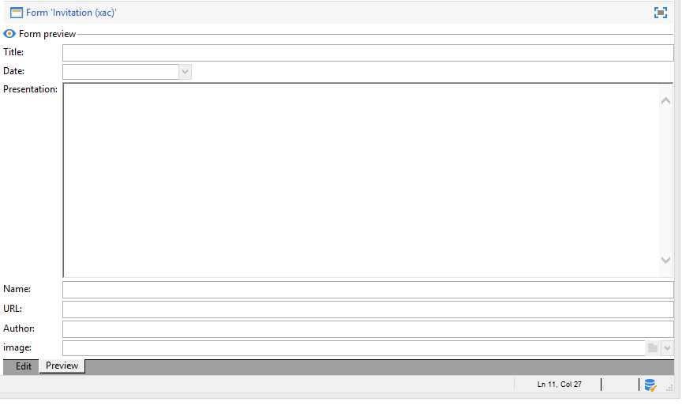

# Formularios de entrada{#input-forms}

A continuación, se muestran algunos principios generales relacionados con el uso de formularios de entrada en Adobe Campaign.

Los formularios se describen en [esta sección](../../configuration/using/identifying-a-form.md).

## Estructura del formulario {#form-structure}

El documento XML de un formulario de entrada debe contener el elemento raíz **`<form>`** con los atributos **name** y **namespace** para rellenar, respectivamente, el nombre del formulario y su área de nombres.

```
<form name="form_name" namespace="name_space">
...
</form>
```

De forma predeterminada, un formulario está asociado al esquema de datos con el mismo nombre y área de nombres. Para asociar un formulario con otro nombre, introduzca la clave de esquema en el atributo **entity-schema** del elemento **`<form>`**.

Para mostrar la estructura de un formulario de entrada, se describe una interfaz basada en el ejemplo de esquema “cus:book”:


Este es el formulario de entrada correspondiente:

```
<form name="book" namespace="cus" type="contentForm">
  <input xpath="@name"/>
  <input xpath="@date"/>
  <input xpath="@language"/>
</form>
```

La descripción de los elementos de edición comienza con el elemento raíz **`<form>`**.

Se introduce un control de edición en el elemento **`<input>`** con el atributo **xpath** que contiene la ruta de acceso al esquema.

**Aviso sobre la sintaxis XPath:**

El lenguaje XPath se utiliza en Adobe Campaign para hacer referencia a un elemento o atributo perteneciente a un esquema de datos.

XPath es una sintaxis que permite localizar un nodo en el árbol de un documento XML.

Los elementos se designan por su nombre y los atributos se designan por el nombre precedido del carácter “@”.

Ejemplos:

* **@date**: selecciona el atributo con el nombre “date”.
* **/@title**`<chapter>`: selecciona el atributo “title” en el elemento
* **../@date**: selecciona la fecha del elemento principal del elemento actual.

El control de edición se adapta automáticamente al tipo de datos correspondiente y utiliza la etiqueta definida en el esquema.

De forma predeterminada, cada campo se muestra en una línea y ocupa todo el espacio disponible, en función del tipo de datos.

>[!CAUTION]
>
>El formulario de entrada debe hacer referencia a un atributo **type=&quot;contentForm&quot;** en el elemento **`<form>`** para añadir automáticamente el marco necesario para introducir el contenido.

## Formato {#formatting}

La disposición de unos controles en relación con los demás se parece a la disposición utilizada en las tablas HTML, con la posibilidad de dividir un control en varias columnas, de entrelazar elementos o de especificar la ocupación del espacio disponible. No obstante, tenga en cuenta que el formato solo autoriza para distribuir proporciones; no puede especificar dimensiones fijas para un objeto.

Para obtener más información, consulte [esta sección](../../configuration/using/form-structure.md#formatting).

## Controles de tipo lista {#list-type-controls}

Para editar un elemento de colección, debe utilizar un control de tipo lista.

### Lista de columnas {#column-list}

Este control muestra una lista de columnas editable con una barra de herramientas que contiene los botones Añadir y Eliminar.


```
<input xpath="chapter" type="list">
  <input xpath="@name"/>
  <input xpath="@number"/>
</input>
```

El control de lista debe rellenarse con el atributo **type=&quot;list&quot;** y la ruta de la lista debe hacer referencia al elemento de colección.

Las columnas se declaran mediante los elementos secundarios **`<input>`** de la lista.

>[!NOTE]
>
>Las flechas de ordenación hacia arriba y hacia abajo se agregan automáticamente cuando se completa el atributo **ordered=&quot;true&quot;** para el elemento de colección en el esquema de datos.

De forma predeterminada, los botones de la barra de herramientas se alinean verticalmente. También pueden alinearse horizontalmente:


```
<input nolabel="true" toolbarCaption="List of chapters" type="list" xpath="chapter">
  <input xpath="@name"/>
  <input xpath="@number"/>
</input>
```

El atributo **toolbarCaption** fuerza la alineación horizontal de la barra de herramientas y rellena el título sobre la lista.

>[!NOTE]
>
>Para que la etiqueta de elemento de colección no se muestre a la izquierda del control, agregue el atributo **nolabel=&quot;true&quot;**.

#### Ampliar una lista {#zoom-in-a-list}

Los datos de la lista se pueden insertar y editar en un formulario de edición por separado.

La edición de formularios dentro de listas se utiliza en los siguientes casos:

* para facilitar la entrada de información,
* presencia de un control de varias líneas,
* las columnas de la lista contienen solo los campos principales y el formulario muestra todos los campos del elemento de colección.


```
<input nolabel="true" toolbarCaption="List of chapters" type="list" xpath="chapter" zoom="true" zoomOnAdd="true">
  <input xpath="@name"/>
  <input xpath="@number"/>

  <form colcount="2" label="Editing a chapter">
    <input xpath="@name"/>
    <input xpath="@number"/>
    <input colspan="2" xpath="page"/>
  </form>
</input>
```

La definición del formulario de edición se especifica mediante el elemento **`<form>`** debajo del elemento de lista. Su estructura es idéntica a la estructura de un formulario de entrada.

Se añade automáticamente un botón **[!UICONTROL Detail]** cuando se introduce el atributo **zoom=&quot;true&quot;** en la definición de la lista. Esto permite abrir el formulario de edición en la línea seleccionada.

>[!NOTE]
>
>Si se añade el atributo **zoomOnAdd=&quot;true&quot;**, este obliga a insertar un elemento de la lista en el formulario de edición.

### Lista de pestañas {#tab-list}

Esta lista presenta la edición de los elementos de colección en forma de pestañas.


```
<container toolbarCaption="List of chapters" type="notebooklist" xpath="chapter" xpath-label="@name">
  <container colcount="2">
    <input xpath="@name"/>
    <input xpath="@number"/>
    <input colspan="2" xpath="page"/>
  </container>
</container>
```

El control de lista debe rellenarse con el atributo **type=&quot;notebooklist&quot;** y la ruta de la lista debe hacer referencia al elemento de colección.

El título de la pestaña contiene el valor de los datos introducidos mediante el atributo **xpath-label**.

Los controles de edición deben declararse en un elemento **`<container>`** que sea un elemento secundario al control de lista.

Utilice los botones de la barra de herramientas para añadir o eliminar elementos de la lista.

>[!NOTE]
>
>Las flechas de orden a la izquierda y derecha se añaden automáticamente cuando el atributo **ordered=&quot;true&quot;** se rellena para el elemento de recolección en el esquema de datos.

## Contenedores {#containers}

Los contenedores permiten agrupar un conjunto de controles. Se utilizan a través del elemento **`<container>`**. Ya se han utilizado para dar formato a los controles en varias columnas y para el control de la lista de pestañas.

Para obtener más información sobre los contenedores y cómo utilizarlos en los formularios de entrada, consulte [esta sección](../../configuration/using/form-structure.md#containers).

## Edición de formularios {#editing-forms}

La zona de edición permite introducir el contenido XML del formulario de entrada:


La pestaña **[!UICONTROL Preview]** le permite ver el formulario de entrada:


