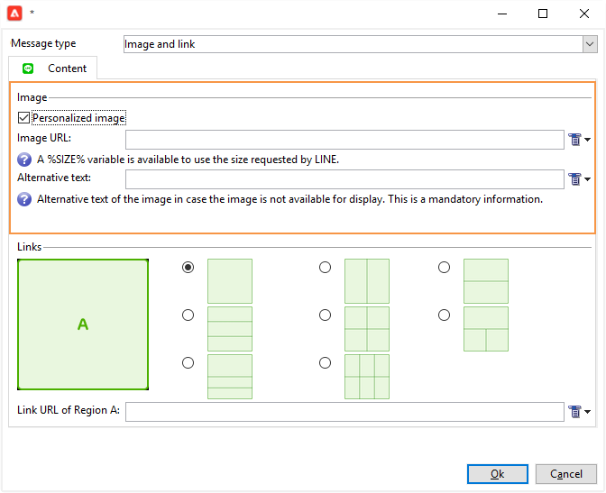

# Creación de entregas LINE{#line-channel}

LINE es una aplicación gratuita de mensajería instantánea, llamadas de voz y vídeo, disponible en todos los teléfonos inteligentes (iPhone, Android, Windows Phone, Blackberry, Nokia) y PC. Adobe Campaign le permite enviar mensajes por LINE.

LINE solo está disponible para instalaciones de servicios locales o gestionados.

LINE también se puede combinar con el módulo de mensajes de transacción para enviar mensajes en tiempo real en la aplicación LINE instalada en los dispositivos móviles de los consumidores. Para obtener más información, consulte [esta página](../../message-center/using/transactional-messaging-architecture.md#transactional-messaging-and-line).

Las secciones a continuación proporcionan información específica del canal LINE. Para obtener más información sobre la creación de entregas, consulte [esta sección](../../delivery/using/steps-about-delivery-creation-steps.md).

Los pasos para utilizar el canal LINE son los siguientes:

1. Creación de envíos
1. Configuración del contenido del mensaje.
1. Selección de la población objetivo
1. Envío de mensajes
1. Monitorización de la entrega (seguimiento, cuarentena, informes, etc.).

## Configuración del canal LINE {#setting-up-line-channel}

### Creación de una cuenta de LINE y una cuenta externa {#creating-a-line-account-and-an-external-account-}

>[!NOTE]
>
>Antes de crear una cuenta de LINE y una cuenta externa, primero debe instalar el paquete de LINE en su instancia. Para obtener más información, consulte la sección [LINE](../../installation/using/installing-campaign-standard-packages.md#line-package) en la guía de instalación.

Primero debe crear una cuenta LINE para poder vincularla a Adobe Campaign. A continuación, puede enviar mensajes a través de LINE a los usuarios que hayan añadido su cuenta de LINE a su aplicación móvil. Solamente el administrador funcional de la plataforma puede administrar las cuentas externas y la cuenta de LINE.

Para crear y configurar una cuenta de LINE, consulte [https://developers.line.me/](https://developers.line.me/).

Para crear y configurar un servicio LINE, consulte [Administración de suscripciones](../../delivery/using/managing-subscriptions.md).

Por último, para crear una cuenta externa en Adobe Campaign:

1. En la estructura de árbol **Administración**, **Plataforma**, haga clic en la pestaña **Cuentas externas**.
1. A continuación, haga clic en el icono **Nueva**.

   

1. Rellene los campos **Etiqueta** y **Nombre interno**.
1. En el campo **[!UICONTROL Type]**, seleccione Routing y en el campo **Channel**, seleccione LINE.
1. Haga clic en **[!UICONTROL Save]** para crear su cuenta externa de LINE.
1. Un campo personalizado **LINE** aparece bajo el icono **General**, rellene los campos siguientes:

   

   * **Channel Alias**: se proporciona a través de su cuenta LINE en la pestaña **[!UICONTROL Channels]** > **[!UICONTROL Technical configuration]** .
   * **ID de canal**: se proporciona a través de su cuenta LINE en la pestaña **Canales**, **Panel de información básica**.
   * **Clave secreta del canal**: se proporciona a través de su cuenta LINE en la pestaña **Canales**, **Panel de información básica**.
   * **Access token**: se proporciona a través de su cuenta LINE en el portal del desarrollador o haciendo clic en el botón **[!UICONTROL Get access token]**.
   * **Fecha de caducidad del token de acceso**: permite especificar la fecha de caducidad del token de acceso.
   * **Servicio de suscripción LINE**: permite especificar los servicios a los que se suscriben los usuarios.

>[!NOTE]
>
>Debe comprobar que se han iniciado los flujos de trabajo **[!UICONTROL LINE access token update (updateLineAccessToken)]** y **[!UICONTROL Delete blocked LINE users (deleteBlockedLineUsers)]**. Desde el navegador, haga clic en **[!UICONTROL Administration > Production > Technical workflows > LINE workflows]** para comprobar el estado de los flujos de trabajo.

## Creación de la entrega {#creating-the-delivery}

Para crear una entrega de **LINE**, debe seguir estos pasos:

>[!NOTE]
>
>En [esta sección](../../delivery/using/steps-about-delivery-creation-steps.md) se exponen conceptos globales sobre la creación de envíos.

1. En la pestaña **[!UICONTROL Campaigns]**, seleccione **[!UICONTROL Deliveries]** y haga clic en el botón **[!UICONTROL Create]**.
1. En la ventana que aparece, seleccione la plantilla de entrega **[!UICONTROL LINE V2 delivery]**

   

1. Identifique su entrega con una etiqueta, un código y una descripción. Para obtener más información, consulte [esta sección](../../delivery/using/steps-create-and-identify-the-delivery.md#identifying-the-delivery).
1. Haga clic en **[!UICONTROL Continue]** para crear su entrega.

## Definición del contenido {#defining-the-content}

Para definir el contenido de una entrega LINE, primero debe añadir el tipo de mensaje a la entrega. Cada entrega LINE puede contener hasta 5 mensajes.

Puede elegir entre dos tipos de mensaje:

* Mensaje de texto
* Imagen y vínculo

### Configuración de una entrega de mensaje de texto {#configuring-a-text-message-delivery}

Una entrega de un **mensaje de texto** de LINE es un mensaje enviado a los destinatarios en forma de texto.

La configuración de este tipo de mensaje es similar a la configuración del **texto** de un mensaje de correo electrónico. Para obtener más información, consulte esta [página](../../delivery/using/defining-the-email-content.md#message-content).

### Configuración de una entrega de imagen y vínculo {#configuring-an-image-and-link-delivery}

Una entrega de **imagen y vínculo** de LINE es un mensaje enviado a los destinatarios en forma de imagen que puede contener una URL o varias.

Puede utilizar:

* una **imagen personalizada**,

   >[!NOTE]
   >
   >Puede utilizar la variable **%SIZE%**: esta variable permite optimizar la visualización de la imagen según el tamaño de pantalla del dispositivo móvil del destinatario.

   

* una **URL con imagen**,

   

   Las direcciones URL con imágenes permiten utilizar distintas resoluciones de imagen para optimizar la visibilidad de la entrega en dispositivos móviles. Solo se admiten imágenes con la misma altura y anchura.

   Las imágenes se pueden definir en función del tamaño de la pantalla:

   * 1040px
   * 700px
   * 460px
   * 300px
   * 240px

   >[!NOTE]
   >
   >El tamaño de 1040 x 1040 píxeles es obligatorio para cada imagen de LINE con vínculo.

   A continuación, debe añadir el texto alternativo que aparece en el dispositivo móvil del destinatario.

* y **[!UICONTROL Links]**.

   

   La sección **[!UICONTROL Links]** le permite elegir entre diferentes diseños que dividen la imagen en varias regiones en las que se puede hacer clic. A continuación, puede asignar a cada una de ellas un vínculo dedicado.

>[!NOTE]
>
>La sintaxis &lt;%@ include option=&#39;NmsServer_URL&#39; %>/webApp/APP3?id=&lt;%=escapeUrl(cryptString(visitor.id))%> permite incluir un vínculo a una aplicación web en un mensaje de LINE.

### Recomendaciones {#recommendations}

* Cuando realice una entrega de LINE a un nuevo destinatario por primera vez, debe añadir a la entrega el mensaje oficial de LINE sobre las condiciones de uso y el consentimiento. El mensaje oficial está disponible en el siguiente vínculo: [https://terms.line.me/OA_privacy/](https://terms.line.me/OA_privacy/sp?lang=fr).

## Selección de la población objetivo {#selecting-the-target-population}

La selección de los destinatarios de una entrega LINE es similar a la definición de los destinatarios de la entrega del correo electrónico. Para obtener más información, consulte [Identificación de poblaciones de destinatarios](../../delivery/using/steps-defining-the-target-population.md).

Se realiza la segmentación de los **visitantes**.

## Envío de mensajes {#sending-messages}

Cuando la entrega se haya creado y configurado correctamente, puede enviarlo al objetivo definido anteriormente.

Realizar envíos de LINE funciona de forma similar a una entrega de correo electrónico. Para obtener más información sobre cómo realizar una entrega, consulte [Envío de mensajes](../../delivery/using/sending-messages.md).

## Acceso a informes {#accessing-reports}

En el explorador, puede ver los informes del servicio LINE haciendo clic en **[!UICONTROL Profiles and Targets > Services and Subscriptions > LINE]**. A continuación, haga clic en el icono **[!UICONTROL Reports]** del servicio LINE.

Para ver los informes sobre los envíos de LINE, haga clic en **[!UICONTROL Campaign Management > Deliveries]** y seleccione la entrega que desee. Los informes de seguimiento indican la tasa de clics. LINE no tiene en cuenta la tasa de apertura.

## Ejemplo: creación y entrega de un mensaje personalizado de LINE {#example--create-and-send-a-personalized-line-message}

En este ejemplo, se crea y configura un mensaje de texto y una imagen que contiene datos que se van a personalizar según el destinatario.

1. En la pestaña **[!UICONTROL Create]**, cree la entrega de LINE haciendo clic en el botón **[!UICONTROL Campaign]**.

   

1. Seleccione la plantilla de entrega **[!UICONTROL LINE V2 delivery]** y asigne un nombre a la entrega.

   

1. En la ventana de configuración de la entrega, seleccione la población objetivo.

   

1. Haga clic en **[!UICONTROL Add]** para crear el mensaje y seleccione **[!UICONTROL Message type]**.

   En primer lugar queremos crear un mensaje de texto.

   

1. Sitúe el cursor en el lugar en el que desee insertar el texto personalizado, haga clic en el icono de lista desplegable y luego seleccione **[!UICONTROL Visitor > First name]**.

   

1. Siga el mismo procedimiento para añadir una imagen: en la lista desplegable de **[!UICONTROL Image and links]**, seleccione **[!UICONTROL Message type]**.

   Añada la URL de imagen.

   

1. En la sección **[!UICONTROL Links]**, seleccione el diseño que debe dividir la imagen en varias regiones en las que se puede hacer clic.
1. Asigne una URL a cada región de la imagen.

   

1. Guarde la entrega y haga clic en **[!UICONTROL Send]** para analizarlo y enviarlo al destinatario.

   La entrega se manda a los destinatarios.

   
