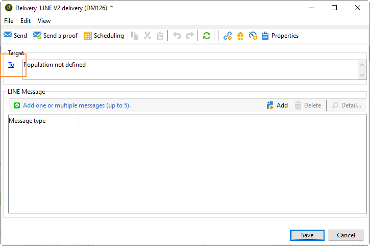

# Creación de entregas LINE{#line-channel}

>[!NOTE]
>
>[!DNL LINE] solo está disponible para instalaciones de servicios locales o gestionados.

[!DNL LINE] es una aplicación gratuita para mensajería instantánea, llamadas de voz y vídeo, disponible en todos los sistemas operativos móviles y en PC.

[!DNL LINE] también se puede combinar con el módulo de mensajes de transacción para enviar mensajes en tiempo real en la aplicación instalada en los dispositivos móviles de los consumidores. [!DNL LINE] Para obtener más información, consulte esta [página](../../message-center/using/transactional-messaging-architecture.md#transactional-messaging-and-line).

Los pasos para utilizar el canal [!DNL LINE] son:

1. [Configuración del canal LINE](#setting-up-line-channel)
1. [Creación de una entrega](#creating-the-delivery)
1. [Configuración del tipo de contenido](#defining-the-content)
1. [Monitorización de la entrega (seguimiento, cuarentena, informes, etc.)](#accessing-reports)

## Configuración del canal LINE {#setting-up-line-channel}

Antes de crear una cuenta [!DNL LINE] y una cuenta externa, primero debe instalar el paquete LINE en su instancia. Para obtener más información, consulte la sección [LINE](../../installation/using/installing-campaign-standard-packages.md#line-package) en la guía de instalación.

Primero debe crear una cuenta [!DNL LINE] para poder vincularla a Adobe Campaign. A continuación, puede enviar mensajes [!DNL LINE] a los usuarios que hayan agregado su cuenta [!DNL LINE] en su aplicación móvil. El administrador funcional de la plataforma solo puede administrar las cuentas externas y la cuenta [!DNL LINE].

Para crear y configurar una cuenta [!DNL LINE], consulte [documentación de desarrolladores de LINE](https://developers.line.me/).

### Crear y configurar el servicio LINE {#configure-line-service}

Para crear su servicio [!DNL LINE]:

1. En la página de inicio de Adobe Campaign Classic, seleccione la pestaña **[!UICONTROL Profiles and Targets]**.

1. En el menú de la izquierda, seleccione **[!UICONTROL Services and Subscriptions]** y haga clic en **[!UICONTROL Create]**.

   

1. Agregue un **[!UICONTROL Label]** y **[!UICONTROL Internal name]** al nuevo servicio.

1. Seleccione **[!UICONTROL LINE]** en la lista desplegable **[!UICONTROL Type]**.

   

1. Haga clic en **[!UICONTROL Save]**.

Para obtener más información sobre suscripciones y servicios, consulte [Administración de suscripciones](managing-subscriptions.md).

### Configuración de la cuenta externa LINE {#configure-line-external}

Después de crear el servicio [!DNL LINE], debe configurar la cuenta externa [!DNL LINE] en Adobe Campaign:

1. En la estructura de árbol **[!UICONTROL Administration]** > **[!UICONTROL Platform]**, haga clic en la pestaña **[!UICONTROL External Accounts]**.

1. Seleccione la cuenta externa **[!UICONTROL LINE V2 routing]** incorporada.

   

1. Haga clic en la pestaña **[!UICONTROL LINE]** de la cuenta externa para comenzar a configurar la cuenta externa. Rellene los campos siguientes:

   

   * **[!UICONTROL Channel Alias]**: se proporciona a través de su  [!DNL LINE] cuenta en la  **[!UICONTROL Channels]** pestaña  **[!UICONTROL Technical configuration]** > .
   * **[!UICONTROL Channel ID]**: se proporciona a través de su  [!DNL LINE] cuenta en la  **[!UICONTROL Channels]** pestaña  **[!UICONTROL Basic Information panel]** > .
   * **[!UICONTROL Channel secret key]**: se proporciona a través de su  [!DNL LINE] cuenta en la  **[!UICONTROL Channels]** pestaña  **[!UICONTROL Basic Information panel]** > .
   * **[!UICONTROL Access token]**[!DNL LINE]: se proporciona a través de su cuenta en el portal del desarrollador o haciendo clic en el botón **[!UICONTROL Get access token]**.
   * **[!UICONTROL Access token expiration date]**: permite especificar la fecha de caducidad del token de acceso.
   * **[!UICONTROL LINE subscription service]**: le permite especificar los servicios a los que se suscribirán los usuarios.

1. Una vez que haya terminado la configuración, haga clic en **[!UICONTROL Save]**.

1. En **[!UICONTROL Explorer]**, seleccione **[!UICONTROL Administration]** > **[!UICONTROL Production]** > **[!UICONTROL Technical workflows]** > **[!UICONTROL LINE workflows]** para comprobar si se han iniciado los flujos de trabajo **[!UICONTROL LINE V2 access token update (updateLineAccessToken)]** y **[!UICONTROL Delete blocked LINE users (deleteBlockedLineUsers)]**.

El [!DNL LINE] ahora está configurado en Adobe Campaign, puede empezar a crear y enviar envíos de LINE a los suscriptores.

## Creación de una entrega LINE {#creating-the-delivery}

>[!NOTE]
>
>Al realizar un envío [!DNL LINE] a un nuevo destinatario por primera vez, se debe añadir el mensaje oficial de LINE relativo a las condiciones de uso y el consentimiento al envío. El mensaje oficial está disponible en el enlace [siguiente](https://terms.line.me/OA_privacy/).

Para crear una entrega de [!DNL LINE], debe seguir estos pasos:

1. En la pestaña **[!UICONTROL Campaigns]**, seleccione **[!UICONTROL Deliveries]** y haga clic en el botón **[!UICONTROL Create]**.

   

1. Seleccione la plantilla de envío **[!UICONTROL LINE V2 delivery]**.

   

1. Identifique su envío con **[!UICONTROL Label]**, **[!UICONTROL Delivery code]** y **[!UICONTROL Description]**. Para obtener más información, consulte [esta sección](steps-create-and-identify-the-delivery.md#identifying-the-delivery).

1. Haga clic en **[!UICONTROL Continue]** para crear su entrega.

1. En el editor de envíos, seleccione **[!UICONTROL To]** para dirigirse a los destinatarios del envío [!DNL LINE]. El establecimiento de destinos se realiza en **[!UICONTROL Visitor subscriptions (nms:visitorSub)]**.

   Para obtener más información, consulte [Identificación de poblaciones de destinatarios](steps-defining-the-target-population.md).

   

1. Haga clic en **[!UICONTROL Add]** para seleccionar su **[!UICONTROL Delivery target population]**.

   

1. Seleccione si desea dirigirse a los [!DNL LINE] suscriptores directamente o si desea dirigirse a los usuarios en función de su [!DNL LINE] suscripción y haga clic en **[!UICONTROL Next]**. En este ejemplo, seleccionamos **[!UICONTROL By LINE V2 subscription]**.

1. Seleccione **[!UICONTROL Line-V2]** en la lista desplegable **[!UICONTROL Folder]** y, a continuación, su servicio [!DNL LINE]. Haga clic en **[!UICONTROL Finish]** y luego en **[!UICONTROL Ok]** para comenzar a personalizar el envío.

   

1. En el editor de envíos, haga clic en **[!UICONTROL Add]** para añadir uno o varios mensajes y seleccione **[!UICONTROL Content type]**.

   Para obtener más información sobre los diferentes **[!UICONTROL Content type]** disponibles, consulte [Definir el tipo de contenido](#defining-the-content).

   

1. Cuando la entrega se haya creado y configurado correctamente, puede enviarlo al objetivo definido anteriormente.

   Para obtener más información sobre cómo realizar un envío, consulte [Enviar mensajes](sending-messages.md).

1. Después de enviar el mensaje, acceda al informe para medir la eficacia de su envío.

   Para obtener más información sobre los informes [!DNL LINE], consulte [Informes de acceso](#accessing-reports).

## Definición del tipo de contenido {#defining-the-content}

Para definir el contenido de un envío [!DNL LINE], primero debe añadir el tipo de mensaje al envío. Cada envío [!DNL LINE] puede contener hasta 5 mensajes.

Puede elegir entre tres tipos de mensajes:

* [Mensaje de texto](#configuring-a-text-message-delivery)
* [Imagen y vínculo](#configuring-an-image-and-link-delivery)
* [Mensaje de vídeo](#configuring-a-video-message-delivery)

### Configuración de una entrega de mensaje de texto {#configuring-a-text-message-delivery}

>[!NOTE]
>
>La sintaxis `<%@ include option='NmsServer_URL' %>/webApp/APP3?id=<%=escapeUrl(cryptString(visitor.id))%>` permite incluir un vínculo a una aplicación web en un mensaje de LINE.

Un envío **[!UICONTROL Text message]** [!DNL LINE] es un mensaje enviado a los destinatarios en forma de texto.

La configuración de este tipo de mensaje es similar a la configuración de **[!UICONTROL Text]** en un mensaje de correo electrónico. Para obtener más información, consulte esta [página](defining-the-email-content.md#message-content).

### Configuración de una entrega de imagen y vínculo {#configuring-an-image-and-link-delivery}

Un envío **[!UICONTROL Image and link]** [!DNL LINE] es un mensaje enviado a los destinatarios en forma de imagen que puede contener una URL o varias.

Puede utilizar:

* a **[!UICONTROL Personalized image]**,

   >[!NOTE]
   >
   >Puede utilizar la variable **%SIZE%** para optimizar la visualización de la imagen según el tamaño de pantalla del dispositivo móvil del destinatario.

   

* un **[!UICONTROL Image URL]** por tamaño de pantalla del dispositivo,

   

   La opción **[!UICONTROL Define images per device screen size]** le permite utilizar distintas resoluciones de imagen para optimizar la visibilidad del envío en dispositivos móviles. Solo se admiten imágenes con la misma altura y anchura.

   Las imágenes se pueden definir en función del tamaño de la pantalla:

   * 1040px
   * 700px
   * 460px
   * 300px
   * 240px

   >[!CAUTION]
   >
   >El tamaño de 1040 x 1040 píxeles es obligatorio para cada imagen de LINE con vínculo.

   A continuación, debe añadir el texto alternativo que aparece en el dispositivo móvil del destinatario.

* y **[!UICONTROL Links]**.

   La sección **[!UICONTROL Links]** le permite elegir entre diferentes diseños que dividen la imagen en varias regiones en las que se puede hacer clic. A continuación, puede asignar a cada uno de ellos un **[!UICONTROL Link URL]** dedicado.

   

### Configuración de una entrega de mensaje de vídeo {#configuring-a-video-message-delivery}

Un envío **[!UICONTROL Video message]** [!DNL LINE] es un mensaje enviado a los destinatarios en forma de vídeo que puede contener una dirección URL.

El campo **[!UICONTROL Preview Image URL]** permite añadir la dirección URL de una imagen de vista previa con un límite de caracteres de 1000. JPEG y PNG son compatibles con un límite de tamaño de archivo de 1 MB.

El campo **[!UICONTROL Video Image URL]** le permite añadir la dirección URL del archivo de vídeo con un límite de caracteres de 1000. Solo se admite el formato mp4 con un límite de tamaño de archivo de 200 MB.

Tenga en cuenta que los vídeos anchos o altos pueden recortarse cuando se reproducen en algunos dispositivos.

## Acceso a informes {#accessing-reports}

Después de realizar el envío, puede ver los informes [!DNL LINE] a través del menú **[!UICONTROL Campaign Management]** > **[!UICONTROL Deliveries]** desde **[!UICONTROL Explorer]**.

>[!NOTE]
>
>Los informes de seguimiento indican la tasa de clics. [!DNL LINE] no tiene en cuenta la tasa de apertura.

Para los [!DNL LINE] informes de servicio, acceda al menú **[!UICONTROL Profiles and Targets]** > **[!UICONTROL Services and Subscriptions]** > **[!UICONTROL LINE-V2]** desde la pestaña **[!UICONTROL Explorer]**. A continuación, haga clic en el icono **[!UICONTROL Reports]** del servicio [!DNL LINE]

## Ejemplo: creación y entrega de un mensaje personalizado de LINE {#example--create-and-send-a-personalized-line-message}

En este ejemplo, se crea y configura un mensaje de texto y una imagen que contiene datos que se van a personalizar según el destinatario.

1. Cree su envío [!DNL LINE] haciendo clic en el botón **[!UICONTROL Create]** de la pestaña **[!UICONTROL Campaign]**.

   

1. Seleccione la plantilla de entrega **[!UICONTROL LINE V2 delivery]** y asigne un nombre a la entrega.

   

1. En la ventana de configuración de la entrega, seleccione la población objetivo.

   Para obtener más información, consulte [Identificación de poblaciones de destinatarios](steps-defining-the-target-population.md).

   

1. Haga clic en **[!UICONTROL Add]** para crear el mensaje y seleccione **[!UICONTROL Content type]**.

   En primer lugar, queremos crear un **[!UICONTROL Text message]**.

   

1. Sitúe el cursor donde desee insertar el texto personalizado, haga clic en el icono de lista desplegable y seleccione **[!UICONTROL Visitor]** > **[!UICONTROL First name]**.

   

1. Siga el mismo procedimiento para añadir una imagen: en la lista desplegable de **[!UICONTROL Image and links]**, seleccione **[!UICONTROL Message type]**.

   Añada su **[!UICONTROL Image URL]**.

   

1. En la sección **[!UICONTROL Links]**, seleccione el diseño que debe dividir la imagen en varias regiones en las que se puede hacer clic.

1. Asigne una URL a cada región de la imagen.

   

1. Guarde la entrega y haga clic en **[!UICONTROL Send]** para analizarlo y enviarlo al destinatario.

   La entrega se manda a los destinatarios.

   

