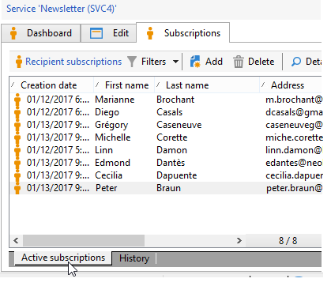
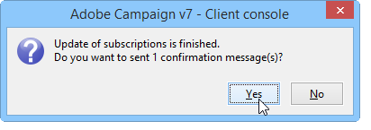
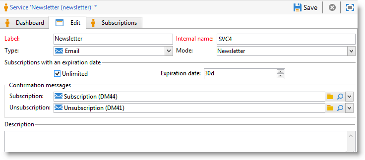

# Administración de suscripciones{#managing-subscriptions}

## Acerca de los servicios de información {#about-information-services}

Un servicio de información consta de:

* Registro y suscripción (adhesión),
* Cancelación de registro, baja voluntaria (exclusión) o baja automática (servicio por tiempo limitado, por ejemplo, una oferta de versión de prueba),
* Mecanismos de confirmación de suscripción y baja (mecanismos simples con confirmación, doble adhesión, etc.),
* Seguimiento del historial del suscriptor.

Como función predeterminada, estos servicios incluyen informes estadísticos específicos: seguimiento de suscriptores, nivel de lealtad, tendencias de baja, etc.

En los correos electrónicos, los vínculos obligatorios para darse de baja se generan automáticamente y el proceso de adhesión/exclusión está totalmente automatizado, con el seguimiento del historial para garantizar el cumplimiento total de las normas en vigor.

Hay tres modos de suscripción/baja del servicio:

1. manual
1. mediante importación (solo suscripción),
1. a través de un formulario Web

>[!NOTE]
>
>En [esta sección](../../web/using/use-cases--web-forms.md#create-a-subscription--form-with-double-opt-in) se adjunta una muestra para crear un formulario de suscripción con doble adhesión.

## Creación de un servicio informativo {#creating-an-information-service}

Puede crear y gestionar suscripciones a los servicios informativos con mensajes de confirmación o envíos automáticos asociados a los suscriptores.

Para acceder al mapa de servicios informativos, vaya al entorno **[!UICONTROL Profiles and Targets]** y haga clic en el vínculo **[!UICONTROL Services and Subscriptions]**.

Para editar un servicio existente, haga clic en su nombre. Para crear un servicio, haga clic en el botón **[!UICONTROL Create]**, situado encima de la lista.

* Introduzca el nombre del servicio en el campo **[!UICONTROL Label]** y seleccione el canal de entrega: correo electrónico, móvil, Facebook, Twitter o aplicaciones móviles.

   >[!NOTE]
   >
   >En [esta sección](../../social/using/about-social-marketing.md) se detallan las suscripciones a Facebook y Twitter. Las suscripciones a aplicaciones móviles se detallan en [Acerca del canal de aplicaciones móviles](../../delivery/using/about-mobile-app-channel.md).

* Para el servicio de correo electrónico, seleccione el **Delivery mode**. Los modos posibles son: **[!UICONTROL Newsletter]** o **[!UICONTROL Viral]**.
* Puede enviar **mensajes de confirmación** para una suscripción o darse de baja. Para ello, seleccione las plantillas de entrega que quiera utilizar para crear los envíos correspondientes de los campos **[!UICONTROL Subscription]** y **[!UICONTROL Unsubscription]**. Estas plantillas deben configurarse con una asignación de destino de tipo **[!UICONTROL Subscription]**, sin un destino definido. Consulte la sección [Acerca del canal de correo electrónico](../../delivery/using/about-email-channel.md).
* De forma predeterminada, las suscripciones son ilimitadas. Puede desmarcar la opción **[!UICONTROL Unlimited]** y definir una duración de validez del servicio. La duración se puede especificar en días (**[!UICONTROL d]**) o meses (**[!UICONTROL m]**).

Una vez guardado el servicio, se añade a la lista Services and Subscriptions: Haga clic en su nombre para editarlo. Hay varias pestañas disponibles. La pestaña **[!UICONTROL Subscriptions]** le permite ver la lista de suscriptores con el servicio informativo (pestaña **[!UICONTROL Active subscriptions]**) o el historial de suscripción/baja de suscripción (pestaña **[!UICONTROL History]**). También puede añadir y eliminar suscriptores de esta pestaña. Consulte [Adición y eliminación de suscriptores](#adding-and-deleting-subscribers).

El botón **[!UICONTROL Detail...]** permite ver las propiedades de la suscripción del destinatario seleccionado.

Puede modificar las características de la suscripción de un destinatario.

En el tablero, haga clic en la pestaña **[!UICONTROL Reports]** para rastrear las suscripciones: cambios en los niveles de suscripción, número total de suscriptores, etc. Puede archivar informes y mirar los historiales desde esta pestaña.

## Adición y eliminación de suscriptores {#adding-and-deleting-subscribers}

En la pestaña **[!UICONTROL Subscriptions]** del servicio informativo, haga clic en **[!UICONTROL Add]** para añadir suscriptores. También puede hacer clic con el botón derecho del ratón en la lista de suscriptores y seleccionar **[!UICONTROL Add]**. Seleccione la carpeta en la que se almacenan los perfiles y, a continuación, seleccione los perfiles a los que desee suscribirse y haga clic en **[!UICONTROL OK]** para validar.

Para eliminar a los suscriptores, selecciónelos y haga clic en **[!UICONTROL Delete]**. También puede hacer clic con el botón derecho del ratón en la lista de suscriptores y seleccionar **[!UICONTROL Delete]**.

En ambos casos, si se ha adjuntado una plantilla de entrega para darse de baja del servicio, puede enviar un mensaje de confirmación a los usuarios correspondientes (consulte [Creación de un servicio informativo](#creating-an-information-service)). Una advertencia permite validar o no validar esta entrega:

Consulte [Mecanismos de suscripción y baja](#subscription-and-unsubscription-mechanisms).

## Realización de una entrega a los suscriptores de un servicio {#delivering-to-the-subscribers-of-a-service}

Para realizar una entrega a los suscriptores de un servicio informativo, puede dirigirse a los suscriptores del servicio informativo en cuestión, tal y como se muestra en el siguiente ejemplo:

>[!CAUTION]
>
>La asignación de destino debe ser **[!UICONTROL Subscriptions]**.

Seleccione **[!UICONTROL Subscribers of an information service]** y haga clic en **[!UICONTROL Next]**.

Seleccione el servicio informativo de destino y haga clic en **[!UICONTROL Finish]**.

La pestaña **[!UICONTROL Preview]** permite ver la lista de suscriptores con el servicio informativo seleccionado.

## Mecanismos de suscripción y baja {#subscription-and-unsubscription-mechanisms}

Puede configurar los mecanismos de suscripción y baja para así automatizar los procesos y la gestión de los suscriptores.

>[!NOTE]
>
>Puede enviar un mensaje de confirmación a los nuevos suscriptores.\
>El contenido de este mensaje se establece a través de la configuración de servicios informativos de los campos **[!UICONTROL Subscription]** o **[!UICONTROL Unsubscription]**.
>
>Los mensajes de confirmación se crean mediante las plantillas de entrega especificadas en estos campos. Estas asignaciones de destino deben ser **[!UICONTROL Subscriptions]**.

### Suscripción de un destinatario a un servicio {#subscribing-a-recipient-to-a-service}

Para registrar a los destinatarios en un servicio informativo, puede:

* Añadirlos manualmente al servicio: para ello, desde la pestaña **[!UICONTROL Subscriptions]** de su perfil, haga clic en **[!UICONTROL Add]** y seleccione el servicio informativo que corresponda.

   Para obtener más información, consulte la sección de edición de perfiles en [esta sección](../../platform/using/editing-a-profile.md).

* Suscribir automáticamente a un conjunto de destinatarios a este servicio. Puede obtener una lista de destinatarios a través de una operación de filtrado, un grupo, una carpeta, una importación o una selección directa usando el ratón. Para suscribir a estos destinatarios, haga clic con el botón derecho del ratón. Seleccione **[!UICONTROL Actions > Subscribe selection to a service...]**, el servicio correspondiente y ejecute la operación.
* Importación de destinatarios y subscripción automática a un servicio informativo. Para ello, seleccione el servicio correspondiente en el último paso del asistente para importar.

   Para obtener más información, consulte [esta sección](../../platform/using/executing-import-jobs.md).

* Uso de un formulario web para que los destinatarios puedan suscribirse a un servicio.

   Para obtener más información, consulte [esta sección](../../web/using/about-web-applications.md).

* Creación de un flujo de trabajo de objetivos y uso de una casilla **[!UICONTROL Subscription service]**.

   

   En [esta sección](../../workflow/using/about-workflows.md) se describen los flujos de trabajo y cómo utilizarlos.

### Dar de baja a un destinatario de un servicio {#unsubscribing-a-recipient-from-a-service}

#### Baja manual {#manual-unsubscribing}

los envíos de correo electrónico deben contener, por ley, un vínculo para darse de baja. Los destinatarios pueden hacer clic en este vínculo para actualizar su perfil y darse de baja de posibles envíos futuros.

El vínculo predeterminado para darse de baja se inserta con el último botón de la barra de herramientas del editor de contenido, en el asistente de envíos (consulte [Acerca de la personalización](../../delivery/using/about-personalization.md)). Cuando el destinatario hace clic en este vínculo, el perfil se incluye en la lista de bloqueados (de exclusión), lo que significa que este destinatario ya no forma parte de ninguna acción de entrega.

Sin embargo, los destinatarios pueden optar por cancelar la suscripción de un servicio sin cancelar la suscripción de todos los servicios. Para esto, puede utilizar un formulario web (consulte [esta sección](../../web/using/adding-fields-to-a-web-form.md#subscription-checkboxes)) o insertar un vínculo personalizado para darse de baja del servicio (consulte [Bloques de personalización](../../delivery/using/personalization-blocks.md)).

También puede anular la suscripción de un destinatario manualmente desde el perfil del destinatario. Para ello, haga clic en la pestaña **[!UICONTROL Subscriptions]** del destinatario correspondiente, seleccione los servicios informativos y haga clic en **[!UICONTROL Delete]**.

A través del servicio informativo correspondiente, pueden cancelar la subscripción de uno o más destinatarios. Para ello, haga clic en la pestaña **[!UICONTROL Subscriptions]** del servicio, seleccione los destinatarios correspondientes y haga clic en **[!UICONTROL Delete]**.

#### Baja automática {#automatic-unsubscription}

Un servicio informativo puede tener una duración limitada. Una vez que el periodo de validez haya caducado, se da de baja a los destinatarios de forma automática. El periodo se configura en la pestaña **[!UICONTROL Edit]** de las propiedades del servicio. Se muestra en días.

También puede configurar un flujo de trabajo para darse de baja de una población. Para ello, siga el mismo procedimiento que para un flujo de trabajo de suscripción, pero seleccione la opción **[!UICONTROL Unsubscription]**. Consulte [Suscripción de un destinatario a un servicio](#subscribing-a-recipient-to-a-service).

### Seguimiento del suscriptor {#subscriber-tracking}

Puede realizar un seguimiento de los cambios en las suscripciones a los servicios informativos mediante el vínculo **[!UICONTROL Reports]** en el panel.

