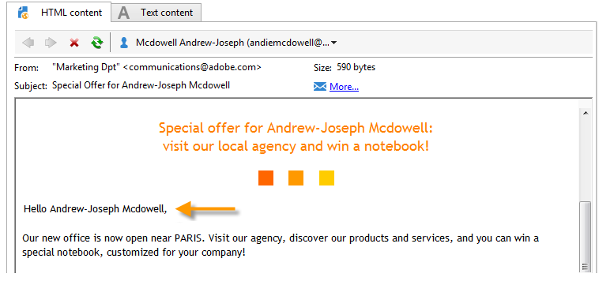
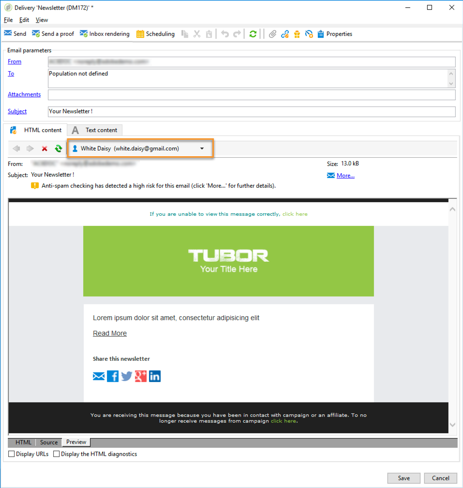
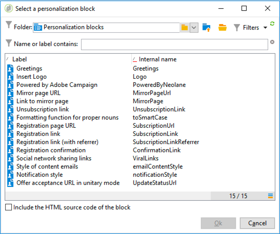
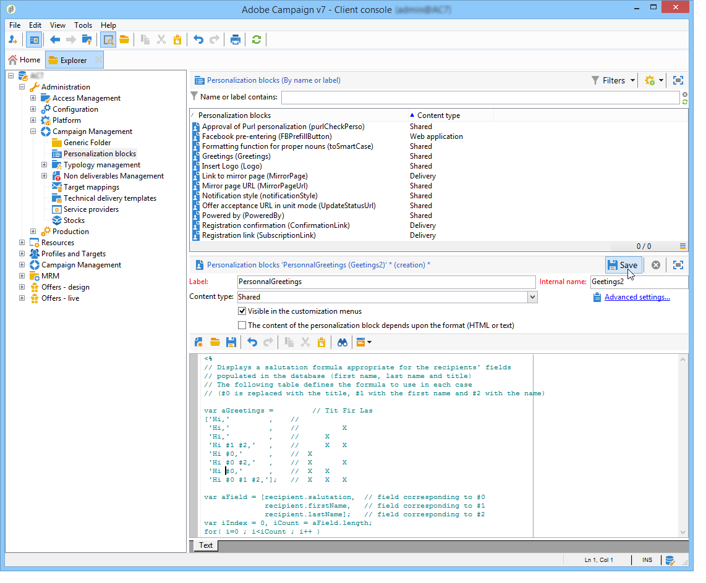
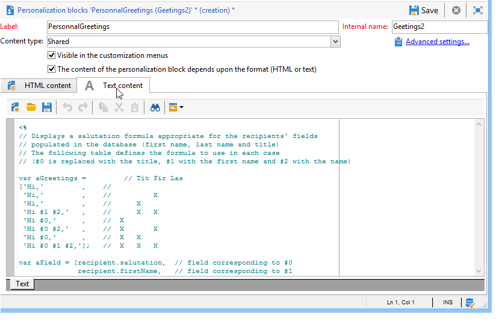

<?xml version="1.0" encoding="UTF-8"?>
<xliff xmlns="urn:oasis:names:tc:xliff:document:1.2" xmlns:okp="okapi-framework:xliff-extensions" xmlns:its="http://www.w3.org/2005/11/its" xmlns:itsxlf="http://www.w3.org/ns/its-xliff/" version="1.2" its:version="2.0">
<file original="help/delivery/using/personalization-blocks.md.mdnouisc" source-language="en-US" target-language="en-XX" datatype="x-text/markdown">
<body>
<trans-unit id="tu69" xml:space="preserve">
<source xml:lang="en-US">https://experienceleague.adobe.com/es/docs/control-panel/using/instances-settings/url-permissions</source>
<target xml:lang="en-XX">https://experienceleague.adobe.com/es/docs/control-panel/using/instances-settings/url-permissions</target>
</trans-unit>
<trans-unit id="tu86" xml:space="preserve">
<source xml:lang="en-US">https://experienceleague.adobe.com/docs/campaign-classic-learn/tutorials/overview.html?lang=es</source>
<target xml:lang="en-XX">https://experienceleague.adobe.com/docs/campaign-classic-learn/tutorials/overview.html?lang=es</target>
</trans-unit>
<trans-unit id="tu1" restype="x-YAML_METADATA_HEADER_VALUE" xml:space="preserve">
<source xml:lang="en-US">Personalization blocks</source>
<target xml:lang="en-XX">Bloques de personalización</target>
</trans-unit>
<trans-unit id="tu2" restype="x-YAML_METADATA_HEADER_VALUE" xml:space="preserve">
<source xml:lang="en-US">Learn how to use personalization blocks</source>
<target xml:lang="en-XX">Aprenda a utilizar bloques de personalización</target>
</trans-unit>
<trans-unit id="tu3" xml:space="preserve">
<source xml:lang="en-US">Also applies to v8</source>
<target xml:lang="en-XX">También se aplica a v8</target>
</trans-unit>
<trans-unit id="tu4" xml:space="preserve">
<source xml:lang="en-US">Also applies to Campaign v8</source>
<target xml:lang="en-XX">También se aplica a Campaign v8</target>
</trans-unit>
<trans-unit id="tu5" xml:space="preserve">
<source xml:lang="en-US">Personalization blocks</source>
<target xml:lang="en-XX">Bloques de personalización</target>
</trans-unit>
<trans-unit id="tu6" xml:space="preserve">
<source xml:lang="en-US">Personalization blocks are dynamic, personalized and contain a specific rendering that you can insert into your deliveries. For example, you can add a logo, a greeting message, or a link to a mirror page. See <ph id="1" ctype="x-LINK">[</ph>Insert personalization blocks<ph id="2" ctype="x-LINK">](#inserting-personalization-blocks)</ph>.</source>
<target xml:lang="en-XX">Los bloques personalizados son dinámicos, personalizados y contienen un procesamiento específico que puede insertar en las entregas. Por ejemplo, puede añadir un logotipo, un mensaje de saludo o un vínculo a una página espejo. Consulte <ph id="1" ctype="x-LINK">[</ph>Inserción de bloques de personalización<ph id="2" ctype="x-LINK">](#inserting-personalization-blocks)</ph>.</target>
</trans-unit>
<trans-unit id="tu7" xml:space="preserve">
<source xml:lang="en-US"><ph id="1" ctype="x-IMAGE"></ph> Discover this feature <ph id="3" ctype="x-LINK">[</ph>in video<ph id="4" ctype="x-LINK">](#personalization-blocks-video)</ph></source>
<target xml:lang="en-XX"><ph id="1" ctype="x-IMAGE"></ph><ph id="3" ctype="x-LINK">[</ph> Descubra esta función en vídeo<ph id="4" ctype="x-LINK">](#personalization-blocks-video)</ph></target>
</trans-unit>
<trans-unit id="tu8" xml:space="preserve">
<source xml:lang="en-US">Personalization blocks are accessed via the <ph id="1" ctype="x-STRONG_EMPHASIS">**[!UICONTROL Resources > Campaign Management > Personalization blocks]**</ph> node of the Adobe Campaign explorer. Several blocks are available by default (see <ph id="4" ctype="x-LINK">[</ph>Out-of-the-box personalization blocks<ph id="5" ctype="x-LINK">](#out-of-the-box-personalization-blocks)</ph>).</source>
<target xml:lang="en-XX">Se puede acceder a los bloques personalizados mediante el nodo <ph id="1" ctype="x-STRONG_EMPHASIS">**[!UICONTROL Resources > Campaign Management > Personalization blocks]**</ph> de Adobe Campaign Explorer. Hay varios bloques disponibles de forma predeterminada (consulte <ph id="4" ctype="x-LINK">[</ph>Bloques de personalización predeterminados<ph id="5" ctype="x-LINK">](#out-of-the-box-personalization-blocks)</ph>).</target>
</trans-unit>
<trans-unit id="tu9" xml:space="preserve">
<source xml:lang="en-US">You have the ability to define new blocks that will enable you to optimize your deliveries personalization. For more on this, refer to <ph id="1" ctype="x-LINK">[</ph>Define custom personalization blocks<ph id="2" ctype="x-LINK">](#defining-custom-personalization-blocks)</ph>.</source>
<target xml:lang="en-XX">Tiene la posibilidad de definir nuevos bloques que le permitan optimizar la personalización de las entregas. Para obtener más información sobre esto, consulte <ph id="1" ctype="x-LINK">[</ph>Definición de bloques de personalización propios<ph id="2" ctype="x-LINK">](#defining-custom-personalization-blocks)</ph>.</target>
</trans-unit>
<trans-unit id="tu10" xml:space="preserve">
<source xml:lang="en-US"><ph id="1" ctype="x-regxph" equiv-text="&lbrack;!NOTE">[!NOTE]</ph></source>
<target xml:lang="en-XX"><ph id="1" ctype="x-regxph" equiv-text="&lbrack;!NOTE">[!NOTE]</ph></target>
</trans-unit>
<trans-unit id="tu11" xml:space="preserve">
<source xml:lang="en-US">Personalization blocks are also available from the <ph id="1" ctype="x-STRONG_EMPHASIS">**[!UICONTROL Digital Content Editor (DCE)]**</ph> . For more on this, refer to <ph id="4" ctype="x-LINK">[</ph>this page<ph id="5" ctype="x-LINK">](../../web/using/editing-content.md#inserting-a-personalization-block)</ph>.</source>
<target xml:lang="en-XX">Los bloques personalizados también están disponibles desde <ph id="1" ctype="x-STRONG_EMPHASIS">**[!UICONTROL Digital Content Editor (DCE)]**</ph> Para obtener más información, consulte <ph id="4" ctype="x-LINK">[</ph>esta página<ph id="5" ctype="x-LINK">](../../web/using/editing-content.md#inserting-a-personalization-block)</ph>.</target>
</trans-unit>
<trans-unit id="tu12" xml:space="preserve">
<source xml:lang="en-US">Insert personalization blocks</source>
<target xml:lang="en-XX">Inserción de bloques de personalización</target>
</trans-unit>
<trans-unit id="tu13" xml:space="preserve">
<source xml:lang="en-US">To insert a personalization block in a message, follow the steps below:</source>
<target xml:lang="en-XX">Para insertar un bloque de personalización en un mensaje, siga los pasos a continuación:</target>
</trans-unit>
<trans-unit id="tu14" xml:space="preserve">
<source xml:lang="en-US">In the content editor of the delivery assistant, click the personalized field icon and select the <ph id="1" ctype="x-STRONG_EMPHASIS">**[!UICONTROL Include]**</ph> menu.</source>
<target xml:lang="en-XX">En el editor de contenido del asistente de envíos, haga clic en el icono de campo personalizado y seleccione el menú <ph id="1" ctype="x-STRONG_EMPHASIS">**[!UICONTROL Include]**</ph>.</target>
</trans-unit>
<trans-unit id="tu15" xml:space="preserve">
<source xml:lang="en-US">Select a personalization block from the list (the list displays the 10 last used blocks), or click the <ph id="1" ctype="x-STRONG_EMPHASIS">**[!UICONTROL Other...]**</ph> menu to access the full list.</source>
<target xml:lang="en-XX">Seleccione un bloque personalizado de la lista (la lista muestra los 10 últimos bloques utilizados) o haga clic en el menú <ph id="1" ctype="x-STRONG_EMPHASIS">**[!UICONTROL Other...]**</ph> para acceder a la lista completa.</target>
</trans-unit>
<trans-unit id="tu16" xml:space="preserve">
<source xml:lang="en-US"><ph id="1" ctype="x-IMAGE"></ph></source>
<target xml:lang="en-XX"><ph id="1" ctype="x-IMAGE"></ph></target>
</trans-unit>
<trans-unit id="tu17" xml:space="preserve">
<source xml:lang="en-US">The <ph id="1" ctype="x-STRONG_EMPHASIS">**[!UICONTROL Other...]**</ph> menu gives access to all the out-of-the-box and custom personalization blocks (see <ph id="4" ctype="x-LINK">[</ph>Out-of-the-box personalization blocks<ph id="5" ctype="x-LINK">](#out-of-the-box-personalization-blocks)</ph> and <ph id="6" ctype="x-LINK">[</ph>Define custom personalization blocks<ph id="7" ctype="x-LINK">](#defining-custom-personalization-blocks)</ph>).</source>
<target xml:lang="en-XX">El menú <ph id="1" ctype="x-STRONG_EMPHASIS">**[!UICONTROL Other...]**</ph> proporciona acceso a todos los bloques de personalización predeterminados y propios (consulte <ph id="4" ctype="x-LINK">[</ph>Bloques de personalización predeterminados<ph id="5" ctype="x-LINK">](#out-of-the-box-personalization-blocks)</ph> y <ph id="6" ctype="x-LINK">[</ph>Definición de bloques de personalización propios<ph id="7" ctype="x-LINK">](#defining-custom-personalization-blocks)</ph>).</target>
</trans-unit>
<trans-unit id="tu18" xml:space="preserve">
<source xml:lang="en-US"><ph id="1" ctype="x-IMAGE"></ph></source>
<target xml:lang="en-XX"><ph id="1" ctype="x-IMAGE"></ph></target>
</trans-unit>
<trans-unit id="tu19" xml:space="preserve">
<source xml:lang="en-US">The personalization block is then inserted as a script. It is automatically adapted to the recipient profile when personalization is generated.</source>
<target xml:lang="en-XX">A continuación, el bloque personalizado se inserta como una secuencia de comandos. Se adapta automáticamente al perfil de destinatario cuando se genera la personalización.</target>
</trans-unit>
<trans-unit id="tu20" xml:space="preserve">
<source xml:lang="en-US"><ph id="1" ctype="x-IMAGE"></ph></source>
<target xml:lang="en-XX"><ph id="1" ctype="x-IMAGE"></ph></target>
</trans-unit>
<trans-unit id="tu21" xml:space="preserve">
<source xml:lang="en-US">Click the <ph id="1" ctype="x-STRONG_EMPHASIS">**[!UICONTROL Preview]**</ph> tab and select a recipient to view the personalization.</source>
<target xml:lang="en-XX">Haga clic en la pestaña <ph id="1" ctype="x-STRONG_EMPHASIS">**[!UICONTROL Preview]**</ph> y seleccione un destinatario para ver la personalización.</target>
</trans-unit>
<trans-unit id="tu22" xml:space="preserve">
<source xml:lang="en-US"><ph id="1" ctype="x-IMAGE"></ph></source>
<target xml:lang="en-XX"><ph id="1" ctype="x-IMAGE"></ph></target>
</trans-unit>
<trans-unit id="tu23" xml:space="preserve">
<source xml:lang="en-US">You can include the source code of a personalization block in the delivery content. To do this, select <ph id="1" ctype="x-STRONG_EMPHASIS">**[!UICONTROL Include the HTML source code of the block]**</ph> when selecting it.</source>
<target xml:lang="en-XX">Se puede incluir el código fuente de un bloque personalizado en el contenido de envío. Para ello, escoja <ph id="1" ctype="x-STRONG_EMPHASIS">**[!UICONTROL Include the HTML source code of the block]**</ph> al seleccionarlo.</target>
</trans-unit>
<trans-unit id="tu24" xml:space="preserve">
<source xml:lang="en-US"><ph id="1" ctype="x-IMAGE"></ph></source>
<target xml:lang="en-XX"><ph id="1" ctype="x-IMAGE"></ph></target>
</trans-unit>
<trans-unit id="tu25" xml:space="preserve">
<source xml:lang="en-US">The HTML source code is inserted in the delivery content. For example, the <ph id="1" ctype="x-STRONG_EMPHASIS">**[!UICONTROL Greetings]**</ph> personalization bloc displays as below:</source>
<target xml:lang="en-XX">El código fuente HTML se inserta en el contenido de envío. Por ejemplo, el bloque personalizado <ph id="1" ctype="x-STRONG_EMPHASIS">**[!UICONTROL Greetings]**</ph> se muestra de la siguiente manera:</target>
</trans-unit>
<trans-unit id="tu26" xml:space="preserve">
<source xml:lang="en-US"><ph id="1" ctype="x-IMAGE"></ph></source>
<target xml:lang="en-XX"><ph id="1" ctype="x-IMAGE"></ph></target>
</trans-unit>
<trans-unit id="tu27" xml:space="preserve">
<source xml:lang="en-US">Personalization blocks example</source>
<target xml:lang="en-XX">Ejemplo de bloques de personalización</target>
</trans-unit>
<trans-unit id="tu28" xml:space="preserve">
<source xml:lang="en-US">In this example, we create an email in which we use personalization blocks to enable the recipient to view the mirror page, share the newsletter on social networks, and unsubscribe from future deliveries.</source>
<target xml:lang="en-XX">En este ejemplo, se crea un correo electrónico en el que se utilizan bloques personalizados para permitir que el destinatario vea la página espejo, compartir el boletín informativo en redes sociales y cancelar la suscripción a futuros envíos.</target>
</trans-unit>
<trans-unit id="tu29" xml:space="preserve">
<source xml:lang="en-US">To do this, we need to insert the following personalization blocks:</source>
<target xml:lang="en-XX">Para ello, es necesario insertar los siguientes bloques personalizados:</target>
</trans-unit>
<trans-unit id="tu30" xml:space="preserve">
<source xml:lang="en-US"><ph id="1" ctype="x-STRONG_EMPHASIS">**[!UICONTROL Link to mirror page]**</ph> .</source>
<target xml:lang="en-XX"><ph id="1" ctype="x-STRONG_EMPHASIS">**[!UICONTROL Link to mirror page]**</ph> .</target>
</trans-unit>
<trans-unit id="tu31" xml:space="preserve">
<source xml:lang="en-US"><ph id="1" ctype="x-STRONG_EMPHASIS">**[!UICONTROL Social network sharing links]**</ph> .</source>
<target xml:lang="en-XX"><ph id="1" ctype="x-STRONG_EMPHASIS">**[!UICONTROL Social network sharing links]**</ph> .</target>
</trans-unit>
<trans-unit id="tu32" xml:space="preserve">
<source xml:lang="en-US"><ph id="1" ctype="x-STRONG_EMPHASIS">**[!UICONTROL Unsubscription link]**</ph> .</source>
<target xml:lang="en-XX"><ph id="1" ctype="x-STRONG_EMPHASIS">**[!UICONTROL Unsubscription link]**</ph> .</target>
</trans-unit>
<trans-unit id="tu33" xml:space="preserve">
<source xml:lang="en-US"><ph id="1" ctype="x-regxph" equiv-text="&lbrack;!NOTE">[!NOTE]</ph></source>
<target xml:lang="en-XX"><ph id="1" ctype="x-regxph" equiv-text="&lbrack;!NOTE">[!NOTE]</ph></target>
</trans-unit>
<trans-unit id="tu34" xml:space="preserve">
<source xml:lang="en-US">For more on the mirror page generation, refer to <ph id="1" ctype="x-LINK">[</ph>Generate the mirror page<ph id="2" ctype="x-LINK">](sending-messages.md#generating-the-mirror-page)</ph>.</source>
<target xml:lang="en-XX">Para obtener más información sobre la generación de páginas espejo, consulte <ph id="1" ctype="x-LINK">[</ph>Generación de la página espejo<ph id="2" ctype="x-LINK">](sending-messages.md#generating-the-mirror-page)</ph>.</target>
</trans-unit>
<trans-unit id="tu35" xml:space="preserve">
<source xml:lang="en-US">Create a new delivery or open an existing email type delivery.</source>
<target xml:lang="en-XX">Cree una nueva entrega o abra una entrega de tipo correo electrónico ya existente.</target>
</trans-unit>
<trans-unit id="tu36" xml:space="preserve">
<source xml:lang="en-US">In the delivery assistant, click <ph id="1" ctype="x-STRONG_EMPHASIS">**[!UICONTROL Subject]**</ph> to edit the subject of the message and enter a subject.</source>
<target xml:lang="en-XX">En el asistente de envíos, haga clic en <ph id="1" ctype="x-STRONG_EMPHASIS">**[!UICONTROL Subject]**</ph> para editar el asunto del mensaje y escriba un asunto.</target>
</trans-unit>
<trans-unit id="tu37" xml:space="preserve">
<source xml:lang="en-US">Insert the personalization blocks in the message body. To do this, click in the message content, click the personalized field icon and select the <ph id="1" ctype="x-STRONG_EMPHASIS">**[!UICONTROL Include]**</ph> menu.</source>
<target xml:lang="en-XX">Inserte los bloques personalizados en el cuerpo del mensaje. Para ello, haga clic en el contenido del mensaje, haga clic en el icono de campo personalizado y seleccione el menú <ph id="1" ctype="x-STRONG_EMPHASIS">**[!UICONTROL Include]**</ph>.</target>
</trans-unit>
<trans-unit id="tu38" xml:space="preserve">
<source xml:lang="en-US">Select the first block to insert. Renew the procedure to include the two other blocks.</source>
<target xml:lang="en-XX">Seleccione el primer bloque que desee insertar. Reinicie el procedimiento para incluir los otros dos bloques.</target>
</trans-unit>
<trans-unit id="tu39" xml:space="preserve">
<source xml:lang="en-US"><ph id="1" ctype="x-IMAGE"></ph></source>
<target xml:lang="en-XX"><ph id="1" ctype="x-IMAGE"></ph></target>
</trans-unit>
<trans-unit id="tu40" xml:space="preserve">
<source xml:lang="en-US">Click the <ph id="1" ctype="x-STRONG_EMPHASIS">**[!UICONTROL Preview]**</ph> tab to view the personalization result. You must select a recipient to display that recipient's message.</source>
<target xml:lang="en-XX">Haga clic en la pestaña <ph id="1" ctype="x-STRONG_EMPHASIS">**[!UICONTROL Preview]**</ph> para ver el resultado personalizado. Se debe seleccionar un destinatario para mostrar el mensaje de dicho destinatario.</target>
</trans-unit>
<trans-unit id="tu41" xml:space="preserve">
<source xml:lang="en-US"><ph id="1" ctype="x-IMAGE"></ph></source>
<target xml:lang="en-XX"><ph id="1" ctype="x-IMAGE"></ph></target>
</trans-unit>
<trans-unit id="tu42" xml:space="preserve">
<source xml:lang="en-US">Confirm that the block contents are displayed properly.</source>
<target xml:lang="en-XX">Confirme que el contenido del bloque se muestra correctamente.</target>
</trans-unit>
<trans-unit id="tu43" xml:space="preserve">
<source xml:lang="en-US">Out-of-the-box personalization blocks</source>
<target xml:lang="en-XX">Bloques de personalización preestablecidos</target>
</trans-unit>
<trans-unit id="tu44" xml:space="preserve">
<source xml:lang="en-US">A list of personalization blocks is available by default to help you personalize the content of your message.</source>
<target xml:lang="en-XX">De forma predeterminada, hay disponibles una lista de bloques personalizados que ayudan a personalizar el contenido del mensaje.</target>
</trans-unit>
<trans-unit id="tu45" xml:space="preserve">
<source xml:lang="en-US"><ph id="1" ctype="x-regxph" equiv-text="&lbrack;!NOTE">[!NOTE]</ph></source>
<target xml:lang="en-XX"><ph id="1" ctype="x-regxph" equiv-text="&lbrack;!NOTE">[!NOTE]</ph></target>
</trans-unit>
<trans-unit id="tu46" xml:space="preserve">
<source xml:lang="en-US">The list of personalization blocks depends on the modules and options which have been installed on your instance.</source>
<target xml:lang="en-XX">La lista de bloques personalizados depende de los módulos y las opciones que se hayan instalado en la instancia.</target>
</trans-unit>
<trans-unit id="tu47" xml:space="preserve">
<source xml:lang="en-US"><ph id="1" ctype="x-IMAGE"></ph></source>
<target xml:lang="en-XX"><ph id="1" ctype="x-IMAGE"></ph></target>
</trans-unit>
<trans-unit id="tu48" xml:space="preserve">
<source xml:lang="en-US"><ph id="1" ctype="x-STRONG_EMPHASIS">**[!UICONTROL Greetings]**</ph> : inserts greetings with the recipient's name. Example: "Hello John Doe,".</source>
<target xml:lang="en-XX"><ph id="1" ctype="x-STRONG_EMPHASIS">**[!UICONTROL Greetings]**</ph>: inserta los saludos con el nombre del destinatario. Ejemplo: "Hola John Doe".</target>
</trans-unit>
<trans-unit id="tu49" xml:space="preserve">
<source xml:lang="en-US"><ph id="1" ctype="x-STRONG_EMPHASIS">**[!UICONTROL Insert logo]**</ph> : inserts an out-of-the-box logo that has been defined when configuring the instance.</source>
<target xml:lang="en-XX"><ph id="1" ctype="x-STRONG_EMPHASIS">**[!UICONTROL Insert logo]**</ph>: inserta un logotipo preestablecido que se haya definido al configurar la instancia.</target>
</trans-unit>
<trans-unit id="tu50" xml:space="preserve">
<source xml:lang="en-US"><ph id="1" ctype="x-STRONG_EMPHASIS">**[!UICONTROL Powered by Adobe Campaign]**</ph> : inserts the "Powered by Adobe Campaign" logo.</source>
<target xml:lang="en-XX"><ph id="1" ctype="x-STRONG_EMPHASIS">**[!UICONTROL Powered by Adobe Campaign]**</ph>: inserta el logotipo “Powered by Adobe Campaign”.</target>
</trans-unit>
<trans-unit id="tu51" xml:space="preserve">
<source xml:lang="en-US"><ph id="1" ctype="x-STRONG_EMPHASIS">**[!UICONTROL Mirror page URL]**</ph> : inserts the mirror page URL, enabling Delivery Designers to check the link.</source>
<target xml:lang="en-XX"><ph id="1" ctype="x-STRONG_EMPHASIS">**[!UICONTROL Mirror page URL]**</ph>: inserta la dirección URL de la página espejo, permitiendo que los diseñadores de envío comprueben el vínculo.</target>
</trans-unit>
<trans-unit id="tu52" xml:space="preserve">
<source xml:lang="en-US"><ph id="1" ctype="x-regxph" equiv-text="&lbrack;!NOTE">[!NOTE]</ph></source>
<target xml:lang="en-XX"><ph id="1" ctype="x-regxph" equiv-text="&lbrack;!NOTE">[!NOTE]</ph></target>
</trans-unit>
<trans-unit id="tu53" xml:space="preserve">
<source xml:lang="en-US">For more on the mirror page generation, refer to <ph id="1" ctype="x-LINK">[</ph>Generate the mirror page<ph id="2" ctype="x-LINK">](sending-messages.md#generating-the-mirror-page)</ph>.</source>
<target xml:lang="en-XX">Para obtener más información sobre la generación de páginas espejo, consulte <ph id="1" ctype="x-LINK">[</ph>Generación de la página espejo<ph id="2" ctype="x-LINK">](sending-messages.md#generating-the-mirror-page)</ph>.</target>
</trans-unit>
<trans-unit id="tu54" xml:space="preserve">
<source xml:lang="en-US"><ph id="1" ctype="x-STRONG_EMPHASIS">**[!UICONTROL Link to mirror page]**</ph> : inserts a link to the mirror page: "If you are unable to view this message correctly, click here".</source>
<target xml:lang="en-XX"><ph id="1" ctype="x-STRONG_EMPHASIS">**[!UICONTROL Link to mirror page]**</ph>: inserta un vínculo a la página espejo: “Si no puede ver este mensaje correctamente, haga clic aquí”.</target>
</trans-unit>
<trans-unit id="tu55" xml:space="preserve">
<source xml:lang="en-US"><ph id="1" ctype="x-STRONG_EMPHASIS">**[!UICONTROL Unsubscription link]**</ph> : inserts a link enabling to unsubscribe from all deliveries (denylist).</source>
<target xml:lang="en-XX"><ph id="1" ctype="x-STRONG_EMPHASIS">**[!UICONTROL Unsubscription link]**</ph>: inserta un vínculo que permite cancelar la suscripción a todas las entregas (lista de bloqueados).</target>
</trans-unit>
<trans-unit id="tu56" xml:space="preserve">
<source xml:lang="en-US"><ph id="1" ctype="x-STRONG_EMPHASIS">**[!UICONTROL Formatting function for proper nouns]**</ph> : generates the <ph id="4" ctype="x-STRONG_EMPHASIS">**[!UICONTROL toSmartCase]**</ph> Javascript function, which changes the first letter of each word to uppercase.</source>
<target xml:lang="en-XX"><ph id="1" ctype="x-STRONG_EMPHASIS">**[!UICONTROL Formatting function for proper nouns]**</ph>: genera la función JavaScript <ph id="4" ctype="x-STRONG_EMPHASIS">**[!UICONTROL toSmartCase]**</ph>, que cambia la primera letra de cada palabra a mayúscula.</target>
</trans-unit>
<trans-unit id="tu57" xml:space="preserve">
<source xml:lang="en-US"><ph id="1" ctype="x-STRONG_EMPHASIS">**[!UICONTROL Registration page URL]**</ph> : inserts a subscription URL (see <ph id="4" ctype="x-LINK">[</ph>About services and subscriptions<ph id="5" ctype="x-LINK">](about-services-and-subscriptions.md)</ph>).</source>
<target xml:lang="en-XX"><ph id="1" ctype="x-STRONG_EMPHASIS">**[!UICONTROL Registration page URL]**</ph>: inserta una URL de suscripción (consulte <ph id="4" ctype="x-LINK">[</ph>Acerca de los servicios y las suscripciones<ph id="5" ctype="x-LINK">](about-services-and-subscriptions.md)</ph>).</target>
</trans-unit>
<trans-unit id="tu58" xml:space="preserve">
<source xml:lang="en-US"><ph id="1" ctype="x-STRONG_EMPHASIS">**[!UICONTROL Registration link]**</ph> : inserts a subscription link. that has been defined when configuring the instance.</source>
<target xml:lang="en-XX"><ph id="1" ctype="x-STRONG_EMPHASIS">**[!UICONTROL Registration link]**</ph>: inserta un vínculo de suscripción. El vínculo se ha definido al configurar la instancia.</target>
</trans-unit>
<trans-unit id="tu59" xml:space="preserve">
<source xml:lang="en-US"><ph id="1" ctype="x-STRONG_EMPHASIS">**[!UICONTROL Registration link (with referrer)]**</ph> : inserts a subscription link, enabling to identify the visitor and delivery. The link has been defined when configuring the instance.</source>
<target xml:lang="en-XX"><ph id="1" ctype="x-STRONG_EMPHASIS">**[!UICONTROL Registration link (with referrer)]**</ph> : inserta un enlace de suscripción que permite identificar el visitante y el envío. El vínculo se ha definido al configurar la instancia.</target>
</trans-unit>
<trans-unit id="tu60" xml:space="preserve">
<source xml:lang="en-US"><ph id="1" ctype="x-regxph" equiv-text="&lbrack;!NOTE">[!NOTE]</ph></source>
<target xml:lang="en-XX"><ph id="1" ctype="x-regxph" equiv-text="&lbrack;!NOTE">[!NOTE]</ph></target>
</trans-unit>
<trans-unit id="tu61" xml:space="preserve">
<source xml:lang="en-US">This block can be used in deliveries targeting visitors only.</source>
<target xml:lang="en-XX">Este bloque se puede utilizar en envíos segmentados solamente a visitantes.</target>
</trans-unit>
<trans-unit id="tu62" xml:space="preserve">
<source xml:lang="en-US"><ph id="1" ctype="x-STRONG_EMPHASIS">**[!UICONTROL Registration confirmation]**</ph> : inserts a link enabling to confirm subscription.</source>
<target xml:lang="en-XX"><ph id="1" ctype="x-STRONG_EMPHASIS">**[!UICONTROL Registration confirmation]**</ph>: inserta un vínculo que permite confirmar la suscripción.</target>
</trans-unit>
<trans-unit id="tu63" xml:space="preserve">
<source xml:lang="en-US"><ph id="1" ctype="x-STRONG_EMPHASIS">**[!UICONTROL Social network sharing links]**</ph> : inserts buttons that enable the recipient to share a link to the mirror page content with the email client, Facebook, X (formerly known as Twitter), and LinkedIn (see <ph id="4" ctype="x-LINK">[</ph>Viral marketing: forward to a friend<ph id="5" ctype="x-LINK">](viral-and-social-marketing.md#viral-marketing--forward-to-a-friend)</ph>).</source>
<target xml:lang="en-XX"><ph id="1" ctype="x-STRONG_EMPHASIS">**[!UICONTROL Social network sharing links]**</ph> : inserta botones que permiten al destinatario compartir un vínculo al contenido de la página espejo con el cliente de correo electrónico, Facebook, X (anteriormente conocido como Twitter) y LinkedIn (consulte <ph id="4" ctype="x-LINK">[</ph>Marketing viral: reenviar a un amigo<ph id="5" ctype="x-LINK">](viral-and-social-marketing.md#viral-marketing--forward-to-a-friend)</ph>).</target>
</trans-unit>
<trans-unit id="tu64" xml:space="preserve">
<source xml:lang="en-US"><ph id="1" ctype="x-STRONG_EMPHASIS">**[!UICONTROL Style of content emails]**</ph> and <ph id="4" ctype="x-STRONG_EMPHASIS">**[!UICONTROL Notification style]**</ph> : generate code that format an email with predefined HTML styles. These blocks must be inserted in the source code of the delivery, in the <ph id="7" ctype="x-STRONG_EMPHASIS">**[!UICONTROL ...]**</ph> section, into <ph id="10" ctype="x-STRONG_EMPHASIS">**`&lt;style>...&lt;/style>`**</ph> tags.</source>
<target xml:lang="en-XX"><ph id="1" ctype="x-STRONG_EMPHASIS">**[!UICONTROL Style of content emails]**</ph> y <ph id="4" ctype="x-STRONG_EMPHASIS">**[!UICONTROL Notification style]**</ph>: genera un código que dé formato a un correo electrónico con estilos HTML predefinidos. Estos bloques deben insertarse en el código fuente de la entrega, en la sección <ph id="7" ctype="x-STRONG_EMPHASIS">**[!UICONTROL ...]**</ph>, entre las etiquetas <ph id="10" ctype="x-STRONG_EMPHASIS">**`&lt;style>...&lt;/style>`**</ph>.</target>
</trans-unit>
<trans-unit id="tu65" xml:space="preserve">
<source xml:lang="en-US"><ph id="1" ctype="x-STRONG_EMPHASIS">**[!UICONTROL Offer acceptance URL in unitary mode]**</ph> : inserts an URL enabling to set an Interaction offer to <ph id="4" ctype="x-STRONG_EMPHASIS">**[!UICONTROL Accepted]**</ph> (see <ph id="7" ctype="x-LINK">[</ph>this section<ph id="8" ctype="x-LINK">](../../interaction/using/offer-analysis-report.md)</ph>).</source>
<target xml:lang="en-XX"><ph id="1" ctype="x-STRONG_EMPHASIS">**[!UICONTROL Offer acceptance URL in unitary mode]**</ph>: inserta una URL que permite establecer una oferta de interacción como <ph id="4" ctype="x-STRONG_EMPHASIS">**[!UICONTROL Accepted]**</ph> (consulte <ph id="7" ctype="x-LINK">[</ph>esta sección<ph id="8" ctype="x-LINK">](../../interaction/using/offer-analysis-report.md)</ph>).</target>
</trans-unit>
<trans-unit id="tu66" xml:space="preserve">
<source xml:lang="en-US">Define custom personalization blocks</source>
<target xml:lang="en-XX">Definición de bloques de personalización propios</target>
</trans-unit>
<trans-unit id="tu67" xml:space="preserve">
<source xml:lang="en-US"><ph id="1" ctype="x-regxph" equiv-text="&lbrack;!IMPORTANT">[!IMPORTANT]</ph></source>
<target xml:lang="en-XX"><ph id="1" ctype="x-regxph" equiv-text="&lbrack;!IMPORTANT">[!IMPORTANT]</ph></target>
</trans-unit>
<trans-unit id="tu68" xml:space="preserve">
<source xml:lang="en-US">Release 7.4.4 (build 9401) includes an update to the external URL allow list. If a custom personalization block references an external URL (for example, an externally-hosted image), make sure that domain is added to your instance's approved allow list so that the resource continues to load without interruption. As a Campaign Administrator, use the Control Panel to add and manage allow-listed URLs. See <ph id="1" ctype="x-LINK">&lbrack;</ph>Add URL permissions<ph id="2" ctype="x-LINK">[#$tu69]{target="_blank"}</ph> for steps.</source>
<target xml:lang="en-XX">La versión 7.4.4 (versión 9401) incluye una actualización de la lista de permitidos de URL externas. Si un bloque de personalización propio hace referencia a una dirección URL externa (por ejemplo, una imagen alojada externamente), asegúrese de que se añade el dominio a la lista de permitidos aprobada de la instancia para que el recurso se siga cargando sin interrupción. Como administrador de Campaign, utilice el Panel de control para añadir y administrar las URL incluidas en la lista de permitidos. Consulte <ph id="1" ctype="x-LINK">&lbrack;</ph>Adición de permisos de URL<ph id="2" ctype="x-LINK">[#$tu69]{target="_blank"}</ph> para conocer los pasos.</target>
</trans-unit>
<trans-unit id="tu70" xml:space="preserve">
<source xml:lang="en-US">You can define new personalization fields to be inserted from the personalized field icon via the <ph id="1" ctype="x-STRONG_EMPHASIS">**[!UICONTROL Include...]**</ph> menu. These fields are defined in personalization blocks.</source>
<target xml:lang="en-XX">Se pueden definir nuevos campos personalizados para que se inserten desde el icono de campo personalizado en el menú <ph id="1" ctype="x-STRONG_EMPHASIS">**[!UICONTROL Include...]**</ph>. Estos campos se definen en bloques personalizados.</target>
</trans-unit>
<trans-unit id="tu71" xml:space="preserve">
<source xml:lang="en-US">To create a personalization block, go to the explorer and apply the following steps:</source>
<target xml:lang="en-XX">Para crear un bloque personalizado, vaya a Explorer y aplique los pasos siguientes:</target>
</trans-unit>
<trans-unit id="tu72" xml:space="preserve">
<source xml:lang="en-US">Click the <ph id="1" ctype="x-STRONG_EMPHASIS">**[!UICONTROL Resources > Campaign Management > Personalization blocks]**</ph> node.</source>
<target xml:lang="en-XX">Haga clic en el nodo <ph id="1" ctype="x-STRONG_EMPHASIS">**[!UICONTROL Resources > Campaign Management > Personalization blocks]**</ph>.</target>
</trans-unit>
<trans-unit id="tu73" xml:space="preserve">
<source xml:lang="en-US">Right-click the list of blocks and select <ph id="1" ctype="x-STRONG_EMPHASIS">**[!UICONTROL New]**</ph> .</source>
<target xml:lang="en-XX">Haga clic con el botón derecho en la lista de bloques y seleccione <ph id="1" ctype="x-STRONG_EMPHASIS">**[!UICONTROL New]**</ph> .</target>
</trans-unit>
<trans-unit id="tu74" xml:space="preserve">
<source xml:lang="en-US">Fill in the settings of the personalization block:</source>
<target xml:lang="en-XX">Rellene la configuración del bloque personalizado:</target>
</trans-unit>
<trans-unit id="tu75" xml:space="preserve">
<source xml:lang="en-US"><ph id="1" ctype="x-IMAGE"></ph></source>
<target xml:lang="en-XX"><ph id="1" ctype="x-IMAGE"></ph></target>
</trans-unit>
<trans-unit id="tu76" xml:space="preserve">
<source xml:lang="en-US">Enter the label of the block. This label will be displayed in the personalization field insertion window.</source>
<target xml:lang="en-XX">Introduzca la etiqueta del bloque. Esta etiqueta se muestra en la ventana de inserción del campo personalizado.</target>
</trans-unit>
<trans-unit id="tu77" xml:space="preserve">
<source xml:lang="en-US">Select <ph id="1" ctype="x-STRONG_EMPHASIS">**[!UICONTROL Visible in the customization menus]**</ph> to make this block accessible from the personalization field insertion icon.</source>
<target xml:lang="en-XX">Seleccione <ph id="1" ctype="x-STRONG_EMPHASIS">**[!UICONTROL Visible in the customization menus]**</ph> para que el bloque esté accesible desde el icono de inserción del campo personalizado.</target>
</trans-unit>
<trans-unit id="tu78" xml:space="preserve">
<source xml:lang="en-US">If necessary, select <ph id="1" ctype="x-STRONG_EMPHASIS">**[!UICONTROL The content of the personalization block depends upon the format]**</ph> to define two separate blocks for emails in HTML format and those in text format.</source>
<target xml:lang="en-XX">Si es necesario, seleccione <ph id="1" ctype="x-STRONG_EMPHASIS">**[!UICONTROL The content of the personalization block depends upon the format]**</ph> para definir dos bloques independientes para los correos electrónicos en formato HTML y aquellos en formato de texto.</target>
</trans-unit>
<trans-unit id="tu79" xml:space="preserve">
<source xml:lang="en-US">Two tabs are then displayed in the lower section of this editor (HTML content and Text content) to define the corresponding contents.</source>
<target xml:lang="en-XX">A continuación, se muestran dos pestañas en la sección inferior de este editor (contenido HTML y contenido de texto) para definir los contenidos correspondientes.</target>
</trans-unit>
<trans-unit id="tu80" xml:space="preserve">
<source xml:lang="en-US"><ph id="1" ctype="x-IMAGE"></ph></source>
<target xml:lang="en-XX"><ph id="1" ctype="x-IMAGE"></ph></target>
</trans-unit>
<trans-unit id="tu81" xml:space="preserve">
<source xml:lang="en-US">Enter the content (in HTML, text, JavaScript, etc.) of the personalization block(s) and click <ph id="1" ctype="x-STRONG_EMPHASIS">**[!UICONTROL Save]**</ph>.</source>
<target xml:lang="en-XX">Introduzca el contenido (en formato HTML, texto, JavaScript, etc.) del bloque o bloques de personalización y haga clic en <ph id="1" ctype="x-STRONG_EMPHASIS">**[!UICONTROL Save]**</ph>.</target>
</trans-unit>
<trans-unit id="tu82" xml:space="preserve">
<source xml:lang="en-US">Tutorial video</source>
<target xml:lang="en-XX">Tutorial en vídeo</target>
</trans-unit>
<trans-unit id="tu83" xml:space="preserve">
<source xml:lang="en-US">Learn how to create dynamic content blocks and how to use them to personalize the content of your email delivery.</source>
<target xml:lang="en-XX">Descubra cómo crear bloques de contenido dinámico y cómo utilizarlos para personalizar el contenido del envío de su correo electrónico.</target>
</trans-unit>
<trans-unit id="tu84" xml:space="preserve">
<source xml:lang="en-US"><ph id="1" ctype="x-regxph" equiv-text="&lbrack;!VIDEO">[!VIDEO](https://video.tv.adobe.com/v/24924?quality=12)</ph></source>
<target xml:lang="en-XX"><ph id="1" ctype="x-regxph" equiv-text="&lbrack;!VIDEO">[!VIDEO](https://video.tv.adobe.com/v/24924?quality=12)</ph></target>
</trans-unit>
<trans-unit id="tu85" xml:space="preserve">
<source xml:lang="en-US">Additional Campaign Classic how-to videos are available <ph id="1" ctype="x-LINK">&lbrack;</ph>here<ph id="2" ctype="x-LINK">[#$tu86]</ph>.</source>
<target xml:lang="en-XX">Hay disponibles más vídeos de procedimientos para Campaign Classic <ph id="1" ctype="x-LINK">&lbrack;</ph>aquí<ph id="2" ctype="x-LINK">[#$tu86]</ph>.</target>
</trans-unit>
</body>
</file>
</xliff>