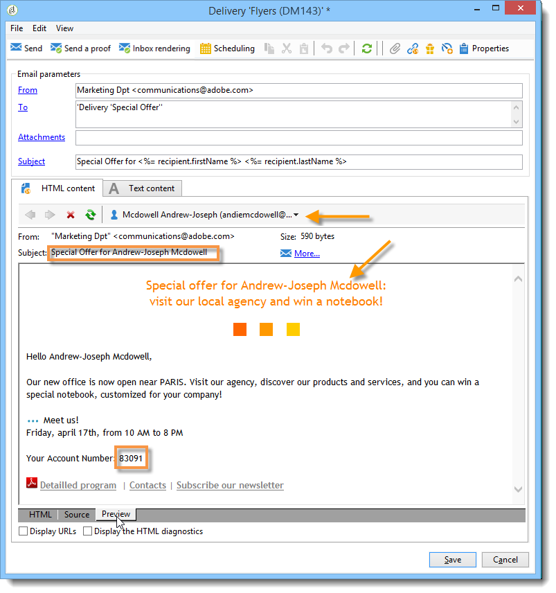

# Campos personalizados{#personalization-fields}

Los campos personalizados se utilizan para la personalización de primer nivel del contenido de los mensajes enviados. Los campos que se inserten en un contenido principal muestran la posición en la que se deben insertar los datos desde la fuente de datos seleccionada.

Por ejemplo, el campo personalizado con la sintaxis **&lt;%= recipient.LastName %>** indica a Adobe Campaign que inserte el nombre del destinatario en la base de datos (tabla de destinatarios).

 [Descubra esta función en vídeo](#personalization-fields-video)

>[!CAUTION]
>
>El contenido de los campos de personalización no puede superar los 1024 caracteres.

## Fuentes de datos {#data-sources}

Los campos personalizados pueden proceder de dos tipos de fuente de datos, según el modo de envío seleccionado:

* La base de datos de Adobe Campaign es la fuente de datos. Este es el caso más común con, por ejemplo, los “campos personalizados de destinatario”. Estos son todos los campos definidos en la lista de distribución, ya sean campos estándar (generalmente: apellidos, nombre, dirección, ciudad, fecha de nacimiento, etc.) o campos definidos por el usuario.
* Un archivo externo es la fuente de datos. Estos son todos los campos definidos en las columnas del archivo presentados como entrada durante una entrega con los datos que se encuentran en un archivo externo.

>[!NOTE]
>
>Una etiqueta personalizada de Adobe Campaign siempre tiene la siguiente forma **&lt;%=table.field%>**.

## Inserción de un campo personalizado {#inserting-a-personalization-field}

Para insertar campos personalizados, haga clic en el icono desplegable al que se puede acceder desde cualquier campo de edición de encabezado, asunto o cuerpo del mensaje.

Después de seleccionar una fuente de datos (campos de destinatario o campo de archivo), esta inclusión aparece como un comando que Adobe Campaign interpreta y al que sustituye el valor del campo para un destinatario determinado. La sustitución física se puede ver en la pestaña **[!UICONTROL Preview]**.

## Ejemplo de campos personalizados {#personalization-fields-example}

Se crea un correo electrónico en el que primero debe insertar el nombre del destinatario y, a continuación, se añade la fecha de creación del perfil en el cuerpo del mensaje. Para ello:

1. Cree una nueva entrega o abra una entrega de tipo correo electrónico ya existente.
1. En el asistente de envíos, haga clic en **[!UICONTROL Subject]** para editar el asunto del mensaje y escriba un asunto.
1. Introduzca &quot; **[!UICONTROL Special offer for]** &quot; y utilice el botón de la barra de herramientas para insertar un campo de personalización. Seleccione **[!UICONTROL Recipients>Title]**.

   

1. Repita la operación para insertar el nombre del destinatario. Inserte espacios entre todos los campos personalizados.
1. Haga clic en **[!UICONTROL OK]** para validar.
1. Inserte la personalización en el cuerpo del mensaje. Para ello, haga clic en el contenido del mensaje y haga clic en el botón de inserción de campo.
1. Seleccione **[!UICONTROL Recipient>Other...]**.

   

1. Seleccione el campo con la información que se va a mostrar y haga clic en **[!UICONTROL OK]**.

   

1. Haga clic en la pestaña **[!UICONTROL Preview]** para ver el resultado personalizado. Se debe seleccionar un destinatario para mostrar el mensaje de dicho destinatario.

   

   >[!NOTE]
   >
   >Cuando una entrega forma parte de un flujo de trabajo, se pueden utilizar los datos de la tabla de flujo de trabajo temporal. Estos datos se agrupan en el menú **[!UICONTROL Target extension]**. Para obtener más información, consulte [esta sección](../../workflow/using/data-life-cycle.md#target-data).

## Optimización de la personalización {#optimizing-personalization}

Puede optimizar la personalización mediante una opción dedicada: **[!UICONTROL Prepare the personalization data with a workflow]**, disponible en la pestaña **[!UICONTROL Analysis]** de las propiedades de envío. Para obtener más información sobre el análisis del envío, consulte [esta sección](../../delivery/using/steps-validating-the-delivery.md#analyzing-the-delivery).

Durante el análisis de envío, esta opción crea y ejecuta automáticamente un flujo de trabajo que almacena todos los datos vinculados con el objetivo en una tabla temporal, incluidos los datos de tablas vinculadas en FDA.

Marcar esta opción puede mejorar el rendimiento del análisis de envío cuando se procesan muchos datos, especialmente si los datos de personalización proceden de una tabla externa a través de FDA. Para obtener más información, consulte [Acceso a una base de datos externa (FDA)](../../installation/using/about-fda.md).

Por ejemplo, si existen problemas de rendimiento al realizar envíos a una gran cantidad de destinatarios mientras utiliza muchos campos personalizados o bloques personalizados en el contenido de sus mensajes, esta opción puede acelerar la gestión de la personalización y, por tanto, la entrega de los mensajes.

Para utilizar esta opción, siga los pasos a continuación:

1. Cree una campaña. Para obtener más información, consulte [esta sección](../../campaign/using/setting-up-marketing-campaigns.md#creating-a-campaign).
1. En la pestaña **[!UICONTROL Targeting and workflows]** de la campaña, añada una actividad **Query** al flujo de trabajo. Para obtener más información sobre esta actividad, consulte [esta sección](../../workflow/using/query.md).
1. Añada una actividad de **[!UICONTROL Email delivery]** al flujo de trabajo y ábrala. Para obtener más información sobre esta actividad, consulte [esta sección](../../workflow/using/delivery.md).
1. Vaya a la pestaña **[!UICONTROL Analysis]** de la **[!UICONTROL Delivery properties]** y seleccione la opción **[!UICONTROL Prepare the personalization data with a workflow]**.

   

1. Configure la entrega e inicie el flujo de trabajo para iniciar el análisis.

Una vez finalizado el análisis, los datos de personalización se almacenan en una tabla temporal a través de un flujo de trabajo técnico temporal que se crea sobre la marcha durante el análisis.

Este flujo de trabajo no es visible desde la interfaz de Adobe Campaign. Solo pretende ser un medio técnico para almacenar y gestionar rápidamente los datos de personalización.

Una vez completado el análisis, vaya al flujo de trabajo **[!UICONTROL Properties]** y seleccione la pestaña **[!UICONTROL Variables]**. Se puede ver el nombre de la tabla temporal que se puede utilizar para realizar una llamada SQL con el fin de mostrar las ID que contiene.

## Fase de personalización de tiempo de espera {#timing-out-personalization}

Para mejorar la protección de la entrega, puede establecer un periodo de espera para la fase de personalización.

En la pestaña **[!UICONTROL Delivery]** de **[!UICONTROL Delivery properties]**, seleccione un valor máximo en segundos para la opción **[!UICONTROL Maximum personalization run time]**.

Durante la vista previa o la entrega, si la fase de personalización supera el tiempo máximo establecido en este campo, el proceso se anula con un mensaje de error y la entrega falla.

El valor predeterminado es 5 segundos.

Si establece esta opción en 0, no va a haber límite de tiempo para la fase de personalización.

## Videotutorial {#personalization-fields-video}

Obtenga información sobre cómo agregar un campo de personalización a la línea de asunto y el contenido de un envío de correo electrónico.

>[!VIDEO](https://video.tv.adobe.com/v/24925?quality=12&captions=spa)

Hay disponibles más vídeos de procedimientos para Campaign Classic [aquí](https://experienceleague.adobe.com/docs/campaign-classic-learn/tutorials/overview.html?lang=es).
