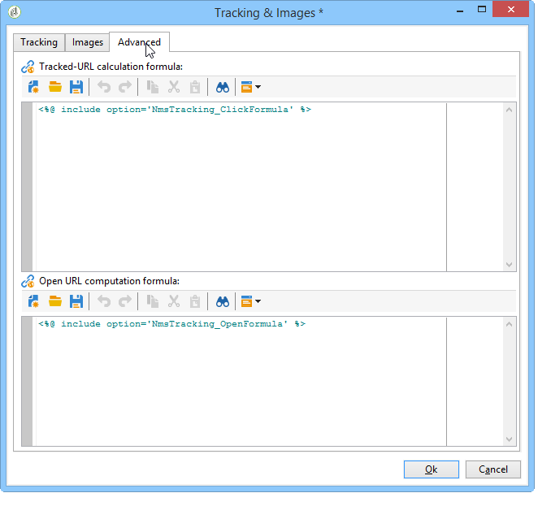

# Personalización del seguimiento de direcciones URL{#personalizing-url-tracking}

Advanced message tracking settings are accessible via the **[!UICONTROL Tracking & Images]** icon in the toolbar of the delivery wizard.

>[!NOTE]
>
>La administración de imágenes en correos electrónicos también se configura en esta ventana. Consulte [Adición de imágenes](../../delivery/using/defining-the-email-content.md#adding-images).

Puede configurar las opciones de seguimiento:

* Activación/Desactivación del seguimiento de URL para todos los mensajes.

   >[!CAUTION]
   >
   >Cuando el seguimiento no está activado en una entrega (es decir, no se ha seleccionado la opción), los informes y los datos relacionados con el seguimiento no están disponibles: **[!UICONTROL Activate tracking]** Los informes de aperturas, pulsaciones en caliente y direcciones URL seguidas no mostrarán ningún dato y no se mostrarán fichas para este envío. **[!UICONTROL Tracking logs]**

* Activación/Desactivación del seguimiento de las aperturas de mensaje.

Las direcciones URL rastreadas se enumeran en la ventana central del formulario de árbol.

Puede activar o desactivar el seguimiento individualmente para cada dirección URL del mensaje. Para obtener más información, consulte [esta sección](../../delivery/using/how-to-configure-tracked-links.md).

The **[!UICONTROL Advanced]** tab lets you personalize the calculation formulas of the tracked URLs and the opening URL.

>[!CAUTION]
>
>Los usuarios expertos pueden modificar la configuración de esta pestaña.
