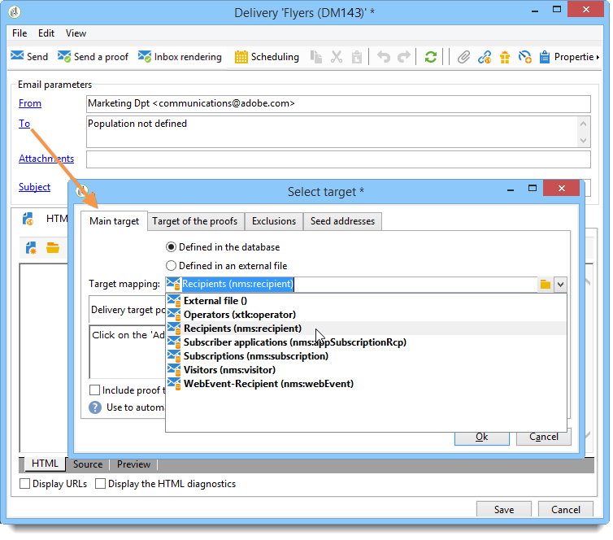

# Selección de una asignación de destino{#selecting-a-target-mapping}

De forma predeterminada, las plantillas de envío tienen como destino **[!UICONTROL Recipients]**. El destino de mapeo utiliza los campos de la tabla **nms:recipient.** Adobe Campaign ofrece otros destinos de mapeo para las entregas, que puede usar según sus necesidades.

Estos mapeos son los siguientes:

| Name | Uso | Esquema estándar |
|---|---|---|
| Recipients | Envío a destinatarios de la base de datos de Adobe Campaign | nms:recipient |
| Visitantes | Envío a los visitantes cuyos perfiles se hayan recopilado mediante recomendación (marketing viral) o a través de redes sociales (Facebook, Twitter), por ejemplo. | mns:visitor |
| Suscripciones | Envío a destinatarios suscritos a un servicio de información como un boletín informativo | nms:subscription |
| Suscripciones de visitantes | Envío a los visitantes que están suscritos a un servicio de información | nms:visitorSub |
| Servicio | Publicación en una cuenta de Twitter o en una página de Facebook | nms:service |
| Operadores | Envío a los operadores de Adobe Campaign | nms:operator |
| Archivo externo | Envío a través de un archivo que contiene toda la información necesaria para la entrega | No hay ningún esquema vinculado, no se ha introducido ningún destino |

>[!NOTE]
>
>También puede crear nuevos destinos de mapeo. Esta operación está reservada para usuarios expertos. Para obtener más información, consulte la [Guía de configuración](../../configuration/using/target-mapping.md).
