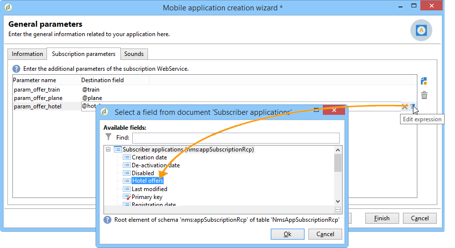
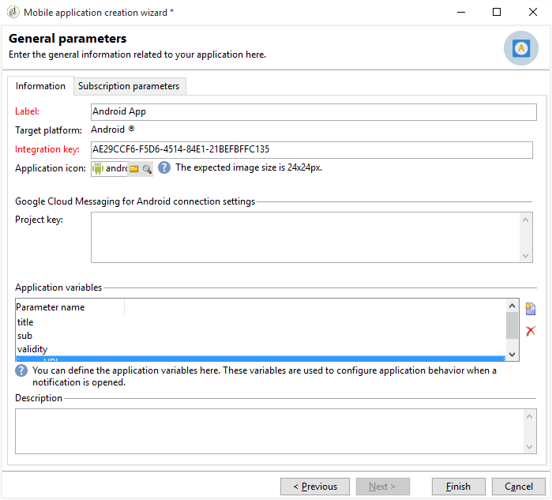
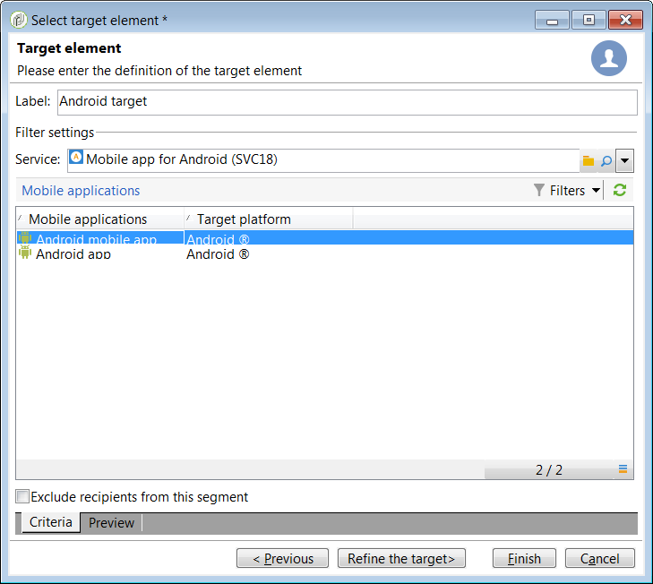

# Configuración del canal de aplicaciones para dispositivos móviles{#setting-up-mobile-app-channel}

## Introducción {#introduction}

>[!CAUTION]
>
>La implementación del canal de aplicaciones móviles deben realizarla usuarios expertos. Si necesita asistencia, póngase en contacto con su administrador de cuentas de Adobe o con su socio de servicios profesionales.

Puede crear varias versiones de la aplicación móvil (iOS, Android): la opción de canales de aplicaciones móviles permite enviar notificaciones a los terminales en los que está instalada la aplicación.

Para utilizar las funciones del canal de aplicaciones móviles de Adobe Campaign, debe cambiar/adaptar la aplicación móvil para integrarla en la plataforma de Adobe Campaign.

Hay dos SDK de Campaign Classic disponibles, uno para Android y otro para iOS, para una fácil integración de la aplicación móvil con Adobe Campaign. Se necesita un buen conocimiento técnico de Java y Objective-C. Encontrará una descripción detallada del SDK de Campaign en [Integración del SDK de Campaign en la aplicación](#integrating-campaign-sdk-into-the-mobile-application)móvil.

>[!NOTE]
>
>Las bibliotecas proporcionadas por Adobe Campaign están diseñadas para utilizarse con Xcode (iOS) y Android Studio (Android).

## Conectores {#connectors}

### Conectores iOS {#ios-connectors}

Para iOS, hay dos conectores disponibles:

* El conector binario de iOS envía notificaciones en el servidor binario APNS heredado.
* El conector HTTP/2 de iOS envía notificaciones a la APNS HTTP/2.

Para elegir el conector que desea utilizar, siga estos pasos:

1. Vaya a **[!UICONTROL Administration > Platform > External accounts]**.
1. Seleccione la cuenta externa iOS configurada anteriormente.
1. En la **[!UICONTROL Connector]** ficha, rellene el **[!UICONTROL Access URL of the connector]** campo:

   Para el conector binario de iOS: https://localhost:8080/nms/jsp/ios.jsp

   Para el conector HTTP2 de iOS: http://localhost:8080/nms/jsp/iosHTTP2.jsp

   

### Conectores de Android {#android-connectors}

Para Android, hay dos conectores disponibles:

* Conector V1, que permite una conexión por elemento secundario de MTA.
* Conector V2, que permite conexiones simultáneas con el servidor FCM para mejorar el rendimiento.

Para elegir el conector que desea utilizar, siga estos pasos:

1. Vaya a **[!UICONTROL Administration > Platform > External accounts]**.
1. Seleccione la cuenta **[!UICONTROL Android routing]** externa.
1. En la **[!UICONTROL Connector]** ficha, rellene el **[!UICONTROL JavaScript used in the connector]** campo:

   Para Android V1: https://localhost:8080/nms/jsp/androidPushConnector.js

   Para Android V2: https://localhost:8080/nms/jsp/androidPushConnectorV2.js

   

1. Para Android V2, hay un parámetro adicional disponible en el archivo de configuración de Adobe Server (serverConf.xml):

   * **maxGCMConnectPerChild**: Límite máximo de solicitudes HTTP paralelas al FCM iniciadas por cada servidor secundario (8 de forma predeterminada).

## Pasos de configuración {#configuration-steps}

### Creación de la aplicación {#creating-the-application}

Si no dispone de una aplicación móvil (aplicación), el desarrollador de la aplicación debe crearla e integrarla. Si existe la aplicación móvil, el desarrollador debe adaptarla integrando el SDK de Adobe Campaign y añadiendo la configuración específica al servicio. Para obtener una descripción del SDK, consulte [Integración del SDK de campaña en la aplicación](#integrating-campaign-sdk-into-the-mobile-application)móvil.

>[!CAUTION]
>
>La aplicación debe estar configurada para acciones push ANTES de cualquier integración con el SDK de Adobe Campaign.
>
>If this is not the case, please refer to [this page](https://developer.apple.com/library/archive/documentation/NetworkingInternet/Conceptual/RemoteNotificationsPG/).

### Recopilación de información {#collecting-information-}

Para configurar la aplicación, debe recopilar las especificaciones técnicas que definen el conjunto de parámetros que habilitan la comunicación entre Adobe Campaign y la aplicación móvil. Estos parámetros son:

* **la clave de integración**: cada aplicación tiene una clave exclusiva. Esta clave le permite vincular el servicio de Adobe Campaign y la aplicación móvil. Consulte la información [general](#general-information).
* **las variables**: define el comportamiento de la aplicación cuando activa la notificación. Consulte la información [general](#general-information).
* **los ajustes de suscripción**: de forma predeterminada, Adobe Campaign recupera el campo **@userKey**, que permite reconciliar dispositivos móviles con los destinatarios de la base de datos. Si desea recopilar datos adicionales (como una clave de ingeniería compleja), puede definir los ajustes de suscripción. Consulte Configuración [de suscripción](#subscription-settings).
* **los sonidos** (solo iOS): si el sonido seleccionado no es un sonido del sistema, el archivo de sonido debe integrarse en la aplicación móvil. Consulte los sonidos [de la aplicación](#application-sounds).
* **la URL del servidor de marketing y del servidor de seguimiento**: el administrador de Adobe Campaign debe proporcionar al programador de la aplicación las direcciones URL del servidor de marketing y las del servidor de seguimiento. Para obtener más información sobre esto, consulte: [Integración del SDK de Campaign en la aplicación](#integrating-campaign-sdk-into-the-mobile-application)móvil.

### Creación del servicio {#creating-the-service}

El administrador de Adobe Campaign debe crear y configurar un servicio vinculado a la aplicación móvil. Para obtener más información sobre esto, consulte [Configuración de la aplicación móvil en Adobe Campaign](#configuring-the-mobile-application-in-adobe-campaign).

### Prueba de la aplicación {#testing-the-application}

En iOS, es necesario crear una aplicación que utilice el modo de entorno limitado para pruebas y aprobaciones. A continuación, dentro del mismo servicio de Adobe Campaign, cree una nueva aplicación de tipo de producción e introduzca el certificado correspondiente. Para obtener más información, consulte la documentación del servicio de notificaciones de Apple.

En Android, solo es necesario crear una aplicación. Pruebe el proceso completo de suscripción y recopilación de envíos en la aplicación antes de publicarlo.

## Ruta de datos {#data-path}

Los siguientes esquemas detallan los pasos que permiten a una aplicación móvil intercambiar datos con Adobe Campaign. Este proceso consta de tres entidades:

* la aplicación móvil
* el servicio de notificación: APNS (Servicio de notificaciones push de Apple) para Apple y FCM (Firebase Cloud Messaging) para Android
* Espacio de trabajo de Adobe Campaign

Los tres pasos principales del proceso de notificación son: registro de la aplicación en Adobe Campaign (recopilación de suscripciones), envíos y seguimiento.

### Paso 1: Colección de suscripciones {#step-1--subscription-collection}

El usuario descarga la aplicación móvil desde la App Store o desde Google Play. Esta aplicación contiene la configuración de conexión (certificado de iOS y clave de proyecto para Android) y la clave de integración. La primera vez que se abre la aplicación (según la configuración), se puede pedir al usuario que introduzca la información de registro (@userKey: correo electrónico o número de cuenta). Al mismo tiempo, la aplicación pregunta al servicio de notificaciones para recopilar una ID de notificación (ID de push). Toda esta información (configuración de conexión, clave de integración, identificador de notificación, userKey) se envía a Adobe Campaign.


### Paso 2: Entrega {#step-2--delivery}

Los especialistas en marketing se dirigen a los suscriptores de la aplicación. El proceso de envío envía la configuración de conexión al servicio de notificaciones (certificado de iOS y clave de proyecto para Android), el ID de notificación (ID de push) y el contenido de la notificación. El servicio de notificaciones envía notificaciones a los terminales de destino.

La siguiente información está disponible en Adobe Campaign:

* Solo Android: número de dispositivos que muestran la notificación (impresiones)
* Android y iOS: número de clics en la notificación


El servidor de Adobe Campaign debe poder comunicarse con el servidor APNS en los puertos siguientes:

* 2195 (envío) y 2186 (servicio de comentarios) para el conector binario de iOS
* 443 para el conector HTTP/2 de iOS

Para comprobar si funciona correctamente, utilice los siguientes comandos:

* Para pruebas:

   ```
   telnet gateway.sandbox.push.apple.com
   ```

* En producción:

   ```
   telnet gateway.push.apple.com
   ```

Si se utiliza un conector binario de iOS, el MTA y el servidor web deben poder comunicarse con el APNS en el puerto 2195 (envío) y el servidor de flujo de trabajo debe poder comunicarse con el APNS en el puerto 2196 (servicio de comentarios).

Si se utiliza un conector HTTP/2 de iOS, el MTA, el servidor de flujo de trabajo y el servidor web deben poder comunicarse con el APNS en el puerto 443.

## Integración del SDK de Campaign en la aplicación móvil {#integrating-campaign-sdk-into-the-mobile-application}

Los SDK de Campaign para iOS y Android son uno de los componentes del módulo Mobile App Channel.

>[!NOTE]
>
>Para obtener el SDK de Campaign (anteriormente denominado SDK de Neolane), póngase en contacto con el servicio de atención al cliente de Adobe.

El objetivo del SDK es facilitar la integración de una aplicación móvil en la plataforma de Adobe Campaign.

Para obtener más información sobre las diferentes versiones de iOS y Android compatibles, consulte la [matriz de compatibilidad](https://helpx.adobe.com/campaign/kb/compatibility-matrix.html#MobileSDK) .

### Cargando SDK de Campaign {#loading-campaign-sdk}

* **En Android**: el archivo **neolane_sdk-release.aar** debe estar vinculado al proyecto.

   El siguiente permiso concede acceso al servidor de Adobe Campaign:

   ```
   Neolane.getInstance().setIntegrationKey("your Adobe mobile app integration key");
   Neolane.getInstance().setMarketingHost("https://yourMarketingHost:yourMarketingPort/");
   Neolane.getInstance().setTrackingHost("https://yourTrackingHost:yourTrackingPort/");
   ```

   El siguiente permiso permite recuperar una ID única del teléfono:

   ```
   <uses-permission android:name="android.permission.READ_PHONE_STATE" /> 
   ```

   A partir de la versión 1.0.24 del SDK, este permiso solo se utiliza para versiones anteriores a Android 6.0.

   A partir de la versión 1.0.26 del SDK, este permiso ya no se utiliza.

* **En iOS**: los archivos **libNeolaneSDK.a** y **Neolane_SDK.h** deben estar vinculados al proyecto. A partir de la versión 1.0.24 del SDK, la opción **ENABLE_BITCODE** está activada.

   >[!NOTE]
   >
   >Para la versión 1.0.25 del SDK, las cuatro
								arquitecturas están disponibles en el
									archivo **Neolane_SDK.h** .

### Declarar configuraciones de integración {#declaring-integration-settings}

Para integrar el SDK de Campaign en la aplicación móvil, el administrador funcional debe proporcionar la siguiente información al desarrollador:

* **Una clave de integración**: para permitir a la plataforma Adobe Campaign identificar la aplicación móvil.

   >[!NOTE]
   >
   >This integration key is entered in the Adobe Campaign console, in the **[!UICONTROL Information]** tab of service dedicated to the mobile application. Consulte la información [general](#general-information).

* **Una URL de seguimiento**: coincide con la dirección del servidor de rastreo de Adobe Campaign.
* **Una URL de marketing**: para habilitar la recopilación de suscripciones.

* **En Android**:

   ```
   Neolane.getInstance().setIntegrationKey("your Adobe mobile app integration key");
   Neolane.getInstance().setMarketingHost("https://yourMarketingHost:yourMarketingPort/");
   Neolane.getInstance().setTrackingHost("https://yourTrackingHost:yourTrackingPort/"); 
   ```

* **En iOS**:

   ```
   Neolane_SDK *nl = [Neolane_SDK getInstance];
   [nl setMarketingHost:strMktHost];
   [nl setTrackingHost:strTckHost];
   [nl setIntegrationKey:strIntegrationKey];
   ```

### Función de registro {#registration-function}

La función de registro le permite:

* Enviar la ID de notificación o ID remota a Adobe Campaign (token de dispositivo en iOS e ID de registro en Android).
* Recuperación de la clave de reconciliación o clave de usuario userKey (por ejemplo, correo electrónico o número de cuenta).

* **En Android**:

   ```
   void registerInNeolane(String registrationId, String userKey, Context context)
   {
    try{
     Neolane.getInstance().registerDevice(registrationToken, userKey, null, context);
    } catch (NeolaneException e){
     //...
    } catch (IOException e){
     //...
    }
   }
   ```

   Si se utiliza FCM (Firebase Cloud Messaging), recomendamos que se utilice la función **registerDevice** al seleccionar la función **onTokenRefresh** para notificar a Adobe Campaign del cambio en el token del dispositivo móvil del usuario.

   ```
   public class NeoTripFirebaseInstanceIDService extends FirebaseInstanceIdService {
     @Override
     public void onTokenRefresh() {
       String registrationToken = FirebaseInstanceId.getInstance().getToken();
       NeolaneAsyncRunner neolaneAs = new NeolaneAsyncRunner(Neolane.getInstance());
       ...
       ...
       // Neolane Registration
       neolaneAs.registerDevice(registrationToken, userKey, additionnalParam, this, new NeolaneAsyncRunner.RequestListener() {
       public void onComplete(String e, Object state) { ... }
       public void onNeolaneException(NeolaneException e, Object state) { ... }
       public void onIOException(IOException e, Object state) { ... }
       });
       ...
       ...
     }
   }
   ```

* **En iOS**:

   ```
   // Callback called on successful registration to the APNS
   - (void)application:(UIApplication*)application didRegisterForRemoteNotificationsWithDeviceToken:(NSData*)deviceToken
   {
       // Pass the token to Adobe Campaign
       Neolane_SDK *nl = [Neolane_SDK getInstance];
       [nl registerDevice:tokenString:self.userKey:dic];
   }
   ```

### Función de seguimiento {#tracking-function}

* **En Android**:

   Las funciones de seguimiento permiten rastrear las activaciones de notificaciones (aperturas) y las visualizaciones de notificaciones (capturas de pantalla).

   Para rastrear la visualización de notificaciones (realizada llamando a la función **notifyReceive** del SDK), siga la implementación que se muestra a continuación. Note that if you use FCM (Firebase Cloud Messaging), we advise you to use the **notifyReceive** function when the **onMessageReceived** function is called by the Android system.

   ```
   package com.android.YourApplication;
   
   import android.content.Context;
   import android.content.SharedPreferences;
   import android.os.Bundle;
   import android.util.Log;
   
   import com.google.firebase.messaging.FirebaseMessagingService;
   import com.google.firebase.messaging.RemoteMessage;
   
   import java.util.Iterator;
   import java.util.Map;
   import java.util.Map.Entry;
   
   public class YourApplicationFirebaseMessagingService extends FirebaseMessagingService {
     private static final String TAG = "MyFirebaseMsgService";
   
     @Override
     public void onMessageReceived(RemoteMessage message) {
       Log.d(TAG, "Receive message from: " + message.getFrom());
       Map<String,String> payloadData = message.getData();
       final Bundle extras = new Bundle();
       final Iterator<Entry<String, String>> iter = payloadData.entrySet().iterator();
       while(iter.hasNext())
       {
         final Entry<String, String>  entry =iter.next();
         extras.putString(entry.getKey(), entry.getValue());
       }
   
       SharedPreferences settings = this.getSharedPreferences(YourApplicationActivity.APPLICATION_PREF_NAME, Context.MODE_PRIVATE);
       String mesg = payloadData.get("_msg");
       String title = payloadData.get("title");
       String url = payloadData.get("url");
       String messageId = payloadData.get("_mId");
       String deliveryId = payloadData.get("_dId");
       YourApplicationActivity.handleNotification(this, mesg, title, url, messageId, deliveryId, extras);
     }
   }
   ```

   ```
   public static void handleNotification(Context context, String message, String title, String url, String messageId, String deliveryId, Bundle extras){
       if( message == null ) message = "No Content";
       if( title == null )   title = "No title";
       if( url == null )     url = "https://www.tripadvisor.fr";
       int iconId = R.drawable.notif_neotrip;
   
       // notify Neolane that a notification just arrived
       NeolaneAsyncRunner nas = new NeolaneAsyncRunner(Neolane.getInstance());
       nas.notifyReceive(Integer.valueOf(messageId), deliveryId, new NeolaneAsyncRunner.RequestListener() {
         public void onNeolaneException(NeolaneException arg0, Object arg1) {}
         public void onIOException(IOException arg0, Object arg1) {}
         public void onComplete(String arg0, Object arg1){}
       });
       if (yourApplication.isActivityVisible())
       {
         Log.i("INFO", "The application has the focus" );
         ...
       }
       else
       {
         // notification creation :
         NotificationManager notificationManager = (NotificationManager) context.getSystemService(Context.NOTIFICATION_SERVICE);
         Notification notification;
   
         // Activity to start :
         Intent notifIntent = new Intent(context.getApplicationContext(), NotificationActivity.class);
         notifIntent.putExtra("notificationText", message);
         notifIntent.putExtra(NotificationActivity.NOTIFICATION_URL_KEYNAME, url);
         notifIntent.putExtra("_dId", deliveryId);
         notifIntent.putExtra("_mId", messageId);
         notifIntent.addFlags(Intent.FLAG_ACTIVITY_NEW_TASK);
         PendingIntent contentIntent = PendingIntent.getActivity(context, 1, notifIntent, PendingIntent.FLAG_UPDATE_CURRENT);
   
         notification = new Notification.Builder(context)
                 .setContentTitle(title)
                 .setContentText(message)
                 .setSmallIcon(iconId)
                 .setContentIntent(contentIntent)
                 .build();
   
         // launch the notification :
         notification.flags |= Notification.FLAG_AUTO_CANCEL;
         notificationManager.notify(Integer.valueOf(messageId), notification);
       }
   }
   ```

   A continuación, se muestra un ejemplo de implementación para rastrear una apertura notificación (ejecutada llamando a la función **notifyOpening** del SDK). La clase **NotificationActivity** corresponde a la clase utilizada para crear el objeto **notifIntent** en el ejemplo anterior.

   ```
   public class NotificationActivity extends Activity {
    public static final String NOTIFICATION_URL_KEYNAME = "NotificationUrl";
    .....
    public void onCreate(Bundle savedBundle) {
     super.onCreate(savedBundle);
     setContentView(R.layout.notification_viewer);  
     .....  
     Bundle extra = getIntent().getExtras();  
     .....  
     //get the messageId and the deliveryId to do the tracking  
     String deliveryId = extra.getString("_dId");
     String messageId = extra.getString("_mId");
     if (deliveryId != null && messageId != null) {
      NeolaneAsyncRunner neolaneAs = new NeolaneAsyncRunner(Neolane.getInstance());
      neolaneAs.notifyOpening(Integer.valueOf(messageId), deliveryId, new NeolaneAsyncRunner.RequestListener() {
       public void onNeolaneException(NeolaneException arg0, Object arg1) {}
       public void onIOException(IOException arg0, Object arg1) {}
       public void onComplete(String arg0, Object arg1) {}
       });
     }
    }
   }
   ```

* **En iOS**:

   La función de seguimiento permite rastrear cuándo se activan las notificaciones (aperturas).

   ```
   (void)application:(UIApplication *)application didReceiveRemoteNotification:(NSDictionary *)launchOptions
   fetchCompletionHandler:(void (^)(UIBackgroundFetchResult))completionHandler
   {
   if( launchOptions ) { // Retrieve notification parameters here ... // Track application opening Neolane_SDK
   *nl = [Neolane_SDK getInstance]; [nl track:launchOptions:NL_TRACK_CLICK]; } 
   ...  
   completionHandler(UIBackgroundFetchResultNoData);
   }
   ```

   >[!NOTE]
   >
   >En la versión 7.0, una vez que la función **application:didReceiveRemoteNotification:fetchCompletionHandler** está implementada, el sistema operativo solo llama a esta función. Por lo tanto, no se llama a la función **application:didReceiveRemoteNotification**.

### Seguimiento de notificaciones silenciosas {#silent-notification-tracking}

iOS permite enviar notificaciones silenciosas, una notificación o datos que se envían directamente a una aplicación móvil sin mostrarlo. Adobe Campaign permite rastrearlas.

Para rastrear una notificación silenciosa, siga el ejemplo a continuación:

```
// AppDelegate.m
...
...
#import "AppDelegate.h"
#import "Neolane_SDK.h"
...
...
// Callback called when the application is already launched (whether the application is running foreground or background)
- (void)application:(UIApplication *)application didReceiveRemoteNotification:(NSDictionary *)launchOptions fetchCompletionHandler:(void (^)(UIBackgroundFetchResult))completionHandler
{
 NSLog(@"IN didReceiveRemoteNotification:fetchCompletionHandler");
 if (launchOptions) NSLog(@"IN launchOptions: %@", [launchOptions description]);
 NSLog(@"Application state: %ld", (long)application.applicationState);

 // Silent Notification (specific case, can use NL_TRACK_RECEIVE as the user doesn't have click/open the notification)
 if ([launchOptions[@"aps"][@"content-available"] intValue] == 1 )
       {
  NSLog(@"Silent Push Notification");
  ...  
  ...
  //Call receive tracking
        Neolane_SDK *nl = [Neolane_SDK getInstance];
  [nl track:launchOptions:NL_TRACK_RECEIVE];

  completionHandler(UIBackgroundFetchResultNoData); //Do not show notification
  return;
 }  
 ...
 ...
        completionHandler(UIBackgroundFetchResultNoData);
}
```

### Delegado RegisterDeviceStatus {#registerdevicestatus-delegate}

>[!NOTE]
>
>Tenga en cuenta que esto es exclusivo de iOS.

En iOS, este protocolo delegado permite obtener el resultado de la llamada a **registerDevice** y se puede utilizar para saber si se ha producido un error durante el registro.

El prototipo de **registerDeviceStatus** es:

```
- (void) registerDeviceStatus: (ACCRegisterDeviceStatus) status:(NSString *) errorReason;
```

**Status** permite saber si un registro se ha realizado correctamente o si se ha producido un error.

**ErrorReason** proporciona más información sobre los errores que se han producido. Para obtener más información sobre los errores disponibles y sus descripciones, consulte la tabla siguiente.

<table> 
 <thead>
  <tr>
   <th> Estado<br /> </th>
   <th> Descripción<br /> </th>
   <th> ErrorReason<br /> </th>
  </tr>
 </thead>
 <tbody>
  <tr>
   <td> ACCRegisterDeviceStatusSuccess <br /> </td>
   <td> Registro con éxito<br /> </td>
   <td> VACÍO<br /> </td>
  </tr>
  <tr> 
   <td> ACCRegisterDeviceStatusFailureMarketingServerHostnameEmpty <br /> </td>
   <td> El nombre de anfitrión del servidor de marketing ACC está vacío o no se ha definido.<br /> </td>
   <td> VACÍO<br /> </td>
  </tr>
  <tr> 
   <td> ACCRegisterDeviceStatusFailureIntegrationKeyEmpty <br /> </td>
   <td> La clave de integración está vacía o no se ha definido.<br /> </td>
   <td> VACÍO<br /> </td>
  </tr>
  <tr> 
   <td> ACCRegisterDeviceStatusFailureConnectionIssue<br /> </td>
   <td> Problema de conexión con ACC<br /> </td>
   <td> Más información (en el idioma actual de OS)<br /> </td>
  </tr>
  <tr> 
   <td> ACCRegisterDeviceStatusFailureUnknownUUID<br /> </td>
   <td> Se desconoce la UUID (clave de integración) proporcionada.<br /> </td>
   <td> VACÍO<br /> </td>
  </tr>
  <tr> 
   <td> ACCRegisterDeviceStatusFailureUnexpectedError<br /> </td>
   <td> Error inesperado devuelto al servidor ACC.<br /> </td>
   <td> El mensaje de error devuelto a ACC.<br /> </td>
  </tr>
 </tbody>
</table>

El protocolo **Neolane_SDKDelegate** y la definición delegada **registerDeviceStatus** son las siguientes:

```
//  Neolane_SDK.h
//  Neolane SDK
..
.. 
// Register Device Status Enum
typedef NS_ENUM(NSUInteger, ACCRegisterDeviceStatus) {
 ACCRegisterDeviceStatusSuccess,                               // Resistration Succeed
 ACCRegisterDeviceStatusFailureMarketingServerHostnameEmpty,   // The ACC marketing server hostname is Empty or not set
 ACCRegisterDeviceStatusFailureIntegrationKeyEmpty,            // The integration key is empty or not set
 ACCRegisterDeviceStatusFailureConnectionIssue,                // Connection issue with ACC, more information in errorReason
 ACCRegisterDeviceStatusFailureUnknownUUID,                    // The provided UUID (integration key) is unknown
 ACCRegisterDeviceStatusFailureUnexpectedError                 // Unexpected error returned by ACC server, more information in errorReason
};
// define the protocol for the registerDeviceStatus delegate
@protocol Neolane_SDKDelegate <NSObject>
@optional
- (void) registerDeviceStatus: (ACCRegisterDeviceStatus) status :(NSString *) errorReason;
@end
@interface Neolane_SDK: NSObject {
} 
...
...
// registerDeviceStatus delegate
@property (nonatomic, weak) id <Neolane_SDKDelegate> delegate;
...
...
@end
```

Para implementar el delegado **registerDeviceStatus**, siga estos pasos:

1. Implemente **setDelegate** durante la inicialización del SDK.

   ```
   // AppDelegate.m
   ...
   ... 
   - (BOOL)application:(UIApplication *)application didFinishLaunchingWithOptions:(NSDictionary *)launchOptions
   {
   ...
   ...
    // Get the stored settings
   
    NSUserDefaults *defaults = [NSUserDefaults standardUserDefaults];
    NSString *strMktHost = [defaults objectForKey:@"mktHost"];
    NSString *strTckHost = [defaults objectForKey:@"tckHost"];
    NSString *strIntegrationKey = [defaults objectForKey:@"integrationKey"];
    userKey = [defaults objectForKey:@"userKey"];
   
    // Configure Neolane SDK on first launch
    Neolane_SDK *nl = [Neolane_SDK getInstance];
    [nl setMarketingHost:strMktHost];
    [nl setTrackingHost:strTckHost];
    [nl setIntegrationKey:strIntegrationKey];
    [nl setDelegate:self];    // HERE
   ...
   ...
   }
   ```

1. Añada el protocolo en la **@interface** de su clase.

   ```
   //  AppDelegate.h
   
   #import <UIKit/UIKit.h>
   #import <CoreLocation/CoreLocation.h>
   #import "Neolane_SDK.h"
   
   @class LandingPageViewController;
   
   @interface AppDelegate : UIResponder <UIApplicationDelegate, CLLocationManagerDelegate, Neolane_SDKDelegate> {
       CLLocationManager *locationManager;
       NSString *userKey;
       NSString *mktServerUrl;
       NSString *tckServerUrl;
       NSString *homeURL;
       NSString *strLandingPageUrl;
       NSTimer *timer;
   }
   ```

1. Implemente el delegado en **AppDelegate**.

   ```
   //  AppDelegate.m
   
   #import "AppDelegate.h"
   #import "Neolane_SDK.h"
   #import "LandingPageViewController.h"
   #import "RootViewController.h"
   ...
   ...
   - (void) registerDeviceStatus: (ACCRegisterDeviceStatus) status :(NSString *) errorReason
   {
       NSLog(@"registerStatus: %lu",status);
   
       if ( errorReason != nil )
           NSLog(@"errorReason: %@",errorReason);
   
       if( status == ACCRegisterDeviceStatusSuccess )
       {
           // Registration successful
           ...
           ...
       }
       else { // An error occurred
           NSString *message;
           switch ( status ){
               case ACCRegisterDeviceStatusFailureUnknownUUID:
                   message = @"Unkown IntegrationKey (UUID)";
                   break;
               case ACCRegisterDeviceStatusFailureMarketingServerHostnameEmpty:
                   message = @"Marketing URL not set or Empty";
                   break;
               case ACCRegisterDeviceStatusFailureIntegrationKeyEmpty:
                   message = @"Integration Key not set or empty";
                   break;
               case ACCRegisterDeviceStatusFailureConnectionIssue:
                   message = [NSString stringWithFormat:@"%@ %@",@"Connection issue:",errorReason];
                   break;
               case ACCRegisterDeviceStatusFailureUnexpectedError:
               default:
                   message = [NSString stringWithFormat:@"%@ %@",@"Unexpected Error",errorReason];
                   break;
           }
    ...
    ...
       }
   }
   @end
   ```

### Variables {#variables}

Las variables permiten definir el comportamiento de la aplicación móvil después de recibir una notificación. These variables must be defined in the mobile application code and in the Adobe Campaign console, in the **[!UICONTROL Variables]** tab in the dedicated mobile application service (see [General information](#general-information)). A continuación, se muestra un ejemplo de código que permite a una aplicación móvil recopilar variables añadidas en una notificación. En este ejemplo, se utiliza la variable “VAR”.

* **En Android**:

   ```
   public void onReceive(Context context, Intent intent) {
        ...
       String event = intent.getStringExtra("VAR");
        ...
   }
   ```

* **En iOS**:

   ```
   - (BOOL)application:(UIApplication *)application didFinishLaunchingWithOptions:(NSDictionary *)launchOptions
   {
       ....
       if( launchOptions )
       {
           // When application is not already launched, the notification data if any are stored in the key 'UIApplicationLaunchOptionsRemoteNotificationKey'
           NSDictionary *localLaunchOptions = [launchOptions objectForKey:@"UIApplicationLaunchOptionsRemoteNotificationKey"];
           if( localLaunchOptions )
           {
            ...
            [localLaunchOptions objectForKey:@"VAR"];
           ...
           }
      }
   }
   
   // Callback called when the application is already launched (whether the application is running foreground or background)
   - (void)application:(UIApplication *)application didReceiveRemoteNotification:(NSDictionary *)launchOptions
   {
       if( launchOptions )
       {
        ...
           [launchOptions objectForKey:@"VAR"];
       }
   }
   ```

>[!CAUTION]
>
>Adobe recomienda elegir nombres de variables cortos debido a que el tamaño de notificación está limitado a 4 kB para iOS y Android.

## Configuración de la aplicación móvil en Adobe Campaign {#configuring-the-mobile-application-in-adobe-campaign}

Puede encontrar debajo un ejemplo de configuración basado en una empresa que vende paquetes festivos en línea. Su aplicación móvil (Neotrips) está disponible para sus clientes en dos versiones: Neotrips para Android y Neotrips para iOS. Para configurar la aplicación móvil en Adobe Campaign, siga los siguientes pasos:

1. Create a **[!UICONTROL Mobile application]** type [information service](#creating-the-service-and-collecting-subscriptions) for the Neotrips mobile application.
1. Añada a este servicio las versiones de iOS y Android de la aplicación.


>[!NOTE]
>
>Go to the **[!UICONTROL Subscriptions]** tab of the service to view the list of subscribers to the service, i.e. all people who have installed the application on their mobile and agreed to receive notifications.

### Creación del servicio y recopilación de suscripciones {#creating-the-service-and-collecting-subscriptions}

1. Vaya al **[!UICONTROL Profiles and Targets > Services and subscriptions]** nodo y haga clic en **[!UICONTROL New]**.

   

1. Defina un **[!UICONTROL Label]** y un **[!UICONTROL Internal name]**.
1. Vaya al **[!UICONTROL Type]** campo y seleccione **[!UICONTROL Mobile application]**.

   >[!NOTE]
   >
   >The default **[!UICONTROL Subscriber applications (nms:appSubscriptionRcp)]** target mapping is linked to the recipients table. If you want to use a different target mapping, you need to create a new target mapping and enter it in the **[!UICONTROL Target mapping]** field of the service. Para obtener más información sobre la creación de destino de mapeo, consulte la [guía de configuración](../../configuration/using/about-custom-recipient-table.md).

1. Then click the **[!UICONTROL Add]** button to define the various versions of your mobile application (iOS, Android).

   

Consulte a continuación para obtener una presentación detallada de los pasos de configuración de cada versión.

>[!NOTE]
>
>Cuando se crea una aplicación de iOS, el asistente invita a configurar la versión de desarrollo de la aplicación (entorno limitado) y la versión de producción. Una vez creadas, se añaden las dos versiones de la aplicación.

### Información general {#general-information}


1. Comience por introducir el **[!UICONTROL Label]**.
1. Make sure the same **[!UICONTROL Integration key]** is defined in Adobe Campaign and in the application code (via the SDK). Para obtener más información sobre esto, consulte: [Integración del SDK de Campaign en la aplicación](#integrating-campaign-sdk-into-the-mobile-application)móvil. Esta clave de integración, específica de cada aplicación, permite vincular la aplicación móvil con la plataforma de Adobe Campaign.
1. Si la aplicación gestiona un icono de aplicación (esquina superior izquierda de la notificación), puede añadirla aquí para que la previsualización sea más fiel al estilo real del envío. To add an image in the content (rich notification), refer to the [Rich notifications](#rich-notifications) section.

   >[!CAUTION]
   >
   >La resolución de imagen esperada es de 48 x 48 píxeles para iOS.

1. En Android, introduzca la configuración de conexión de la aplicación: escriba la clave de proyecto que proporcionó el desarrollador de la aplicación móvil.
1. Después, introduzca las variables de la aplicación.

   

   Las variables permiten definir el comportamiento de la aplicación tras recibir una notificación: por ejemplo, se puede configurar una pantalla específica de la aplicación para que se abra cuando el usuario active la notificación. Estas variables deben definirse en el código de la aplicación móvil. Click the **[!UICONTROL Add]** button to add them to Adobe Campaign.

   El asistente de envío permite definir los valores de estas variables. Consulte [Creación de notificaciones](../../delivery/using/creating-notifications.md).

### Ajustes de suscripción {#subscription-settings}

>[!NOTE]
>
>Solo es necesario configurar esta pestaña si se desean recopilar datos adicionales.



De forma predeterminada, Adobe Campaign guarda una clave en el campo **[!UICONTROL User identifier]** (@userKey) de la **[!UICONTROL Subscriber applications (nms:appSubscriptionRcp)]** tabla. Esta clave permite vincular una suscripción a un destinatario. Para recopilar datos adicionales (como una clave de acceso compleja), es necesario aplicar la siguiente configuración:

1. Create an extension of the **[!UICONTROL Subscriber applications (nms:appsubscriptionRcp)]** schema and define the new fields.
1. Defina la asignación en la **[!UICONTROL Subscription parameters]** ficha.

   >[!CAUTION]
   >
   >Make sure the configuration names in the **[!UICONTROL Subscription parameters]** tab are the same as those in the mobile application code. Consulte la sección [Integración del SDK de campaña en la aplicación](#integrating-campaign-sdk-into-the-mobile-application) móvil.

### Sonidos de la aplicación {#application-sounds}

>[!NOTE]
>
>Esta pestaña solo está disponible para las versiones de iOS de las aplicaciones.


Si la aplicación de iOS tiene sonidos incorporados, utilice esta pestaña para añadirlos. Puede utilizar el asistente de envío para seleccionar uno de los sonidos que se deben reproducir cuando se reciba la notificación. Para obtener más información sobre esto, consulte [Envío de notificaciones en iOS](../../delivery/using/creating-notifications.md#sending-notifications-on-ios).

>[!NOTE]
>
>Los sonidos del sistema también se pueden definir en esta pantalla.

In the **[!UICONTROL Application setting]** screen, the **[!UICONTROL Internal name]** field must contain the name of the file embedded in the application or the name of the system sound. The value entered in the **[!UICONTROL Label]** field will appear in the **[!UICONTROL Play a sound]** drop-down list of the delivery wizard.

### Certificado {#certificate}

>[!NOTE]
>
>Esta pestaña solo está disponible para las versiones de iOS de las aplicaciones.

En esta pantalla, introduzca la configuración de conexión de la aplicación.


Click the **[!UICONTROL Enter the certificate...]** link then select the authentication certificate and enter the password that was provided by the mobile application developer.

>[!NOTE]
>
>Asegúrese de no utilizar el mismo certificado para la versión de desarrollo (entorno limitado) y la versión de producción de la aplicación.

## Notificaciones rich {#rich-notifications}

Una notificación rich permite incluir otros tipos de medios en las notificaciones, como imágenes, vídeos, etc.

### Android {#android}

Adobe Campaign allows you to define application variables in addition to content (see [Sending notifications on Android](../../delivery/using/creating-notifications.md#sending-notifications-on-android)). Estas variables se pueden utilizar para enviar información como la URL de la imagen a la aplicación móvil. La aplicación móvil puede generar una notificación personalizada.

Primero se debe crear una aplicación móvil en Adobe Campaign y definir las variables de aplicación para dicha aplicación.

1. Vaya a **[!UICONTROL Profiles and Targets]** > **[!UICONTROL Services and Subscriptions]**.
1. Click **[!UICONTROL New]** to create a service.
1. En la **[!UICONTROL Edit]** ficha, seleccione **[!UICONTROL Mobile application]** como **[!UICONTROL Type]** y **[!UICONTROL Subscriber application]** (nms:appSubscriptionRcp) como **[!UICONTROL Target mapping]**.
1. En la **[!UICONTROL List of mobile applications that use the service]**, agregue una nueva aplicación y seleccione **[!UICONTROL Create an Android application]**.
1. Haga clic **[!UICONTROL Next]**.
1. In the **[!UICONTROL Information]** tab of the creation wizard, enter a label.
1. In the **[!UICONTROL Application variables]** field, add the parameters that you want to use for sending a rich push:

   * título
   * sub
   * valide
   * URL de imagen
   * URL de página web

1. Click **[!UICONTROL Finish]** and save the service.

   

A continuación, se debe crear una nueva plantilla de envío y vincularla a la aplicación móvil creada.

1. Vaya a **[!UICONTROL Resources]** > **[!UICONTROL Templates]** > **[!UICONTROL Delivery templates]**.
1. Duplique la **[!UICONTROL Deliver on Android]** plantilla.
1. Change the label and click **[!UICONTROL Continue]**.
1. Click the **[!UICONTROL To]** link to target the application&#39;s subscribers.
1. Cambie **[!UICONTROL Target mapping]** a **[!UICONTROL Subscriber applications (nms:appSubscriptionRcp)]**.

   

1. Haga clic en **[!UICONTROL Add]**, seleccione **[!UICONTROL Subscribers of an Android mobile application]** y haga clic en **[!UICONTROL Next]**.
1. Introduzca una etiqueta, seleccione el servicio que ha creado y la aplicación móvil creada en este servicio.

   

1. Haga clic **[!UICONTROL Finish]**.

Los parámetros que ha creado en la aplicación móvil se muestran en el campo **Variables de aplicación**.


Finalmente, cree un nuevo envío de Android y añada los valores que desee para los parámetros definidos en la aplicación móvil.

1. Vaya a **[!UICONTROL Campaign management]** > **[!UICONTROL Deliveries]**.
1. Haga clic **[!UICONTROL New]**.
1. Select the delivery template that you just created and click **[!UICONTROL Continue]**.
1. In the **[!UICONTROL Application variables]** field, add the values of your choice for the different parameters.

   

1. Click **[!UICONTROL Save]** and send your delivery.

La imagen y la página web deberían aparecer en la notificación push cuando se reciban en los dispositivos móviles Android de los suscriptores.

### iOS {#ios}

Con iOS 10 o posterior, es posible generar notificaciones rich. Adobe Campaign puede enviar notificaciones mediante variables que permiten al dispositivo mostrar una notificación rich.

>[!NOTE]
>
>Si desea utilizar notificaciones rich, debe utilizar el conector HTTP/2 de iOS. Refer to the [Connectors](#connectors) section.

En Adobe Campaign, los siguientes parámetros deben enviarse a la aplicación móvil:

* Check the **[!UICONTROL Mutable content]** box in the edit notification window. Esto permite que la aplicación móvil descargue contenido multimedia.
* The **[!UICONTROL Category]** field must be set. El valor debe coincidir con una de las extensiones de contenido de la aplicación móvil (parámetro **UNNotificationExtensionCategory**).
* En las variables de la aplicación, añada la URL del archivo multimedia que desea que la aplicación móvil descargue y muestre.

   

Para implementar notificaciones rich en la aplicación móvil, debe añadir las siguientes extensiones al proyecto:

* Extensión de servicio de notificaciones
* Extensión de contenido de notificaciones (una o más en función de su implementación)

**Extensión de servicio de notificaciones**

Los medios deben descargarse en el nivel de extensión del servicio de notificación.

```
#import "NotificationService.h"

@interface NotificationService ()

@property (nonatomic, strong) void (^contentHandler)(UNNotificationContent *contentToDeliver);
@property (nonatomic, strong) UNMutableNotificationContent *bestAttemptContent;

@end

@implementation NotificationService

- (void)didReceiveNotificationRequest:(UNNotificationRequest *)request withContentHandler:(void (^)(UNNotificationContent * _Nonnull))contentHandler {
    NSDictionary *userInfo = nil;
    NSString *url = nil;

    self.contentHandler = contentHandler;
    self.bestAttemptContent = [request.content mutableCopy];

    userInfo = request.content.userInfo;
    if ( userInfo != nil )
    {
        url = userInfo[@"mediaUrl"];  // Get the url of the media to download (Adobe Campaign additional variable)
    }
    ...
    // Perform the download to local storage
```

**Extensión de contenido de notificación**

A este nivel, es necesario:

* Asocie la extensión de contenido a la categoría enviada por Adobe Campaign:

   Si desea que la aplicación móvil muestre una imagen, puede establecer el valor de la categoría en “imagen” en Adobe Campaign y crear en la aplicación móvil una extensión de notificación con el parámetro **UNNotificationExtensionCategory** establecido en “imagen”. Cuando se recibe la notificación push en el dispositivo, se llama a la extensión según el valor de categoría definido.

* Definición del diseño de la notificación

   Se debe definir el diseño con elementos gráficos relevantes. Para una imagen, el elemento gráfico se denomina **UIImageView**.

* Visualización de sus medios

   Se debe añadir código para enviar los datos de medios al widget. A continuación, se muestra un ejemplo de código para una imagen:

   ```
   #import "NotificationViewController.h"
   #import <UserNotifications/UserNotifications.h>
   #import <UserNotificationsUI/UserNotificationsUI.h>
   
   @interface NotificationViewController () <UNNotificationContentExtension>
   
   @property (strong, nonatomic) IBOutlet UIImageView *imageView;
   @property (strong, nonatomic) IBOutlet UILabel *notifContent;
   @property (strong, nonatomic) IBOutlet UILabel *label;
   
   @end
   
   @implementation NotificationViewController
   
   - (void)viewDidLoad {
       [super viewDidLoad];
       // Do any required interface initialization here.
   }
   
   - (void)didReceiveNotification:(UNNotification *)notification {
       self.label.text = notification.request.content.title;
       self.notifContent.text = notification.request.content.body;
       UNNotificationAttachment *attachment = [notification.request.content.attachments objectAtIndex:0];
       if ([attachment.URL startAccessingSecurityScopedResource])
       {
         NSData * imageData = [[NSData alloc] initWithContentsOfURL:attachment.URL];
         self.imageView.image =[UIImage imageWithData: imageData];
         [attachment.URL stopAccessingSecurityScopedResource];
       }
   }
   @end
   ```
