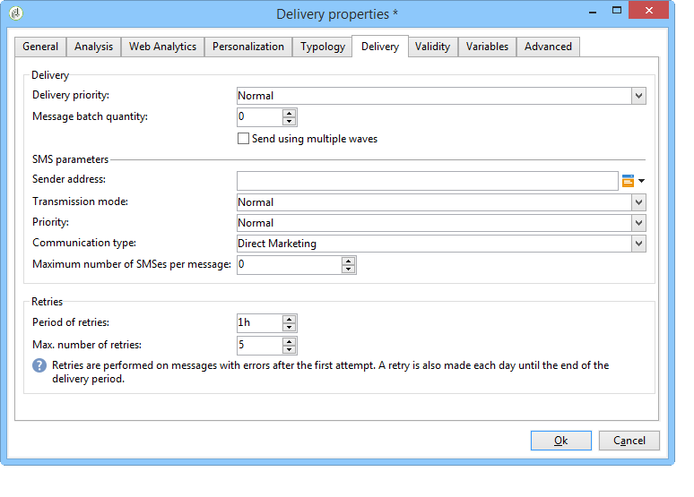

# Canal de SMS{#sms-channel}

Adobe Campaign le permite realizar envíos personalizados y masivos de mensajes SMS. Los perfiles de destinatario deben contener al menos un número de teléfono móvil.

>[!NOTE]
>
>Adobe Campaign también permite enviar notificaciones a los terminales móviles a través de su opción **Adobe Campaign Mobile App Channel (NMAC)**.
> 
>Para obtener más información sobre esto, consulte la sección [Acerca del canal](../../delivery/using/about-mobile-app-channel.md) de la aplicación móvil.

Las secciones a continuación proporcionan información específica del canal SMS. For global information on how to create a delivery, refer to [this section](../../delivery/using/steps-about-delivery-creation-steps.md).

## Configuración del canal SMS {#setting-up-sms-channel}

Para enviar a un teléfono móvil, necesita:

1. una cuenta externa que especifique un conector y el tipo de mensaje.

   Los conectores disponibles son: NetSize, Generic SMPP (SMPP versión 3.4 compatible con modo binario), Sybase365 (SAP SMS 365), CLX Communications, Tele2, O2 y Extended genérico SMPP.

1. Una plantilla de envío en la que se haga referencia a esta cuenta externa.

### Activación de una cuenta externa {#activating-an-external-account}

The list of external accounts can be found in the **[!UICONTROL Platform]** > **[!UICONTROL External accounts]** node of the Adobe Campaign explorer tree.

* For example, go to the default account called **[!UICONTROL NetSize mobile delivery]**.
* En la **[!UICONTROL General]** ficha, marque la **[!UICONTROL Enabled]** casilla.

   

* Compruebe que la **[!UICONTROL Mobile]** opción está seleccionada para el **[!UICONTROL Channel]** campo.
* En la **[!UICONTROL Mobile]** ficha, seleccione un conector en la lista desplegable: NetSize, Generic SMPP, Sybase365 (SAP SMS 365), CLX Communications, Tele2, O2 o Extended genérico SMPP. Para obtener más información sobre el conector SMPP genérico ampliado, consulte la sección [Creación de una cuenta](#creating-an-smpp-external-account) externa de SMPP.

   

* Configure el conector según la información proporcionada por el proveedor. En el siguiente ejemplo, el operador es NetSize.

   

* En la **[!UICONTROL Connector]** ficha, deje el modo de activación **[!UICONTROL Call Web Service]** seleccionado de forma predeterminada.

   

* If the **[!UICONTROL Connector]** tab is displayed, specify the access URL for the connector. The address must end in **netsize.jsp** if your provider is NetSize. For all other connectors, the URL address ends in **smpp34.jsp**.

### Creación de una cuenta externa SMPP {#creating-an-smpp-external-account}

Si desea utilizar el protocolo SMPP, también puede crear una nueva cuenta externa.

Para obtener más información sobre el protocolo y la configuración SMS, consulte esta [nota técnica](https://helpx.adobe.com/campaign/kb/sms-connector-protocol-and-settings.html).

Para realizar esto, siga los pasos a continuación:

1. En el nodo **[!UICONTROL Platform]** > **[!UICONTROL External accounts]** del árbol, haga clic en el **[!UICONTROL New]** icono .
1. Defina el tipo de cuenta como **Enrutamiento**, el canal como **Móvil (SMS)** y el modo de envío como **Envío masivo**.

   

1. Marque la **[!UICONTROL Enabled]** casilla.
1. En la **[!UICONTROL Mobile]** ficha, seleccione **[!UICONTROL Extended generic SMPP]** en la lista **[!UICONTROL Connector]** desplegable.

   

   The **[!UICONTROL Enable verbose SMPP traces in the log file]** option allows you to dump all SMPP traffic in log files. Esta opción debe habilitarse para solucionar los problemas del conector y comparar el tráfico que ve el proveedor.

1. Contact your SMS service provider who will explain to you how to complete the different external account fields from the **[!UICONTROL Connection settings]** tab.

   Then, contact your provider, depending on the one chosen, who will give you the value to enter into the **[!UICONTROL SMSC implementation name]** field.

   Puede definir el número de conexiones al proveedor por MTA secundario. De forma predeterminada, se establece en 1.

1. De forma predeterminada, el número de caracteres de un SMS cumple los estándares de GSM.

   Los mensajes SMS con codificación GSM están limitados a 160 caracteres, o a 153 caracteres por SMS en el caso de los mensajes enviados en varias partes.

   >[!NOTE]
   >
   >Algunos caracteres cuentan como dos (llaves, corchetes, símbolo del euro, etc.).
   >
   >A continuación, se presenta la lista de caracteres GSM disponibles.

   Si lo desea, puede autorizar la transliteración de caracteres marcando el cuadro correspondiente.

   

   Para obtener más información, consulte [esta sección](#about-character-transliteration).

1. In the **[!UICONTROL Throughput and delays]** tab, you can specify the maximum throughput of outbound messages (&quot;MT&quot;, Mobile Terminated) in MT per second. Si introduce “0” en el campo correspondiente, el rendimiento es ilimitado.

   Los valores de todos los campos correspondientes a las duraciones deben rellenarse en segundos.

1. In the **[!UICONTROL Mapping of encodings]** tab, you can define encodings.

   Para obtener más información, consulte [esta sección](#about-text-encodings).

1. En la **[!UICONTROL SMSC specificities]** ficha, la **[!UICONTROL Send full phone number]** opción está deshabilitada de forma predeterminada. No la habilite si desea respetar el protocolo de SMPP y transferir únicamente dígitos al servidor del proveedor de SMS (SMSC).

   Sin embargo, dado que determinados proveedores requieren el uso del prefijo “+”. se recomienda que se ponga en contacto con su proveedor y que este le recomiende si es necesario activar esta opción.

   The **[!UICONTROL Enable TLS over SMPP]** checkbox allows you to encrypt SMPP traffic. Para 
                            obtener más información, consulte este [artículo técnico](https://helpx.adobe.com/campaign/kb/sms-connector-protocol-and-settings.html).

1. If you are configuring an **[!UICONTROL Extended generic SMPP]** connector, you can set up automatic replies.

   Para obtener más información, consulte [esta sección](#automatic-reply).

### Acerca de la transliteración de caracteres {#about-character-transliteration}

Character transliteration can be set up in a SMPP mobile delivery external account, under the **[!UICONTROL Mobile]** tab.

La transliteración consiste en reemplazar un carácter de un SMS por otro cuando el estándar GSM no tiene en cuenta dicho carácter.

* If transliteration is **[!UICONTROL authorized]**, each character that is not taken into account is replaced by a GSM character when the message is sent. Por ejemplo, la letra “ë” se sustituye por “e”. Por lo tanto, el mensaje se altera ligeramente, pero el límite de caracteres se mantiene.
* When transliteration is **[!UICONTROL not authorized]**, each message that contains characters that are not taken into account is sent in binary format (Unicode): all of the characters are therefore sent as they are. Sin embargo, los mensajes SMS con Unicode están limitados a 70 caracteres (o 67 caracteres por SMS en el caso de los mensajes enviados en varias partes). Si se supera el número máximo de caracteres, se envían varios mensajes, lo que puede suponer costes adicionales.

>[!CAUTION]
>
>La inserción de campos personalizados en el contenido del mensaje SMS puede introducir caracteres que no se tienen en cuenta con la codificación GSM.

De forma predeterminada, la transliteración de caracteres está desactivada. Si desea que todos los caracteres de los mensajes SMS se mantengan tal cual, para, por ejemplo, no modificar los nombres propios, es recomendable que no habilite esta opción.

Sin embargo, si los mensajes SMS contienen muchos caracteres que generan mensajes Unicode, puede optar por activar esta opción para limitar los costes de envío de mensajes.

La siguiente tabla presenta los caracteres que tiene cuenta el estándar GSM. Todos los caracteres insertados en el cuerpo del mensaje que no sean los mencionados abajo convierten todo el mensaje a formato binario (Unicode) y lo limitan a 70 caracteres.

**Caracteres básicos**

<table> 
 <tbody> 
  <tr> 
   <td> @ </td> 
   <td>  </td> 
   <td> SP </td> 
   <td> 0 </td> 
   <td> ¡ </td> 
   <td> P </td> 
   <td> ¿ </td> 
   <td> p </td> 
  </tr> 
  <tr> 
   <td> £ </td> 
   <td> _ </td> 
   <td> ! </td> 
   <td> 1 </td> 
   <td> A </td> 
   <td> Q </td> 
   <td> a </td> 
   <td> q </td> 
  </tr> 
  <tr> 
   <td> $ </td> 
   <td>  </td> 
   <td> " </td> 
   <td> 2 </td> 
   <td> B </td> 
   <td> R </td> 
   <td> b </td> 
   <td> r </td> 
  </tr> 
  <tr> 
   <td> ¥ </td> 
   <td>  </td> 
   <td> # </td> 
   <td> 3 </td> 
   <td> C </td> 
   <td> S </td> 
   <td> c </td> 
   <td> s </td> 
  </tr> 
  <tr> 
   <td> è </td> 
   <td>  </td> 
   <td> ¤ </td> 
   <td> 4 </td> 
   <td> D </td> 
   <td> T </td> 
   <td> d </td> 
   <td> t </td> 
  </tr> 
  <tr> 
   <td> é </td> 
   <td>  </td> 
   <td> % </td> 
   <td> 5 </td> 
   <td> E </td> 
   <td> U </td> 
   <td> e </td> 
   <td> u </td> 
  </tr> 
  <tr> 
   <td> ù </td> 
   <td>  </td> 
   <td> &amp; </td> 
   <td> 6 </td> 
   <td> F </td> 
   <td> V </td> 
   <td> f </td> 
   <td> v </td> 
  </tr> 
  <tr> 
   <td> ì </td> 
   <td>  </td> 
   <td> ' </td> 
   <td> 7 </td> 
   <td> G </td> 
   <td> W </td> 
   <td> g </td> 
   <td> w </td> 
  </tr> 
  <tr> 
   <td> ò </td> 
   <td>  </td> 
   <td> ( </td> 
   <td> 8 </td> 
   <td> H </td> 
   <td> X </td> 
   <td> h </td> 
   <td> x </td> 
  </tr> 
  <tr> 
   <td> Ç </td> 
   <td>  </td> 
   <td> ) </td> 
   <td> 9 </td> 
   <td> I </td> 
   <td> Y </td> 
   <td> i </td> 
   <td> y </td> 
  </tr> 
  <tr> 
   <td> LF </td> 
   <td>  </td> 
   <td> * </td> 
   <td> : </td> 
   <td> J </td> 
   <td> Z </td> 
   <td> j </td> 
   <td> z </td> 
  </tr> 
  <tr> 
   <td> Ø </td> 
   <td> ESC </td> 
   <td> + </td> 
   <td> ; </td> 
   <td> K </td> 
   <td> Ä </td> 
   <td> k </td> 
   <td> ä </td> 
  </tr> 
  <tr> 
   <td> ø </td> 
   <td> Æ </td> 
   <td> , </td> 
   <td> &lt; </td> 
   <td> L </td> 
   <td> Ö </td> 
   <td> l </td> 
   <td> ö </td> 
  </tr> 
  <tr> 
   <td> CR </td> 
   <td> æ </td> 
   <td> - </td> 
   <td> = </td> 
   <td> M </td> 
   <td> Ñ </td> 
   <td> m </td> 
   <td> ñ </td> 
  </tr> 
  <tr> 
   <td> Å </td> 
   <td> ß </td> 
   <td> . </td> 
   <td> &gt; </td> 
   <td> N </td> 
   <td> Ü </td> 
   <td> n </td> 
   <td> ü </td> 
  </tr> 
  <tr> 
   <td> å </td> 
   <td> É </td> 
   <td> / </td> 
   <td> ? </td> 
   <td> O </td> 
   <td> § </td> 
   <td> o </td> 
   <td> à </td> 
  </tr> 
 </tbody> 
</table>

SP: Espacio

ESC: Escape

LF: Fuente de línea

CR: Retorno de carro

**Caracteres avanzados (se cuentan dos veces)**

^ { } `[ ~ ]` | €

### Acerca de las codificaciones de texto {#about-text-encodings}

Al enviar un mensaje SMS, Adobe Campaign puede utilizar una o varias codificaciones de texto. Cada codificación tiene su propio conjunto de caracteres específico y determina el número de caracteres que caben en un mensaje SMS.

When configuring a new SMPP mobile delivery external account, you can define the **[!UICONTROL Mapping of encodings]** in the **[!UICONTROL Mobile]** tab: the **[!UICONTROL data_coding]** field allows Adobe Campaign to communicate which encoding is used to the SMSC.

>[!NOTE]
>
>La asignación entre el valor **data_coding** y la codificación utilizada está estandarizada. Sin embargo, ciertos SMSC tienen su propia asignación específica: en este caso, el administrador de **Adobe Campaign** debe declarar esta asignación. Consulte a su proveedor para obtener más información.

Puede declarar **data_codings** y forzar la codificación si es necesario: para ello, especifique una sola codificación en la tabla.

* Cuando no se define ninguna asignación de codificaciones, el conector asume un comportamiento genérico:

   * se intenta utilizar la codificación GSM para asignar el valor **data_coding = 0**.
   * Si la codificación GSM falla, se utiliza la codificación **UCS2** a la que asigna el valor **data_coding = 8**.

* When you define the encodings that you would like to use as well as the linked **[!UICONTROL data_coding]** field values, Adobe Campaign will try to use the first encoding in the list, then the following, if the first encoding proves impossible.

>[!CAUTION]
>
>El orden de la declaración es importante: se recomienda que coloque la lista en orden ascendente **según el coste** con el fin de priorizar las codificaciones que le permitan introducir tantos caracteres como sea posible en cada mensaje SMS.
>
>Solo declare las codificaciones que desee utilizar. Si algunas de las codificaciones proporcionadas por SMSC no se corresponden con su propósito, no las declare en la lista.

### Respuesta automática {#automatic-reply}

Al configurar un conector SMPP genérico extendido, puede configurar las respuestas automáticas.

When a subscriber replies to an SMS message which was sent to them via Adobe Campaign and their message contains a keyword such as &quot;STOP&quot;, you can configure messages which are automatically sent back to them in the **[!UICONTROL Automatic reply sent to the MO]** section.

>[!NOTE]
>
>Las palabras clave no distinguen entre mayúsculas y minúsculas.

Para cada palabra clave, especifique un código corto, que es un número que suele utilizarse para realizar envíos y sirve como nombre de remitente, e indique el mensaje que se envía al suscriptor.

You can also link an action to your automatic response: **[!UICONTROL Send to quarantine]** or **[!UICONTROL Remove from quarantine]**. Por ejemplo, si un destinatario envía la palabra clave “Detener”, se le envía automáticamente una confirmación de baja y se le incluye en la lista negra.


If you link the **[!UICONTROL Remove from quarantine]** action to an automatic response, the recipients sending the corresponding keyword are automatically removed from quarantine.

Los destinatarios se muestran en la **[!UICONTROL Non deliverables and addresses]** tabla disponible a través del menú **[!UICONTROL Administration]** > **[!UICONTROL Campaign Management]** > **[!UICONTROL Non deliverables Management]** .

* To send the same reply no matter what the short code, leave the **[!UICONTROL Short code]** column empty.
* To send the same reply no matter what the keyword, leave the **[!UICONTROL Keyword]** column empty.
* To carry out an action without sending a response, leave the **[!UICONTROL Response]** column empty. Por ejemplo, esto le permite sacar de cuarentena a un usuario que responda con un mensaje que sea distinto a Detenerse.

Si tiene varias cuentas externas usando el conector SMPP genérico ampliado con la misma cuenta de proveedor, puede ocurrir el siguiente problema: al enviar una respuesta a un código corto, puede recibirse en cualquiera de las conexiones de cuenta externas. En consecuencia, la respuesta automática que se envía no puede ser el mensaje esperado.
Para evitarlo, aplique una de las siguientes soluciones, según el proveedor que esté utilizando:
* Cree una cuenta de proveedor para cada cuenta externa.
* Utilice el **[!UICONTROL System type]** campo de la ficha **[!UICONTROL Mobile]** > **[!UICONTROL Connection settings]** para distinguir cada código corto. Pida a su proveedor un valor diferente para cada cuenta.

   

Los pasos para configurar una cuenta externa mediante el conector SMPP genérico ampliado se detallan en la sección [Creación de una cuenta](../../delivery/using/sms-channel.md#creating-an-smpp-external-account) externa de SMPP.

### Modificación de la plantilla de envío {#changing-the-delivery-template}

Adobe Campaign proporciona una plantilla para los envíos a móviles. Esta plantilla está disponible en el **[!UICONTROL Resources > Templates > Delivery templates]** nodo. For more on this, refer to the [About templates](../../delivery/using/about-templates.md) section.

Para realizar envíos a través del canal SMS, debe crear una plantilla en la que se haga referencia al conector de canal.

Para conservar la plantilla de envío nativa, recomendamos que la duplique y, a continuación, la configure.

En el siguiente ejemplo, creamos una plantilla para enviar mensajes a través de la cuenta NetSize activada anteriormente. Para ello:

1. Vaya al **[!UICONTROL Delivery templates]** nodo.
1. Haga clic con el botón derecho en la **[!UICONTROL Send to mobiles]** plantilla y seleccione **[!UICONTROL Duplicate]**.

   

1. Modifique la etiqueta de la plantilla.

   

1. Haga clic **[!UICONTROL Properties]**.
1. In the **[!UICONTROL General]** tab, select a routing mode that corresponds to an external account that you configured, for example **[!UICONTROL NetSize mobile delivery]**.

   

1. Haga clic en **[!UICONTROL Save]** para crear la plantilla.

   

Ahora tiene una cuenta externa y una plantilla de envío que le permiten realizar envíos a través de SMS.

## Creación de un envío por SMS {#creating-a-sms-delivery}

### Selección del canal de envío {#selecting-the-delivery-channel}

Para diseñar un envío de SMS nuevo, siga los pasos a continuación:

>[!NOTE]
>
>En [esta sección](../../delivery/using/steps-about-delivery-creation-steps.md) se exponen conceptos globales sobre la creación de envíos.

1. Cree un nuevo envío, por ejemplo, desde el panel Envío.
1. Seleccione la plantilla de envío **[!UICONTROL Send to mobiles (NetSize)]** que creó anteriormente. For more on this, refer to the [Changing the delivery template](#changing-the-delivery-template) section.

   

1. Identifique su envío con una etiqueta, un código y una descripción. Para obtener más información, consulte [esta sección](../../delivery/using/steps-create-and-identify-the-delivery.md#identifying-the-delivery).
1. Click **[!UICONTROL Continue]** to confirm this information and display the message configuration window.

## Definición del contenido del SMS {#defining-the-sms-content}

Para crear el contenido del SMS, siga los pasos a continuación:

1. Enter the content of the message in the **[!UICONTROL Text content]** section of the wizard. Los botones de la barra de herramientas permiten importar, guardar o buscar dentro del contenido. El último botón se utiliza para insertar campos personalizados.

   

   The use of personalization fields is presented in the [About personalization](../../delivery/using/about-personalization.md) section.

1. Click **[!UICONTROL Preview]** at the bottom of the page to view the rendering of the message with its personalization. To launch the preview, select a recipient using the **[!UICONTROL Test personalization]** button in the toolbar. Puede seleccionar un destinatario del público objetivo definido o elegir otro destinatario.

   

   Puede aprobar el mensaje SMS. También puede ver el contenido del SMS en la pantalla del teléfono móvil que aparece a la derecha del editor de contenido. Haga clic en la pantalla y utilice el ratón para desplazarse por el contenido.

   

1. Click the **[!UICONTROL Data loaded]** link to view the information concerning the recipient.

   

   >[!NOTE]
   >
   >Los mensajes SMS se limitan a una longitud de 160 caracteres si se utiliza la página de códigos Latin-1 (ISO-8859-1). Si el mensaje se escribe en Unicode, no debe exceder los 70 caracteres. Algunos caracteres especiales pueden afectar la longitud del mensaje. For more information on message length, refer to the [About character transliteration](#about-character-transliteration) section.
   >
   >Cuando hay campos personalizados o campos de contenido condicional, el tamaño del mensaje varía según el destinatario. La longitud del mensaje debe evaluarse cuando se haya realizado la personalización.
   >
   >Al iniciar el análisis, se comprueba la longitud de los mensajes y se muestra una advertencia en caso de contenidos adicionales.

1. Si utiliza el conector NetSize o un conector SMPP, puede personalizar el nombre del remitente del envío. For more on this, refer to the [Advanced parameters](#advanced-parameters) section.

## Selección de la población objetivo {#selecting-the-target-population}

En [esta sección](../../delivery/using/steps-defining-the-target-population.md) se describe el proceso detallado al seleccionar la población objetivo de un envío.

For more on the use of personalization fields, refer to [About personalization](../../delivery/using/about-personalization.md).

For more on the inclusion of a seed list, refer to [About seed addresses](../../delivery/using/about-seed-addresses.md).

## Envío de mensajes SMS {#sending-sms-messages}

To approve your message and send it to the recipients of the delivery being created, click **[!UICONTROL Send]**.

El proceso detallado para validar y realizar un envío se presenta en las siguientes secciones:

* [Validación del envío](../../delivery/using/steps-validating-the-delivery.md)
* [Realización del envío](../../delivery/using/steps-sending-the-delivery.md)

### Parámetros avanzados {#advanced-parameters}

The **[!UICONTROL Properties]** button gives access to the advanced delivery parameter. The parameters specific to SMS deliveries are in the **[!UICONTROL SMS parameters]** section of the **[!UICONTROL Delivery]** tab.

Estas son las opciones disponibles:

* **Dirección del remitente** (solo para conectores NetSize y SMPP): permite personalizar el nombre del remitente del envío con una cadena de caracteres alfanuméricos limitada a 11 caracteres. El campo no debe estar compuesto exclusivamente por números. Puede definir una condición para mostrar, por ejemplo, nombres distintos según el código de zona del destinatario:

   ```
   <% if( String(recipient.mobilePhone).indexOf("+1") == 0){ %>NeoShopUS<%} else %>
   ```

   >[!CAUTION]
   >
   >Compruebe la legislación de su país sobre la edición de nombres de remitente. También debe consultar si su operador ofrece esta funcionalidad.

* **Modo de transmisión**: transmisión de mensaje por SMS.
* **Prioridad**: nivel de importancia asignado a un mensaje. **[!UICONTROL Normal]** la prioridad está seleccionada de forma predeterminada. Ask your service provider about the cost of SMS sent with **[!UICONTROL High]** priority.
* **Tipo de aplicación**: elija la aplicación que desea asignar a su envío de SMS. The **[!UICONTROL Direct Marketing]** option is selected by default and is the most common one used.

**Parámetros específicos del conector NetSize**



* **Utilizar varios SMS para un único mensaje**: esto le permite enviar un mensaje de más de 160 caracteres mediante varios mensajes SMS.

**Parámetros específicos de un conector SMPP**


* **Cantidad máxima de SMS por mensaje**: esta opción le permite establecer la cantidad de SMS que debe utilizar para enviar un mensaje. Si el número se establece en 0, puede utilizar un SMS para enviar el mensaje. Si el número de SMS se establece en 1 o 2 por ejemplo y el mensaje supera este umbral, no se envía.

## Supervisión y seguimiento de los envíos de SMS {#monitoring-and-tracking-sms-deliveries}

Después de enviar mensajes, puede monitorizar y realizar un seguimiento de los envíos. Para obtener más información, consulte estas secciones:

* [Seguimiento de un envío](../../delivery/using/monitoring-a-delivery.md)
* [Comprensión de los errores de envío](../../delivery/using/understanding-delivery-failures.md)
* [Acerca del seguimiento de mensajes](../../delivery/using/about-message-tracking.md)

## Procesamiento de mensajes entrantes {#processing-inbound-messages}

El módulo **nlserver sms** consulta al enrutador SMS a intervalos regulares. Esto permite a Adobe Campaign realizar un seguimiento del progreso de los envíos y controlar los informes de estado y las solicitudes de baja de los destinatarios.

* **Informes de estado**: vea los “logs” de envío para comprobar el estado de los mensajes.

   >[!NOTE]
   >
   >Cada SMS enviado se vincula a una cuenta externa con su clave principal. De este modo:
   >
   > * Los informes de estado de una cuenta de SMS externa eliminada no se procesan correctamente.
   > * Una cuenta SMS solo se puede vincular a una cuenta externa única para garantizar que los informes de estado se atribuyen a la cuenta correcta


* **Baja**: los destinatarios que deseen dejar de recibir envíos SMS pueden devolver un mensaje que contenga la palabra STOP. Si su proveedor lo permite en los términos del contrato, puede recuperar mensajes mediante la actividad de flujo de trabajo de los **SMS de entrada** y, a continuación, crear una consulta para activar la opción **No volver a ponerse en contacto con este destinatario** para los destinatarios correspondientes.

   Consulte la guía [Flujos de trabajo](../../workflow/using/executing-a-workflow.md#architecture).

## Esquema InSMS {#insms-schema}

El esquema InSMS contiene información relacionada con los SMS entrantes. Una descripción de estos campos está disponible a través del atributo desc.

* **message**: contenido del SMS recibido.
* **origin**: número de móvil de origen del mensaje.
* **providerId**: identificador del mensaje devuelto por el SMSC (centro de mensajes).
* **created**: fecha en la que se insertó el mensaje entrante en Adobe Campaign.
* **extAccount**: Cuenta externa de Adobe Campaign.

   >[!CAUTION]
   >
   >Los campos siguientes son específicos de NetSize.
   >
   >Si el operador utilizado no es NetSize, estos campos se consideran vacíos.

* **alias**: alias del mensaje entrante.
* **separator**: separador entre el alias y el cuerpo del mensaje.
* **messageDate**: fecha del mensaje dada por el operador.
* **receivalDate**: fecha en la que se recibió el mensaje del operador en el SMSC (centro de mensajes).
* **deliveryDate**: fecha en la que se envió el mensaje del SMSC (centro de mensajes).
* **largeAccount**: código de cuenta de cliente vinculada al SMS entrante.
* **countryCode**: código de país del operador.
* **operatorCode**: código de red del operador.
* **linkedSmsId**: El identificador de Adobe Campaign (identificador de registro de anuncios) está vinculado a un mensaje de texto saliente, donde este mensaje de texto es la respuesta.

## Administración de respuestas automáticas (normativa de Estados Unidos) {#managing-automatic-replies--american-regulation-}

Cuando los suscriptores responden a un mensaje SMS enviado a través de Adobe Campaign y utilizan una palabra clave como STOP, HELP o YES, es necesario en el mercado estadounidense configurar los mensajes que se envían automáticamente.

Por ejemplo, si los destinatarios envían la palabra clave STOP, reciben automáticamente un mensaje de confirmación que indica que se han dado de baja.

El nombre del remitente para este tipo de mensaje es un breve código que suele utilizarse para realizar envíos.

>[!CAUTION]
>
>El siguiente procedimiento detallado solo es válido para conectores SMPP, excepto para el conector SMPP genérico extendido. Para obtener más información sobre esto, consulte la sección [Creación de una cuenta](#creating-an-smpp-external-account) externa de SMPP.
>
>Esto forma parte del proceso de certificación llevado a cabo por los operadores estadounidenses para las campañas de marketing en los Estados Unidos. Estas respuestas a mensajes SMS de suscriptores que contienen la palabra clave deben enviarse al suscriptor inmediatamente después de recibir un mensaje de ellos.

1. Crear este tipo de archivo XML:

   ```
   <autoreply>
     <shortcode name="12345">
       <reply keyword="STOP" text="You will not receive SMS anymore" />
       <reply keyword="HELP" text="Powered by Adobe Campaign" />
     </shortcode>
     <shortcode name="43115">
       <reply keyword="STOP" text="Vous ne recevrez plus de SMS" />
       <reply keyword="HELP" text="Service rendu par Adobe Campaign" />
     </shortcode>
     <shortcode name="*">
       <reply keyword="ADOBE" text="This text is replied when you send ADOBE to any short code" />
     </shortcode>
   </autoreply>
   ```

1. For the **name** attribute of the **`<shortcode>`** tag, specify the short code that will be displayed in the place of the message sender name.

   In each **`<reply>`** tag, enter the **keyword** attribute with a keyword and the **text** attribute with the message that you would like to send for this keyword.

   >[!NOTE]
   >
   >Cada palabra clave debe estar escrita en mayúsculas.

   Si desea enviar el mismo mensaje para varias palabras clave, duplique la línea correspondiente.

   Por ejemplo:

   ```
   <reply keyword="STOP" text="You will not receive SMS anymore" />
   <reply keyword="QUIT" text="You will not receive SMS anymore" />
   ```

1. Una vez finalizado, guarde este archivo con el nombre **smsAutoReply.xml**.

   Tenga en cuenta que el nombre del archivo distingue mayúsculas de minúsculas en Linux.

1. Copie este archivo en el directorio **conf** de Adobe Campaign, en el mismo lugar que el servidor Web.

>[!CAUTION]
>
>Estos tipos de mensajes automáticos no conservan un historial. Por lo tanto, no aparecen en el [panel de envío](../../delivery/using/monitoring-a-delivery.md#delivery-dashboard).
>
>Estos mensajes no se consideran parte de las [reglas de presión comercial](../../campaign/using/pressure-rules.md).
