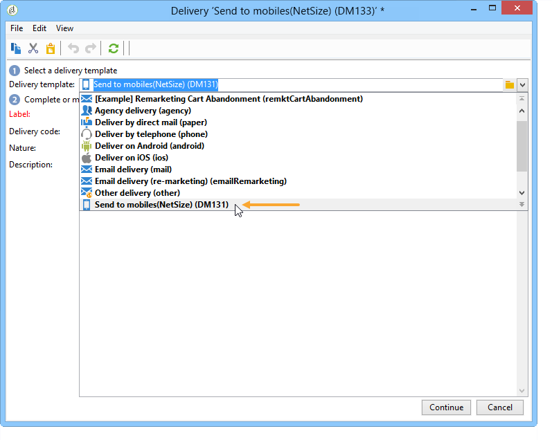
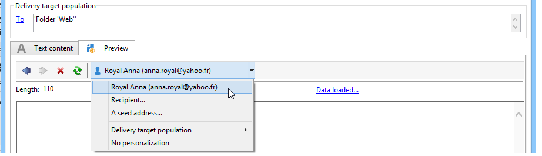

# Creación de una entrega de SMS {#creating-a-sms-delivery}

## Selección del canal de entrega {#selecting-the-delivery-channel}

Para diseñar un envío de SMS nuevo, siga los pasos a continuación:

>[!NOTE]
>
>En la [documentación de Campaign v8](https://experienceleague.adobe.com/docs/campaign/campaign-v8/send/create-message.html?lang=es){target="_blank"} se exponen conceptos globales sobre la creación de envíos.

1. Cree un nuevo envío, por ejemplo, en el panel de control de envíos.
1. Seleccione la plantilla de envíos **Enviado a móviles (NetSize)** creada anteriormente. Para obtener más información, consulte la sección [Modificación de la plantilla de entrega](sms-set-up.md#changing-the-delivery-template).

   

1. Identifique su envío con una etiqueta, un código y una descripción. Para obtener más información, consulte esta sección en la [documentación de Campaign v8](https://experienceleague.adobe.com/docs/campaign/campaign-v8/send/create-message.html?lang=es#create-the-delivery){target="_blank"}.
1. Haga clic en **[!UICONTROL Continue]** para confirmar esta información y mostrar la ventana de configuración de mensajes.

## Definición del contenido del SMS {#defining-the-sms-content}

Para crear el contenido del SMS, siga los pasos a continuación:

1. Introduzca el contenido del mensaje en la sección **[!UICONTROL Text content]** del asistente. Los botones de la barra de herramientas permiten importar, guardar o buscar dentro del contenido. El último botón se utiliza para insertar campos de personalización.

   

   El uso de los campos de personalización se presenta en la sección [Acerca de la personalización](about-personalization.md).

1. Haga clic en **[!UICONTROL Preview]** en la parte inferior de la página para ver la renderización del mensaje con su personalización. Para iniciar la previsualización, seleccione un destinatario con el botón **[!UICONTROL Test personalization]** de la barra de herramientas. Puede seleccionar un destinatario del público objetivo definido o elegir otro destinatario.

   

   Puede aprobar el mensaje SMS. También puede ver el contenido del SMS en la pantalla del teléfono móvil que aparece a la derecha del editor de contenido. Haga clic en la pantalla y utilice el ratón para desplazarse por el contenido.

   

1. Haga clic en el enlace **[!UICONTROL Data loaded]** para ver la información sobre el destinatario.

   

   >[!NOTE]
   >
   >Los mensajes SMS se limitan a una longitud de 160 caracteres si se utiliza la página de códigos Latin-1 (ISO-8859-1). Si el mensaje se escribe en Unicode, no debe exceder los 70 caracteres. Algunos caracteres especiales pueden afectar la longitud del mensaje. Para obtener más información sobre la longitud del mensaje, consulte la sección [Transliteración de caracteres de SMS](#about-character-transliteration).
   >
   >Cuando hay campos de personalización o campos de contenido condicionados, el tamaño del mensaje varía según el destinatario. La longitud del mensaje debe evaluarse cuando se haya realizado la personalización.
   >
   >Al iniciar el análisis, se comprueba la longitud de los mensajes y se muestra una advertencia en caso de contenidos adicionales.

1. Si utiliza el conector NetSize o un conector SMPP, puede personalizar el nombre del remitente de la entrega. Para obtener más información, consulte [Parámetros avanzados](#advanced-parameters).

## Selección de la población objetivo {#selecting-the-target-population}

En [esta sección](steps-defining-the-target-population.md) se describe el proceso detallado al seleccionar la población objetivo de una entrega.

Para obtener más información sobre el uso de los campos de personalización, consulte [esta sección](about-personalization.md).

Para obtener más información sobre la integración de una lista semilla, consulte [esta página](about-seed-addresses.md).
