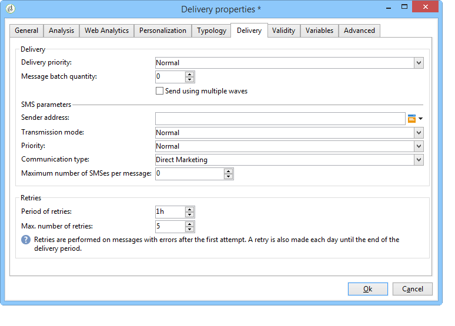

# Envío, monitorización y seguimiento de envíos SMS{#sms-properties}

## Enviar mensajes SMS {#sending-sms-messages}

Para aprobar el mensaje y enviarlo a los destinatarios de la entrega que está creando, haga clic en **[!UICONTROL Send]**.

El proceso detallado para validar y realizar una entrega se presenta en las siguientes secciones:

* [Validación de la entrega](../../delivery/using/steps-validating-the-delivery.md)
* [Realización de la entrega](../../delivery/using/steps-sending-the-delivery.md)

## Parámetros avanzados {#advanced-parameters}

El botón **[!UICONTROL Properties]** proporciona acceso al parámetro de entrega avanzado. Los parámetros específicos de las entregas SMS se encuentran en la sección **[!UICONTROL SMS parameters]** de la pestaña **[!UICONTROL Delivery]**.

Estas son las opciones disponibles:

* **Dirección del remitente**: permite personalizar el nombre del remitente del envío con una cadena de caracteres alfanuméricos limitada a 11 caracteres. El campo no debe estar compuesto exclusivamente por números. Puede definir una condición para mostrar, por ejemplo, nombres distintos según el código de zona del destinatario:

   ```
   <% if( String(recipient.mobilePhone).indexOf("+1") == 0){ %>NeoShopUS<%} else %>
   ```

   >[!IMPORTANT]
   >
   >Compruebe la legislación de su país sobre la edición de nombres de remitente. También debe consultar si su operador ofrece esta funcionalidad.

* **Modo de transmisión**: transmisión de mensaje por SMS.
* **Prioridad**: nivel de importancia asignado a un mensaje. La prioridad **[!UICONTROL Normal]** está seleccionada de forma predeterminada. Pregunte al proveedor de servicios el coste de los SMS enviados con la prioridad **[!UICONTROL High]**.
* **Tipo de aplicación**: elija la aplicación que desea asignar a su envío de SMS. La opción **[!UICONTROL Direct Marketing]** está seleccionada de forma predeterminada y es la que se utiliza más comúnmente.

**Parámetros específicos del conector NetSize**



* **Utilizar varios SMS para un único mensaje**: esto le permite enviar un mensaje de más de 160 caracteres mediante varios mensajes SMS.

**Parámetros específicos de un conector SMPP**


* **Cantidad máxima de SMS por mensaje**: esta opción le permite establecer la cantidad de SMS que debe utilizar para enviar un mensaje. Si el número se establece en 0, puede utilizar un SMS para enviar el mensaje. Si el número de SMS se establece en 1 o 2 por ejemplo y el mensaje supera este umbral, no se envía.

## Supervisión y seguimiento de SMS {#monitoring-and-tracking-sms-deliveries}

Después de enviar mensajes, puede monitorizar y realizar un seguimiento de las entregas. Para obtener más información, consulte estas secciones:

* [Monitorización de un envío](../../delivery/using/about-delivery-monitoring.md)
* [Comprensión de los errores de entrega](../../delivery/using/understanding-delivery-failures.md)
* [Acerca del seguimiento de mensajes](../../delivery/using/about-message-tracking.md)

## Procesar mensajes entrantes {#processing-inbound-messages}

El módulo **nlserver sms** consulta al enrutador SMS a intervalos regulares. Esto permite a Adobe Campaign realizar un seguimiento del progreso de las entregas y controlar los informes de estado y las solicitudes de baja de los destinatarios.

* **Informes de estado**: vea los “logs” de envío para comprobar el estado de los mensajes.

   >[!NOTE]
   >
   >Cada SMS enviado se vincula a una cuenta externa con su clave principal. De este modo:
   >
   > * Los informes de estado de una cuenta de SMS externa eliminada no se procesan correctamente.
   > * Una cuenta SMS solo se puede vincular a una cuenta externa única para garantizar que los informes de estado se atribuyen a la cuenta correcta


* **Baja**: los destinatarios que deseen dejar de recibir envíos SMS pueden devolver un mensaje que contenga la palabra STOP. Si su proveedor lo permite en los términos del contrato, puede recuperar mensajes mediante la actividad de flujo de trabajo de los **SMS de entrada** y, a continuación, crear una consulta para activar la opción **No volver a ponerse en contacto con este destinatario** para los destinatarios correspondientes.

   Consulte la guía [Flujos de trabajo](../../workflow/using/architecture.md).

## Esquema InSMS {#insms-schema}

El esquema InSMS contiene información relacionada con los SMS entrantes. Una descripción de estos campos está disponible a través del atributo desc.

* **message**: contenido del SMS recibido.
* **origin**: número de móvil de origen del mensaje.
* **providerId**: identificador del mensaje devuelto por el SMSC (centro de mensajes).
* **created**: fecha en la que se insertó el mensaje entrante en Adobe Campaign.
* **extAccount**: Cuenta externa de Adobe Campaign.

   >[!IMPORTANT]
   >
   >Los campos siguientes son específicos de NetSize.
   >
   >Si el operador utilizado no es NetSize, estos campos se consideran vacíos.

* **alias**: alias del mensaje entrante.
* **separator**: separador entre el alias y el cuerpo del mensaje.
* **messageDate**: fecha del mensaje dada por el operador.
* **receivalDate**: fecha en la que se recibió el mensaje del operador en el SMSC (centro de mensajes).
* **deliveryDate**: fecha en la que se envió el mensaje del SMSC (centro de mensajes).
* **largeAccount**: código de cuenta de cliente vinculada al SMS entrante.
* **countryCode**: código de país del operador.
* **operatorCode**: código de red del operador.
* **linkedSmsId**: Identificador de Adobe Campaign (broadlogId) asociado al SMS saliente, donde el SMS es la respuesta.

## Administrar respuestas automáticas (normativa estadounidense) {#managing-automatic-replies--american-regulation-}

Cuando los suscriptores responden a un mensaje SMS enviado a través de Adobe Campaign y utilizan una palabra clave como STOP, HELP o YES, es necesario en el mercado estadounidense configurar los mensajes que se envían automáticamente.

Por ejemplo, si los destinatarios envían la palabra clave STOP, reciben automáticamente un mensaje de confirmación que indica que se han dado de baja.

El nombre del remitente para este tipo de mensaje es un breve código que suele utilizarse para realizar envíos.

>[!IMPORTANT]
>
>El siguiente procedimiento detallado solo es válido para conectores SMPP, excepto para el conector SMPP genérico extendido. Para obtener más información, consulte la sección [Crear una cuenta externa de SMPP](sms-set-up.md#creating-an-smpp-external-account) .
>
>Esto forma parte del proceso de certificación llevado a cabo por los operadores estadounidenses para las campañas de marketing en los Estados Unidos. Estas respuestas a mensajes SMS de suscriptores que contienen la palabra clave deben enviarse al suscriptor inmediatamente después de recibir un mensaje de ellos.

1. Crear este tipo de archivo XML:

   ```
   <autoreply>
     <shortcode name="12345">
       <reply keyword="STOP" text="You will not receive SMS anymore" />
       <reply keyword="HELP" text="Powered by Adobe Campaign" />
     </shortcode>
     <shortcode name="43115">
       <reply keyword="STOP" text="Vous ne recevrez plus de SMS" />
       <reply keyword="HELP" text="Service rendu par Adobe Campaign" />
     </shortcode>
     <shortcode name="*">
       <reply keyword="ADOBE" text="This text is replied when you send ADOBE to any short code" />
     </shortcode>
   </autoreply>
   ```

1. Para el atributo **name** de la etiqueta **`<shortcode>`**, especifique el código corto que se debe mostrar en el lugar del nombre del remitente del mensaje.

   En cada etiqueta **`<reply>`**, introduzca el atributo **keyword** con una palabra clave y el atributo **text** con el mensaje que desee enviar para esta palabra clave.

   >[!NOTE]
   >
   >Cada palabra clave debe estar escrita en mayúsculas.

   Si desea enviar el mismo mensaje para varias palabras clave, duplique la línea correspondiente.

   Por ejemplo:

   ```
   <reply keyword="STOP" text="You will not receive SMS anymore" />
   <reply keyword="QUIT" text="You will not receive SMS anymore" />
   ```

1. Una vez finalizado, guarde este archivo con el nombre **smsAutoReply.xml**.

   Tenga en cuenta que el nombre del archivo distingue mayúsculas de minúsculas en Linux.

1. Copie este archivo en el directorio **conf** de Adobe Campaign, en el mismo lugar que el servidor Web.

>[!IMPORTANT]
>
>Estos tipos de mensajes automáticos no conservan un historial. Por lo tanto, no aparecen en el panel de envío. [Más información](../../delivery/using/delivery-dashboard.md).
>
>Estos mensajes no se tienen en cuenta en las reglas de presión comercial. [Más información](../../campaign/using/pressure-rules.md).
