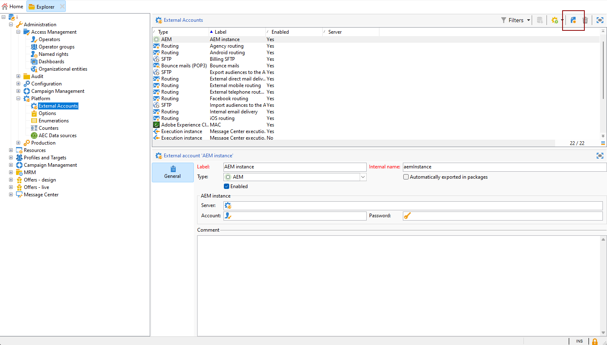
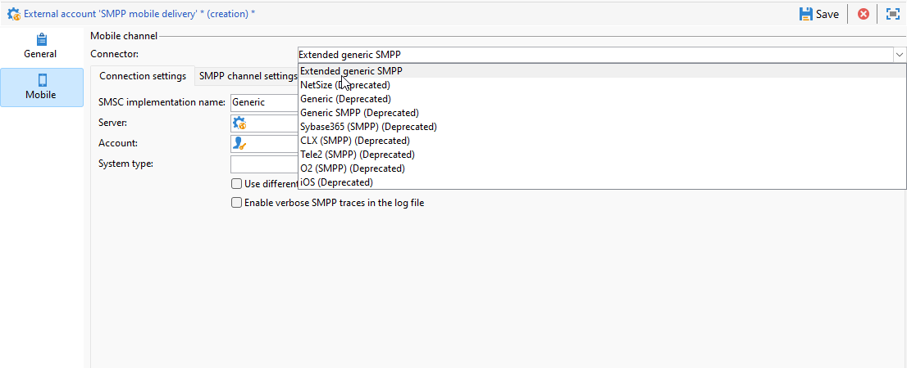
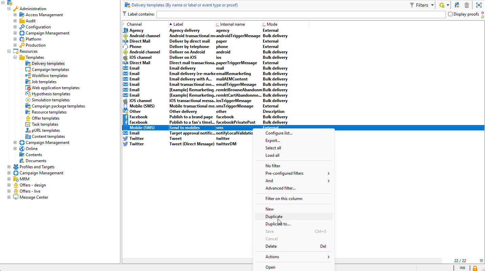
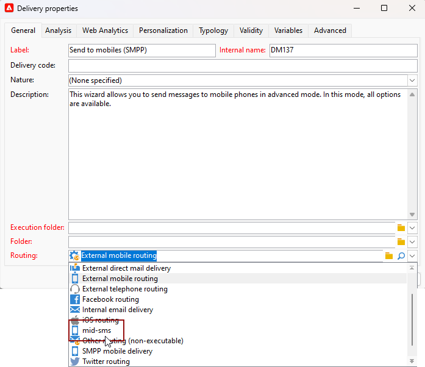

# Configuración del canal SMS en una infraestructura intermediaria {#setting-up-sms-channel}

Para enviar a un teléfono móvil con servidores intermediarios, necesita:

1. Un operador SMS creado en el servidor intermediario utilizado para la cuenta SMS externa creada en el servidor de marketing.

1. Una cuenta externa en el servidor de marketing que especifique el modo de canal y envío.

1. Una cuenta externa en el servidor intermediario que detalle el conector y el tipo de mensaje.

1. Una plantilla de envíos que haga referencia a la cuenta externa para optimizar el proceso de envío.

>[!NOTE]
>
> Para las entregas SMS, la tipología debe utilizar una afinidad SMS específica creada en **un** contenedor de servidor de aplicaciones dedicado. [Más información](../../installation/using/configure-delivery-settings.md#managing-outbound-smtp-traffic-with-affinities)

## Creación del operador SMS en el servidor intermediario {#create-sms-operator}

Para iniciar el proceso de configuración, debe crear un operador SMS en el servidor intermediario específicamente para la cuenta externa.

>[!IMPORTANT]
>
>Cada conector SMS requiere un operador SMS único.

1. En el nodo **[!UICONTROL Administration]** > **[!UICONTROL Access management]** > **[!UICONTROL Operators node]** del árbol, haga clic en el icono **[!UICONTROL New]**.

   

1. Especifique los **[!UICONTROL Identification parameters]** del usuario, incluidos su nombre de inicio de sesión, contraseña y nombre.  El nombre de inicio de sesión y la contraseña son necesarios para que el operador inicie sesión en Adobe Campaign de forma segura.

   Tenga en cuenta que el **[!UICONTROL Name (login)]** se utilizará más adelante para asignar un nombre a la cuenta externa SMPP en el servidor intermediario.

   

1. Seleccione los permisos otorgados al operador en la sección Operator access rights.

   Para asignar derechos al operador, haga clic en el botón **[!UICONTROL Add]** situado sobre la lista de derechos. A continuación, seleccione un **[!UICONTROL Operator group]** o **[!UICONTROL Named rights]** de la lista de grupos disponibles.

   

1. Haga clic en **[!UICONTROL Save]** para finalizar la creación del operador. El perfil ahora se incluye en la lista de operadores existentes.

## Creación de una cuenta externa SMS en el servidor de marketing {#create-accound-mkt}

Para enviar un SMS a un teléfono móvil con servidores intermediarios, primero debe crear su cuenta externa SMS en el servidor de marketing.

1. En el nodo **[!UICONTROL External accounts]** > **[!UICONTROL Platform]** del árbol, haga clic en el icono **[!UICONTROL New]**.

   

1. Escriba su **[!UICONTROL Label]** y **[!UICONTROL Internal name]**. Tenga en cuenta que Internal name se utilizará más adelante para asignar un nombre a la cuenta externa SMPP en el servidor intermediario.

1. Defina el tipo de cuenta como **[!UICONTROL Routing]**, el canal como **[!UICONTROL Mobile (SMS)]** y el modo de envío como **[!UICONTROL Mid-sourcing]**.

   

1. En la pestaña **[!UICONTROL Mid-Sourcing]**, especifique los parámetros de conexión del servidor intermediario.

   Introduzca los detalles del [conector SMS creado anteriormente](#create-sms-operator) en los campos **[!UICONTROL Account]** y **[!UICONTROL Password]**.

   

1. Confirme la configuración haciendo clic en **[!UICONTROL Test the connection]**.

1. Haga clic en **[!UICONTROL Save]**.

## Creación de una cuenta externa SMPP en el servidor intermediario {#creating-smpp-mid}

>[!IMPORTANT]
>
>El uso de la misma cuenta y contraseña para varias cuentas externas de SMS puede provocar conflictos y superposición entre las cuentas. Consulte la [Página de solución de problemas de SMS](troubleshooting-sms.md#external-account-conflict).

Una vez que haya configurado correctamente su cuenta externa SMS en el servidor de marketing, el siguiente paso es establecer la cuenta externa SMPP en el servidor intermediario.

Para obtener más información sobre el protocolo y la configuración de SMS, consulte esta [página](sms-protocol.md).

Para realizar esto, siga los pasos a continuación:

1. En el nodo **[!UICONTROL External accounts]** > **[!UICONTROL Platform]** del árbol, haga clic en el icono **[!UICONTROL New]**.

1. Escriba su **[!UICONTROL Label]** y **[!UICONTROL Internal name]**.

   >[!WARNING]
   >
   >Al asignar un **[!UICONTROL Internal name]**, asegúrese de seguir la convención de nomenclatura especificada:
   >  `SMS Operator Name_Internal Name of the Marketing SMS external account`

   

1. Defina el tipo de cuenta como **Enrutamiento**, el canal como **Móvil (SMS)** y el modo de envío como **Envío masivo**.

   

1. Marque la casilla **[!UICONTROL Enabled]**.

1. En la pestaña **[!UICONTROL Mobile]**, en la lista desplegable **[!UICONTROL Connector]**, seleccione **[!UICONTROL Extended generic SMPP]**.

   

1. La opción **[!UICONTROL Enable verbose SMPP traces in the log file]** permite volcar todo el tráfico SMPP en los archivos de registro. Esta opción solo debe habilitarse para solucionar los problemas del conector y comparar el tráfico que ve el proveedor.

1. Póngase en contacto con el proveedor de servicios de SMS para que le explique cómo rellenar los distintos campos de cuenta externa de la pestaña **[!UICONTROL Connection settings]**.

   A continuación, póngase en contacto con el proveedor, en función del que haya elegido, para que le proporcione el valor que debe introducir en el campo **[!UICONTROL SMSC implementation name]**.

   Puede definir el número de conexiones al proveedor por MTA secundario. De forma predeterminada, se establece en 1.

1. De forma predeterminada, el número de caracteres de un SMS cumple los estándares de GSM.

   Los mensajes SMS con codificación GSM están limitados a 160 caracteres, o a 153 caracteres por SMS en el caso de los mensajes enviados en varias partes.

   >[!NOTE]
   >
   >Algunos caracteres cuentan como dos (llaves, corchetes, símbolo del euro, etc.).
   >
   >La lista de caracteres GSM disponibles puede consultarse en [esta sección](sms-set-up.md#about-character-transliteration).

   También puede autorizar la transliteración de caracteres marcando el cuadro correspondiente.

   

1. En la pestaña **[!UICONTROL Throughput and delays]**, puede especificar el rendimiento máximo de los mensajes salientes (&quot;MT&quot;, móvil finalizado) en MT por segundo. Si introduce &quot;0&quot; en el campo correspondiente, el rendimiento es ilimitado.

   Los valores de todos los campos correspondientes a las duraciones deben rellenarse en segundos.

1. En la pestaña **[!UICONTROL Mapping of encodings]**, puede definir las codificaciones.

   Para obtener más información, consulte [esta sección](sms-set-up.md#about-text-encodings).

1. En la pestaña **[!UICONTROL SMSC specificities]**, la opción **[!UICONTROL Send full phone number]** está desactivada de forma predeterminada. No la habilite si desea respetar el protocolo de SMPP y transferir únicamente dígitos al servidor del proveedor de SMS (SMSC).

   Sin embargo, dado que determinados proveedores requieren el uso del prefijo “+”. se recomienda que se ponga en contacto con su proveedor y que este le recomiende si es necesario activar esta opción.

   La casilla de verificación **[!UICONTROL Enable TLS over SMPP]** permite cifrar el tráfico de SMPP. Para obtener más información, consulte esta [página](sms-protocol.md).

1. Si está configurando un conector **[!UICONTROL Extended generic SMPP]**, puede configurar respuestas automáticas.

   Para obtener más información, consulte [esta sección](sms-set-up.md#automatic-reply).

## Modificación de la plantilla de envíos {#changing-the-delivery-template}

Adobe Campaign ofrece una plantilla de envíos móvil ubicada en el nodo **[!UICONTROL Resources > Templates > Delivery templates]**. Para obtener más información, consulte la sección [Acerca de las plantillas](about-templates.md).

Para enviar mensajes a través del canal SMS, debe crear una plantilla que incluya una referencia al conector del canal.

Para conservar la plantilla de envíos nativa, recomendamos que la duplique y, a continuación, la configure.

En el ejemplo siguiente, generamos una plantilla para facilitar el envío de mensajes a través de la cuenta SMPP creada anteriormente.  Para ello, haga lo siguiente:

1. En el nodo **[!UICONTROL Resources]** > **[!UICONTROL Templates]** > **[!UICONTROL Delivery templates]** del árbol, haga clic con el botón derecho en la plantilla **[!UICONTROL Send to mobiles]** y seleccione **[!UICONTROL Duplicate]**.

   

1. Cambie la etiqueta de la plantilla, por ejemplo, **Enviado a móviles (SMPP)**.

   

1. Haga clic **[!UICONTROL Properties]**.

1. En la pestaña **[!UICONTROL General]**, seleccione un modo de enrutamiento que corresponda a la cuenta externa creada en la sección [Creación de una cuenta externa SMS en el servidor de marketing](#create-accound-mkt).

   

1. Haga clic en **[!UICONTROL Save]** para crear la plantilla.

   

Ahora tiene una cuenta externa y una plantilla de envíos que le permiten realizar envíos a través de SMS.

## Temas relacionados {#related-topics}

* [Transliteración de caracteres SMS](sms-set-up.md#about-character-transliteration)
* [Codificaciones de texto](sms-set-up.md#about-text-encodings)
* [Respuesta automática](sms-set-up.md#automatic-reply)
