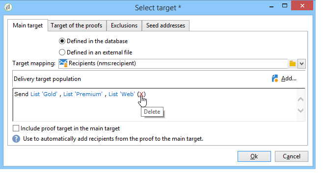

# Definición de la población objetivo {#defining-the-target-population}

## Acerca de las poblaciones objetivo {#about-target-populations}

Para cada envío, puede definir varios tipos de poblaciones objetivo:

* **Audiencia** principal: perfiles que recibirán mensajes. [Obtenga más información](../../delivery/using/steps-defining-the-target-population.md#selecting-the-main-target)
* **Prueba**: destinatarios de mensajes de prueba implicados en el ciclo de validación. [Obtenga más información](../../delivery/using/steps-defining-the-target-population.md#defining-a-specific-proof-target)
* **Direcciones** semilla: destinatarios que estén fuera del objetivo de la entrega pero que reciban la entrega (solo en el contexto de una campaña de marketing). [Obtenga más información](../../delivery/using/about-seed-addresses.md)
* **Grupos** de control: población que no recibe la entrega, se utiliza para realizar el seguimiento del comportamiento y el impacto de la campaña (solo en el contexto de una campaña de marketing). [Más información](../../campaign/using/marketing-campaign-target.md#defining-a-control-group).

## Selección de los principales destinatarios de la entrega {#selecting-the-main-target}

En la mayoría de los casos, el objetivo principal se extrae de la base de datos de Adobe Campaign (modo predeterminado). No obstante, los destinatarios también se pueden almacenar en un archivo externo. Obtenga más información en [esta sección](../../delivery/using/steps-defining-the-target-population.md#selecting-external-recipients).

Para seleccionar los destinatarios de un envío, siga los siguientes pasos:

1. En el editor de envíos, seleccione **[!UICONTROL To]**.
1. Si los destinatarios están almacenados en la base de datos, seleccione la primera opción.

   

1. Seleccione la asignación de destino en la lista desplegable **[!UICONTROL Target mapping]**. La asignación de destino predeterminada de Adobe Campaign es **[!UICONTROL Recipients]**, según el esquema **nms:destinatario** .

   Están disponibles otras asignaciones de destino, y algunos pueden relacionarse con la configuración específica. Para obtener más información sobre las asignaciones de destino, consulte [Selección de una asignación de destino](../../delivery/using/selecting-a-target-mapping.md).

1. Haga clic en el botón **[!UICONTROL Add]** para definir los filtros de restricción.

   A continuación, se puede seleccionar el tipo de filtrado que desee aplicar:

   

   Puede seleccionar destinatarios mediante los tipos de objetivo definidos en la base de datos. Para utilizar un tipo de destinatario, selecciónelo y haga clic en **[!UICONTROL Next]**. Para cada destinatario, se pueden visualizar los destinatarios correspondientes haciendo clic en la pestaña **[!UICONTROL Preview]**. Para ciertos tipos de destinatario, el botón **[!UICONTROL Refine target]** permite combinar varios criterios de destinatarios.

   Los siguientes tipos de objetivos se ofrecen de forma predeterminada:

   * **[!UICONTROL Filtering conditions]**: esta opción permite definir una consulta y mostrar el resultado. El método para definir consultas se muestra en [esta sección](../../platform/using/creating-filters.md#creating-an-advanced-filter).
   * **[!UICONTROL Subscribers of an information service]**: esta opción permite seleccionar un boletín informativo al que se deben suscribir los destinatarios para ser objetivos de la entrega que se está creando.

      

   * **[!UICONTROL Recipients of a delivery]**: esta opción permite definir los destinatarios de una entrega existente como criterio de objetivo. A continuación, se debe seleccionar la entrega en la lista:

      

   * **[!UICONTROL Delivery recipients belonging to a folder]**: esta opción permite seleccionar una carpeta de entrega y establecer como objetivo los destinatarios de los envíos de dicha carpeta.

      

      Se puede filtrar el comportamiento de los destinatarios seleccionando una de las opciones de la lista desplegable:

      

      >[!NOTE]
      >
      >La opción **[!UICONTROL Include sub-folders]** también permite dirigir los envíos contenidos en carpetas ubicadas en la estructura del árbol debajo del nodo seleccionado.

   * **[!UICONTROL Recipients included in a folder]**: esta opción permite establecer como objetivo a los perfiles contenidos en una carpeta específica del árbol.
   * **[!UICONTROL A recipient]**: esta opción permite seleccionar un destinatario específico de los perfiles de la base de datos.
   * **[!UICONTROL A list of recipients]**: esta opción permite establecer como objetivo una lista de destinatarios. Las listas se muestran en [esta sección](../../platform/using/creating-and-managing-lists.md).
   * **[!UICONTROL User filters]**: esta opción permite acceder a los filtros preconfigurados para utilizarlos como criterios de filtrado para los perfiles de la base de datos. Los filtros preconfigurados se muestran en [esta sección](../../platform/using/creating-filters.md#saving-a-filter).
   * La opción **[!UICONTROL Exclude recipients corresponding to this segment]** permite dirigirse a los destinatarios que no cumplan con los criterios de objetivo definidos. Para utilizar esta opción, seleccione el cuadro apropiado y, a continuación, aplique los objetivos, según lo definido anteriormente, para excluir los perfiles resultantes.

      

1. Introduzca un nombre para estos objetivos en el campo **[!UICONTROL Label]**. De forma predeterminada, la etiqueta es la etiqueta del primer criterio de objetivo. Para una combinación, es mejor utilizar un nombre explícito.
1. Haga clic en **[!UICONTROL Finish]** para validar el objetivo configurado.

   Los criterios de objetivo definidos se resumen en la sección central de la pestaña de configuración del objetivo principal. Haga clic en un criterio para ver su contenido (configuración y previsualización). Para eliminar un criterio, haga clic en la cruz situada después de su etiqueta.

   

### Selección de destinatarios externos {#selecting-external-recipients}

Se puede iniciar una entrega a los destinatarios que no se hayan guardado en la base de datos, pero que se almacenan en un archivo externo. Por ejemplo, aquí se realiza una entrega a los destinatarios importados desde un archivo de texto.

Para ello:

1. Haga clic en el vínculo **[!UICONTROL To]** para seleccionar los destinatarios de la entrega.
1. Seleccione la opción **[!UICONTROL Defined in an external file]**.

   

1. De forma predeterminada, los destinatarios se importan en la base de datos. Se debe seleccionar **[!UICONTROL Target mapping]**. Para obtener más información sobre las asignaciones de destino, consulte [Selección de una asignación de destino](../../delivery/using/selecting-a-target-mapping.md).

   También puede elegir **[!UICONTROL Do not import the recipients into the database]**.

1. Al importar los destinatarios, haga clic en enlace **[!UICONTROL File format definition...]** para seleccionar y configurar el archivo externo.

   Para obtener más información sobre la importación de datos, consulte [esta sección](../../platform/using/executing-import-jobs.md#step-2---source-file-selection).

1. Haga clic en **[!UICONTROL Finish]** y configure la entrega como entrega estándar.

>[!CAUTION]
>
>Al definir el contenido del mensaje para la entrega por correo electrónico, no incluya el vínculo a la página espejo; no se puede generar en este modo de entrega.

### Configuración de exclusión {#customizing-exclusion-settings}

Los errores de direcciones y las clasificaciones de calidad los proporciona el proveedor de servicios (IAP). Esta información se actualiza automáticamente en el perfil de destinatario después de las acciones de entrega y con los archivos devueltos por los proveedores de servicios. Puede verse en el perfil en modo de solo lectura.

Puede elegir excluir las direcciones que han alcanzado un determinado número de errores consecutivos o cuya clasificación de calidad está por debajo del umbral especificado en esta ventana. También puede elegir si desea o no autorizar direcciones no clasificadas para las que no se ha devuelto ningún dato.

>[!NOTE]
>
>Si dos destinatarios tienen el mismo nombre, apellido, código postal o ciudad en una entrega de correo postal, se produce un error doble y no se tiene en cuenta el duplicado.

La pestaña **[!UICONTROL Exclusions]** se utiliza para limitar el número de mensajes.

>[!NOTE]
>
>Se recomiendan los parámetros predeterminados, pero los ajustes se pueden adaptar según sus necesidades. Sin embargo, estas opciones solo debe modificarlas un usuario experto para evitar errores y un uso incorrecto.

Haga clic en el enlace **[!UICONTROL Edit...]** para modificar la configuración predeterminada.

Estas son las opciones disponibles:

* **[!UICONTROL Exclude duplicate addresses during delivery]**. Esta opción está activada de forma predeterminada: permite eliminar direcciones de correo electrónico duplicadas durante la entrega. La estrategia aplicada puede variar según la forma en que se utilice Adobe Campaign y el tipo de datos de la base de datos.

   El valor predeterminado de la opción se puede configurar para cada plantilla de entrega.

   Por ejemplo:

   * Envío de un boletín informativo o una entrega de documentos electrónicos. No hay exclusión de duplicados en algunos casos si los datos no cuentan con duplicados nativos. Una pareja suscrita con la misma dirección de correo electrónico puede recibir dos mensajes de correo electrónico personalizados específicos: uno dirigido a cada individuo por su nombre. En este caso, esta opción se puede anular.
   * Envío de una campaña de marketing: la exclusión de duplicados es esencial para evitar enviar demasiados mensajes al mismo destinatario. En este caso, se puede seleccionar esta opción.

      Si se desmarca esta opción, se puede acceder a una opción adicional: **[!UICONTROL Keep duplicate records (same identifier)]**. Permite autorizar varios envíos a destinatarios que cumplan varios criterios de objetivo.

      

* **[!UICONTROL Exclude recipients who no longer want to be contacted]**, es decir, destinatarios cuyas direcciones de correo electrónico estén en una lista de bloqueados (&quot;exclusión&quot;). Esta opción debe permanecer seleccionada para respetar la ética profesional de marketing electrónico y las leyes que rigen el comercio electrónico.
* **[!UICONTROL Exclude quarantined recipients]**. Esta opción permite excluir del objetivo cualquier perfil con una dirección que no responde. Se recomienda mantener seleccionada esta opción.

   >[!NOTE]
   >
   >Para obtener más información sobre la administración de cuarentena, consulte [Explicación de la administración de cuarentena](../../delivery/using/understanding-quarantine-management.md).

* **[!UICONTROL Limit delivery]** a un número determinado de mensajes. Esta opción permite introducir el número máximo de mensajes a enviar. Si el contenido del objetivo supera el número de mensajes indicados, se le aplica una selección aleatoria.

### Reducción del tamaño de la población objetivo {#reducing-the-size-of-the-target-population}

Se puede reducir el tamaño de la población objetivo. Para ello, en el campo **[!UICONTROL Requested quantity]**, especifique el número de destinatarios que desea exportar.

## Selección de los destinatarios de los mensajes de prueba {#selecting-the-proof-target}

La prueba es un mensaje especial que permite probar una entrega antes de enviarla al destino principal. Los destinatarios de la prueba son los responsables de aprobar el formulario y el contenido del mensaje.

 [Descubra esta función en vídeo](#seeds-and-proofs-video)

Para seleccionar el destino de las pruebas, siga los siguientes pasos:

1. Haga clic en el vínculo **[!UICONTROL To]**.
1. Seleccione la pestaña **[!UICONTROL Target of the proofs]**.
1. Haga clic en el campo **[!UICONTROL Targeting mode]** para elegir el método que desee aplicar: **[!UICONTROL Definition of a specific proof target]**, **[!UICONTROL Substitution of the address]**, **[!UICONTROL Seed addresses]** o **[!UICONTROL Specific target and seed addresses]**.

>[!NOTE]
>
>Normalmente, el objetivo de la prueba se puede añadir al objetivo principal. Para ello, seleccione la opción adecuada en la sección inferior de la pestaña **[!UICONTROL Main target]**.

## Definición de un objetivo de prueba específico {#defining-a-specific-proof-target}

Al seleccionar el objetivo de la prueba, la opción **[!UICONTROL Definition of a specific proof target]** permite seleccionar los destinatarios de prueba entre los perfiles de la base de datos.

Seleccione esta opción para elegir los destinatarios que utilizan el botón **[!UICONTROL Add]**, como en el caso de la definición del destinatario principal. Consulte [Selección del destinatario principal](../../delivery/using/steps-defining-the-target-population.md#selecting-the-main-target).

Para obtener más información sobre la entrega de prueba, consulte [esta sección](../../delivery/using/steps-validating-the-delivery.md#sending-a-proof).

### Uso de la sustitución de direcciones en la prueba {#using-address-substitution-in-proof}

En lugar de seleccionar destinatarios dedicados en la base de datos, se puede utilizar la opción **[!UICONTROL Substitution of the address]**.

Esta opción permite utilizar los perfiles de destinatario de la entrega y reemplazar sus direcciones de correo electrónico con otras direcciones a las que se envía la prueba.

Cuando se selecciona esta opción, las direcciones de prueba se rellenan a través de un editor especial que permite configurar las sustituciones.

La configuración se realiza de la siguiente manera:

1. Haga clic en el icono **[!UICONTROL Add]** para definir una sustitución.
1. Introduzca la dirección del destinatario que desea utilizar o selecciónela en la lista.
1. Seleccione el perfil que desea utilizar en la prueba: guarde el valor **[!UICONTROL Random]** en la columna **[!UICONTROL Profile to use]** para utilizar en dicha prueba los datos de cualquier perfil de destinatario.

   

1. Haga clic en el icono **[!UICONTROL Detail]** para seleccionar un perfil de destinatario principal, como en el siguiente ejemplo:

   

   Se pueden definir tantas direcciones de sustitución como sea necesario.

## Uso de las direcciones semilla como prueba {#using-seed-addresses-as-proof}

Se pueden utilizar **[!UICONTROL Seed addresses]** como destinatario de las pruebas: esta opción permite usar o importar una lista de direcciones semilla existentes.

>[!NOTE]
>
>Las direcciones semilla se presentan en [Acerca de las direcciones semilla](../../delivery/using/about-seed-addresses.md).

Se puede combinar la definición de un destinatario de prueba específico y el uso de direcciones semilla con la opción **[!UICONTROL Specific target and Seed addresses]**. Las configuraciones relacionadas se definen en dos subpestañas independientes.

Asimismo, consulte lo siguiente:

* [Selección del destino de la prueba](#selecting-the-proof-target)
* [Sobre las direcciones semilla](../../delivery/using/about-seed-addresses.md)
* [Ejemplo de uso: selección de direcciones semilla según ciertos criterios](../../delivery/using/use-case--selecting-seed-addresses-on-criteria.md)

## Videotutorial {#seeds-and-proofs-video}

En este vídeo aprenderá a añadir semillas y pruebas a un correo electrónico existente y a enviarlo.

>[!VIDEO](https://video.tv.adobe.com/v/25606?quality=12)

Hay disponibles más vídeos de procedimientos para Campaign Classic [aquí](https://experienceleague.adobe.com/docs/campaign-classic-learn/tutorials/overview.html?lang=es).
