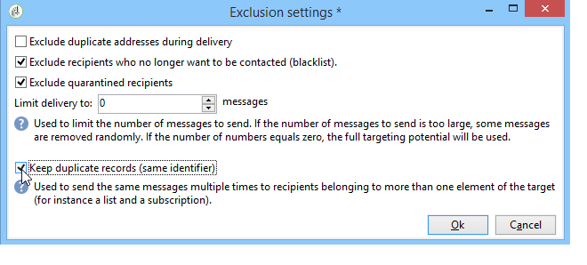

# Definición de la población objetivo {#defining-the-target-population}

## Acerca de las poblaciones objetivo {#about-target-populations}

Para cada entrega, puede definir varios tipos de poblaciones objetivo. La sección siguiente proporciona más información sobre cómo seleccionar:

* **Destinatarios principales de la entrega**. [Más información](../../delivery/using/steps-defining-the-target-population.md#selecting-the-main-target).
* **Destinatarios de los mensajes** de prueba para configurar un ciclo de validación. [Más información](../../delivery/using/steps-defining-the-target-population.md#defining-a-specific-proof-target).

Además, también puede definir direcciones [de](../../delivery/using/about-seed-addresses.md)raíz y grupos [de](../../campaign/using/marketing-campaign-deliveries.md#defining-a-control-group)control. si la entrega se incluye en una campaña de marketing.

## Selección de los principales destinatarios del envío {#selecting-the-main-target}

En la mayoría de los casos, el objetivo principal se extrae de la base de datos de Campaign (modo predeterminado).

Los destinatarios también se pueden almacenar en un archivo externo. The configuration of this type of delivery is presented in [Selecting external recipients](../../delivery/using/steps-defining-the-target-population.md#selecting-external-recipients).

Para seleccionar los destinatarios de la entrega que se va a crear, siga estos pasos:

1. Haga clic en el **[!UICONTROL To]** vínculo.
1. Si los destinatarios están almacenados en la base de datos, seleccione la primera opción.

   

1. Select the target mapping in the **[!UICONTROL Target mapping]** drop-down list. Adobe Campaign default target mapping is **[!UICONTROL Recipients]**.

   Están disponibles otros destinos de mapeo, y algunos pueden relacionarse con la configuración específica. Para obtener más información sobre las asignaciones de destino, consulte [Selección de una asignación](../../delivery/using/selecting-a-target-mapping.md)de destino.

1. Click the **[!UICONTROL Add]** button to define restriction filters.

   A continuación, se puede seleccionar el tipo de filtrado que desee aplicar:

   

   Puede seleccionar destinatarios mediante los tipos de objetivo definidos en la base de datos. To use a target type, select it and click **[!UICONTROL Next]**. For each target, you can display the recipients concerned by clicking the **[!UICONTROL Preview]** tab. For certain types of target, the **[!UICONTROL Refine target]** button lets you combine several targeting criteria.

   Los siguientes tipos de objetivos se ofrecen de forma predeterminada:

   * **[!UICONTROL Filtering conditions]** :: esta opción le permite definir una consulta y mostrar el resultado. El método para definir consultas se muestra en [esta sección](../../platform/using/creating-filters.md#creating-an-advanced-filter).
   * **[!UICONTROL Subscribers of an information service]** :: esta opción le permite seleccionar una newsletter a la que se deben suscribir los destinatarios para que el envío que se esté creando sea el objetivo.

      

   * **[!UICONTROL Recipients of a delivery]** :: esta opción permite definir los destinatarios de una entrega existente como criterio de objetivo. A continuación, se debe seleccionar el envío en la lista:

      

   * **[!UICONTROL Delivery recipients belonging to a folder]** :: esta opción le permite seleccionar una carpeta de entrega y dirigirse a los destinatarios de los envíos de esa carpeta.

      

      Se puede filtrar el comportamiento de los destinatarios seleccionando una de las opciones de la lista desplegable:

      

      >[!NOTE]
      >
      >The **[!UICONTROL Include sub-folders]** option also lets you target the deliveries contained in folders located in the tree structure below the selected node.

   * **[!UICONTROL Recipients included in a folder]** :: esta opción le permite dirigirse a los perfiles contenidos en una carpeta específica del árbol.
   * **[!UICONTROL A recipient]** :: esta opción permite seleccionar un destinatario específico de los perfiles de la base de datos.
   * **[!UICONTROL A list of recipients]** :: esta opción le permite dirigir una lista de destinatarios. Las listas se muestran en [esta sección](../../platform/using/creating-and-managing-lists.md).
   * **[!UICONTROL User filters]** :: esta opción le permite acceder a los filtros preconfigurados para utilizarlos como criterios de filtrado para perfiles en la base de datos. Los filtros preconfigurados se muestran en [esta sección](../../platform/using/creating-filters.md#saving-a-filter).
   * The option **[!UICONTROL Exclude recipients corresponding to this segment]** lets you target on recipients who do not satisfy the defined target criteria. Para utilizar esta opción, seleccione el cuadro apropiado y, a continuación, aplique los objetivos, según lo definido anteriormente, para excluir los perfiles resultantes.

      

1. Enter a name for this targeting in the **[!UICONTROL Label]** field. De forma predeterminada, la etiqueta es la etiqueta del primer criterio de objetivo. Para una combinación, es mejor utilizar un nombre explícito.
1. Click **[!UICONTROL Finish]** to validate the configured targeting.

   Los criterios de objetivo definidos se resumen en la sección central de la pestaña de configuración del objetivo principal. Haga clic en un criterio para ver su contenido (configuración y previsualización). Para eliminar un criterio, haga clic en la cruz situada después de su etiqueta.

   

### Selección de destinatarios externos {#selecting-external-recipients}

Se puede iniciar un envío a los destinatarios que no se hayan guardado en la base de datos, pero que se almacenan en un archivo externo. Por ejemplo, aquí se realiza un envío a los destinatarios importados desde un archivo de texto.

Para ello:

1. Click the **[!UICONTROL To]** link to select the recipients of your delivery.
1. Seleccione la **[!UICONTROL Defined in an external file]** opción.

   

1. De forma predeterminada, los destinatarios se importan en la base de datos. Debe seleccionar el **[!UICONTROL Target mapping]**. Para obtener más información sobre las asignaciones de destino, consulte [Selección de una asignación de destino](../../delivery/using/selecting-a-target-mapping.md)

   También puede elegir **[!UICONTROL Do not import the recipients into the database]**.

1. When importing the recipients, click the **[!UICONTROL File format definition...]** link to select and configure the external file.

   Para obtener más información sobre la importación de datos, consulte [esta sección](../../platform/using/importing-data.md#step-2---source-file-selection).

1. Click **[!UICONTROL Finish]** and configure your delivery as a standard delivery.

>[!CAUTION]
>
>Al definir el contenido del mensaje para el envío por correo electrónico, no incluya el enlace a la página espejo; no se puede generar en este modo de envío.

### Configuración de la configuración de exclusión {#customizing-exclusion-settings}

Los errores de direcciones y las clasificaciones de calidad los proporciona el proveedor de servicios (IAP). Esta información se actualiza automáticamente en el perfil de destinatario después de las acciones de envío y con los archivos devueltos por los proveedores de servicios. Puede verse en el perfil en modo de solo lectura.

Puede elegir excluir las direcciones que han alcanzado un determinado número de errores consecutivos o cuya clasificación de calidad está por debajo del umbral especificado en esta ventana. También puede elegir si desea o no autorizar direcciones no clasificadas para las que no se ha devuelto ningún dato.

>[!NOTE]
>
>Si dos destinatarios tienen el mismo nombre, apellido, código postal o ciudad en un envío de correo postal, se produce un error doble y no se tiene en cuenta el duplicado.

The **[!UICONTROL Exclusions]** tab is used to limit the number of messages.

>[!NOTE]
>
>Se recomiendan los parámetros predeterminados, pero los ajustes se pueden adaptar según sus necesidades. Sin embargo, estas opciones solo debe modificarlas un usuario experto para evitar errores y un uso incorrecto.

Click the **[!UICONTROL Edit...]** link to modify the default configuration.

Estas son las opciones disponibles:

* **[!UICONTROL Exclude duplicate addresses during delivery]**. Esta opción está activada de forma predeterminada: permite eliminar direcciones de correo electrónico duplicadas durante el envío. La estrategia aplicada puede variar según la forma en que se utilice Adobe Campaign y el tipo de datos de la base de datos.

   El valor predeterminado de la opción se puede configurar para cada plantilla de envío.

   Por ejemplo:

   * Envío de un boletín informativo o un envío de documentos electrónicos. No hay exclusión de duplicados en algunos casos si los datos no cuentan con duplicados nativos. Una pareja suscrita con la misma dirección de correo electrónico puede recibir dos mensajes de correo electrónico personalizados específicos: uno dirigido a cada individuo por su nombre. En este caso, esta opción se puede anular.
   * Envío de una campaña de marketing: la exclusión de duplicados es esencial para evitar enviar demasiados mensajes al mismo destinatario. En este caso, se puede seleccionar esta opción.

      Si se desmarca esta opción, se puede acceder a una opción adicional: **[!UICONTROL Keep duplicate records (same identifier)]**. Permite autorizar varios envíos a destinatarios que cumplan varios criterios de objetivo.

      

* **[!UICONTROL Exclude recipients who no longer want to be contacted]** , es decir, los destinatarios cuyas direcciones de correo electrónico están en una lista negra (&#39;desactivación&#39;). Esta opción debe permanecer seleccionada para respetar la ética profesional de marketing electrónico y las leyes que rigen el comercio electrónico.
* **[!UICONTROL Exclude quarantined recipients]**. Esta opción permite excluir del objetivo cualquier perfil con una dirección que no responde. Se recomienda mantener seleccionada esta opción.

   >[!NOTE]
   >
   >Para obtener más información sobre la administración de cuarentena, consulte [Explicación de la administración](../../delivery/using/understanding-quarantine-management.md)de cuarentena.

* **[!UICONTROL Limit delivery]** a un número determinado de mensajes. Esta opción permite introducir el número máximo de mensajes a enviar. Si el contenido del objetivo supera el número de mensajes indicados, se le aplica una selección aleatoria.

### Reducción del tamaño de la población objetivo {#reducing-the-size-of-the-target-population}

Se puede reducir el tamaño de la población objetivo. To do this, specify the number of recipients to be exported in the **[!UICONTROL Requested quantity]** field.

## Selección de los destinatarios de los mensajes de prueba {#selecting-the-proof-target}

La prueba es un mensaje especial que permite probar un envío antes de enviarla al destino principal. Los destinatarios de la prueba son los responsables de aprobar el formulario y el contenido del mensaje.

Para seleccionar el destino de las pruebas, siga los siguientes pasos:

1. Haga clic en el **[!UICONTROL To]** vínculo.
1.  Haga clic en la **[!UICONTROL Target of the proofs]** ficha.
1. Haga clic en el **[!UICONTROL Targeting mode]** campo para elegir el método que desee aplicar: **[!UICONTROL Definition of a specific proof target]** , **[!UICONTROL Substitution of the address]** , **[!UICONTROL Seed addresses]** o **[!UICONTROL Specific target and seed addresses]**.

>[!NOTE]
>
>Normalmente, el objetivo de la prueba se puede añadir al objetivo principal. To do this, select the appropriate option in the lower section of the **[!UICONTROL Main target]** tab.

## Definición de un objetivo de prueba específico {#defining-a-specific-proof-target}

When selecting the proof target, the **[!UICONTROL Definition of a specific proof target]** option lets you select the proof recipients from the profiles in the database.

Select this option to choose recipients using the **[!UICONTROL Add]** button, as in the case of defining the main target. See [Selecting the main target](../../delivery/using/steps-defining-the-target-population.md#selecting-the-main-target).

For more on proof sending, refer to [this section](../../delivery/using/steps-validating-the-delivery.md#sending-a-proof).

### Uso de la sustitución de direcciones en la prueba {#using-address-substitution-in-proof}

Instead of selecting dedicated recipients in the database, you can use the **[!UICONTROL Substitution of the address]** option.

Esta opción permite utilizar los perfiles de destinatario del envío y reemplazar sus direcciones de correo electrónico con otras direcciones a las que se envía la prueba.

Cuando se selecciona esta opción, las direcciones de prueba se rellenan a través de un editor especial que permite configurar las sustituciones.

La configuración se realiza de la siguiente manera:

1. Click the **[!UICONTROL Add]** icon to define a substitution.
1. Introduzca la dirección del destinatario que desea utilizar o selecciónela en la lista.
1. Select the profile to use in the proof: save the **[!UICONTROL Random]** value in the **[!UICONTROL Profile to use]** column to use the data of any profile of the target in the proof.

   

1. Click the **[!UICONTROL Detail]** icon to select a profile from the main target, as in the following example:

   

   Se pueden definir tantas direcciones de sustitución como sea necesario.

## Uso de las direcciones sembradas como prueba {#using-seed-addresses-as-proof}

You can use **[!UICONTROL Seed addresses]** as target of the proofs: this option lets you use or import a list of existing seed addresses.

>[!NOTE]
>
>Las direcciones de raíz se presentan en [Acerca de las direcciones](../../delivery/using/about-seed-addresses.md)de raíz.

You can combine the definition of a specific proof target and the use of seed addresses using the **[!UICONTROL Specific target and Seed addresses]** option. Las configuraciones relacionadas se definen en dos subpestañas independientes.
