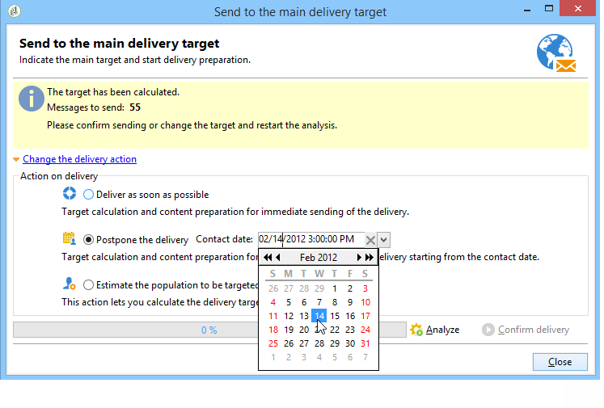

# Configuración y entrega de la entrega {#configuring-and-sending-the-delivery}

>[!NOTE]
>
>Solo el propietario de la entrega puede iniciar una entrega. Para que otro operador (o grupo de operadores) pueda iniciar una entrega, debe añadirlos como revisores en el campo **[!UICONTROL Delivery start:]**.
>
>Consulte [esta sección](../../campaign/using/marketing-campaign-approval.md#selecting-reviewers) para obtener más información.

## Parámetros adicionales de entrega {#delivery-additiona-parameters}

Antes de realizar el envío, se pueden definir los parámetros de envío en las propiedades de envío a través de la pestaña **[!UICONTROL Delivery]**.

* **[!UICONTROL Delivery priority]**: Esta opción permite influir en el orden de envío de los envíos indicando su nivel de prioridad (normal, alto o bajo). Esto permite priorizar el orden de ciertos envíos más urgentes por encima de otros.

* **[!UICONTROL Message batch quantity]**: Esta opción permite definir el número de mensajes agrupados dentro del mismo paquete de envío XML. Si el parámetro se establece en 0, los mensajes se agrupan automáticamente. El tamaño del paquete se define mediante el cálculo `<delivery size>/1024`, con un mínimo de 8 y un máximo de 256 mensajes por paquete.

   >[!CAUTION]
   >
   >Cuando se duplica la entrega, se restablece el parámetro.

* **[!UICONTROL Send using multiple waves]**: Para obtener más información, consulte [Enviar usando múltiples ondas](#sending-using-multiple-waves).

* **[!UICONTROL Test SMTP delivery]**: Esta opción permite probar la realización de un envío a través de SMTP. La entrega se procesa hasta la conexión con el servidor SMTP, pero no se envía.

   >[!NOTE]
   >
   >No se recomienda utilizar esta opción al instalar con mid-sourcing para no llamar al MTA.
   >
   >Para obtener más información sobre la configuración de un servidor SMTP, consulte [esta sección](../../installation/using/configuring-campaign-server.md#personalizing-delivery-parameters).

* **[!UICONTROL Email BCC]**: Esta opción permite almacenar correos electrónicos en un sistema externo como CCO simplemente añadiendo una dirección de correo electrónico CCO al objetivo del mensaje. Para obtener más información, consulte [esta sección](../../delivery/using/sending-messages.md#archiving-emails).

Una vez configurada la entrega y lista para enviarla, asegúrese de ejecutar [Análisis de entrega](../../delivery/using/steps-validating-the-delivery.md#analyzing-the-delivery). Una vez finalizado, haga clic en **[!UICONTROL Confirm delivery]** para iniciar el envío de mensajes.

A continuación, se puede cerrar el asistente de envíos y realizar un seguimiento de la ejecución del envío desde la pestaña **[!UICONTROL Delivery]**, a la que se puede acceder mediante el detalle del envío o a través de la lista de envíos.

Después de enviar mensajes, puede monitorizar y realizar un seguimiento de las entregas. Para obtener más información, consulte estas secciones:

* [Seguimiento de una entrega](../../delivery/using/monitoring-a-delivery.md)
* [Comprensión de los errores de entrega](../../delivery/using/understanding-delivery-failures.md)
* [Acerca del seguimiento de mensajes](../../delivery/using/about-message-tracking.md)

## Programación de los envíos {#scheduling-the-delivery-sending}

Puede retrasar la entrega de mensajes para programar su fecha o manejar la presión de ventas y evitar solicitar en exceso a una población.

1. Haga clic en el botón **[!UICONTROL Send]** y seleccione la opción **[!UICONTROL Postpone delivery]**.

1. En el campo **[!UICONTROL Contact date]** especifique una fecha de inicio.

1. A continuación, puede iniciar el análisis de entrega y confirmar la entrega de la entrega. Sin embargo, la entrega del envío no comenzará hasta la fecha indicada en el campo **[!UICONTROL Contact date]**.

>[!CAUTION]
>
>Una vez iniciado el análisis, la fecha de contacto definida queda fijada. Si se modifica esta fecha, es necesario reiniciar el análisis para que se tengan en cuenta las modificaciones.

En la lista de envío, el envío aparecerá con el estado **[!UICONTROL Pending]**.

La programación se puede configurar en orden ascendente mediante el botón **[!UICONTROL Scheduling]** del envío.

Permite retrasar la entrega a una fecha posterior o guardar la entrega en el calendario provisional.

* La opción **[!UICONTROL Schedule delivery (no automatic execution)]** permite programar un análisis provisional del envío.

   Cuando se guarda esta configuración, el envío cambia al estado **[!UICONTROL Targeting pending]**. El análisis se inicia en la fecha especificada.

* La opción **[!UICONTROL Schedule delivery (automatic execution on planned date)]** permite especificar la fecha de envío.

   Haga clic en **[!UICONTROL Send]** y seleccione **[!UICONTROL Postpone delivery]** luego inicie el análisis y confirme la entrega. Cuando el análisis finalice, el destino de entrega está listo y los mensajes se envían automáticamente en la fecha especificada.

Las fechas y horas se expresan en el huso horario del operador actual. La lista desplegable **[!UICONTROL Time zone]** situada debajo del campo “fecha de contacto” permite convertir automáticamente la fecha y la hora introducidas al huso horario seleccionado.

Por ejemplo, si se programa una entrega para que se ejecute automáticamente a las 8 en punto, hora de Londres, la hora se convierte automáticamente al huso horario seleccionado:

## Envío mediante múltiples olas {#sending-using-multiple-waves}

Para equilibrar la carga, se pueden dividir los envíos en varios lotes. Configure el número de lotes y su proporción con respecto a todo la entrega.

>[!NOTE]
>
>Solo se puede definir el tamaño y el retraso entre dos olas consecutivas. No se pueden configurar los criterios de selección de destinatarios para cada ola.

1. Abra la ventana de propiedades de entrega y haga clic en la pestaña **[!UICONTROL Delivery]**.
1. Seleccione la opción **[!UICONTROL Send using multiple waves]** y haga clic en el enlace **[!UICONTROL Define waves...]**.

   

1. Para configurar las olas, se puede:

   * Definir el tamaño de cada ola. Por ejemplo, si se introduce **[!UICONTROL 30%]** en el campo correspondiente, cada ola representa el 30 % de los mensajes incluidos en el envío, excepto el último, que representa el 10 % de los mensajes.

      En el campo **[!UICONTROL Period]** especifique el retardo entre el inicio de dos olas consecutivas. Por ejemplo, si se introduce **[!UICONTROL 2d]**, la primera ola comienza inmediatamente, la segunda ola comienza en dos días, la tercera ola en cuatro días, etc.

      

   * Defina un calendario para enviar cada ola.

      En la columna **[!UICONTROL Start]** especifique el retardo entre el inicio de dos olas consecutivas. En la columna **[!UICONTROL Size]**, introduzca un número fijo o un porcentaje.

      En el siguiente ejemplo, la primera ola representa el 25 % del número total de mensajes incluidos en la entrega y se inicia inmediatamente. Las dos olas siguientes completan la entrega y se establecen para comenzar a intervalos de seis horas.

      
   Una regla de tipología específica, **[!UICONTROL Wave scheduling check]**, garantiza que la última ola se programe antes del límite de validez del envío. Las tipologías de campaña y sus reglas, configuradas en la pestaña **[!UICONTROL Typology]** de las propiedades de envío, se muestran en [Proceso de validación con tipologías](../../delivery/using/steps-validating-the-delivery.md#validation-process-with-typologies).

   >[!CAUTION]
   >
   >Asegúrese de que las últimas olas no superen la fecha límite de envío, que se define en la pestaña **[!UICONTROL Validity]**. En caso contrario, es posible que algunos mensajes no se envíen.
   >
   >Al configurar las últimas olas, se debe dejar un margen suficiente para realizar reintentos. Consulte [esta sección](../../delivery/using/steps-sending-the-delivery.md#configuring-retries).

1. Para supervisar sus envíos, vaya a los “logs” de entrega. Consulte [esta página](../../delivery/using/monitoring-a-delivery.md#delivery-logs-and-history).

   Se pueden ver los envíos que ya se han realizado en las olas procesadas (estado **[!UICONTROL Sent]**) y las que se envían en las olas restantes (estado **[!UICONTROL Pending]**).

Los siguientes dos ejemplos son los casos más comunes para usar varias olas.

* **Durante el proceso de aceleración**

   Cuando se envían correos electrónicos utilizando una plataforma nueva, los proveedores de servicios de Internet (ISP) sospechan de las direcciones IP desconocidas. Si se envían, de repente, grandes volúmenes de correos electrónicos, los ISP suelen marcarlos como correo no deseado.

   Para evitar que se lo considere correo no deseado, puede aumentar progresivamente el volumen enviado mediante el uso de olas. Esto debería garantizar un desarrollo uniforme de la fase de inicio y permitir reducir la velocidad total de direcciones no válidas.

   Para ello, marque la opción **[!UICONTROL Schedule waves according to a calendar]**. Por ejemplo, defina la primera ola en 10 %, la segunda en 15 % y así sucesivamente.

   

* **Campañas que implican un centro de llamadas**

   Al administrar una campaña de lealtad por teléfono, su organización tiene una capacidad limitada para procesar la cantidad de llamadas a los suscriptores.

   Al usar olas, restringimos el número de mensajes a 20 por día, es decir, la capacidad de procesamiento diaria de un centro de llamadas.

   Para ello, seleccione la opción **[!UICONTROL Schedule multiple waves of the same size]**. Introduzca **[!UICONTROL 20]** como tamaño de la ola y **[!UICONTROL 1d]** en el campo **[!UICONTROL Period]**.

   

## Configuración de los reintentos {#configuring-retries}

Para los mensajes que no se hayan enviado temporalmente debido a un error **leve** o **ignorado**, se realiza un reintento automático. Los tipos y motivos del error de entrega se presentan en esta [sección](../../delivery/using/understanding-delivery-failures.md#delivery-failure-types-and-reasons).

La sección central de la pestaña **[!UICONTROL Delivery]** para los parámetros de envío indica la cantidad de reintentos que deben realizarse el día después del envío y el retardo mínimo entre los reintentos.

De manera predeterminada, se programan cinco reintentos para el primer día de la entrega con un intervalo mínimo de una hora distribuidos durante las 24 horas del día. Después de ello, se programa un reintento por día hasta la fecha límite de envío, que se define en la pestaña **[!UICONTROL Validity]** (consulte [Definir periodo de validez](../../delivery/using/steps-sending-the-delivery.md#defining-validity-period)).

>[!NOTE]
>
>En el caso de instalaciones hospedadas o híbridas, si ha actualizado a la MTA mejorada, la configuración de reintentos de la entrega ya no se utiliza en Campaign. Los reintentos de devoluciones en blanco y el periodo entre ellos están determinados por el MTA mejorado en función del tipo y la gravedad de las respuestas de devoluciones procedentes del dominio de correo electrónico del mensaje.
>
>Todos los impactos se detallan en el documento [Mejorar el MTA de Adobe Campaign](https://helpx.adobe.com/es/campaign/kb/acc-campaign-enhanced-mta.html).

## Definición del periodo de validez {#defining-validity-period}

Una vez iniciado la entrega, se pueden enviar los mensajes (y los reintentos) hasta la fecha límite de entrega. Esto se indica en las propiedades de envío a través de la pestaña **[!UICONTROL Validity]**.

* El campo **[!UICONTROL Delivery duration]** permite introducir el límite de los reintentos de envío global. Esto significa que Adobe Campaign envía los mensajes comenzando en la fecha de inicio y, a continuación, para los mensajes que devuelven solo un error se realizan reintentos normales y configurables hasta que se alcanza el límite de validez.

   Asimismo, puede especificar fechas. Para ello, seleccione **[!UICONTROL Explicitly set validity dates]**. En este caso, las fechas de entrega y de límite de validez también permiten especificar el tiempo. El tiempo actual se utiliza de forma predeterminada, pero puede modificarse directamente en el campo de entrada.

* **Límite de validez de los recursos**: El campo **[!UICONTROL Validity limit]** se utiliza para los recursos cargados, principalmente para la página espejo y las imágenes. Los recursos de esta página son válidos durante un tiempo limitado (para ahorrar espacio en el disco).

   Los valores de este campo se pueden expresar en las unidades enumeradas en [esta sección](../../platform/using/adobe-campaign-workspace.md#default-units).

>[!NOTE]
>
>En el caso de instalaciones hospedadas o híbridas, si se ha actualizado a la MTA mejorada, la configuración **[!UICONTROL Delivery duration]** en sus envíos de la campaña se utilizará únicamente si se establece en **3,5** días o menos. Si define un valor superior a 3,5 días, no se tendrá en cuenta.
>
>Todos los impactos se detallan en el documento [Mejorar el MTA de Adobe Campaign](https://helpx.adobe.com/es/campaign/kb/acc-campaign-enhanced-mta.html).
