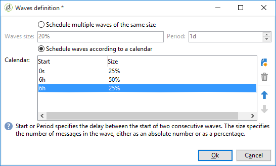

# Configuración y envío del envío {#configuring-and-sending-the-delivery}

>[!NOTE]
>
>Solo el propietario del envío puede iniciar un envío. In order for another operator (or operator group) to be able to start a delivery, you have to add them as reviewers in the **[!UICONTROL Delivery start:]** field.
>
>Consulte [esta sección](../../campaign/using/marketing-campaign-approval.md#selecting-reviewers) para obtener más información.

## Parámetros adicionales de envío {#delivery-additiona-parameters}

Before sending the delivery, you can define the sending parameters in the delivery properties, via the **[!UICONTROL Delivery]** tab.

* **[!UICONTROL Delivery priority]**: Esta opción permite influir en el orden de envío de los envíos indicando su nivel de prioridad (normal, alto o bajo). Esto permite priorizar el orden de ciertos envíos más urgentes por encima de otros.

* **[!UICONTROL Message batch quantity]**: Esta opción permite definir el número de mensajes agrupados dentro del mismo paquete de envío XML. Si el parámetro está establecido en 0, los mensajes se agrupan automáticamente. The package size is defined by the calculation `<delivery size>/1024`, with a minimum of 8 and a maximum of 256 messages by package.

   >[!CAUTION]
   >
   >Cuando se duplica el envío, se restablece el parámetro.

* **[!UICONTROL Send using multiple waves]**:: Para obtener más información, consulte [Envío con varias ondas](#sending-using-multiple-waves).

* **[!UICONTROL Test SMTP delivery]**: Esta opción permite probar la realización de un envío a través de SMTP. El envío se procesa hasta la conexión con el servidor SMTP, pero no se envía.

   >[!NOTE]
   >
   >No se recomienda utilizar esta opción al instalar con mid-sourcing para no llamar al MTA.
   >
   >Para obtener más información sobre la configuración de un servidor SMTP, consulte [esta sección](../../installation/using/configuring-campaign-server.md#personalizing-delivery-parameters).

* **[!UICONTROL Archive emails]**: Esta opción permite almacenar correos electrónicos en un sistema externo como CCO simplemente añadiendo una dirección de correo electrónico CCO al objetivo del mensaje. For more on this, refer to [Archiving emails](../../delivery/using/sending-messages.md#archiving-emails).

Una vez configurada la entrega y lista para enviarla, asegúrese de ejecutar el análisis [de](../../delivery/using/steps-validating-the-delivery.md#analyzing-the-delivery)envío. Una vez finalizado, haga clic en **[!UICONTROL Confirm delivery]** para iniciar el envío de mensajes.

You can then close the delivery wizard and track the execution of the delivery from the **[!UICONTROL Delivery]** tab, accessible via the detail of this delivery or via the list of deliveries.

Después de enviar mensajes, puede monitorizar y realizar un seguimiento de los envíos. Para obtener más información, consulte estas secciones:

* [Seguimiento de un envío](../../delivery/using/monitoring-a-delivery.md)
* [Comprensión de los errores de envío](../../delivery/using/understanding-delivery-failures.md)
* [Acerca del seguimiento de mensajes](../../delivery/using/about-message-tracking.md)

## Programación de los envíos {#scheduling-the-delivery-sending}

Puede retrasar el envío de mensajes para programar su fecha o manejar la presión de ventas y evitar solicitar en exceso a una población.

1. Haga clic en el **[!UICONTROL Send]** botón y seleccione la **[!UICONTROL Postpone delivery]** opción.

1. Specify a start date in the **[!UICONTROL Contact date]** field.

1. A continuación, puede iniciar el análisis de envío y confirmar el envío de envío. Sin embargo, el envío de envío no comenzará hasta la fecha indicada en el **[!UICONTROL Contact date]** campo.

>[!CAUTION]
>
>Una vez iniciado el análisis, la fecha de contacto definida queda fijada. Si se modifica esta fecha, es necesario reiniciar el análisis para que se tengan en cuenta las modificaciones.

En la lista de envío, el envío aparecerá con **[!UICONTROL Pending]** estado.

Scheduling can also be configured upstream via the **[!UICONTROL Scheduling]** button of the delivery.

Permite retrasar el envío a una fecha posterior o guardar el envío en el calendario provisional.

* The **[!UICONTROL Schedule delivery (no automatic execution)]** option lets you schedule a provisional analysis of the delivery.

   When this configuration is saved, the delivery changes to **[!UICONTROL Targeting pending]** status. El análisis se inicia en la fecha especificada.

* La **[!UICONTROL Schedule delivery (automatic execution on planned date)]** opción le permite especificar la fecha de entrega.

   Haga clic **[!UICONTROL Send]** y seleccione **[!UICONTROL Postpone delivery]** luego iniciar el análisis y confirmar el envío. Cuando el análisis finalice, el destino de envío está listo y los mensajes se envían automáticamente en la fecha especificada.

Las fechas y horas se expresan en el huso horario del operador actual. The **[!UICONTROL Time zone]** drop-down list located below the contact date input field lets you automatically convert the entered date and time into the selected time zone.

Por ejemplo, si se programa un envío para que se ejecute automáticamente a las 8 en punto, hora de Londres, la hora se convierte automáticamente al huso horario seleccionado.

## Envío mediante múltiples olas {#sending-using-multiple-waves}

Para equilibrar la carga, se pueden dividir los envíos en varios lotes. Configure el número de lotes y su proporción con respecto a todo el envío.

>[!NOTE]
>
>Solo se puede definir el tamaño y el retraso entre dos olas consecutivas. No se pueden configurar los criterios de selección de destinatarios para cada ola.

1. Open the delivery properties window and click the **[!UICONTROL Delivery]** tab.
1. Seleccione la **[!UICONTROL Send using multiple waves]** opción y haga clic en el **[!UICONTROL Define waves...]** vínculo.

   

1. Para configurar las olas, se puede:

   * Definir el tamaño de cada ola. For example, if you enter **[!UICONTROL 30%]** in the corresponding field, each wave will represent 30% of the messages included in the delivery, except the last one, which will represent 10% of the messages.

      In the **[!UICONTROL Period]** field, specify the delay between the start of two consecutive waves. For example, if you enter **[!UICONTROL 2d]**, the first wave will start immediately, the second wave will start in two days, the third wave in four days, and so on.

      

   * Defina un calendario para enviar cada ola.

      In the **[!UICONTROL Start]** column, specify the delay between the start of two consecutive waves. In the **[!UICONTROL Size]** column, enter a fixed number or a percentage.

      En el siguiente ejemplo, la primera ola representa el 25 % del número total de mensajes incluidos en el envío y se inicia inmediatamente. Las dos olas siguientes completan el envío y se establecen para comenzar a intervalos de seis horas.

      
   A specific typology rule, **[!UICONTROL Wave scheduling check]**, ensures that the last wave is planned before the delivery validity limit. Las tipologías de campaña y sus reglas, configuradas en la **[!UICONTROL Typology]** ficha de las propiedades de entrega, se presentan en el proceso [de validación con tipologías](../../delivery/using/steps-validating-the-delivery.md#validation-process-with-typologies).

   >[!CAUTION]
   >
   >Make sure the last waves do not exceed the delivery deadline, which is defined in the **[!UICONTROL Validity]** tab. En caso contrario, es posible que algunos mensajes no se envíen.
   >
   >Al configurar las últimas olas, se debe dejar un margen suficiente para realizar reintentos. Consulte [esta sección](../../delivery/using/steps-sending-the-delivery.md#configuring-retries).

1. Para supervisar sus envíos, vaya a los “logs” de envío. Consulte [esta página](../../delivery/using/monitoring-a-delivery.md#delivery-logs-and-history).

   You can see the deliveries that were already sent in the processed waves (**[!UICONTROL Sent]** status) and the deliveries to be sent in the remaining waves (**[!UICONTROL Pending]** status).

Los siguientes dos ejemplos son los casos más comunes para usar varias olas.

* **Durante el proceso de aceleración**

   Cuando se envían correos electrónicos utilizando una plataforma nueva, los proveedores de servicios de Internet (ISP) sospechan de las direcciones IP desconocidas. Si se envían, de repente, grandes volúmenes de correos electrónicos, los ISP suelen marcarlos como correo no deseado.

   Para evitar que se lo considere correo no deseado, puede aumentar progresivamente el volumen enviado mediante el uso de olas. Esto debería garantizar un desarrollo uniforme de la fase de inicio y permitir reducir la velocidad total de direcciones no válidas.

   Para ello, utilice la **[!UICONTROL Schedule waves according to a calendar]** opción . Por ejemplo, defina la primera ola en 10 %, la segunda en 15 % y así sucesivamente.

   

* **Campañas que implican un centro de llamadas**

   Al administrar una campaña de lealtad por teléfono, su organización tiene una capacidad limitada para procesar la cantidad de llamadas a los suscriptores.

   Al usar olas, restringimos el número de mensajes a 20 por día, es decir, la capacidad de procesamiento diaria de un centro de llamadas.

   Para ello, seleccione la **[!UICONTROL Schedule multiple waves of the same size]** opción. Enter **[!UICONTROL 20]** as the wave&#39;s size and **[!UICONTROL 1d]** in the **[!UICONTROL Period]** field.

   

## Configuración de los reintentos {#configuring-retries}

Para los mensajes que no se hayan enviado temporalmente debido a un error **leve** o **ignorado**, se realiza un reintento automático. Los tipos y motivos del error de envío se presentan en esta [sección](../../delivery/using/understanding-delivery-failures.md#delivery-failure-types-and-reasons).

The central section of the **[!UICONTROL Delivery]** tab for delivery parameters indicates how many retries should be performed the day after the delivery and the minimum delay between retries.

De manera predeterminada, se programan cinco reintentos para el primer día del envío con un intervalo mínimo de una hora distribuidos durante las 24 horas del día. One retry per day is programmed after that and until the delivery deadline, which is defined in the **[!UICONTROL Validity]** tab (see [Defining validity period](../../delivery/using/steps-sending-the-delivery.md#defining-validity-period)).

>[!NOTE]
>
>En el caso de instalaciones hospedadas o híbridas, si ha actualizado a la MTA mejorada, la configuración de reintentos de la entrega ya no se utiliza en Campaign. Los reintentos de devoluciones en blanco y el período de tiempo entre ellos están determinados por el MTA mejorado en función del tipo y la gravedad de las respuestas de devoluciones procedentes del dominio de correo electrónico del mensaje.
>
>Todos los impactos se detallan en el documento MTA [mejorado de](https://helpx.adobe.com/campaign/kb/campaign-enhanced-mta.html) Adobe Campaign.

## Definición del periodo de validez {#defining-validity-period}

Una vez iniciado el envío, se pueden enviar los mensajes (y los reintentos) hasta la fecha límite de envío. This is indicated in the delivery properties, via the **[!UICONTROL Validity]** tab.

* The **[!UICONTROL Delivery duration]** field lets you enter the limit for global delivery retries. Esto significa que Adobe Campaign envía los mensajes comenzando en la fecha de inicio y, a continuación, para los mensajes que devuelven solo un error se realizan reintentos normales y configurables hasta que se alcanza el límite de validez.

   Asimismo, puede especificar fechas. Para ello, seleccione **[!UICONTROL Explicitly set validity dates]**. En este caso, las fechas de envío y de límite de validez también permiten especificar el tiempo. El tiempo actual se utiliza de forma predeterminada, pero puede modificarse directamente en el campo de entrada.

* **Límite de validez de los recursos**:El **[!UICONTROL Validity limit]** campo se utiliza para los recursos cargados, principalmente para la página reflejada y las imágenes. Los recursos de esta página son válidos durante un tiempo limitado (para ahorrar espacio en el disco).

   Los valores de este campo se pueden expresar en las unidades enumeradas en [esta sección](../../platform/using/adobe-campaign-workspace.md#default-units).

>[!NOTE]
>
>En el caso de instalaciones hospedadas o híbridas, si se ha actualizado a la MTA mejorada, la configuración de las entregas de la campaña solo se utilizará si se establece en **[!UICONTROL Delivery duration]** 3,5 **** días o menos. Si define un valor superior a 3,5 días, no se tendrá en cuenta.
>
>Todos los impactos se detallan en el documento MTA [mejorado de](https://helpx.adobe.com/campaign/kb/campaign-enhanced-mta.html) Adobe Campaign.
