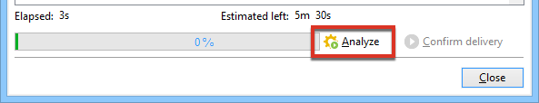

# Validación de la entrega {#validating-the-delivery}

Cuando se ha creado y configurado una entrega, se debe validar antes de enviarlo al objetivo principal.

Para ello:

1. **Analice la entrega**: este paso permite preparar los mensajes que se van a enviar. [Más información](#analyzing-the-delivery).

   Las reglas aplicadas durante el análisis se presentan en [esta sección](#validation-process-with-typologies). Los modos de validación disponibles se detallan en la sección [Cambio del modo de aprobación](#changing-the-approval-mode).

1. **Envío de pruebas**: este paso permite controlar el contenido, las direcciones URL, la personalización, etc. Obtenga más información en [Envío de pruebas](../../delivery/using/steps-validating-the-delivery.md#sending-a-proof) y [Definición de un objetivo de prueba específico](../../delivery/using/steps-defining-the-target-population.md#defining-a-specific-proof-target).

>[!IMPORTANT]
>
>Los dos pasos anteriores DEBEN ejecutarse después de cada modificación del contenido del mensaje.

## Analice la entrega {#analyzing-the-delivery}

El análisis es la fase durante la cual se calcula la población objetivo y se prepara el contenido de entrega. Una vez finalizada, la entrega está listo para realizarse.

### Inicie el análisis {#launching-the-analysis}

1. Para iniciar el análisis de entrega, haga clic en **[!UICONTROL Send]**.
1. Seleccione **[!UICONTROL Deliver as soon as possible]**.

   

1. Haga clic en **[!UICONTROL Analyze]** para iniciar el análisis manualmente.

   La barra de progreso muestra el progreso del análisis.

   

   >[!NOTE]
   >
   >Las reglas de validación utilizadas durante el análisis se describen en la sección [Proceso de validación con tipologías](../../delivery/using/steps-validating-the-delivery.md#validation-process-with-typologies).

1. Puede detener este análisis en cualquier momento haciendo clic en **[!UICONTROL Stop]**.

   

   No se envían mensajes durante la fase de preparación. Por lo tanto, puede iniciar o cancelar el análisis sin riesgos.

   >[!IMPORTANT]
   >
   >Al ejecutarse, el análisis detiene el envío (o prueba). Cualquier modificación al envío (o la prueba) debe ir seguida de otro análisis antes de ser válida.

1. Espere hasta que se complete el análisis.

   Cuando termina el análisis, la sección superior de la ventana indica si la preparación del envío ha finalizado o si se ha producido algún error. Se muestran todos los pasos, advertencias y errores de validación. Los iconos de color muestran el tipo de mensaje:
   * El icono azul indica un mensaje informativo.
   * El icono amarillo indica un error de procesamiento no crítico.
   * El icono rojo indica un error crítico que impide realizar el envío.

   

1. Haga clic en **[!UICONTROL Close]** para corregir los errores.

1. Después de realizar los cambios, reinicie el análisis haciendo clic en **[!UICONTROL Analyze]**.

Compruebe el resultado del análisis antes de hacer clic en **[!UICONTROL Confirm delivery]** para enviar el mensaje al objetivo especificado. Un mensaje de confirmación permite iniciar la entrega.

>[!NOTE]
>
>Haga clic en el vínculo **[!UICONTROL Change the main delivery target]** si el número de mensajes que va a enviar no coincide con la configuración. Esto permite cambiar la definición de la población objetivo y reiniciar el análisis.

### Configuración de análisis {#analysis-parameters}

La pestaña **[!UICONTROL Analysis]** de los parámetros de envío permite definir un conjunto de información relacionada con la preparación de los mensajes durante la fase de análisis.

Esta pestaña proporciona acceso a las siguientes opciones:

* **[!UICONTROL Label and code of the delivery]**: las opciones de esta sección se utilizan para calcular los valores de estos campos durante la fase de análisis de envío. El campo **[!UICONTROL Compute the execution folder during the delivery analysis]** calcula el nombre de la carpeta que debe contener esta acción de entrega durante la fase de análisis.
* **[!UICONTROL Approval mode]**: este campo permite definir el envío manual o automático una vez finalizado el análisis. Los modos de validación se presentan en la sección [Cambio del modo de aprobación](#changing-the-approval-mode).
* **[!UICONTROL Prepare the delivery parts in the database]**: esta opción permite mejorar el rendimiento del análisis de envío. Para obtener más información, consulte [esta sección](#improving-delivery-analysis).
* **[!UICONTROL Prepare the personalization data with a workflow]**: esta opción 
permite preparar los datos de personalización contenidos en el envío en un flujo de trabajo automático, lo que permite obtener un aumento significativo del rendimiento para ejecutar la personalización. Para obtener más información, consulte [Optimización de la personalización](../../delivery/using/personalization-fields.md#optimizing-personalization).
* **[!UICONTROL Start job in a detached process]**: esta opción permite iniciar el análisis de envío en un proceso independiente. La función de análisis utiliza el proceso del servidor de aplicaciones de Adobe Campaign (web nlserver) de forma predeterminada. Al seleccionar esta opción, se asegura de que el análisis se complete incluso en caso de que falle el servidor de aplicaciones.
* **[!UICONTROL Log SQL queries generated during the analysis in the journal]**: esta opción añade los registros de consulta SQL al diario de entrega durante la fase de análisis.
* **[!UICONTROL Ignore personalization scripts during sending]**: esta opción permite evitar la interpretación de las directrices de JavaScript que se encuentran en el contenido HTML. Se visualizan tal y como están en los contenidos enviados. Estas directivas se introducen con la etiqueta **&lt;%=**.

### Mejora del rendimiento del análisis de envío {#improving-delivery-analysis}

Para acelerar la preparación del envío, puede marcar la opción **[!UICONTROL Prepare the delivery parts in the database]** antes de iniciar el análisis.

Cuando esta opción está habilitada, la preparación de envíos se realiza directamente en la base de datos, lo que puede acelerar considerablemente el análisis.

Actualmente, esta opción solo está disponible cuando se cumplen las siguientes condiciones:
* El envío debe ser un correo electrónico. Los otros canales no son compatibles por ahora.
* Evite utilizar enrutamiento intermediario o externo, solo el tipo de enrutamiento de envío masivo. Puede comprobar el enrutamiento que se utiliza en la pestaña **[!UICONTROL General]** de la **[!UICONTROL Delivery properties]**.
* No se puede direccionar hacia una población procedente de un archivo externo. Para un solo envío, haga clic en el enlace **[!UICONTROL To]** desde el **[!UICONTROL Email parameters]** y compruebe que la **[!UICONTROL Defined in the database]** opción está seleccionada. Para un envío utilizado en un flujo de trabajo, compruebe que los destinatarios están **[!UICONTROL Specified by the inbound event(s)]** en la pestaña **[!UICONTROL Delivery]**.
* Debe estar utilizando una base de datos PostgreSQL.

### Configuración de la prioridad de análisis {#analysis-priority-}

Cuando la entrega forma parte de una campaña, la pestaña **[!UICONTROL Advanced]** ofrece una opción adicional. Esto permite organizar el orden de procesamiento de los envíos en la misma campaña.

Cada entrega se analiza antes de realizarlo. La duración del análisis depende del archivo de extracción de envíos. Cuanto más significativo sea el tamaño del archivo, más dura el análisis, lo que hace que los siguientes envíos deban esperar.

Las opciones de **[!UICONTROL Message preparation by the scheduler]** permiten priorizar el análisis de envíos en un flujo de trabajo de Campaign.

Si una entrega es demasiado grande, es mejor asignarle una prioridad baja para evitar ralentizar el análisis de otros envíos del flujo de trabajo.

>[!NOTE]
>
>Para garantizar que los análisis de entrega más grandes no ralenticen el progreso de los flujos de trabajo, se puede programar su ejecución marcando **[!UICONTROL Schedule execution for a time of low activity]**.

## Envío de una prueba {#sending-a-proof}

Para detectar posibles errores en la configuración del mensaje, Adobe recomienda configurar un ciclo de validación de entrega. Asegúrese de que el contenido se aprueba con la frecuencia necesaria al enviar pruebas a los destinatarios de prueba. Se debe enviar una prueba cada vez que se realiza un cambio para aprobar el contenido.

>[!NOTE]
>
>* Los modos de validación disponibles se detallan en [Cambio del modo de aprobación](../../delivery/using/steps-validating-the-delivery.md#changing-the-approval-mode).
>* La configuración del objetivo de prueba se explica en [Definición de un objetivo de prueba específico](../../delivery/using/steps-defining-the-target-population.md#defining-a-specific-proof-target).

>

Para enviar una prueba, siga los pasos a continuación:

1. Asegúrese de que el objetivo de prueba se ha configurado tal como se describe en [Definición de un objetivo de prueba específico](../../delivery/using/steps-defining-the-target-population.md#defining-a-specific-proof-target).
1. En la barra superior del asistente de envíos, haga clic en **[!UICONTROL Send a proof]**.

   

1. Inicie el análisis del mensaje. Consulte [Análisis de la entrega](../../delivery/using/steps-validating-the-delivery.md#analyzing-the-delivery).
1. Ahora puede enviar la entrega (consulte [Envío de la entrega](../../delivery/using/steps-sending-the-delivery.md)).

   Una vez que se envía la entrega, la prueba aparece en la lista de entrega y se crea y numera automáticamente. Se puede editar si se desea acceder a su contenido y sus propiedades. Para obtener más información, consulte [esta página](../../delivery/using/about-delivery-monitoring.md).

   

   >[!NOTE]
   >
   >Si se han creado varios formatos para la entrega (HTML y texto), se puede elegir el formato de los mensajes que se envían a los destinatarios de la prueba en la sección inferior de la ventana.

   

Quizá desee modificar el contenido de la entrega como resultado de los comentarios realizados por el grupo de validación que recibe la prueba. Después de realizar los cambios, debe reiniciar el análisis y enviar otra prueba. Cada nueva prueba se numera y registra en el diario de envíos.

Una vez analizado la entrega, puede ver las distintas pruebas enviadas a través de la subpestaña **[!UICONTROL Proofs]** del “log” (pestaña **[!UICONTROL Audit]**).

Debe enviar tantas pruebas como sean necesarias hasta finalizar el contenido de la entrega. Después, puede realizar la entrega al destino principal y cerrar el ciclo de validación.

La pestaña **[!UICONTROL Advanced]** de propiedades de la entrega permite definir las propiedades de la prueba. Cuando sea necesario, puede anular las reglas de exclusión de destinatarios.

Estas son las opciones disponibles:

* La primera opción permite mantener las pruebas duplicadas.
* Las dos opciones siguientes permiten mantener los destinatarios que están en la lista de bloqueados y las direcciones en cuarentena. Consulte la descripción de estas opciones para el objetivo principal en [Personalización de la configuración de exclusión](../../delivery/using/steps-defining-the-target-population.md#customizing-exclusion-settings). A diferencia del objetivo de una entrega, donde estas direcciones se excluyen de forma predeterminada, se mantienen de forma predeterminada para el objetivo de una prueba.
* La opción **[!UICONTROL Keep the delivery code for the proof]** permite dar a la prueba el mismo código de entrega que el definido para la entrega con el que se relaciona. Este código se especifica en el primer paso del asistente de envíos.
* De forma predeterminada, el asunto de la prueba incluye el prefijo “Proof #”, donde # es el número de la prueba. Se puede cambiar este prefijo en el campo **[!UICONTROL Label prefix]**.

## Proceso de validación con tipologías {#validation-process-with-typologies}

Antes de enviar cualquier mensaje, se debe analizar la campaña para aprobar su contenido y configuración. Las reglas de comprobación aplicadas durante la fase de análisis se definen en una **tipología**. De forma predeterminada, en el caso de los correos electrónicos, el análisis cubre los siguientes puntos:

* Aprobación del objeto
* Aprobación de las URL e imágenes
* Aprobación de las etiquetas de URL
* Aprobación del vínculo de baja
* Comprobación del tamaño de las pruebas
* Comprobación del periodo de validez
* Comprobación de la programación de las olas

La tipología que se debe aplicar a cada entrega se selecciona en la pestaña **[!UICONTROL Typologies]** de los parámetros de la entrega.

Puede ver y editar las reglas de aprobación, su contenido, orden de ejecución y descripción completa a través del nodo **[!UICONTROL Administration > Campaign execution > Typology management > Typology rules]**.

Puede crear nuevas reglas y definir nuevas tipologías a partir de este nodo. Sin embargo, estas tareas se reservan para los usuarios expertos que conocen JavaScript.

Para obtener más información sobre las reglas de tipología, consulte [esta página](../../campaign/using/about-campaign-typologies.md).

Para editar la tipología actual, haga clic en el icono **[!UICONTROL Edit link]** a la derecha del campo **[!UICONTROL Typology]**.

La pestaña **[!UICONTROL Rule]** proporciona una lista de las reglas de tipología que se pueden aplicar. Seleccione una regla y haga clic en el icono **[!UICONTROL Detail...]** para ver su configuración:

>[!NOTE]
>
>Las tipologías de tipo **[!UICONTROL Arbitration]** se utilizan dentro del marco de gestión de la presión de ventas. Para obtener más información, consulte [esta sección](../../campaign/using/about-marketing-resource-management.md).

## Cambio del modo de aprobación {#changing-the-approval-mode}

La pestaña **[!UICONTROL Analysis]** para las propiedades de entrega permite seleccionar el modo de validación. Si se generan advertencias durante el análisis (por ejemplo, si se acentúan ciertos caracteres en el asunto de la entrega, etc.), puede configurar la entrega para definir si se debe ejecutar o no. De forma predeterminada, el usuario debe confirmar la entrega de los mensajes al final de la fase de análisis: esta es la validación **manual**.

Seleccione otro modo de aprobación en la lista desplegable del campo apropiado.

Están disponibles los siguientes modos de aprobación:

* **[!UICONTROL Manual]**: al final de la fase de análisis, el usuario debe confirmar la entrega para iniciarlo. Para ello, haga clic en el botón **[!UICONTROL Start]** para iniciar la entrega.
* **[!UICONTROL Semi-automatic]**: la entrega comienza automáticamente si la fase de análisis no genera mensajes de advertencia.
* **[!UICONTROL Automatic]**: la entrega comienza automáticamente al final de la fase de análisis, independientemente de su resultado.
