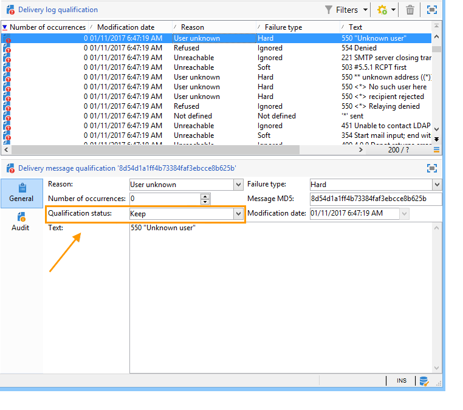

# Comprensión de los errores de entrega{#understanding-delivery-failures}

## Acerca de los errores de entrega {#about-delivery-failures}

Cuando un mensaje (correo electrónico, SMS, notificación inmediata) no se puede enviar a un perfil, el servidor remoto envía automáticamente un mensaje de error que recoge la plataforma de Adobe Campaign para determinar si la dirección de correo electrónico o el número de teléfono deben ponerse en cuarentena. Consulte [Administración de correos rechazados](#bounce-mail-management).

>[!NOTE]
>
>Los mensajes de error de **correo electrónico** (o “devoluciones”) están calificados por el MTA mejorado (devoluciones sincrónicas) o por el proceso de inMail (devoluciones asincrónicas).
>
>**Los mensajes de error de SMS (o “SR”, de “informe de estado”) se clasifican mediante el proceso MTA.**

Una vez enviado un mensaje, los registros de envío permiten ver el estado de envío de cada perfil y el tipo y el motivo de error asociado.

Los mensajes también se pueden excluir durante la preparación de la entrega si una dirección está en cuarentena o si un perfil está en la lista de bloqueados. Los mensajes excluidos se muestran en el panel de entrega.

**Temas relacionados:**

* [Registros de entrega e historial](../../delivery/using/delivery-dashboard.md#delivery-logs-and-history)
* [Estado de error](../../delivery/using/delivery-performances.md#failed-status)
* [Tipos y motivos de errores de entrega](#delivery-failure-types-and-reasons)

## Tipos y motivos de errores de entrega {#delivery-failure-types-and-reasons}

Existen tres tipos de error cuando falla un mensaje. Cada tipo de error determina si una dirección se envía a cuarentena. Para obtener más información, consulte [Condiciones para enviar una dirección a cuarentena](../../delivery/using/understanding-quarantine-management.md#conditions-for-sending-an-address-to-quarantine).

* **Hard**: Un error “grave” indica una dirección no válida. Esto implica un mensaje de error que indica explícitamente que la dirección no es válida, como: “Usuario desconocido”.
* **Soft**: Podría tratarse de un error temporal o uno que no se pudiera categorizar, como: “Dominio no válido” o “Buzón lleno”.
* **Ignored**: Se trata de un error temporal, como “Fuera de la oficina”, o un error técnico, por ejemplo, si el tipo de remitente es “Administrador de correo”.

Los posibles motivos de un error de entrega son:

<table> 
 <tbody> 
  <tr> 
   <td> Etiqueta de error </td> 
   <td> Tipo de error </td> 
   <td> Valor técnico </td> 
   <td> Descripción </td> 
  </tr> 
  <tr> 
   <td> Cuenta deshabilitada </td> 
   <td> Leve/Grave </td> 
   <td> 4 </td> 
   <td> La cuenta vinculada a la dirección no está activa. Cuando el proveedor de acceso a Internet (IAP) detecta un periodo de inactividad prolongado, puede cerrar la cuenta del usuario. A partir de ese momento no se pueden realizar entregas a la cuenta de usuario. Si la cuenta está temporalmente desactivada debido a seis meses de inactividad y todavía se puede activar, se asigna el estado “con errores” y se prueba de nuevo la cuenta hasta que el contador de errores alcance 5. Si el error indica que la cuenta está desactivada de forma permanente, se envía directamente a Cuarentena.  </td> 
  </tr> 
  <tr> 
   <td> Dirección en cuarentena </td> 
   <td> Grave </td> 
   <td> 9 </td> 
   <td> La dirección se envió a cuarentena.  </td> 
  </tr> 
  <tr> 
   <td> Dirección no especificada </td> 
   <td> Grave </td> 
   <td> 7 </td> 
   <td> No se proporciona ninguna dirección para el destinatario.  </td> 
  </tr> 
  <tr> 
   <td> Dirección de baja calidad </td> 
   <td> Ignorado </td> 
   <td> 14 </td> 
   <td> El índice de calidad de esta dirección es demasiado bajo.  </td> 
  </tr> 
  <tr> 
   <td> Dirección incluida en la lista de bloqueados </td> 
   <td> Grave </td> 
   <td> 8 </td> 
   <td> La dirección se agregó a la lista de bloqueados al momento del envío. Este estado se utiliza para importar datos de listas externas y sistemas externos a la lista de cuarentena de Adobe Campaign.  </td> 
  </tr> 
  <tr> 
   <td> Dirección de control </td> 
   <td> Ignorado </td> 
   <td> 127 </td> 
   <td> La dirección del destinatario forma parte del grupo de control.  </td> 
  </tr> 
  <tr> 
   <td> Duplicada </td> 
   <td> Ignorado </td> 
   <td> 10 </td> 
   <td> La dirección del destinatario ya se encontraba en esta entrega.  </td> 
  </tr> 
  <tr> 
   <td> Error ignorado </td> 
   <td> Ignorado </td> 
   <td> 25 </td> 
   <td> La dirección está incluida en la lista de permitidos. Por lo tanto, el error se ignora y se envía un correo electrónico.  </td> 
  </tr> 
  <tr> 
   <td> Excluido tras la mediación </td> 
   <td> Ignorado </td> 
   <td> 12 </td> 
   <td> El destinatario se ha excluido mediante las reglas de tipología de campaña de tipo “mediación”.  </td> 
  </tr> 
  <tr> 
   <td> Excluido por una regla SQL </td> 
   <td> Ignorado </td> 
   <td> 11 </td> 
   <td> El destinatario se ha excluido mediante una regla de tipología de campaña de tipo “SQL”.  </td> 
  </tr> 
  <tr> 
   <td> Dominio inválido </td> 
   <td> Leve </td> 
   <td> 2 </td> 
   <td> El dominio de la dirección del correo electrónico es incorrecto o ya no existe. Este perfil se vuelve a seleccionar hasta que el recuento de errores llegue a 5. Después de esto, el registro se pone en estado de cuarentena y no se realiza ningún reintento.  </td> 
  </tr> 
  <tr> 
   <td> Buzón de correo lleno </td> 
   <td> Leve </td> 
   <td> 5 </td> 
   <td> El buzón de este usuario está lleno y no puede aceptar más mensajes. Este perfil se vuelve a seleccionar hasta que el recuento de errores llegue a 5. Después de esto, el registro se pone en estado de cuarentena y no se realiza ningún reintento.  Este tipo de error se administra mediante un proceso de limpieza; la dirección se establece en un estado válido después de 30 días.  Advertencia: para que la dirección se elimine automáticamente de la lista de direcciones en cuarentena, debe iniciarse el flujo de trabajo técnico de limpieza de bases de datos.  </td> 
  </tr> 
  <tr> 
   <td> Sin conexión </td> 
   <td> Ignorado </td> 
   <td> 6 </td> 
   <td> El teléfono móvil del destinatario está apagado o no está conectado a la red cuando al enviar el mensaje.  </td> 
  </tr> 
  <tr> 
   <td> Sin definir </td> 
   <td> Sin definir </td> 
   <td> 0 </td> 
   <td> La dirección se encuentra sin clasificar debido a que aún no se ha sumado el error. Este tipo de error se produce cuando el servidor envía un nuevo mensaje de error: puede tratarse de un error aislado; sin embargo, si vuelve a producirse, el contador de errores aumenta, lo que advierte a los equipos técnicos. Entonces pueden realizar análisis de mensajes y clasificar este error a través del nodo Administration, Campaign Management, Non deliverables Management en la estructura del árbol.  </td> 
  </tr> 
  <tr> 
   <td> No reúne los requisitos para las ofertas </td> 
   <td> Ignorado </td> 
   <td> 16 </td> 
   <td> El destinatario no reunía los requisitos para las ofertas de la entrega.  </td> 
  </tr> 
  <tr> 
   <td> Rechazado </td> 
   <td> Leve/Grave </td> 
   <td> 20 </td> 
   <td> La dirección se ha enviado a cuarentena debido a un comentario de seguridad que informa de correo no deseado. Según el error, se vuelve a intentar enviar un correo a la dirección hasta que el contador de errores alcance 5 o se envía directamente a cuarentena.  </td> 
  </tr> 
  <tr> 
   <td> Destinatarios de tamaño limitado </td> 
   <td> Ignorado </td> 
   <td> 17 </td> 
   <td> Se ha alcanzado el tamaño máximo de entrega para el destinatario.  </td> 
  </tr> 
  <tr> 
   <td> Dirección no autorizada </td> 
   <td> Ignorado </td> 
   <td> 15 </td> 
   <td> La dirección postal no se ha clasificado.  </td> 
  </tr> 
  <tr> 
   <td> Inaccesible </td> 
   <td> Leve/Grave </td> 
   <td> 3 </td> 
   <td> Se ha producido un error en la cadena de entrega de mensajes. Podría ser un incidente en la retransmisión SMTP, un dominio al que no se puede acceder temporalmente, etc. Según el error, se vuelve a intentar enviar un correo a la dirección hasta que el contador de errores llegue a 5 o se envía directamente a cuarentena.  </td> 
  </tr> 
  <tr> 
   <td> Usuario desconocido </td> 
   <td> Grave </td> 
   <td> 1 </td> 
   <td> La dirección no existe. No se intenta realizar entregas adicionales para este perfil.  </td> 
  </tr> 
 </tbody> 
</table>

## Reintentos tras un fallo temporal de entrega {#retries-after-a-delivery-temporary-failure}

Si un mensaje falla debido a un error **leve** o **ignorado** temporal, los reintentos se realizan durante la duración de la entrega.

>[!NOTE]
>
>Los mensajes no enviados temporalmente solo pueden estar relacionados con un error **Soft** o **Ignored**, pero no con un error **Hard** (consulte [Tipos y motivos de error de entrega](#delivery-failure-types-and-reasons)).

>[!IMPORTANT]
>
>En el caso de instalaciones hospedadas o híbridas, si ha actualizado al [servidor de correo mejorado](../../delivery/using/sending-with-enhanced-mta.md), la configuración de reintentos del envío ya no se utiliza en Campaign. Los reintentos de rebote suave y el periodo entre ellos están determinados por el servidor de correo mejorado en función del tipo y la gravedad de las respuestas de devoluciones procedentes del dominio de correo electrónico del mensaje.

En las instalaciones on-premise y las instalaciones hospedadas/híbridas que utilizan el servidor de correo de Campaign heredado, para modificar la duración de un envío, vaya a los parámetros avanzados del envío o la plantilla de envío y especifique la duración deseada en el campo correspondiente. Consulte [Definición del periodo de validez](../../delivery/using/steps-sending-the-delivery.md#defining-validity-period).

La configuración predeterminada permite cinco intentos en intervalos de una hora, seguidos de un reintento diario durante cuatro días. El número de reintentos se puede cambiar a nivel global (póngase en contacto con el administrador técnico de Adobe) o para cada envío o plantilla de envíos (consulte [Configuración de reintentos](../../delivery/using/steps-sending-the-delivery.md#configuring-retries)).

## Errores sincrónicos y asíncronos {#synchronous-and-asynchronous-errors}

Un mensaje puede fallar inmediatamente (error sincrónico), o más tarde, después de enviarlo (error asíncrono).

* Error sincrónico: el servidor de correo remoto contactado mediante el servidor de entrega de Adobe Campaign devuelve inmediatamente un mensaje de error y la entrega no puede enviarse al servidor del perfil. Adobe Campaign clasifica cada error para determinar si las direcciones de correo electrónico implicadas deben estar en cuarentena o no. Consulte [Cualificación de correo rechazado](#bounce-mail-qualification).
* Error asíncrono: el servidor receptor reenvía más tarde un correo electrónico de rechazo o una SR. Este correo se carga en un buzón técnico que la aplicación utiliza para etiquetar mensajes con un error. Pueden producirse errores asíncronos hasta una semana después de mandar la entrega.

   >[!NOTE]
   >
   >La configuración del buzón de rechazos se detalla en [esta sección](../../installation/using/deploying-an-instance.md#managing-bounced-emails).

   El [bucle de comentarios](https://experienceleague.adobe.com/docs/deliverability-learn/deliverability-best-practice-guide/transition-process/infrastructure.html?lang=es#feedback-loops) funciona como los correos electrónicos rechazados. Cuando un usuario clasifica un correo electrónico como correo no deseado, puede configurar las reglas de correo en Adobe Campaign para bloquear todas las entregas a este usuario. Los mensajes enviados a los usuarios que han clasificado un correo electrónico como no deseado se redireccionan automáticamente a una bandeja de correo creada específicamente para este fin. Las direcciones de estos usuarios se incluyen en la lista de bloqueados aunque no hayan hecho clic en el vínculo de baja. Las direcciones se incluyen en la lista de bloqueados en la tabla de cuarentena (**NmsAddress**) en vez de en la tabla de destinatarios (**NmsRecipient**).

   >[!NOTE]
   >
   >La administración de quejas se detalla en la sección de [administración de entregas](../../delivery/using/about-deliverability.md).

## Gestión de correos rechazados {#bounce-mail-management}

La plataforma Adobe Campaign permite administrar los errores de envío de los correos electrónicos a través de la funcionalidad de correos rechazados.

Cuando un correo electrónico no puede enviarse a un destinatario, el servidor de mensajería remoto envía automáticamente un mensaje de error (correo rechazado) a una bandeja de entrada técnica diseñada para este fin.

En el caso de instalaciones on-premise e instalaciones alojadas/híbridas que utilizan el servidor de correo de Campaign heredado, la plataforma Adobe Campaign recopila los mensajes de error y los califica el proceso inMail para enriquecer la lista de reglas de gestión de correo electrónico.

>[!IMPORTANT]
>
>En el caso de instalaciones alojadas o híbridas, si ha actualizado al [servidor de correo mejorado](../../delivery/using/sending-with-enhanced-mta.md), la mayoría de las reglas de gestión de correo electrónico ya no se utilizan. Para obtener más información, consulte [esta sección](#email-management-rules).

### Clasificación del correo rechazado {#bounce-mail-qualification}

>[!IMPORTANT]
>
>Para instalaciones hospedadas o híbridas, si ha actualizado al [servidor de correo mejorado](../../delivery/using/sending-with-enhanced-mta.md):
>
>* Las cualificaciones de rechazo de la tabla **[!UICONTROL Delivery log qualification]** ya no se utilizan para los mensajes de error de envío **síncronos**. El servidor de correo mejorado determina el tipo de rechazo y la calificación, y envía esa información a Campaign.
>
>* Las devoluciones **asíncronas** siguen siendo calificadas por el proceso inMail a través de las reglas de **[!UICONTROL Inbound email]**. Para obtener más información, consulte [Reglas de gestión de correo electrónico](#email-management-rules).
>
>* En el caso de instancias que utilicen el servidor de correo mejorado **sin Webhooks/EFS**, las reglas de **[!UICONTROL Inbound email]** también se utilizan para procesar los correos electrónicos rechazados síncronos procedentes del servidor de correo mejorado, utilizando la misma dirección de correo electrónico que para los correos electrónicos rechazados asíncronos.

En el caso de instalaciones on-premise e instalaciones alojadas/híbridas que utilizan el servidor de correo de Campaign heredado, cuando se produce un error en el envío de un correo electrónico, el servidor de envío de Adobe Campaign recibe un mensaje de error del servidor de mensajería o del servidor DNS remoto. La lista de errores se compone de cadenas de caracteres incluidas en el mensaje rechazado por el servidor remoto. Los tipos y los motivos del error se asignan a cada mensaje.

Esta lista está disponible a través del nodo **[!UICONTROL Administration > Campaign Management > Non deliverables Management > Delivery log qualification]**. Contiene todas las reglas utilizadas por Adobe Campaign para clasificar los errores de entrega. No es exhaustiva, Adobe Campaign la actualiza regularmente y también la puede administrar el usuario.

El mensaje rechazado por el servidor remoto en la primera vez que se produjo este tipo de error se muestra en la columna **[!UICONTROL First text]** de la tabla **[!UICONTROL Delivery log qualification]**. Si no se muestra esta columna, haga clic en el botón **[!UICONTROL Configure list]** situado en la parte inferior derecha de la lista para seleccionarla.

Adobe Campaign filtra este mensaje para eliminar el contenido de la variable (como ID, fechas, direcciones de correo electrónico, números de teléfono, etc.) y muestra el resultado filtrado en la columna **[!UICONTROL Text]**. Las variables se reemplazan por **`#xxx#`**, excepto las direcciones que se sustituyen por **`*`**.

Este proceso permite reunir todos los errores del mismo tipo y evitar entradas múltiples para errores similares en la tabla de clasificación de “logs” de entregas.

>[!NOTE]
>
>El campo **[!UICONTROL Number of occurrences]** muestra el número de veces que se ha producido el mensaje en la lista. Está limitado a 100 000 incidencias. Si lo desea, puede editar el campo, por ejemplo, para reiniciarlo.

Los correos electrónicos rechazados pueden tener el siguiente estado de clasificación:

* **[!UICONTROL To qualify]**: no se ha podido clasificar el correo rechazado. Se debe asignar la clasificación al equipo de entregas para garantizar una capacidad de entrega eficiente de la plataforma. Siempre que no esté clasificado, no se usa el correo rechazado para enriquecer la lista de reglas de gestión de correo electrónico.
* **[!UICONTROL Keep]**: el correo rechazado fue clasificado y el flujo de trabajo de **Refresh for deliverability** lo usa para compararlo con las reglas de gestión de correo electrónico existentes y enriquecer la lista.
* **[!UICONTROL Ignore]** : el correo rechazado es ignorado por el MTA de Campaign, lo que significa que esta devolución nunca hará que la dirección del destinatario se ponga en cuarentena. El flujo de trabajo de **actualización para la entrega** no lo usará y no se enviará a las instancias de cliente.

>[!NOTE]
>
>En caso de una interrupción de un ISP, los correos electrónicos enviados a través de Campaign se marcan erróneamente como rechazos. Para corregir esto, debe actualizar la calificación de devoluciones. Para obtener más información, consulte [esta página](../../delivery/using/update-bounce-qualification.md).

### Reglas de gestión de correo electrónico {#email-management-rules}

>[!IMPORTANT]
>
>En el caso de instalaciones alojadas o híbridas, si ha actualizado al [servidor de correo mejorado](../../delivery/using/sending-with-enhanced-mta.md), la mayoría de las reglas de gestión de correo electrónico ya no se utilizan. Para obtener más información, consulte las secciones que siguen.

Se accede a las reglas de correo a través del nodo **[!UICONTROL Administration > Campaign Management > Non deliverables Management > Mail rule sets]**. Las reglas de administración de correo electrónico se muestran en la parte inferior de la ventana.

>[!NOTE]
>
>Los parámetros predeterminados de la plataforma se configuran en el asistente de implementación. Para obtener más información, consulte [esta sección](../../installation/using/deploying-an-instance.md).

Las reglas predeterminadas son las siguientes.

>[!IMPORTANT]
>
>* El servidor de entrega (MTA) debe reiniciarse si los parámetros se han modificado.
>* La modificación o creación de reglas de administración solo es para usuarios expertos.

#### Correo electrónico entrante {#inbound-email}

>[!IMPORTANT]
>
>En el caso de instalaciones alojadas o híbridas, si ha actualizado al [servidor de correo mejorado](../../delivery/using/sending-with-enhanced-mta.md) y si su instancia tiene la funcionalidad **Webhooks/EFS**, las reglas de **[!UICONTROL Inbound email]** ya no se utilizan para los mensajes de error en el envío síncronos. Para obtener más información, consulte [esta sección](#bounce-mail-qualification).

Para instalaciones on-premise e instalaciones hospedadas/híbridas que utilizan el servidor de correo de Campaign heredado, estas reglas contienen la lista de cadenas de caracteres que pueden ser devueltas por servidores remotos y que permiten calificar el error (**duro**, **suave** o **desconocido**).

Cuando un mensaje de correo electrónico falla, el servidor remoto devuelve un mensaje de rechazo a la dirección especificada en los parámetros de la plataforma. Adobe Campaign compara el contenido de cada mensaje de rechazo con las cadenas de la lista de reglas y, a continuación, lo asigna a uno de los tres [tipos de error](#delivery-failure-types-and-reasons).

>[!NOTE]
>
>El usuario puede crear sus propias reglas. Al importar un paquete y al actualizar datos mediante el flujo de trabajo **Refresh for deliverability**, se sobrescriben las reglas creadas por el usuario.

Para obtener más información sobre la calificación de correo rechazado, consulte [esta sección](#bounce-mail-qualification).

#### Administración de dominios {#domain-management}

>[!IMPORTANT]
>
>En el caso de instalaciones alojadas o híbridas, si ha actualizado al [servidor de correo mejorado](../../delivery/using/sending-with-enhanced-mta.md), las reglas de **[!UICONTROL Domain management]** ya no se utilizan. La firma de autenticación por correo electrónico de **DKIM (DomainKeys Identified Mail)** se realiza mediante el MTA mejorado para todos los mensajes con todos los dominios. No se firma con **el ID del remitente**, **DomainKeys** o **S/MIME** a menos que se especifique lo contrario en el nivel de MTA mejorado.

Para instalaciones on-premise e instalaciones hospedadas/híbridas que utilizan el servidor de correo de Campaign heredado, el servidor de mensajería de Adobe Campaign aplica una sola regla de **administración de dominios** a todos los dominios.

<!---->

* Se puede elegir si activar o no determinadas normas de identificación y claves de cifrado para comprobar el nombre del dominio como, por ejemplo, **ID de remitente**, **DomainKeys**, **DKIM** y **S/MIME**.
* **SMTP relay**: permite configurar la dirección IP y el puerto de un servidor de transmisión para un dominio determinado. Para obtener más información, consulte [esta sección](../../installation/using/configuring-campaign-server.md#smtp-relay).

Si los mensajes se muestran en Outlook con **[!UICONTROL on behalf of]** en la dirección del remitente, asegúrese de no firmar los mensajes de correo electrónico con el **ID del remitente**, que es el estándar de autenticación de correo electrónico propietario obsoleto de Microsoft. Si la opción **[!UICONTROL Sender ID]** está activada, desmarque la casilla correspondiente y póngase en contacto con el [Servicio de atención al cliente de Adobe](https://helpx.adobe.com/es/enterprise/admin-guide.html/enterprise/using/support-for-experience-cloud.ug.html). La capacidad de envío no se ve afectada.

#### Administración MX {#mx-management}

>[!IMPORTANT]
>
>En el caso de instalaciones alojadas o híbridas, si se ha actualizado al [servidor de correo mejorado](../../delivery/using/sending-with-enhanced-mta.md), ya no se utilizan las reglas de rendimiento de envíos **[!UICONTROL MX management]**. El servidor de correo mejorado utiliza sus propias reglas MX que le permiten personalizar el rendimiento por dominio en función de su propia reputación histórica de correo electrónico y de los comentarios en tiempo real procedentes de los dominios a los que envía correos electrónicos.

Para instalaciones on-premise e instalaciones alojadas/híbridas que utilicen el servidor de correo de Campaign heredado:

* Las reglas de administración MX se utilizan para regular el flujo de correos electrónicos salientes para un dominio específico. Realizan muestras de los mensajes de rechazo y bloquean la entrega a donde corresponda.

* El servidor de mensajería de Adobe Campaign aplica reglas específicas a los dominios y, a continuación, las reglas para el caso general representado por un asterisco en la lista de reglas.

* Para configurar las reglas de administración MX, simplemente configure un umbral y seleccione ciertos parámetros SMTP. Un **umbral** es un límite calculado como un porcentaje de error por encima del cual se bloquean todos los mensajes dirigidos a un dominio específico. Por ejemplo, en el caso general, para un mínimo de 300 mensajes, la entrega de correos electrónicos se bloquea durante tres horas si la tasa de error alcanza el 90 %.

Para obtener más información sobre gestión MX, consulte [esta sección](../../installation/using/email-deliverability.md#mx-configuration).
