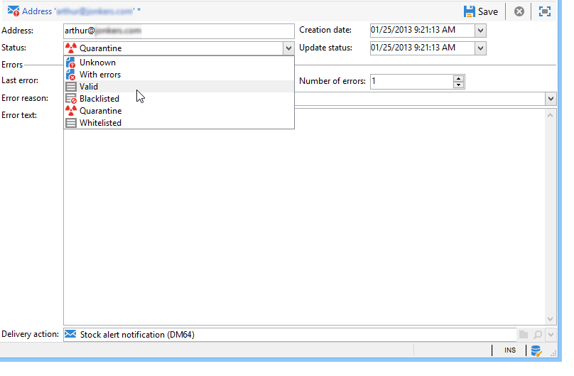

# Comprensión de la gestión de la cuarentena{#understanding-quarantine-management}

## Acerca de la cuarentena {#about-quarantines}

Adobe Campaign administra una lista de direcciones en cuarentena. Los destinatarios cuya dirección se haya puesto en cuarentena se excluyen de forma predeterminada durante el análisis de la entrega y no se tendrán en cuenta para la segmentación. Una dirección de correo electrónico se puede poner en cuarentena, por ejemplo, cuando el buzón está lleno o si la dirección no existe. En cualquier caso, el procedimiento de cuarentena cumple las reglas específicas que se describen a continuación.

>[!NOTE]
>
>Esta sección se aplica a los canales en línea: correo electrónico, SMS, notificación inmediata.

### Optimización de la entrega mediante cuarentenas {#optimizing-your-delivery-through-quarantines}

Los perfiles cuyas direcciones de correo electrónico o número de teléfono están en cuarentena se excluyen automáticamente durante la preparación del mensaje (consulte [Identificación de direcciones en cuarentena para una entrega](#identifying-quarantined-addresses-for-a-delivery)). Esto acelera las entregas, ya que la tasa de error afecta significativamente a la velocidad de entrega.

Algunos proveedores de acceso a Internet consideran automáticamente los correos electrónicos como no deseados si la tasa de direcciones no válidas es demasiado alta. Por lo tanto, la cuarentena le permite evitar ser incluido en la lista de bloqueados de bloqueados por estos proveedores.

Además, la cuarentena reduce el coste de entrega de los SMS mediante la exclusión en las entregas de los números de teléfono incorrectos. Para obtener más información sobre las prácticas recomendadas para proteger y optimizar las entregas, consulte [esta página](../../delivery/using/delivery-best-practices.md) .

### Cuarentena frente a lista de bloqueados {#quarantine-vs-denylist}

La **cuarentena** solo se aplica a una dirección, no al propio perfil. Esto significa que, si dos perfiles tienen la misma dirección de correo electrónico, ambos se ven afectados si la dirección está en cuarentena.

Del mismo modo, un perfil cuya dirección de correo electrónico se haya puesto en cuarentena puede actualizar su perfil e introducir una nueva dirección, y luego puede volver a recibir entregas.

Al estar en la **lista de bloqueados**, no obstante, el perfil ya no se tendrá en cuenta para los envíos, por ejemplo, tras una cancelación de la suscripción (exclusión).

>[!NOTE]
>
>Cuando un usuario responde a un mensaje SMS con una palabra clave como &quot;STOP&quot; para impedir la exclusión de entregas SMS, su perfil no se añade a la lista de bloqueados en el proceso de exclusión de correo electrónico. El número de teléfono del perfil se envía a cuarentena, de modo que el usuario pueda seguir recibiendo mensajes de correo electrónico.

## Identificación de direcciones en cuarentena {#identifying-quarantined-addresses}

Las direcciones en cuarentena pueden enumerarse para una entrega específico o para toda la plataforma.

### Identificación de direcciones en cuarentena para una entrega {#identifying-quarantined-addresses-for-a-delivery}

Las direcciones en cuarentena de una entrega específico se enumeran durante la fase de preparación de la entrega, en los registros de entrega del panel de entregas (consulte [Registro e historial de entregas](../../delivery/using/delivery-dashboard.md#delivery-logs-and-history)).

### Identificación de direcciones en cuarentena para toda la plataforma {#identifying-quarantined-addresses-for-the-entire-platform}

Los administradores pueden enumerar las direcciones en cuarentena para toda la plataforma desde el nodo **[!UICONTROL Administration > Campaign Management > Non deliverables Management > Non deliverables and addresses]**.

>[!NOTE]
>
>En este menú se muestran los elementos en cuarentena para los canales de **correo electrónico**, **SMS** y **notificaciones push**.

La siguiente información está disponible para cada dirección:


>[!NOTE]
>
>El aumento del número de cuarentenas es un efecto normal, relacionado con el “desgaste” de la base de datos. Por ejemplo, si se considera que la duración de una dirección de correo electrónico es de tres años y la lista de distribución aumenta en un 50 % cada año, el aumento de la cuarentena se puede calcular de la siguiente manera:
>
>Fin de año 1: (1*0,33)/(1+0,5) = 22 %.
Fin de año 2: ((1,22*0,33)+0,33)/(1,5+0,75) = 32,5 %.

### Identificación de direcciones en cuarentena en informes de entrega {#identifying-quarantined-addresses-in-delivery-reports}

Los siguientes informes proporcionan información sobre las direcciones en cuarentena:

* Para cada entrega, el informe **[!UICONTROL Delivery summary]** muestra la cantidad de direcciones en cuarentena en el destino de la entrega. Muestra:

   * El número de direcciones puestas en cuarentena durante el análisis de la entrega.

   * El número de direcciones puestas en cuarentena después de la acción de entrega.

* El informe **[!UICONTROL Non-deliverables and bounces]** muestra información sobre las direcciones en cuarentena, los tipos de error encontrados, etc. y un desglose de errores por dominio.

Puede consultar esta información para todos los envíos de la plataforma (**[!UICONTROL Home page > Reports]**) para un envío específico. También se pueden crear informes personalizados y seleccionar la información que desea mostrar.

### Identificación de direcciones en cuarentena para un destinatario {#identifying-quarantined-addresses-for-a-recipient}

Se puede buscar el estado del correo electrónico de cualquier destinatario. Para ello, seleccione el perfil de destinatario y haga clic en la pestaña **[!UICONTROL Deliveries]**. Para todas las entregas a ese destinatario, se puede averiguar si la dirección falló, si se puso en cuarentena durante el análisis, etc. Por cada carpeta, puede mostrar solo los destinatarios cuya dirección de correo electrónico está en cuarentena. Para ello, utilice el filtro de aplicación **[!UICONTROL Quarantined email address]**.


### Rehabilitación de una dirección en cuarentena {#removing-a-quarantined-address}

Si es necesario, puede eliminar manualmente una dirección de la lista de cuarentena. Además, el flujo de trabajo **[!UICONTROL Database cleanup]** elimina automáticamente de la lista de cuarentena las direcciones que coinciden con condiciones específicas.

Para eliminar manualmente una dirección de la lista de cuarentena:

* Puede cambiar su estado a **[!UICONTROL Valid]** desde el nodo **[!UICONTROL Administration > Campaign Management > Non deliverables Management > Non deliverables and addresses]**.

   

* También puede cambiar su estado a **[!UICONTROL Allowlisted]**. En este caso, la dirección permanece en la lista de la cuarentena, pero se dirigirá sistemáticamente, incluso si se produce un error.

Las direcciones se eliminan automáticamente de la lista de cuarentena en los siguientes casos:

* Las direcciones de un estado **[!UICONTROL With errors]** se eliminarán de la lista de cuarentena tras un envío correcto.
* Las direcciones de un estado **[!UICONTROL With errors]** se eliminarán de la lista de cuarentena si el último rebote suave se produjo hace más de 10 días. Para obtener más información sobre la administración de errores leves, consulte [esta sección](#soft-error-management).
* Las direcciones con un estado **[!UICONTROL With errors]** que rebotó con el error **[!UICONTROL Mailbox full]** se eliminarán de la lista de cuarentena pasados 30 días.

A continuación, su estado cambia a **[!UICONTROL Valid]**.

>[!IMPORTANT]
Los destinatarios con una dirección en un estado **[!UICONTROL Quarantine]** o **[!UICONTROL On denylist]** nunca se eliminarán, aunque reciban un correo electrónico.

Puede modificar el número de errores y el periodo entre dos errores. Para ello, cambie la configuración correspondiente en el asistente de implementación (**[!UICONTROL Email channel]** > **[!UICONTROL Advanced parameters]**). Para obtener más información sobre el asistente de implementación, consulte [esta sección](../../installation/using/deploying-an-instance.md).

## Condiciones para enviar una dirección a cuarentena {#conditions-for-sending-an-address-to-quarantine}

Adobe Campaign administra la cuarentena según el tipo de error de entrega y el motivo asignado durante la calificación de mensajes de error (consulte [Calificación de correos rechazados](../../delivery/using/understanding-delivery-failures.md#bounce-mail-qualification)) y [Los tipos y motivos de error de entrega](../../delivery/using/understanding-delivery-failures.md#delivery-failure-types-and-reasons).

* **Error ignorado**: los errores ignorados no envían una dirección a la cuarentena.
* **Error grave:** la dirección de correo electrónico correspondiente se envía inmediatamente a la cuarentena.
* **Error leve**: los errores leves no envían inmediatamente una dirección a la cuarentena, sino que se suman a un contador de errores. Para obtener más información, consulte [Gestión de errores en software](#soft-error-management).

Si un usuario clasifica un correo electrónico como correo no deseado ([bucle de comentarios](https://experienceleague.adobe.com/docs/deliverability-learn/deliverability-best-practice-guide/transition-process/infrastructure.html?lang=es#feedback-loops)), el mensaje se redirige automáticamente a un buzón de correo técnico administrado por Adobe. A continuación, la dirección de correo electrónico del usuario se envía automáticamente a cuarentena.

En la lista de direcciones en cuarentena, el campo **[!UICONTROL Error reason]** indica por qué la dirección seleccionada se envía a cuarentena. La cuarentena en Adobe Campaign distingue entre mayúsculas y minúsculas. Asegúrese de importar las direcciones de correo electrónico en minúsculas para que no se redireccionen más adelante.


### Administración de errores en software {#soft-error-management}

A diferencia de los errores en hardware, los errores en software no envían inmediatamente una dirección a la cuarentena, sino que se suman a un contador de errores.

* Cuando el contador de errores alcanza el umbral de límite, la dirección se pone en cuarentena.
* En la configuración predeterminada, el umbral se establece en cinco errores, de los cuales dos errores son importantes si se producen al menos con una diferencia de 24 horas. La dirección se envía a cuarentena en el quinto error.
* El umbral del contador de errores puede modificarse. Para obtener más información, consulte [Reintentos después de un error temporal de entrega](../../delivery/using/understanding-delivery-failures.md#retries-after-a-delivery-temporary-failure).

El contador de errores se reinicia si el último error significativo se produjo hace más de 10 días. El estado de la dirección cambia a **válido** y se elimina de la lista de cuarentena mediante el flujo de trabajo de **Limpieza de la base de datos**.

## Cuarentena de notificaciones push {#push-notification-quarantines}

El mecanismo de cuarentena para notificaciones push es el mismo a nivel global que el proceso general. Consulte [Acerca de las cuarentenas](#about-quarantines). Sin embargo, algunos errores se administran de forma diferente para las notificaciones push. Por ejemplo, en el caso de ciertos errores leves, no se realiza ningún reintento dentro de la misma entrega. Las particularidades de la notificación push se enumeran a continuación. El mecanismo de reintento (número de intentos, frecuencia) es el mismo que el de los correos electrónicos.

Los elementos que se ponen en cuarentena son tokens de dispositivo.

### Cuarentena de iOS {#ios-quarantine}

El protocolo HTTP/V2 permite los comentarios y el estado directo para cada notificación remota. Si se utiliza el conector de protocolo HTTP/V2, el flujo de trabajo **[!UICONTROL mobileAppOptOutMgt]** ya no se comunica con el servicio de comentarios. Un token de dispositivo se considera no registrado cuando se desinstala o se vuelve a instalar una aplicación móvil.

Sincrónicamente, si APNS devuelve el estado “no registrado” para un mensaje, el token de destino se pone inmediatamente en cuarentena.

<table> 
 <tbody> 
  <tr> 
   <td> <strong>Situación</strong><br /> </td> 
   <td> <strong>Estado</strong><br /> </td> 
   <td> <strong>Mensaje de error</strong><br /> </td> 
   <td> <strong>Tipo de error</strong><br /> </td> 
   <td> <strong>Motivo del error</strong><br /> </td> 
   <td> <strong>Reintento</strong><br /> </td> 
  </tr> 
  <tr> 
   <td> Dispositivo de destino encendido<br /> </td> 
   <td> OK<br /> </td> 
   <td> </td> 
   <td> </td> 
   <td> </td> 
   <td> </td> 
  </tr> 
  <tr> 
   <td> Dispositivo de destino apagado<br /> </td> 
   <td> OK<br /> </td> 
   <td> </td> 
   <td> </td> 
   <td> </td> 
   <td> </td> 
  </tr> 
  <tr> 
   <td> El usuario desactiva las notificaciones de la aplicación<br /> </td> 
   <td> OK<br /> </td> 
   <td> </td> 
   <td> </td> 
   <td> </td> 
   <td> </td> 
  </tr> 
  <tr> 
   <td> Fase de creación/análisis de mensaje: carga útil demasiado grande<br /> </td> 
   <td> Fallo<br /> </td> 
   <td> Carga útil demasiado grande<br /> </td> 
   <td> Leve<br /> </td> 
   <td> Rechazado<br /> </td> 
   <td> No<br /> </td> 
  </tr> 
  <tr> 
   <td> Fase de creación/análisis de mensaje: problema de formato inesperado del contenido<br /> </td> 
   <td> Fallo<br /> </td> 
   <td> Varios mensajes de error según el error<br /> </td> 
   <td> Leve<br /> </td> 
   <td> Sin definir<br /> </td> 
   <td> No<br /> </td> 
  </tr> 
  <tr> 
   <td> Problema de certificado (contraseña, corrupción, etc.) y conexión de prueba a un problema de APNS<br /> </td> 
   <td> Fallo<br /> </td> 
   <td> Varios mensajes de error según el error<br /> </td> 
   <td> Leve<br /> </td> 
   <td> Rechazado<br /> </td> 
   <td> No<br /> </td> 
  </tr> 
  <tr> 
   <td> Se perdió la conexión de red durante la entrega<br /> </td> 
   <td> Fallo<br /> </td> 
   <td> Error de conexión<br /> </td> 
   <td> Sin definir<br /> </td> 
   <td> Inaccesible<br /> </td> 
   <td> Sí<br /> </td> 
  </tr> 
  <tr> 
   <td> Rechazo de mensaje APNS: cancelación del registro<br /> el usuario ha eliminado la aplicación o el token ha caducado<br />. </td> 
   <td> Fallo<br /> </td> 
   <td> No registrado<br /> </td> 
   <td> Grave<br /> </td> 
   <td> Usuario desconocido<br /> </td> 
   <td> No<br /> </td> 
  </tr> 
  <tr> 
   <td> Rechazo de mensaje de APNS: todos los demás errores<br /> </td> 
   <td> Fallo<br /> </td> 
   <td> La causa del rechazo del error está presente en el mensaje de error.<br /> </td> 
   <td> Leve<br /> </td> 
   <td> Rechazado<br /> </td> 
   <td> No<br /> </td> 
  </tr> 
 </tbody> 
</table>

### Cuarentena de Android {#android-quarantine}

**Para Android V1**

Para cada notificación, Adobe Campaign recibe los errores sincrónicos directamente desde el servidor FCM. Adobe Campaign los gestiona sobre la marcha y genera errores graves o leves según la gravedad de los errores y los reintentos que se puedan realizar:

* Longitud de la carga útil excedida, problema de conexión, problema de disponibilidad del servicio: con reintento, error leve, el motivo del error es **[!UICONTROL Refused]**.
* Se ha superado la cuota de dispositivo: sin reintento, error leve, el motivo del error es **[!UICONTROL Refused]**.
* Token inválido o no registrado, error inesperado, problema con la cuenta del remitente: sin reintento, error grave, el motivo del error es **[!UICONTROL Refused]**.

El flujo de trabajo **[!UICONTROL mobileAppOptOutMgt]** se ejecuta cada 6 horas para actualizar la tabla de **AppSubscriptionRcp**. En el caso de los tokens declarados no registrados o ya no válidos, el campo **Deshabilitado** se establece en **Verdadero** y la suscripción vinculada a ese token de dispositivo se excluye automáticamente de futuros entregas.

Durante el análisis de la entrega, todos los dispositivos excluidos del destino se añaden automáticamente a la tabla **excludeLogAppSubRcp**.

>[!NOTE]
Para los clientes que utilicen el conector Baidu, los distintos tipos de errores son:
* Problema de conexión al principio del envío: tipo de error **[!UICONTROL Undefined]**, motivo del error **[!UICONTROL Unreachable]**, con reintento.
* Se ha perdido la conexión durante un envío: error de software, motivo del error **[!UICONTROL Refused]**, con reintento.
* Error sincrónico devuelto por Baidu durante el envío: error de hardware, motivo del error **[!UICONTROL Refused]**, sin reintento.

Adobe Campaign se pone en contacto con el servidor Baidu cada 10 minutos para recuperar el estado del mensaje enviado y actualiza los broadlogs. Si se declara un mensaje como enviado, el estado del mensaje en los broadlogs se establece en **[!UICONTROL Received]**. Si Baidu declara un error, el estado se establece en **[!UICONTROL Failed]**.

**Para Android V2**

El mecanismo de cuarentena de Android V2 utiliza el mismo proceso que Android V1; lo mismo se aplica a las suscripciones y a la actualización de las exclusiones. Para obtener más información, consulte la sección de [Android V1](#android-quarantine).

<table> 
 <tbody> 
  <tr> 
   <td> <strong>Situación</strong><br /> </td> 
   <td> <strong>Estado</strong><br /> </td> 
   <td> <strong>Mensaje de error</strong><br /> </td> 
   <td> <strong>Tipo de error</strong><br /> </td> 
   <td> <strong>Motivo del error</strong><br /> </td> 
   <td> <strong>Reintento</strong><br /> </td> 
  </tr> 
  <tr> 
   <td> Fase de creación/análisis de mensaje: palabras clave no válidas utilizadas en los campos personalizados<br /> </td> 
   <td> Fallo<br /> </td> 
   <td> Las siguientes palabras clave no se pueden utilizar: {1}<br /> </td> 
   <td> Leve<br /> </td> 
   <td> </td> 
   <td> No<br /> </td> 
  </tr> 
  <tr> 
   <td> Fase de creación/análisis de mensaje: carga útil demasiado grande<br /> </td> 
   <td> Fallo<br /> </td> 
   <td> La notificación es demasiado pesada: {1} bits, mientras que solo se autorizan {2}<br />. </td> 
   <td> Leve<br /> </td> 
   <td> Rechazado<br /> </td> 
   <td> No<br /> </td> 
  </tr> 
  <tr> 
   <td> Se perdió la conexión de red durante la entrega<br /> </td> 
   <td> Fallo<br /> </td> 
   <td> No hay respuesta del servicio Firebase Cloud Messaging en la dirección: {1}<br /> </td> 
   <td> Leve<br /> </td> 
   <td> Inaccesible<br /> </td> 
   <td> Sí<br /> </td> 
  </tr> 
  <tr> 
   <td> Rechazo de mensaje FCM: El servidor FCM no está disponible temporalmente (por ejemplo, con tiempos de espera). <br /> </td> 
   <td> Fallo<br /> </td> 
   <td> El servicio de Firebase Cloud Messaging no está disponible temporalmente<br /> </td> 
   <td> Leve<br /> </td> 
   <td> Inaccesible<br /> </td> 
   <td> Sí<br /> </td> 
  </tr> 
  <tr> 
   <td> Rechazo de mensaje FCM: Error al autenticar la cuenta del remitente<br />. </td> 
   <td> Fallo<br /> </td> 
   <td> Error al identificar la cuenta de desarrollador, compruebe su ID y contraseña<br /> </td> 
   <td> Leve<br /> </td> 
   <td> Rechazado<br /> </td> 
   <td> No<br /> </td> 
  </tr> 
  <tr> 
   <td> Rechazo de mensaje FCM: Se excedió la cuota de dispositivo<br />. </td> 
   <td> Fallo<br /> </td> 
   <td> </td> 
   <td> Leve<br /> </td> 
   <td> Rechazado<br /> </td> 
   <td> Sí<br /> </td> 
  </tr> 
  <tr> 
   <td> Rechazo de mensaje FCM: Registro no válido / no registrado<br /> </td> 
   <td> Fallo<br /> </td> 
   <td> </td> 
   <td> Grave<br /> </td> 
   <td> Usuario desconocido<br /> </td> 
   <td> No<br /> </td> 
  </tr> 
  <tr> 
   <td> Rechazo de mensaje FCM: Todos los demás errores<br /> </td> 
   <td> Fallo<br /> </td> 
   <td> El servidor Firebase Cloud Messaging ha devuelto un código de error inesperado: {1} </td> 
   <td> </td> 
   <td> Rechazado<br /> </td> 
   <td> No<br /> </td> 
  </tr> 
    <tr> 
   <td> Rechazo de mensaje de FCM: argumento no válido<br /> </td> 
   <td> Fallo<br /> </td> 
   <td> INVALID_ARGUMENT </td> 
   <td> Ignorado</td> 
   <td> Sin definir<br /> </td> 
   <td> No<br /> </td> 
  </tr>
    <tr> 
   <td> Rechazo de mensaje de FCM: error de autenticación de terceros<br /> </td> 
   <td> Fallo<br /> </td> 
   <td> THIRD_PARTY_AUTH_ERROR </td> 
   <td> Ignorado</td>
   <td> Rechazado<br /> </td> 
   <td> Sí<br /> </td> 
  </tr>
    <tr> 
   <td> Rechazo de mensaje de FCM: el ID del remitente no coincide<br /> </td> 
   <td> Fallo<br /> </td> 
   <td> SENDER_ID_MISMATCH </td> 
   <td> Leve</td>
   <td> Usuario desconocido<br /> </td> 
   <td> No<br /> </td> 
  </tr>
    <tr> 
   <td> Rechazo de mensaje de FCM: no registrado<br /> </td> 
   <td> Fallo<br /> </td>
   <td> NO REGISTRADO </td> 
   <td> Grave</td> 
   <td> Usuario desconocido<br /> </td> 
   <td> No<br /> </td> 
  </tr>
    <tr> 
   <td> Rechazo de mensaje de FCM: interno<br /> </td> 
   <td> Fallo<br /> </td> 
   <td> INTERNAL </td> 
   <td> Ignorado</td> 
   <td> Rechazado<br /> </td> 
   <td> Sí<br /> </td> 
  </tr>
    <tr> 
   <td> Rechazo de mensaje de FCM: no está disponible<br /> </td> 
   <td> Fallo<br /> </td> 
   <td> UNAVAILABLE</td> 
   <td> Ignorado</td> 
   <td> Rechazado<br /> </td> 
   <td> Sí<br /> </td> 
  </tr>
    <tr> 
   <td> Rechazo de mensaje de FCM: código de error inesperado<br /> </td> 
   <td> Fallo<br /> </td> 
   <td> unexpected error code</td> 
   <td> Ignorado</td> 
   <td> Rechazado<br /> </td> 
   <td> No<br /> </td> 
  </tr>
  <tr> 
   <td> Autenticación: problema de conexión<br /> </td> 
   <td> Fallo<br /> </td> 
   <td> No es posible conectarse al servidor de autenticación </td> 
   <td> Ignorado</td>
   <td> Rechazado<br /> </td> 
   <td> Sí<br /> </td> 
  </tr>
    <tr> 
   <td> Autenticación: cliente o ámbito no autorizado en la solicitud.<br /> </td> 
   <td> Fallo<br /> </td> 
   <td> unauthorized_client </td> 
   <td> Ignorado</td>
   <td> Rechazado<br /> </td> 
   <td> No<br /> </td> 
  </tr>
    <tr> 
   <td> Autenticación: el cliente no tiene autorización para recuperar los token de acceso mediante este método o no está autorizado para ninguno de los ámbitos solicitados.<br /> </td> 
   <td> Fallo<br /> </td> 
   <td> authorized_client </td> 
   <td> Ignorado</td>
   <td> Rechazado<br /> </td> 
   <td> No<br /> </td> 
  </tr>
    <tr> 
   <td> Autenticación: acceso denegado<br /> </td> 
   <td> Fallo<br /> </td>
   <td> access_denied</td> 
   <td> Ignorado</td>
   <td> Rechazado<br /> </td> 
   <td> No<br /> </td> 
  </tr>
    <tr> 
   <td> Autenticación: correo electrónico no válido<br /> </td> 
   <td> Fallo<br /> </td> 
   <td> invalid_grant </td> 
   <td> Ignorado</td> 
   <td> Rechazado<br /> </td> 
   <td> No<br /> </td> 
  </tr>
    <tr> 
   <td> Autenticación: JWT no válido<br /> </td> 
   <td> Fallo<br /> </td> 
   <td> invalid_grant </td> 
   <td> Ignorado</td> 
   <td> Rechazado<br /> </td> 
   <td> No<br /> </td> 
  </tr>
    <tr> 
   <td> Autenticación: firma JWT no válida<br /> </td> 
   <td> Fallo<br /> </td> 
   <td> invalid_grant </td> 
   <td> Ignorado</td> 
   <td> Rechazado<br /> </td> 
   <td> No<br /> </td> 
  </tr>
    <tr> 
   <td> Autenticación: audiencia de ámbito de OAuth o token de ID no válida proporcionada<br /> </td> 
   <td> Fallo<br /> </td> 
   <td> authorized_client</td> 
   <td> Ignorado</td> 
   <td> Rechazado<br /> </td> 
   <td> No<br /> </td> 
  </tr>
    <tr> 
   <td> Autenticación: cliente OAuth deshabilitado<br /> </td> 
   <td> Fallo<br /> </td> 
   <td> disabled_client</td> 
   <td> Ignorado</td> 
   <td> Rechazado<br /> </td> 
   <td> No<br /> </td> 
  </tr>
 </tbody> 
</table>

## Cuarentena de SMS {#sms-quarantines}

**Para conectores estándar**

El mecanismo de cuarentena para mensajes SMS es el mismo a nivel global que el proceso general. Consulte [Acerca de las cuarentenas](#about-quarantines). Las particularidades para los SMS se enumeran a continuación.

>[!NOTE]
La tabla **[!UICONTROL Delivery log qualification]** no se aplica al conector **Extended generic SMPP**.

<table> 
 <tbody> 
  <tr> 
   <td> <strong>Situación</strong><br /> </td> 
   <td> <strong>Estado</strong><br /> </td> 
   <td> <strong>Mensaje de error</strong><br /> </td> 
   <td> <strong>Tipo de error</strong><br /> </td> 
   <td> <strong>Motivo del error</strong><br /> </td> 
  </tr> 
  <tr> 
   <td> Enviado al proveedor<br /> </td> 
   <td> Enviado<br /> </td> 
   <td> </td> 
   <td> </td> 
   <td> </td> 
  </tr> 
  <tr> 
   <td> Recibido en el móvil<br /> </td> 
   <td> Recibido<br /> </td> 
   <td> </td> 
   <td> </td> 
   <td> </td> 
  </tr> 
  <tr> 
   <td> Error devuelto por el proveedor<br /> </td> 
   <td> Fallo<br /> </td> 
   <td> Error al recibir datos (SR o MO)<br /> </td> 
   <td> Leve<br /> </td> 
   <td> Inaccesible<br /> </td> 
  </tr> 
  <tr> 
   <td> Reconocimiento de MT no válido<br /> </td> 
   <td> Fallo<br /> </td> 
   <td> Error “{1}” durante el procesamiento del marco de reconocimiento de la consulta de entrega<br /> </td> 
   <td> Leve<br /> </td> 
   <td> Inaccesible<br /> </td> 
  </tr> 
  <tr> 
   <td> Error al enviar el MT<br /> </td> 
   <td> Fallo<br /> </td> 
   <td> Error al enviar mensajes<br /> </td> 
   <td> Leve<br /> </td> 
   <td> Inaccesible<br /> </td> 
  </tr> 
 </tbody> 
</table>

**Para el conector SMPP genérico extendido**

Al utilizar el protocolo SMPP para enviar mensajes SMS, la administración de errores se gestiona de forma distinta. Para obtener más información sobre el conector SMPP genérico extendido, consulte [esta sección](../../delivery/using/sms-set-up.md#creating-an-smpp-external-account).

El conector SMPP recupera los datos del mensaje de SR (informe de estado) que se devuelve utilizando expresiones regulares (regex) para filtrar su contenido. Estos datos se corresponden con la información que se encuentra en la tabla **[!UICONTROL Delivery log qualification]** (disponible a través del menú **[!UICONTROL Administration]** > **[!UICONTROL Campaign Management]** > **[!UICONTROL Non deliverables Management]**).

Antes de que se clasifique un nuevo tipo de error, el motivo del error se establece siempre como **Rechazado** de forma predeterminada.

>[!NOTE]
Los tipos de errores y los motivos del error son los mismos que para los correos electrónicos. Consulte [Tipos y motivos de errores de entrega](../../delivery/using/understanding-delivery-failures.md#delivery-failure-types-and-reasons).
Solicite a su proveedor una lista de estados y códigos de error para establecer tipos y motivos de error adecuados para los errores en la tabla de clasificación de registros de entregas.

Ejemplo de mensaje generado:

```
SR Generic DELIVRD 000|#MESSAGE#
```

* Todos los mensajes de error empiezan por **SR** para distinguir entre los códigos de error de los SMS y códigos de error de los correos electrónicos.
* La segunda parte (**Generic** en este ejemplo) del mensaje de error hace referencia al nombre de la implementación de SMSC, como se define en el campo **[!UICONTROL SMSC implementation name]** de la cuenta externa de SMS. Consulte [esta página](../../delivery/using/sms-set-up.md#creating-an-smpp-external-account).

   Dado que el mismo código de error puede tener un significado diferente para cada proveedor, este campo permite saber qué proveedor genera el código de error. Después se puede buscar el error en la documentación del proveedor correspondiente.

* La tercera parte (**DELIVRD** en este ejemplo) del mensaje de error corresponde al código de estado recuperado del SR mediante las regex de extracción de estado definidas en la cuenta externa de SMS.

   Esta regex se especifica en la pestaña **[!UICONTROL SMSC specificities]** de la cuenta externa. Consulte [esta página](../../delivery/using/sms-set-up.md#creating-an-smpp-external-account).

   

   De manera predeterminada, la regex extrae el campo **stat:** como se define en la sección **Apéndice B** de la **especificación de SMPP 3.4**.

* La cuarta parte (**000** en este ejemplo) del mensaje de error corresponde al código de error extraído del SR mediante la regex de extracción de código de error definida en la cuenta externa de SMS.

   Esta regex se especifica en la pestaña **[!UICONTROL SMSC specificities]** de la cuenta externa. Consulte [esta página](../../delivery/using/sms-set-up.md#creating-an-smpp-external-account).

   De manera predeterminada, la regex extrae el campo **err:** tal y como se define en la sección **Apéndice B** de la **especificación de SMPP 3.4**.

* Todo lo que aparece después del símbolo de barra vertical (|) se muestra solo en la columna **[!UICONTROL First text]** de la tabla **[!UICONTROL Delivery log qualification]**. Este contenido siempre se sustituye por **#MESSAGE#** después de normalizar el mensaje. Este proceso evita tener varias entradas para errores similares y funciona igual que para los correos electrónicos. Para obtener más información, consulte [Cualificación de correo rechazado](../../delivery/using/understanding-delivery-failures.md#bounce-mail-qualification).

El conector genérico extendido SMPP aplica un método heurístico para buscar valores predeterminados coherentes: si el estado comienza con **DELIV**, se considera un éxito porque coincide con los estados comunes utilizados por la mayoría de los proveedores **DELIVRD** o **DELIVERED.** Cualquier otro estado conlleva un error grave.
