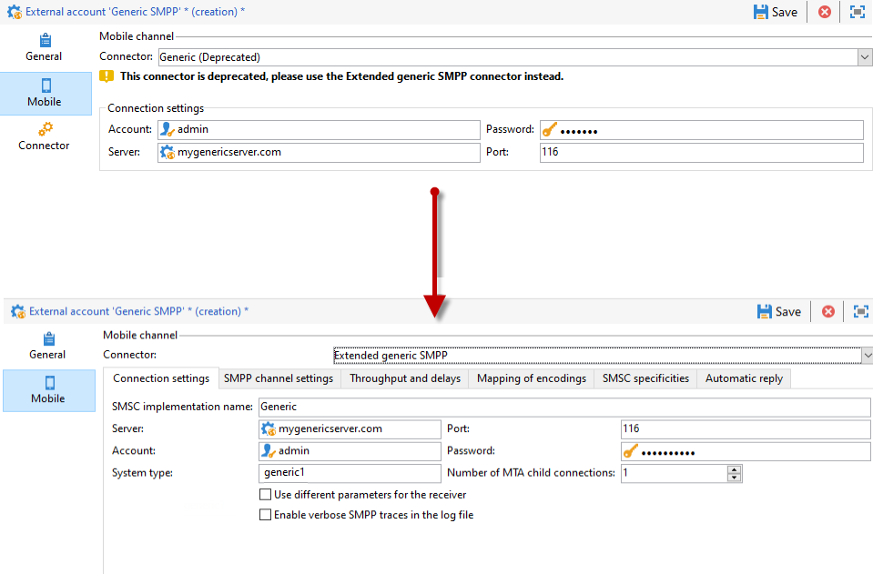
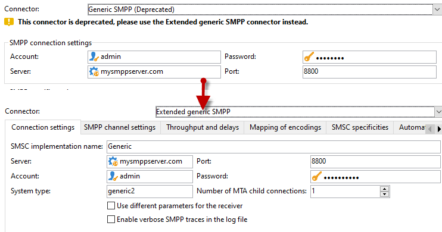
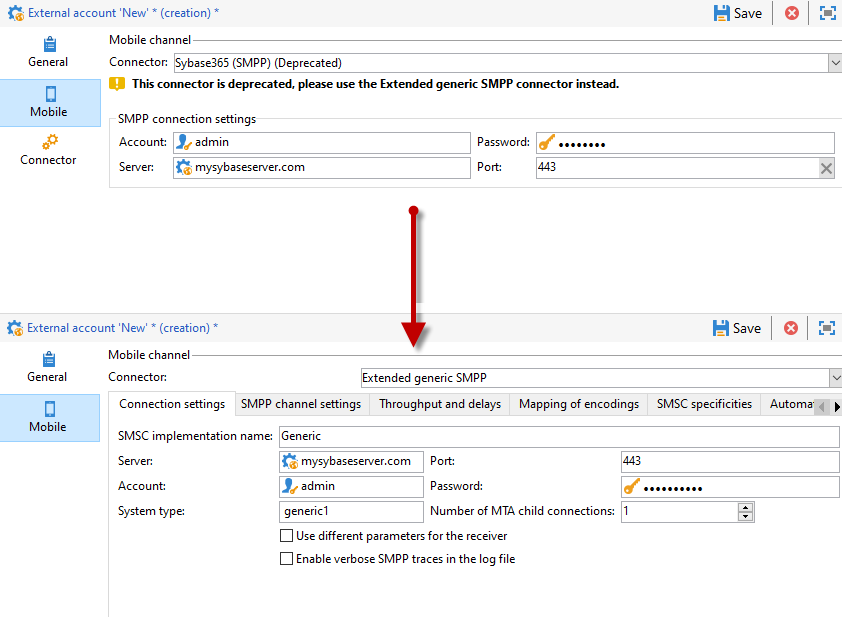
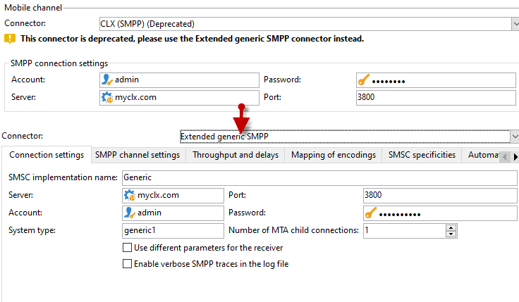
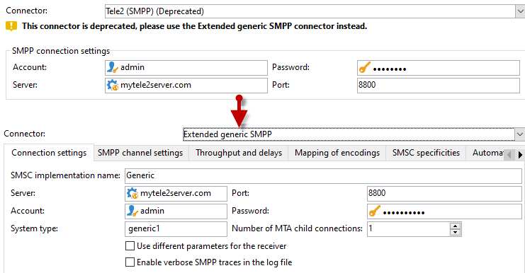
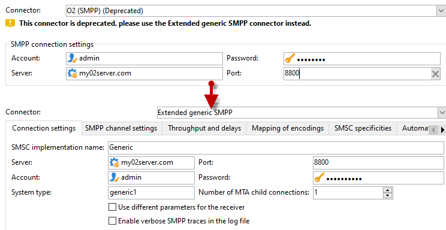

# Migración de conectores SMS no compatibles al conector genérico SMPP extendido{#unsupported-connector-migration}

A partir de la versión 20.2, los conectores heredados quedan obsoletos. Este documento le ayudará a migrar los conectores que aún se están ejecutando en el sistema antiguo al conector SMPP recomendado.

>[!CAUTION]
>
>Esta migración no es obligatoria, pero Adobe la recomienda y le garantizará que está ejecutando la última versión compatible del software.

## Acerca de los conectores SMS {#about-sms-connectors}

Los siguientes conectores quedan obsoletos a partir de la versión 20.2:

* **[!UICONTROL Generic SMPP]** (SMPP versión 3.4 compatible con modo binario)
* **[!UICONTROL Sybase365]** (SAP SMS 365)
* **[!UICONTROL CLX Communications]**
* **[!UICONTROL Tele2]**
* **[!UICONTROL O2]**
* **[!UICONTROL iOS]**

Las funciones obsoletas siguen estando disponibles y son compatibles, pero no se seguirán mejorando. Se recomienda utilizar el conector **[!UICONTROL Extended generic SMPP]**.

Para obtener más información sobre las funciones obsoletas y eliminadas, consulte esta [página](../../rn/using/deprecated-features.md).

Los conectores SMS antiguos utilizan el conector SMS de Java que sobrecarga el proceso web. Al migrar al nuevo conector **[!UICONTROL Extended Generic SMPP]**, se moverá esta carga al servidor de correo que puede admitirla.

## Migración al conector genérico SMPP extendido {#migrating-extended-generic-smpp}

>[!CAUTION]
>
>Incluso si puede transponer los parámetros, la configuración del conector **[!UICONTROL Extended Generic SMPP]** requiere que hable con su proveedor, que le proporcionará la información necesaria para rellenar el resto de los parámetros. Para obtener más información, consulte esta [página](sms-protocol.md).

En primer lugar, debe crear una cuenta externa **[!UICONTROL Extended Generic SMPP]** nueva y, a continuación, puede transponer algunos de los parámetros. Puede encontrar los pasos detallados en esta [página](sms-set-up.md#creating-an-smpp-external-account).

Ahora debe rellenar los parámetros de la pestaña **[!UICONTROL Mobile]** de la cuenta externa **[!UICONTROL Extended Generic SMPP]** recién creada, según el conector anterior.

### Desde el conector genérico {#from-generic-connector}

Al elegir el conector **[!UICONTROL Generic]**, debe tener un conector JavaScript personalizado que se adapte a cada situación.

Si sabe que este conector ya está utilizando el protocolo SMPP, puede migrar al conector **[!UICONTROL Extended Generic SMPP]**. Si no es así, consulte con su proveedor si es compatible con el protocolo SMPP y configure un conector nuevo con la ayuda de un consultor.

Desde el conector **[!UICONTROL Generic]**, puede transponer a su cuenta **[!UICONTROL Extended SMPP]** recién creada:

En la pestaña **[!UICONTROL Connection Settings]**:

* **[!UICONTROL Account]**
* **[!UICONTROL Password]**
* **[!UICONTROL Server]**
* **[!UICONTROL Port]**

### Desde el conector genérico SMPP {#from-generic-smpp-connector}

Desde el conector **[!UICONTROL Generic SMPP]**, puede transponer a su cuenta **[!UICONTROL Extended SMPP]** recién creada:

En la pestaña **[!UICONTROL Connection Settings]**:

* **[!UICONTROL Account]**
* **[!UICONTROL Password]**
* **[!UICONTROL Server]**
* **[!UICONTROL Port]**
* **[!UICONTROL System Type]**

En la pestaña **[!UICONTROL SMPP Channel Settings]**:

* **[!UICONTROL Source number]**
* **[!UICONTROL Source NPI]**
* **[!UICONTROL Destination NPI]**
* **[!UICONTROL Source TON]**
* **[!UICONTROL Destination TON]**

En la pestaña **[!UICONTROL Mapping of Encoding]**:

* **[!UICONTROL Outbound SMS coding]**

En la pestaña **[!UICONTROL SMSC specificities]**:

* **[!UICONTROL Coding when sending]** corresponde a **[!UICONTROL ID Format in MT acknowledgement]**
* **[!UICONTROL Coding when receiving]** corresponde a **[!UICONTROL ID Format in the SR]**

### Desde el conector Sybase365 {#from-sybase}

Desde el conector **[!UICONTROL Sybase365]**, puede transponer a su cuenta **[!UICONTROL Extended SMPP]** recién creada:

En la pestaña **[!UICONTROL Connection Settings]**:

* **[!UICONTROL Account]**
* **[!UICONTROL Password]**
* **[!UICONTROL Server]**
* **[!UICONTROL Port]**
* **[!UICONTROL System Type]**

### Desde el conector CLX {#from-clx}

Desde el conector **[!UICONTROL CLX]**, puede transponer a su cuenta **[!UICONTROL Extended SMPP]** recién creada:

En la pestaña **[!UICONTROL Connection Settings]**:

* **[!UICONTROL Account]**
* **[!UICONTROL Password]**
* **[!UICONTROL Server]**
* **[!UICONTROL Port]**
* **[!UICONTROL System Type]**

En la pestaña **[!UICONTROL SMPP Channel Settings]**:

* **[!UICONTROL Source number]**

En la pestaña **[!UICONTROL SMSC specificities]**:

* **[!UICONTROL Coding when sending]** corresponde a **[!UICONTROL ID Format in MT acknowledgement]**
* **[!UICONTROL Coding when receiving]** corresponde a **[!UICONTROL ID Format in the SR]**

### Desde el conector Tele2 {#from-tele2}

Desde el conector **[!UICONTROL Tele2]**, puede transponer a su cuenta **[!UICONTROL Extended SMPP]** recién creada:

En la pestaña **[!UICONTROL Connection Settings]**:

* **[!UICONTROL Account]**
* **[!UICONTROL Password]**
* **[!UICONTROL Server]**
* **[!UICONTROL Port]**
* **[!UICONTROL System Type]**

En la pestaña **[!UICONTROL SMPP Channel Settings]**:

* **[!UICONTROL Source number]**
* **[!UICONTROL Source NPI]**
* **[!UICONTROL Destination NPI]**
* **[!UICONTROL Source TON]**

En la pestaña **[!UICONTROL Mapping of Encoding]**:

* **[!UICONTROL Outbound SMS coding]**

### Desde el conector O2 {#from-O2}

Desde el conector **[!UICONTROL O2]**, puede transponer a su cuenta **[!UICONTROL Extended SMPP]** recién creada:

En la pestaña **[!UICONTROL Connection Settings]**:

* **[!UICONTROL Account]**
* **[!UICONTROL Password]**
* **[!UICONTROL Server]**
* **[!UICONTROL Port]**
* **[!UICONTROL System Type]**

En la pestaña **[!UICONTROL SMPP Channel Settings]**:

* **[!UICONTROL Source number]**
* **[!UICONTROL Source NPI]**
* **[!UICONTROL Destination NPI]**
* **[!UICONTROL Source TON]**
* **[!UICONTROL Destination TON]**
