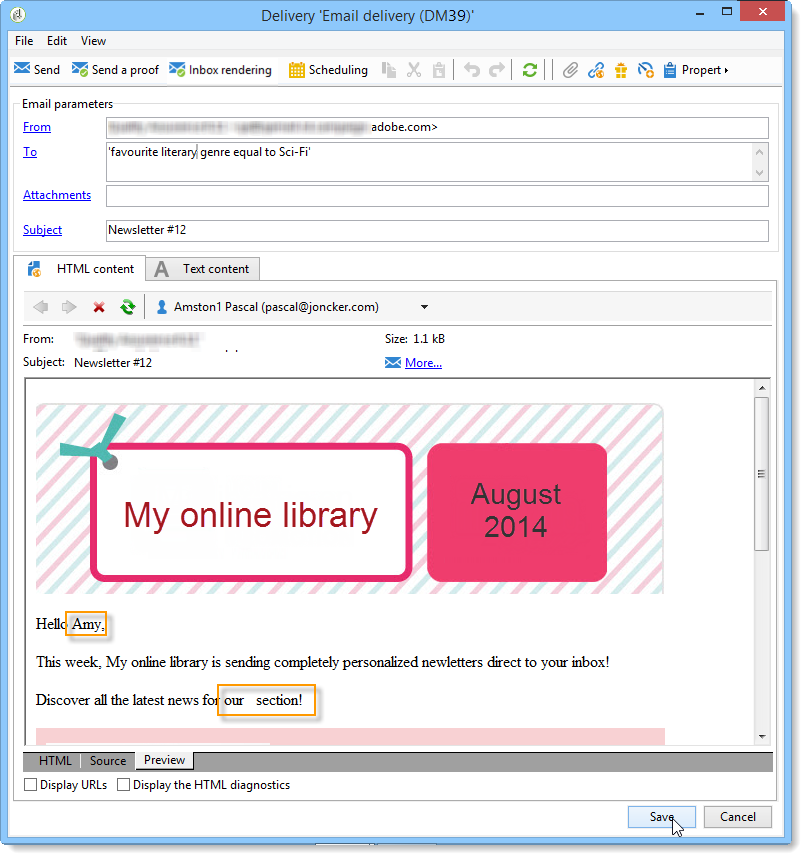

# Ejemplo de uso: Configuración de la sustitución de campos{#use-case-configuring-the-field-substitution}

La sustitución aleatoria de campos permite atribuir un valor de la lista de distribución a las direcciones semilla que están vacías cuando el usuario utiliza este valor en una entrega (por ejemplo: nombre, ciudad, etc.).

Esta sustitución le permite ahorrar tiempo al crear la entrega: en lugar de añadir manualmente el valor deseado a las direcciones semilla, la sustitución recupera aleatoriamente este valor en la lista de destinatarios de la entrega y la aplica a las direcciones semilla.

## Contexto {#context}

En este ejemplo de uso, **My online library** quiere enviar un descuento a sus clientes en función de su género literario favorito.

El administrador de la entrega ha integrado un campo personalizado vinculado con el género favorito en su correo electrónico. Le gustaría utilizar algunas direcciones semilla. Estas direcciones semilla tienen el campo personalizado en su tabla, pero no tiene guardado ningún valor en él.

Para utilizar la sustitución de campos aleatoria debe tener:

* una entrega con uno o varios campos personalizados,
* direcciones semilla cuyo **esquema de datos** se modifique según los campos personalizados utilizados en la entrega.

## Creación de envíos {#step-1---creating-a-delivery}

Los pasos para crear una entrega se detallan en la sección [Creación de una entrega por correo electrónico](../../delivery/using/creating-an-email-delivery.md).

En este ejemplo, el administrador de envíos ha creado el boletín informativo.


## Edición del esquema de datos de las direcciones semilla {#editing-the-seed-addresses-data-schema}

Las instrucciones para la modificación de un esquema de datos se detallan en la sección.

En este ejemplo, el esquema de datos de las direcciones semilla toma un valor creado a partir del esquema de datos de los destinatarios:

```
 <attribute label="Favorite literary genre" length="80" name="favoriteLiteraryGenre"
               type="string" userEnum="favoriteLiteraryGenre"/>
```

Esta enumeración permite al usuario especificar el género literario favorito de sus clientes.

Para que esta modificación del esquema de datos pueda verse en el **formulario de entrada** de las direcciones semilla, debe actualizarlo. Consulte la sección [Actualización del formulario de entrada](../../delivery/using/use-case--selecting-seed-addresses-on-criteria.md#updating-the-input-form).

## Configuración de personalización {#configuring-personalization}

1. Abra una entrega.

   En este ejemplo, la entrega tiene dos campos personalizados: **el nombre** y el **género literario favorito** del destinatario.

   

1. Configure la lista de envío y las direcciones semilla. Consulte [Identificación de poblaciones objetivo](../../delivery/using/steps-defining-the-target-population.md).

   En este ejemplo, el usuario selecciona a los usuarios cuyo **género literario favorito** sea ciencia ficción como población objetivo principal.

   

   El usuario añade las direcciones semilla a la entrega.

   

   >[!NOTE]
   >
   >Para obtener más información sobre el vínculo **[!UICONTROL Edit the dynamic condition...]**, consulte [Caso de uso: selección de direcciones semilla según ciertos criterios](../../delivery/using/use-case--selecting-seed-addresses-on-criteria.md)

1. Haga clic en la pestaña **[!UICONTROL Preview]** y seleccione una dirección semilla para probar la personalización.

   

   Se puede ver que uno de los campos personalizados está vacío. Ya que la dirección semilla no tiene datos para este campo, la vista previa del contenido HTML no puede mostrar un valor.

   La sustitución aleatoria de campos se realiza **en el momento de la entrega**.

1. Haga clic en el botón **[!UICONTROL Send]**.
1. Analice su envío y **confirme la entrega**.

   Las direcciones semilla reciben la entrega en la bandeja de entrada.

   La personalización de campos ha funcionado correctamente.

   
