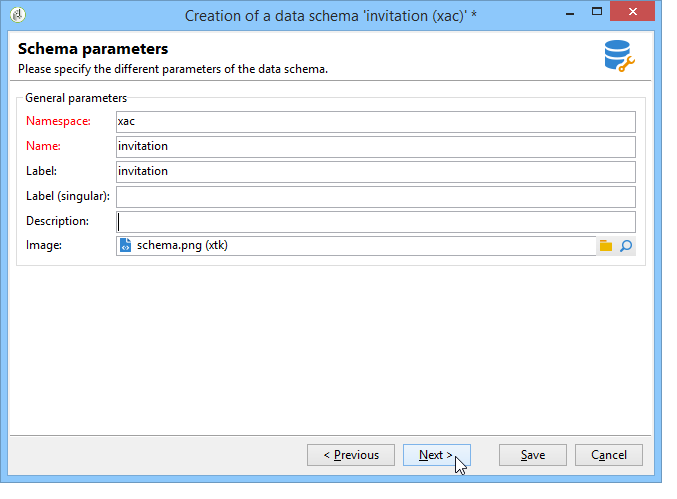
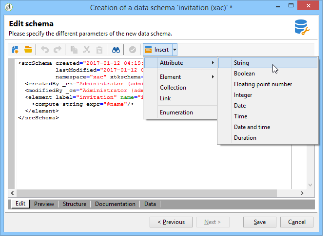
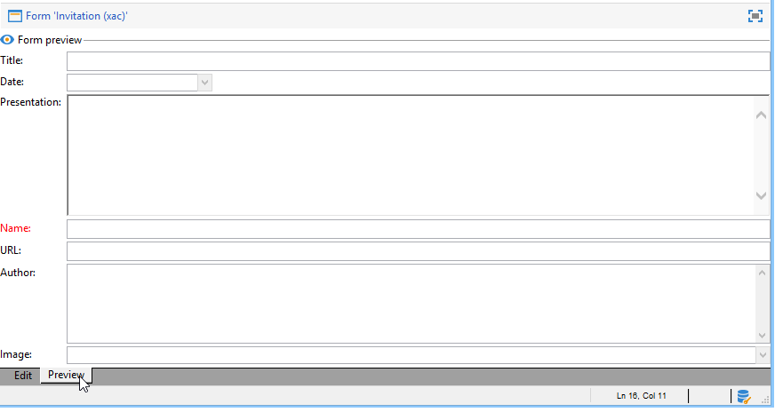

# Ejemplos de uso: creación de gestión de contenido{#use-case-creating-content-management}

Para crear la gestión de contenido en Adobe Campaign, siga los siguientes pasos:

* [Paso 1: Análisis del contenido a producir](#step-1---analyzing-the-content-to-be-produced),
* [Paso 2: Creación del esquema de datos](#step-2---creating-the-data-schema),
* [Paso 3: Creación del formulario de entrada](#step-3---creating-the-input-form),
* [Paso 4: Creación de la plantilla de construcción](#step-4---creating-the-construction-template),
* [Paso 5: Creación de la plantilla de publicación](#step-5---creating-the-publication-template),
* [Paso 6: Creación de contenidos](#step-6---creating-contents).

## Paso 1: Análisis del contenido a producir {#step-1---analyzing-the-content-to-be-produced}

Antes de comenzar, se debe realizar un análisis preciso del contenido que se va a producir: identifique los elementos que se van a mostrar, estudie las restricciones vinculadas a ellos, defina un tipo para cada elemento, etc. Asimismo, se deben diferenciar los elementos estáticos y los variables.

Por ejemplo, para crear un boletín informativo en HTML con el siguiente tipo de contenido:


Este boletín informativo contiene tres tipos de elementos:

1. Elementos variables, cuyo contenido lo introduce o selecciona el usuario mediante un formulario de entrada durante la creación de la entrega.

   

1. Los campos personalizados que se introducen dinámicamente en función de la información guardada en la base de datos (el nombre y apellidos del destinatario, en este caso).

   

1. Elementos estáticos, los mismos que para todos los boletines informativos.

   

Los distintos elementos de este boletín informativo se agrupan en función de las reglas definidas en una plantilla JavaScript que hace referencia a todos los elementos que se van a insertar y conceptualiza su diseño.

Estos elementos se crean mediante un esquema dedicado que especifica los siguientes elementos para cada contenido: nombre, etiqueta, tipo, tamaño y cualquier otra información relevante para su procesamiento en Adobe Campaign.

## Paso 2: Creación del esquema de datos {#step-2---creating-the-data-schema}

Un esquema de datos es un documento XML asociado al contenido. Describe la estructura XML de los datos de este contenido.

>[!NOTE]
>
>Para obtener más información sobre la creación y configuración de esquemas de datos en Adobe Campaign, consulte [esta sección](../../configuration/using/about-schema-edition.md).
>
>Los elementos de configuración específicos para la gestión de contenido se describen en [Esquemas de datos](../../delivery/using/data-schemas.md).

Para crear un esquema de datos, aplique los pasos siguientes:

1. En el explorador de Adobe Campaign, seleccione el nodo **[!UICONTROL Administration > Configuration > Data schemas]**.

   Haga clic en el icono **[!UICONTROL New]** situado encima de la lista de esquemas de datos.

1. Seleccione la opción **[!UICONTROL Create a schema]** de la administración de contenido y haga clic en **[!UICONTROL Next]**.

   

1. Introduzca el nombre y la etiqueta del esquema en los campos correspondientes. Se puede añadir una descripción y vincular una imagen específica si es necesario.

   

   Haga clic en **[!UICONTROL Next]** para validar.

1. Introduzca el contenido del esquema en la ventana **[!UICONTROL Edit schema]**.

   Utilice el botón **[!UICONTROL Insert]** para crear el contenido del esquema.

   

   Para obtener más información, consulte [Edición de esquemas](../../delivery/using/data-schemas.md#editing-schemas).

   Para cada elemento al que se hace referencia en el contenido, se debe seleccionar un tipo que corresponda.

   En este ejemplo, los contenidos identificados, su formato y su tipo son:

<table> 
 <thead> 
  <tr> 
   <th> <strong>Content</strong> <br /> </th> 
   <th> <strong>Formato</strong> <br /> </th> 
   <th> <strong>Tipo</strong> <br /> </th> 
   <th> <strong>Etiqueta</strong> <br /> </th> 
  </tr> 
 </thead> 
 <tbody> 
  <tr> 
   <td> Título<br /> </td> 
   <td> Atributo<br /> </td> 
   <td> Cadena<br /> </td> 
   <td> Título<br /> </td> 
  </tr> 
  <tr> 
   <td> Subtítulo<br /> </td> 
   <td> Atributo<br /> </td> 
   <td> Cadena<br /> </td> 
   <td> Nombre<br /> </td> 
  </tr> 
  <tr> 
   <td> Fecha del evento<br /> </td> 
   <td> Atributo<br /> </td> 
   <td> Fecha<br /> </td> 
   <td> Fecha<br /> </td> 
  </tr> 
  <tr> 
   <td> Párrafo de introducción<br /> </td> 
   <td> Elemento<br /> </td> 
   <td> HTML<br /> </td> 
   <td> Información general<br /> </td> 
  </tr> 
  <tr> 
   <td> Fotografía del autor<br /> </td> 
   <td> Atributo<br /> </td> 
   <td> Cadena<br /> </td> 
   <td> URL<br /> </td> 
  </tr> 
  <tr> 
   <td> Autor<br /> </td> 
   <td> Elemento<br /> </td> 
   <td> Nota<br /> </td> 
   <td> Autor<br /> </td> 
  </tr> 
  <tr> 
   <td> Logotipo de encabezado (almacenado en recursos públicos de Adobe Campaign)<br /> </td> 
   <td> Atributo<br /> </td> 
   <td> Enlace<br /> </td> 
   <td> Imagen<br /> </td> 
  </tr> 
 </tbody> 
</table>

El esquema contiene la siguiente información:

```
<element label="Invitation" name="invitation" template="ncm:content" xmlChildren="true">
    <compute-string expr="@name"/>
    <attribute label="Title" length="40" name="title" type="string"/>
    <element label="Presentation" name="presentation" type="html"/>
    <attribute label="Date" name="date" type="date"/>
    <attribute label="Name" length="10" name="name" type="string"/>
    <attribute label="URL" name="url" type="string"/>
    <element label="Author" name="author" type="memo"/>
    <element label="Image" name="image" target="xtk:fileRes" type="link"/>
  </element>
```

1. Haga clic en **[!UICONTROL Save]** para crear el esquema de datos.

## Paso 3: Creación del formulario de entrada {#step-3---creating-the-input-form}

El formulario de entrada permite editar una instancia de contenido a través de una interfaz de entrada desde la consola del cliente de Adobe Campaign.

La descripción de un formulario es un documento XML estructurado que observa la gramática del esquema del formulario “xtk:form”.

>[!NOTE]
>
>Para obtener más información sobre la creación y configuración de formularios en Adobe Campaign, consulte [esta sección](../../configuration/using/identifying-a-form.md).
>
>Los elementos de configuración específicos para la administración de contenido se describen en [Formularios de entrada](../../delivery/using/input-forms.md).

Para crear un formulario de entrada de la gestión de contenido, siga estos pasos:

1. En el explorador de Adobe Campaign, seleccione el nodo **[!UICONTROL Administration > Configuration > Input forms]**.

   Haga clic en el icono **[!UICONTROL New]** situado encima de la lista de formularios.

1. Introduzca el nombre del formulario y la etiqueta relacionada con él. Luego, seleccione el tipo **[!UICONTROL Content management]**.

   

   >[!NOTE]
   >
   >Para que ambos elementos coincidan automáticamente, se recomienda utilizar el mismo nombre que con el esquema de datos vinculado. Utilice el botón **[!UICONTROL Insert]** situado encima de la zona de entrada para añadir campos del esquema relacionados con el formulario.

   

1. En la sección central del editor, especifique los campos que desea mostrar en el formulario de entrada.

   En este ejemplo, tenemos el siguiente tipo de información:

   ```
    <input xpath="@title"/>
     <input xpath="@date"/>
     <input xpath="presentation"/>
     <input xpath="@name"/>
     <input xpath="@url"/>
     <input xpath="author"/>
     <input img="nl:sryimage.png" newEntityFormChoice="true" xpath="image">
       <sysFilter>
         <condition expr="@isImage = true"/>
       </sysFilter>
     </input>
   ```

   La pestaña **[!UICONTROL Preview]** permite comprobar la renderización del formulario mientras lo está editando:

   

1. Haga clic en **[!UICONTROL Save]** para crear el formulario de entrada.

## Paso 4: Creación de la plantilla de construcción {#step-4---creating-the-construction-template}

El lenguaje XSLT permite transformar un documento XML en otro documento de salida. Esta transformación se describe en XML en un documento denominado hoja de estilo.

En este ejemplo, deseamos utilizar una plantilla JavaScript para definir el modo de construcción y diseño de datos en el documento generado.

>[!NOTE]
>
>Las limitaciones relacionadas con la creación de documentos (plantillas JavaScript o XSL) se detallan en [Formato](../../delivery/using/formatting.md).

Para utilizar una plantilla JavaScript en Adobe Campaign, siga los siguientes pasos:

1. En el explorador de Adobe Campaign, seleccione el nodo **[!UICONTROL Administration > Configuration > JavaScript Templates]**.

   Haga clic en el icono **[!UICONTROL New]** situado encima de la lista de plantillas.

1. Introduzca un nombre de plantilla y seleccione el esquema que ha creado para el gestor de contenido.
1. Importe el contenido establecido que desea mostrar en el mensaje.

   Añada los elementos variables respetando la sintaxis detallada en [Plantillas de JavaScript](../../delivery/using/formatting.md#javascript-templates).

   Para visualizar el contenido mostrado en nuestro ejemplo, la plantilla JavaScript debe contener los siguientes elementos:

   ```
   <html>
   <% eval(xtk.javascript.load("xac:perso").data); %>
   <head>
     <title>Invitation to an exceptional dedication session</title>
   </head>
   <body link="#0E59AE" vlink="#0E59AE" alink="#0E59AE" style="background-color:white;">
       <table width="546" border="0" align="center" cellpadding="0" cellspacing="0" style="border-left: solid 1px gray;border-top: solid 1px gray;border-right: solid 1px gray;">
         <tr>
           <td colspan="3">
             <%= generateImgTag(content.@["image-id"]) %>
           </td>
         </tr>
       </table>
       <table width="546" border="0" align="center" cellpadding="0" cellspacing="0" style="border-left: solid 1px gray;border-right: solid 1px gray;">
         <tr>
           <td>
             <table border="0" cellspacing="0" cellpadding="5">
               <tr>
                 <td width="10"> </td>
                 <td style="padding-top:2em; padding-bottom:2em;" width="730" align="middle">
                   <b>
                     <font style="font-family:Verdana, Arial, Helvetica, sans-serif; font-size:14px; color:#800080;">
                       <span style="FONT-VARIANT: small-caps"><%= content.@title %> - <%= content.@name %></span>
                     </font>
                   </b>
                 </td>
                 <td width="10"> </td>
               </tr>
               <tr>
                 <td width="10"> </td>
                 <td style="padding-top:1em; padding-bottom:1em;" width="730">
                   <font style="font-family:Verdana, Arial, Helvetica, sans-serif; font-size:11px; color:#666666;">
                     Hello <%= perso('recipient.firstName') %> <%= perso('recipient.lastName') %>,
                     <p>
                       <%= content.presentation %>
                     </p>               
                     <center>
                       <b><%= formatDate(content.@date, "%2D %Bl %4Y") %></b> come to our Book Fair and meet our favorite authors and illustrators.<br>
                       <br>
                       <a href="https://www.site.web.com/registration" target="_blank"><b>REGISTER</b></a>
                     </center>
                   </font>
                 </td>
                 <td width="10"> </td>
               </tr>
               <tr>
                 <td width="10"> </td>
                 <td style="padding-top:1em; padding-bottom:1em;" width="730">
                   <font style="font-family:Verdana, Arial, Helvetica, sans-serif; font-size:11px; color:#666666;">
                    " width="70" height="70">
                     <b><%= content.author %></b>, will be signing their book between 2
   and 5:30PM.
                   </font>
                 </td>
                 <td width="10"> </td>
               </tr>            
                   <tr>
                 <td width="10"> </td>
                 <td width="730">
                   <font style="font-family:Verdana, Arial, Helvetica, sans-serif; font-size:11px; color:#666666;">                  
                 </td>
                 <td width="10"> </td>
               </tr>           
               <tr>
                 <td width="10"> </td>
                 <td>
                   <font style="font-family:Verdana, Arial, Helvetica, sans-serif; font-size:11px; color:#666666;">
                     <center>
                       <p>
                         <a href="https://www.site.web.com/program" target="_blank"><span style="FONT-VARIANT: small-caps"><b>Program</b></span></a>
                          | 
                         <a href="https://www.site.web.com/information" target="_blank"><span style="FONT-VARIANT: small-caps"><b>Useful information</b></span></a>
                          | 
                       <a href="https://www.site.web.com/registration" target="_blank"><span style="FONT-VARIANT: small-caps"><b>Register</b></span></a></p>
                       </center>
                     </font>
                   </td>
                   <td width="10"> </td>
                 </tr>
               </table>
               <br>
             </td>
           </tr>
         </table>
   </body>
   </html>
   ```

   Llamar a una función al comienzo de una plantilla permite configurar una llamada a los datos de personalización tomados de la base de datos de Adobe Campaign (en este caso: recipient.firstName y recipient.lastName), de manera que se pueda interpretar cuando se utilice en una entrega. Para más información, consulte [Inclusión de una plantilla de JavaScript](../../delivery/using/formatting.md#including-a-javascript-template).

   En este ejemplo, la función contiene el siguiente código:

   ```
   function perso(strPerso)
   {
     var strStart = '<' + '%' + '=';
     var strEnd = '%' + '>';
     return strStart + strPerso + strEnd;
   }
     function bloc(strPerso)
   {
     var strStart = '<' + '%' + '@ include view="';
     var strEnd = '" %' + '>';
     return strStart + strPerso + strEnd;
   }
   ```

   Para que la plantilla de JavaScript sea válida, esta función debe crearse de antemano desde el nodo **[!UICONTROL JavaScript codes]** en la estructura del árbol, como se muestra a continuación:

   

## Paso 5: Creación de la plantilla de publicación {#step-5---creating-the-publication-template}

El siguiente paso implica la creación de una plantilla de publicación de contenido para vincular el esquema, el formulario y la plantilla de construcción de contenido. Esta plantilla de publicación puede tener varios formatos de salida.

>[!NOTE]
>
>Para obtener más información sobre las plantillas de publicación de contenido, consulte [Plantillas de publicación](../../delivery/using/publication-templates.md).

En este ejemplo, los pasos son los siguientes:

1. Cree una nueva plantilla de publicación a través del nodo **[!UICONTROL Administration > Configuration > Publication templates]**.
1. Introduzca un nombre y una etiqueta y seleccione el esquema y el formulario que desea utilizar.
1. A continuación, introduzca el nombre de la plantilla y elija el modo de renderización que desee aplicar. Aquí tiene una renderización de tipo **[!UICONTROL JavaScript]** basada en la plantilla creada anteriormente.

   

   >[!NOTE]
   >
   >La opción **[!UICONTROL DOM interface]** está activada de forma predeterminada, lo que significa que no puede acceder a este documento si se utiliza la sintaxis E4X. La interfaz DOM debe utilizarse cuando se active esta opción, y es la sintaxis recomendada.
   >
   >Puede seguir utilizando la sintaxis E4X. Si es así, asegúrese de desactivar esta opción.

   Utilice el botón **[!UICONTROL Add]** para crear otras plantillas de transformación.

1. Haga clic en **[!UICONTROL Save]** para crear la plantilla de publicación.

## Paso 6: Creación de contenidos {#step-6---creating-contents}

Ahora se puede crear contenido basado en esta plantilla de publicación.

>[!NOTE]
>
>Para obtener más información sobre la creación de contenidos, consulte [Uso de una plantilla de contenido](../../delivery/using/using-a-content-template.md).

### Creación de contenido en el asistente de envíos {#creating-content-in-the-delivery-wizard}

Para crear contenido directamente en los envíos, aplique los pasos siguientes:

1. Comience por hacer referencia a la plantilla de publicación a través de la pestaña **[!UICONTROL Advanced]** de las propiedades de entrega.

   

   Se agrega una pestaña adicional al asistente de envíos para definir el contenido a través del formulario del gestor de contenido.

1. Introduzca la información variable del boletín informativo.

   

1. Haga clic en la pestaña **[!UICONTROL HTML preview]** para visualizar la renderización. Se debe seleccionar un destinatario para probar la personalización.

   
