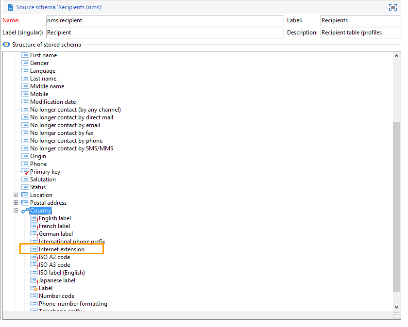

# Ejemplo de uso: selección de direcciones sembradas según ciertos criterios{#use-case-selecting-seed-addresses-on-criteria}

In the framework of a delivery or a campaign, the **[!UICONTROL Edit the dynamic condition...]** link lets you choose seed addresses based on specific selection criteria.

En este ejemplo de uso, al sitio **My online library** le gustaría personalizar sus boletines informativos según los gustos de lectura de sus clientes.

Junto con el departamento de compras, el usuario a cargo de los envíos ha creado un boletín informativo para suscriptores que hayan comprado novelas policiacas.

Para compartir el resultado final de su colaboración con ellos, el administrador de envíos decide añadir a sus compañeros del departamento de compras al envío como direcciones sembradas. El uso de una condición dinámica permite ahorrar tiempo al configurar y actualizar las direcciones.

Para utilizar la condición dinámica, se debe contar con:

* un envío listo para realizar,
* direcciones sembradas que tengan un valor común. Este valor puede ser un campo que ya exista en Adobe Campaign. En este ejemplo, las direcciones sembradas comparten el valor “Compras” en el campo “Departamento” que no está presente en la aplicación de forma predeterminada.

## Paso 1: Creación de un envío {#step-1---creating-a-delivery}

Los pasos para crear una entrega se detallan en la sección [Creación de una entrega](../../delivery/using/creating-an-email-delivery.md) por correo electrónico.

En este ejemplo, el administrador de envíos ha creado el boletín informativo y ha seleccionado los destinatarios.


## Paso 2: Creación de un valor común {#step-2---creating-a-common-value}

Para crear un valor común como el de nuestro ejemplo (departamento de compras), primero debe extender el **esquema de datos** de las direcciones sembradas y editar el formulario de entrada asociado.

### Extensión del esquema de datos {#extending-the-data-schema}

Para obtener más información sobre las extensiones de esquema, consulte la [guía de configuración](../../configuration/using/data-schemas.md).

1. En el **[!UICONTROL Administration > Configuration > Data schemas]** nodo, haga clic en el **[!UICONTROL New]** icono .
1. En la **[!UICONTROL Creation of a data schema]** ventana, seleccione la **[!UICONTROL Extension of a schema]** opción y haga clic en **[!UICONTROL Next]**.

   

1. Seleccione el esquema **[!UICONTROL Seed addresses]** de origen, introduzca **doc** como **[!UICONTROL Namespace]** y haga clic en **[!UICONTROL Ok]**.

   

1. Haga clic **[!UICONTROL Save]**.
1. En la ventana de edición del esquema, copie las líneas situadas debajo y péguelas en el área indicada en la captura de pantalla.

   ```
     <element name="common">
       <element label="Recipient" name="custom_nms_recipient">
         <attribute label="Department" length="80" name="workField" template="nms:recipient:recipient/@company"
                    type="string" userEnum="workField"/>
       </element>
     </element>
   ```

   

   A continuación, copie las líneas siguientes y péguelas debajo del **[!UICONTROL Seed to insert in the export files]** elemento.

   ```
       <element aggregate="doc:seedMember:common">
     </element>
   ```

   

   In this case, you are specifying that a new enumeration named **[!UICONTROL Department]** has been created in the seed address table, and it is based on the standard **[!UICONTROL @company]** enumeration template (labeled under the name **Company** in the seed address form).

1. Haga clic **[!UICONTROL Save]**.
1. En el **[!UICONTROL Tools > Advanced]** menú, seleccione la **[!UICONTROL Update database structure]** opción.

   

1. When the update wizard is displayed, click the **[!UICONTROL Next]** button to access the Edit tables window: changes carried out in the seed address data schema require a structure update.

   

1. Siga el asistente hasta llegar a la página para ejecutar la actualización. Haga clic en el botón **[!UICONTROL Start]**.

   

   Una vez finalizada la actualización, puede cerrar el asistente.

1. Desconéctese y vuelva a conectarse a Adobe Campaign. Los cambios realizados en el esquema de datos de las direcciones sembradas deberían haber surtido efecto. In order for them to be visible from the seed address screen, you must update the associated **[!UICONTROL Input form]**. Consulte la sección [Actualización del formulario](#updating-the-input-form) de entrada.

#### Ampliación del esquema de datos desde una tabla vinculada {#extending-the-data-schema-from-a-linked-table}

El esquema de direcciones sembradas puede utilizar valores de una tabla vinculada al esquema de datos del destinatario: Destinatario (nms).

For example, the user would like to integrate the **[!UICONTROL Internet Extension]** found in the **[!UICONTROL Country]** table that is linked to the recipients schema.



Por lo tanto, deben ampliar el esquema de datos de las direcciones sembradas como se detalla en la sección . Sin embargo, las líneas de código que se van a integrar en el **paso 4** son las siguientes:

```
<element name="country">
      <attribute label="Internet Extension" length="2" name="iana" type="string"/>
      <attribute label="Country ISO" length="2" name="countryIsoA2" type="string"/>
    </element>
```


Indican lo siguiente:

* that the user wants to create a new element named **[!UICONTROL Internet Extension]**,
* that this element comes from the **[!UICONTROL Country]** table.

>[!CAUTION]
>
>En el nombre de tabla vinculada debe especificar la **xpath-dst** de esa tabla vinculada.
>
>This can be found in the **[!UICONTROL Country]** element in the recipients table.


The user can then follow from **step 5** of the section, and update the **[!UICONTROL Input form]** of the seed addresses.

Consulte la sección [Actualización del formulario](#updating-the-input-form) de entrada.

#### Actualización del formulario de entrada {#updating-the-input-form}

1. In the **[!UICONTROL Administration > Configuration > Input forms]** node, find the seed addresses input form.

   

1. Edit the form and insert the following line in the **[!UICONTROL Recipient]** container.

   ```
   <input xpath="@workField"/>
   ```

   

1. Guarde los cambios.
1. Abra una dirección sembrada. El **[!UICONTROL Department]** campo aparece en la **[!UICONTROL Recipient]** tabla.

   

1. Edit the seed addresses that you want to use for the delivery and enter **Purchasing** as the value in the **[!UICONTROL Department]** field.

## Paso 3: Definición de la condición {#step-3---defining-the-condition}

Ahora puede especificar la condición dinámica de las direcciones sembradas para el envío. Para ello:

1. Abra un envío.

   

1. Haga clic en el **[!UICONTROL To]** vínculo y luego en la **[!UICONTROL Seed addresses]** ficha para acceder al **[!UICONTROL Edit the dynamic condition...]** vínculo.

   

1. Seleccione la expresión que le permite elegir las direcciones sembradas que desee. Aquí el usuario selecciona la **[!UICONTROL Department (@workField)]** expresión.

   

1. Seleccione el valor que desee. En este ejemplo, el usuario selecciona el departamento **Purchasing** de la lista desplegable de valores.

   

   >[!NOTE]
   >
   >La extensión de esquema creada anteriormente procede del esquema **recipient.** Los valores mostrados en la pantalla superior proceden de una enumeración del esquema **recipient**.

1. Haga clic **[!UICONTROL Ok]**.

   The query is displayed in the **[!UICONTROL Select target]** window.

   

1. Haga clic **[!UICONTROL Ok]** para aprobar la consulta.
1. Analyze your delivery then click on the **[!UICONTROL Delivery]** tab to access the delivery logs.

   Las direcciones sembradas del departamento de compras se muestran como pendientes de envío, al igual que los destinatarios y otras direcciones sembradas.

   

1. Click the **[!UICONTROL Send]** button to start the delivery.

   Los miembros del departamento de compras forman parte de las direcciones sembradas que reciben el envío en la bandeja de entrada de su correo electrónico.

   
