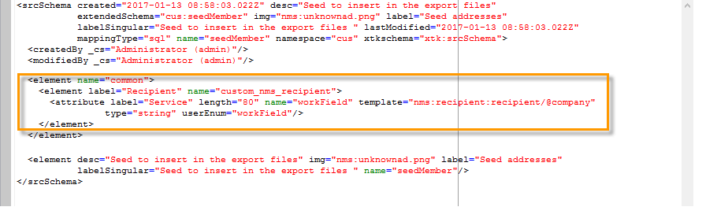

# Ejemplo de uso: selección de direcciones semilla según ciertos criterios{#use-case-selecting-seed-addresses-on-criteria}

En el marco de trabajo de una entrega o de una campaña, el vínculo **[!UICONTROL Edit the dynamic condition...]** permite elegir las direcciones semilla basándose en criterios de selección específicos.

En este ejemplo de uso, al sitio **My online library** le gustaría personalizar sus boletines informativos según los gustos de lectura de sus clientes.

Junto con el departamento de compras, el usuario a cargo de las entregas ha creado un boletín informativo para suscriptores que hayan comprado novelas policiales.

Para compartir el resultado final de su colaboración con ellos, el administrador de envíos decide añadir a sus compañeros del departamento de compras a la entrega como direcciones semilla. El uso de una condición dinámica permite ahorrar tiempo al configurar y actualizar las direcciones.

Para utilizar la condición dinámica, se debe contar con:

* una entrega lista para realizar,
* direcciones semilla que tengan un valor común. Este valor puede ser un campo que ya exista en Adobe Campaign. En este ejemplo, las direcciones semilla comparten el valor “Compras” en el campo “Departamento” que no está presente en la aplicación de forma predeterminada.

## Paso 1: Creación de una entrega {#step-1---creating-a-delivery}

Los pasos para crear una entrega se detallan en la sección [Creación de una entrega por correo electrónico](../../delivery/using/creating-an-email-delivery.md).

En este ejemplo, el administrador de envíos ha creado el boletín informativo y ha seleccionado los destinatarios.


## Paso 2: Creación de un valor común {#step-2---creating-a-common-value}

Para crear un valor común como el de nuestro ejemplo (departamento de compras), primero debe extender el **esquema de datos** de las direcciones semilla y editar el formulario de entrada asociado.

### Extensión del esquema de datos {#extending-the-data-schema}

Para obtener más información sobre las extensiones de esquema, consulte la [guía de configuración](../../configuration/using/data-schemas.md).

1. En el nodo **[!UICONTROL Administration > Configuration > Data schemas]**, haga clic en el icono **[!UICONTROL New]**.
1. En la ventana **[!UICONTROL Creation of a data schema]**, seleccione la opción **[!UICONTROL Extension of a schema]** haciendo clic en **[!UICONTROL Next]**. 

   

1. Seleccione el esquema de origen **[!UICONTROL Seed addresses]**, introduzca **doc** en el campo **[!UICONTROL Namespace]** y haga clic en **[!UICONTROL Ok]**.

   

1. Haga clic en **[!UICONTROL Save]**.
1. En la ventana de edición del esquema, copie las líneas situadas debajo y péguelas en el área indicada en la captura de pantalla.

   ```
     <element name="common">
       <element label="Recipient" name="custom_nms_recipient">
         <attribute label="Department" length="80" name="workField" template="nms:recipient:recipient/@company"
                    type="string" userEnum="workField"/>
       </element>
     </element>
   ```

   

   A continuación, copie las líneas siguientes y péguelas en el elemento **[!UICONTROL Seed to insert in the export files]**.

   ```
       <element aggregate="doc:seedMember:common">
     </element>
   ```

   

   En este caso, se especifica que se ha creado una nueva enumeración denominada **[!UICONTROL Department]** en la tabla de direcciones semilla y que se basa en la plantilla de enumeración estándar **[!UICONTROL @company]** (etiquetada con el nombre **Company** en el formulario de direcciones semilla).

1. Haga clic en **[!UICONTROL Save]**.
1. En el menú **[!UICONTROL Tools > Advanced]**, seleccione la opción **[!UICONTROL Update database structure]**.

   

1. Cuando se muestre el asistente de actualización, haga clic en el botón **[!UICONTROL Next]** para acceder a la ventana Edit tables: los cambios realizados en el esquema de datos de las direcciones semilla requieren una actualización de estructura.

   

1. Siga el asistente hasta llegar a la página para ejecutar la actualización. Haga clic en el botón **[!UICONTROL Start]**.

   

   Una vez finalizada la actualización, puede cerrar el asistente.

1. Desconéctese y vuelva a conectarse a Adobe Campaign. Los cambios realizados en el esquema de datos de las direcciones semilla deberían haber surtido efecto. Para que puedan ser visibles desde la pantalla de las direcciones semilla, debe actualizar el **[!UICONTROL Input form]** asociado. Consulte la sección [Actualización del formulario de entrada](#updating-the-input-form).

#### Ampliación del esquema de datos desde una tabla vinculada {#extending-the-data-schema-from-a-linked-table}

El esquema de direcciones semilla puede utilizar valores de una tabla vinculada al esquema de datos del destinatario: Destinatario (nms).

Por ejemplo, el usuario desea integrar **[!UICONTROL Internet Extension]** que se encuentra en la tabla de **[!UICONTROL Country]** que está relacionada con el esquema de destinatarios.


Por lo tanto, deben ampliar el esquema de datos de las direcciones semilla como se detalla en la sección . Sin embargo, las líneas de código que se van a integrar en el **paso 4** son las siguientes:

```
<element name="country">
      <attribute label="Internet Extension" length="2" name="iana" type="string"/>
      <attribute label="Country ISO" length="2" name="countryIsoA2" type="string"/>
    </element>
```


Indican lo siguiente:

* que el usuario desea crear un elemento nuevo denominado **[!UICONTROL Internet Extension]**,
* que este elemento proviene de la tabla de **[!UICONTROL Country]**.

>[!CAUTION]
>
>En el nombre de tabla vinculada debe especificar la **xpath-dst** de esa tabla vinculada.
>
>Esto se puede encontrar en el elemento **[!UICONTROL Country]** de la tabla de destinatarios.


El usuario puede seguir el **paso 5** de la sección y actualizar el **[!UICONTROL Input form]**.

Consulte la sección [Actualización del formulario de entrada](#updating-the-input-form).

#### Actualización del formulario de entrada {#updating-the-input-form}

1. En el nodo **[!UICONTROL Administration > Configuration > Input forms]**, busque el formulario de entrada de direcciones semilla.

   

1. Edite el formulario e inserte la línea siguiente en el contenedor **[!UICONTROL Recipient]**:

   ```
   <input xpath="@workField"/>
   ```

   

1. Guarde los cambios.
1. Abra una dirección semilla. El campo **[!UICONTROL Department]** aparece en la tabla **[!UICONTROL Recipient]**.

   

1. Edite las direcciones semilla que desee utilizar para la entrega e introduzca **Purchasing** como valor del campo **[!UICONTROL Department]**.

## Paso 3: Definición de la condición {#step-3---defining-the-condition}

Ahora puede especificar la condición dinámica de las direcciones semilla para la entrega. Para ello:

1. Abra una entrega.

   

1. Haga clic en el vínculo **[!UICONTROL To]** y luego en la pestaña **[!UICONTROL Seed addresses]** para acceder al vínculo **[!UICONTROL Edit the dynamic condition...]**.

   

1. Seleccione la expresión que le permite elegir las direcciones semilla que desee. El usuario selecciona la expresión **[!UICONTROL Department (@workField)]**.

   

1. Seleccione el valor que desee. En este ejemplo, el usuario selecciona el departamento **Purchasing** de la lista desplegable de valores.

   

   >[!NOTE]
   >
   >La extensión de esquema creada anteriormente procede del esquema **recipient.** Los valores mostrados en la pantalla superior proceden de una enumeración del esquema **recipient**.

1. Haga clic en **[!UICONTROL Ok]**.

   La consulta se muestra en la ventana **[!UICONTROL Select target]**.

   

1. Haga clic en **[!UICONTROL Ok]** para aprobar la consulta.
1. Analice la entrega y haga clic en la pestaña **[!UICONTROL Delivery]** para acceder a los registros de envío.

   Las direcciones semilla del departamento de compras se muestran como pendientes de envío, al igual que los destinatarios y otras direcciones semilla.

   

1. Haga clic en el botón **[!UICONTROL Send]** para iniciar la entrega.

   Los miembros del departamento de compras forman parte de las direcciones semilla que reciben la entrega en la bandeja de entrada de su correo electrónico.

   
